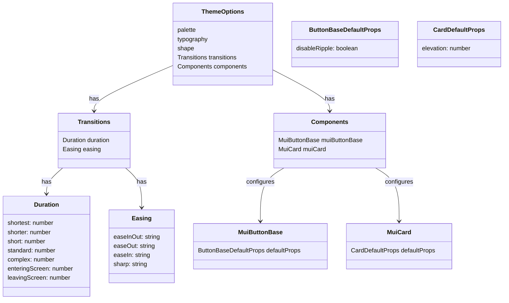

# PR #37 Review Analysis

**Generated**: 2026-01-06T22:53:37.588Z  
**Total Issues**: 3  
**Breakdown**: 0 CRITICAL, 3 HIGH, 0 MEDIUM, 0 LOW

---

## Summary

| Severity | Count | Action Required |
|----------|-------|-----------------|
| CRITICAL | 0 | Fix immediately before merge |
| HIGH | 3 | Fix if <5 min each |
| MEDIUM | 0 | Document for later |
| LOW | 0 | Optional (style/formatting) |

---

## CRITICAL Issues (0)

_No critical issues found._

---

## HIGH Issues (3)


### 1. Sourcery

```
<!-- Generated by sourcery-ai[bot]: start review_guide -->

## Reviewer's Guide

This PR implements Phase 2 performance improvements by tuning the MUI theme for lighter visual effects, tightening Next.js image caching and core performance flags, and adding bundle analysis tooling via @next/bundle-analyzer and a new analyze script, with accompanying documentation of the performance plan and impact.

#### Class diagram for updated MUI theme options



### File-Level Changes

| Change | Details | Files |
| ------ | ------- | ----- |
| Optimize MUI theme transitions and component defaults to reduce animation and rendering overhead. | <ul><li>Add explicit transition durations and easing curves to the base theme options to standardize and constrain animations.</li><li>Set default MuiCard elevation to a lower value to reduce shadow complexity and paint cost.</li><li>Introduce a components section in the theme for centralizing performance-conscious default props (e.g., keeping but documenting button ripple behavior).</li></ul> | `src/lib/theme.ts` |
| Tighten Next.js runtime configuration for caching, compression, and diagnostics while integrating bundle analysis into the build pipeline. | <ul><li>Reduce Next.js image minimumCacheTTL from one year to 30 days in line with prior audit recommendations.</li><li>Enable core Next.js performance flags including gzip compression, SWC-based minification, and React strict mode, and disable the X-Powered-By header.</li><li>Wrap the existing Sentry-enhanced Next.js config with @next/bundle-analyzer, gated by an ANALYZE environment variable so analysis is opt-in.</li></ul> | `next.config.mjs` |
| Introduce bundle analysis tooling and update project scripts and dependencies to support it. | <ul><li>Add an analyze npm script that runs the Next.js build with ANALYZE=true to trigger the bundle analyzer.</li><li>Add @next/bundle-analyzer as a dev dependency and lock it in pnpm-lock.yaml.</li></ul> | `package.json`<br/>`pnpm-lock.yaml` |
| Document the Phase 2 performance work, its rationale, metrics, and operational steps. | <ul><li>Create a PERFORMANCE_PHASE2_COMPLETE markdown document describing objectives, configuration changes, expected impact, verification steps, risks, and follow-up work for Phase 3.</li></ul> | `docs/PERFORMANCE_PHASE2_COMPLETE.md` |

### Possibly linked issues

- **#(unassigned)**: Yes. The PR updates minimumCacheTTL to 30 days and adds related performance tweaks, directly fulfilling the issue.

---

<details>
<summary>Tips and commands</summary>

#### Interacting with Sourcery

- **Trigger a new review:** Comment `@sourcery-ai review` on the pull request.
- **Continue discussions:** Reply directly to Sourcery's review comments.
- **Generate a GitHub issue from a review comment:** Ask Sourcery to create an
  issue from a review comment by replying to it. You can also reply to a
  review comment with `@sourcery-ai issue` to create an issue from it.
- **Generate a pull request title:** Write `@sourcery-ai` anywhere in the pull
  request title to generate a title at any time. You can also comment
  `@sourcery-ai title` on the pull request to (re-)generate the title at any time.
- **Generate a pull request summary:** Write `@sourcery-ai summary` anywhere in
  the pull request body to generate a PR summary at any time exactly where you
  want it. You can also comment `@sourcery-ai summary` on the pull request to
  (re-)generate the summary at any time.
- **Generate reviewer's guide:** Comment `@sourcery-ai guide` on the pull
  request to (re-)generate the reviewer's guide at any time.
- **Resolve all Sourcery comments:** Comment `@sourcery-ai resolve` on the
  pull request to resolve all Sourcery comments. Useful if you've already
  addressed all the comments and don't want to see them anymore.
- **Dismiss all Sourcery reviews:** Comment `@sourcery-ai dismiss` on the pull
  request to dismiss all existing Sourcery reviews. Especially useful if you
  want to start fresh with a new review - don't forget to comment
  `@sourcery-ai review` to trigger a new review!

#### Customizing Your Experience

Access your [dashboard](https://app.sourcery.ai) to:
- Enable or disable review features such as the Sourcery-generated pull request
  summary, the reviewer's guide, and others.
- Change the review language.
- Add, remove or edit custom review instructions.
- Adjust other review settings.

#### Getting Help

- [Contact our support team](mailto:support@sourcery.ai) for questions or feedback.
- Visit our [documentation](https://docs.sourcery.ai) for detailed guides and information.
- Keep in touch with the Sourcery team by following us on [X/Twitter](https://x.com/SourceryAI), [LinkedIn](https://www.linkedin.com/company/sourcery-ai/) or [GitHub](https://github.com/sourcery-ai).

</details>

<!-- Generated by sourcery-ai[bot]: end review_guide -->
```


### 2. CodeRabbit

```
<!-- This is an auto-generated comment: summarize by coderabbit.ai -->
<!-- This is an auto-generated comment: review in progress by coderabbit.ai -->

> [!NOTE]
> Currently processing new changes in this PR. This may take a few minutes, please wait...
> 
> <details>
> <summary>📥 Commits</summary>
> 
> Reviewing files that changed from the base of the PR and between 3f803bc0cc696b57762fdafe31ffe2f5386cd234 and 8fe861068c868aaf3866cf4a7314a32add455839.
> 
> </details>
> 
> <details>
> <summary>⛔ Files ignored due to path filters (2)</summary>
> 
> * `docs/PERFORMANCE_PHASE2_COMPLETE.md` is excluded by `!**/*.md`
> * `pnpm-lock.yaml` is excluded by `!**/pnpm-lock.yaml`, `!pnpm-lock.yaml`
> 
> </details>
> 
> <details>
> <summary>📒 Files selected for processing (3)</summary>
> 
> * `next.config.mjs`
> * `package.json`
> * `src/lib/theme.ts`
> 
> </details>
> 
> ```ascii
>  __________________________________________________________________________________________________________
> < Minimize coupling between modules. Avoid coupling by writing 'shy' code and applying the Law of Demeter. >
>  ----------------------------------------------------------------------------------------------------------
>   \
>    \   \
>         \ /\
>         ( )
>       .( o ).
> ```

<!-- end of auto-generated comment: review in progress by coderabbit.ai -->
<!-- usage_tips_start -->

> [!TIP]
> <details>
> <summary>You can disable sequence diagrams in the walkthrough.</summary>
> 
> Disable the `reviews.sequence_diagrams` setting in your project's settings in CodeRabbit to disable sequence diagrams in the walkthrough.
> 
> </details>

<!-- usage_tips_end -->

<!-- finishing_touch_checkbox_start -->

<details>
<summary>✨ Finishing touches</summary>

- [ ] <!-- {"checkboxId": "7962f53c-55bc-4827-bfbf-6a18da830691"} --> 📝 Generate docstrings
<details>
<summary>🧪 Generate unit tests (beta)</summary>

- [ ] <!-- {"checkboxId": "f47ac10b-58cc-4372-a567-0e02b2c3d479", "radioGroupId": "utg-output-choice-group-unknown_comment_id"} -->   Create PR with unit tests
- [ ] <!-- {"checkboxId": "07f1e7d6-8a8e-4e23-9900-8731c2c87f58", "radioGroupId": "utg-output-choice-group-unknown_comment_id"} -->   Post copyable unit tests in a comment
- [ ] <!-- {"checkboxId": "6ba7b810-9dad-11d1-80b4-00c04fd430c8", "radioGroupId": "utg-output-choice-group-unknown_comment_id"} -->   Commit unit tests in branch `bb/performance-phase2-pagespeed-fixes`

</details>

</details>

<!-- finishing_touch_checkbox_end -->

<!-- tips_start -->

---

Thanks for using [CodeRabbit](https://coderabbit.ai?utm_source=oss&utm_medium=github&utm_campaign=Hex-Tech-Lab/hex-test-drive-man&utm_content=37)! It's free for OSS, and your support helps us grow. If you like it, consider giving us a shout-out.

<details>
<summary>❤️ Share</summary>

- [X](https://twitter.com/intent/tweet?text=I%20just%20used%20%40coderabbitai%20for%20my%20code%20review%2C%20and%20it%27s%20fantastic%21%20It%27s%20free%20for%20OSS%20and%20offers%20a%20free%20trial%20for%20the%20proprietary%20code.%20Check%20it%20out%3A&url=https%3A//coderabbit.ai)
- [Mastodon](https://mastodon.social/share?text=I%20just%20used%20%40coderabbitai%20for%20my%20code%20review%2C%20and%20it%27s%20fantastic%21%20It%27s%20free%20for%20OSS%20and%20offers%20a%20free%20trial%20for%20the%20proprietary%20code.%20Check%20it%20out%3A%20https%3A%2F%2Fcoderabbit.ai)
- [Reddit](https://www.reddit.com/submit?title=Great%20tool%20for%20code%20review%20-%20CodeRabbit&text=I%20just%20used%20CodeRabbit%20for%20my%20code%20review%2C%20and%20it%27s%20fantastic%21%20It%27s%20free%20for%20OSS%20and%20offers%20a%20free%20trial%20for%20proprietary%20code.%20Check%20it%20out%3A%20https%3A//coderabbit.ai)
- [LinkedIn](https://www.linkedin.com/sharing/share-offsite/?url=https%3A%2F%2Fcoderabbit.ai&mini=true&title=Great%20tool%20for%20code%20review%20-%20CodeRabbit&summary=I%20just%20used%20CodeRabbit%20for%20my%20code%20review%2C%20and%20it%27s%20fantastic%21%20It%27s%20free%20for%20OSS%20and%20offers%20a%20free%20trial%20for%20proprietary%20code)

</details>

<sub>Comment `@coderabbitai help` to get the list of available commands and usage tips.</sub>

<!-- tips_end -->
```


### 3. Sourcery - src/lib/theme.ts:31

```
**suggestion (performance):** Consider aligning transition settings with reduced-motion preferences for accessibility and performance.

Given this block focuses on animation performance, verify how these transitions behave when `prefers-reduced-motion` is enabled. Depending on how `theme.transitions` is used, it may be better to globally shorten or disable certain transitions when reduced motion is requested to improve both performance and accessibility.

Suggested implementation:

```typescript
  // Performance optimizations for animations
  // Honor prefers-reduced-motion by shortening/ disabling transitions
  transitions: {
    duration: {
      shortest:
        typeof window !== 'undefined' &&
        window.matchMedia?.('(prefers-reduced-motion: reduce)').matches
          ? 0
          : 150,
      shorter:
        typeof window !== 'undefined' &&
        window.matchMedia?.('(prefers-reduced-motion: reduce)').matches
          ? 0
          : 200,
      short:
        typeof window !== 'undefined' &&
        window.matchMedia?.('(prefers-reduced-motion: reduce)').matches
          ? 0
          : 250,
      standard:
        typeof window !== 'undefined' &&
        window.matchMedia?.('(prefers-reduced-motion: reduce)').matches
          ? 0
          : 300,
      complex:
        typeof window !== 'undefined' &&
        window.matchMedia?.('(prefers-reduced-motion: reduce)').matches
          ? 0
          : 375,
      enteringScreen:
        typeof window !== 'undefined' &&
        window.matchMedia?.('(prefers-reduced-motion: reduce)').matches
          ? 0
          : 225,
      leavingScreen:
        typeof window !== 'undefined' &&
        window.matchMedia?.('(prefers-reduced-motion: reduce)').matches
          ? 0
          : 195,
    },

```

If your build setup or linting rules discourage direct `window` access in shared modules, you may want to:
1. Extract the `prefers-reduced-motion` check into a small utility (e.g., `getReducedMotionPreference()`) that safely handles SSR, and call that utility here instead of inlining `window.matchMedia`.
2. Alternatively, gate theme creation so this file is only executed client-side, or provide a wrapper that injects the reduced-motion preference into theme options.
```


---

## MEDIUM Issues (0)

_No medium-priority issues found._

---

## LOW Issues (0)

_No low-priority issues found._

---

## Next Steps

1. **Fix CRITICAL issues** (0 found) - Block merge until resolved
2. **Fix HIGH issues** (3 found) - Fix if <5 min each, otherwise document
3. **Document MEDIUM/LOW** (0 found) - Create follow-up issues

**Generated by**: `pnpm run pr:scrape 37`
