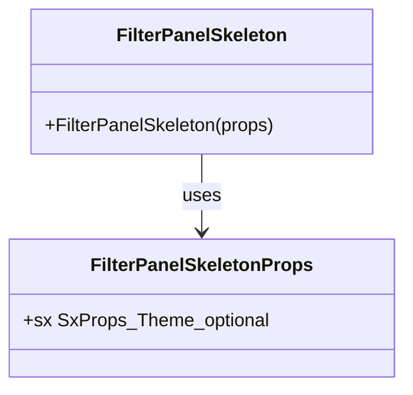
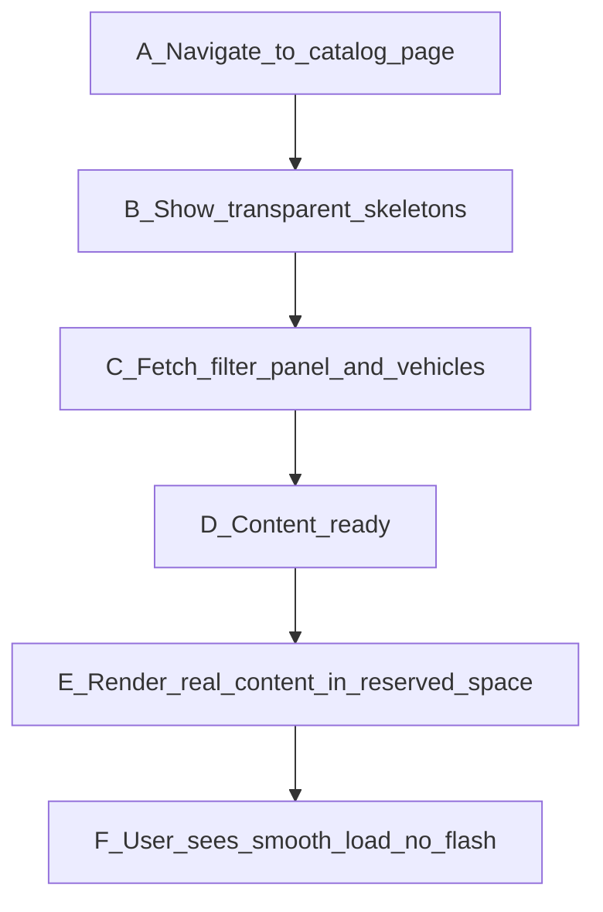

# PR #39 Review Analysis

**Generated**: 2026-01-06T23:28:24.840Z  
**Total Issues**: 2  
**Breakdown**: 0 CRITICAL, 1 HIGH, 0 MEDIUM, 1 LOW

---

## Summary

| Severity | Count | Action Required |
|----------|-------|-----------------|
| CRITICAL | 0 | Fix immediately before merge |
| HIGH | 1 | Fix if <5 min each |
| MEDIUM | 0 | Document for later |
| LOW | 1 | Optional (style/formatting) |

---

## CRITICAL Issues (0)

_No critical issues found._

---

## HIGH Issues (1)


### 1. CodeRabbit

```
<!-- This is an auto-generated comment: summarize by coderabbit.ai -->
<!-- This is an auto-generated comment: rate limited by coderabbit.ai -->

> [!WARNING]
> ## Rate limit exceeded
> 
> @TechHypeXP has exceeded the limit for the number of commits that can be reviewed per hour. Please wait **27 minutes and 12 seconds** before requesting another review.
> 
> <details>
> <summary>⌛ How to resolve this issue?</summary>
> 
> After the wait time has elapsed, a review can be triggered using the `@coderabbitai review` command as a PR comment. Alternatively, push new commits to this PR.
> 
> We recommend that you space out your commits to avoid hitting the rate limit.
> 
> </details>
> 
> 
> <details>
> <summary>🚦 How do rate limits work?</summary>
> 
> CodeRabbit enforces hourly rate limits for each developer per organization.
> 
> Our paid plans have higher rate limits than the trial, open-source and free plans. In all cases, we re-allow further reviews after a brief timeout.
> 
> Please see our [FAQ](https://docs.coderabbit.ai/faq) for further information.
> 
> </details>
> 
> <details>
> <summary>📥 Commits</summary>
> 
> Reviewing files that changed from the base of the PR and between 317b4c584332acd322a377ddef63c64eca2c3774 and 230c79d46ff85f34cf3d790367337e7cfdf827e4.
> 
> </details>
> 
> <details>
> <summary>⛔ Files ignored due to path filters (3)</summary>
> 
> * `BLACKBOX.md` is excluded by `!**/*.md`
> * `TRANSPARENT_SKELETON_FIX_SUMMARY.md` is excluded by `!**/*.md`
> * `docs/PERFORMANCE_LOG.md` is excluded by `!**/*.md`
> 
> </details>
> 
> <details>
> <summary>📒 Files selected for processing (2)</summary>
> 
> * `src/app/[locale]/page.tsx`
> * `src/components/skeletons/FilterPanelSkeleton.tsx`
> 
> </details>

<!-- end of auto-generated comment: rate limited by coderabbit.ai -->


<!-- finishing_touch_checkbox_start -->

<details>
<summary>✨ Finishing touches</summary>

<details>
<summary>🧪 Generate unit tests (beta)</summary>

- [ ] <!-- {"checkboxId": "f47ac10b-58cc-4372-a567-0e02b2c3d479", "radioGroupId": "utg-output-choice-group-unknown_comment_id"} -->   Create PR with unit tests
- [ ] <!-- {"checkboxId": "07f1e7d6-8a8e-4e23-9900-8731c2c87f58", "radioGroupId": "utg-output-choice-group-unknown_comment_id"} -->   Post copyable unit tests in a comment
- [ ] <!-- {"checkboxId": "6ba7b810-9dad-11d1-80b4-00c04fd430c8", "radioGroupId": "utg-output-choice-group-unknown_comment_id"} -->   Commit unit tests in branch `bb/transparent-skeleton-fix`

</details>

</details>

<!-- finishing_touch_checkbox_end -->

<!-- tips_start -->

---

Thanks for using [CodeRabbit](https://coderabbit.ai?utm_source=oss&utm_medium=github&utm_campaign=Hex-Tech-Lab/hex-test-drive-man&utm_content=39)! It's free for OSS, and your support helps us grow. If you like it, consider giving us a shout-out.

<details>
<summary>❤️ Share</summary>

- [X](https://twitter.com/intent/tweet?text=I%20just%20used%20%40coderabbitai%20for%20my%20code%20review%2C%20and%20it%27s%20fantastic%21%20It%27s%20free%20for%20OSS%20and%20offers%20a%20free%20trial%20for%20the%20proprietary%20code.%20Check%20it%20out%3A&url=https%3A//coderabbit.ai)
- [Mastodon](https://mastodon.social/share?text=I%20just%20used%20%40coderabbitai%20for%20my%20code%20review%2C%20and%20it%27s%20fantastic%21%20It%27s%20free%20for%20OSS%20and%20offers%20a%20free%20trial%20for%20the%20proprietary%20code.%20Check%20it%20out%3A%20https%3A%2F%2Fcoderabbit.ai)
- [Reddit](https://www.reddit.com/submit?title=Great%20tool%20for%20code%20review%20-%20CodeRabbit&text=I%20just%20used%20CodeRabbit%20for%20my%20code%20review%2C%20and%20it%27s%20fantastic%21%20It%27s%20free%20for%20OSS%20and%20offers%20a%20free%20trial%20for%20proprietary%20code.%20Check%20it%20out%3A%20https%3A//coderabbit.ai)
- [LinkedIn](https://www.linkedin.com/sharing/share-offsite/?url=https%3A%2F%2Fcoderabbit.ai&mini=true&title=Great%20tool%20for%20code%20review%20-%20CodeRabbit&summary=I%20just%20used%20CodeRabbit%20for%20my%20code%20review%2C%20and%20it%27s%20fantastic%21%20It%27s%20free%20for%20OSS%20and%20offers%20a%20free%20trial%20for%20proprietary%20code)

</details>

<sub>Comment `@coderabbitai help` to get the list of available commands and usage tips.</sub>

<!-- tips_end -->
```


---

## MEDIUM Issues (0)

_No medium-priority issues found._

---

## LOW Issues (1)


### 1. Sourcery

```
<!-- Generated by sourcery-ai[bot]: start review_guide -->

<details>
<summary>Reviewer's guide (collapsed on small PRs)</summary>

## Reviewer's Guide

Implements an Amazon-style transparent skeleton loading pattern by making skeleton placeholders invisible while still reserving layout space, and updating the filter panel skeleton to accept styling overrides via an sx prop.

#### Class diagram for updated FilterPanelSkeleton component



#### Flow diagram for transparent skeleton loading behavior



### File-Level Changes

| Change | Details | Files |
| ------ | ------- | ----- |
| Use transparent skeletons in the catalog page to reserve layout space without visible loading indicators. | <ul><li>Update dynamic FilterPanel loading option to render FilterPanelSkeleton with an opacity: 0 style so it remains invisible while reserving space.</li><li>Adjust the top search-bar skeleton container to include opacity: 0, keeping layout while hiding the loading UI.</li><li>Apply opacity: 0 to the main skeleton grid layout and clarify comments that placeholders are invisible but prevent layout shifts.</li><li>Retain existing layout dimensions for filter panel and vehicle card placeholders while making them visually transparent.</li></ul> | `src/app/[locale]/page.tsx` |
| Allow FilterPanelSkeleton to accept custom styling via an sx prop while preserving its existing layout responsibilities. | <ul><li>Extend FilterPanelSkeleton’s component signature to accept an optional sx prop typed as SxProps<Theme>.</li><li>Spread the incoming sx prop into the root Box sx object so callers can override visual properties such as opacity.</li><li>Document the new sx parameter in the component’s docstring to clarify its purpose and usage.</li></ul> | `src/components/skeletons/FilterPanelSkeleton.tsx` |

</details>

---

<details>
<summary>Tips and commands</summary>

#### Interacting with Sourcery

- **Trigger a new review:** Comment `@sourcery-ai review` on the pull request.
- **Continue discussions:** Reply directly to Sourcery's review comments.
- **Generate a GitHub issue from a review comment:** Ask Sourcery to create an
  issue from a review comment by replying to it. You can also reply to a
  review comment with `@sourcery-ai issue` to create an issue from it.
- **Generate a pull request title:** Write `@sourcery-ai` anywhere in the pull
  request title to generate a title at any time. You can also comment
  `@sourcery-ai title` on the pull request to (re-)generate the title at any time.
- **Generate a pull request summary:** Write `@sourcery-ai summary` anywhere in
  the pull request body to generate a PR summary at any time exactly where you
  want it. You can also comment `@sourcery-ai summary` on the pull request to
  (re-)generate the summary at any time.
- **Generate reviewer's guide:** Comment `@sourcery-ai guide` on the pull
  request to (re-)generate the reviewer's guide at any time.
- **Resolve all Sourcery comments:** Comment `@sourcery-ai resolve` on the
  pull request to resolve all Sourcery comments. Useful if you've already
  addressed all the comments and don't want to see them anymore.
- **Dismiss all Sourcery reviews:** Comment `@sourcery-ai dismiss` on the pull
  request to dismiss all existing Sourcery reviews. Especially useful if you
  want to start fresh with a new review - don't forget to comment
  `@sourcery-ai review` to trigger a new review!

#### Customizing Your Experience

Access your [dashboard](https://app.sourcery.ai) to:
- Enable or disable review features such as the Sourcery-generated pull request
  summary, the reviewer's guide, and others.
- Change the review language.
- Add, remove or edit custom review instructions.
- Adjust other review settings.

#### Getting Help

- [Contact our support team](mailto:support@sourcery.ai) for questions or feedback.
- Visit our [documentation](https://docs.sourcery.ai) for detailed guides and information.
- Keep in touch with the Sourcery team by following us on [X/Twitter](https://x.com/SourceryAI), [LinkedIn](https://www.linkedin.com/company/sourcery-ai/) or [GitHub](https://github.com/sourcery-ai).

</details>

<!-- Generated by sourcery-ai[bot]: end review_guide -->
```


---

## Next Steps

1. **Fix CRITICAL issues** (0 found) - Block merge until resolved
2. **Fix HIGH issues** (1 found) - Fix if <5 min each, otherwise document
3. **Document MEDIUM/LOW** (1 found) - Create follow-up issues

**Generated by**: `pnpm run pr:scrape 39`
