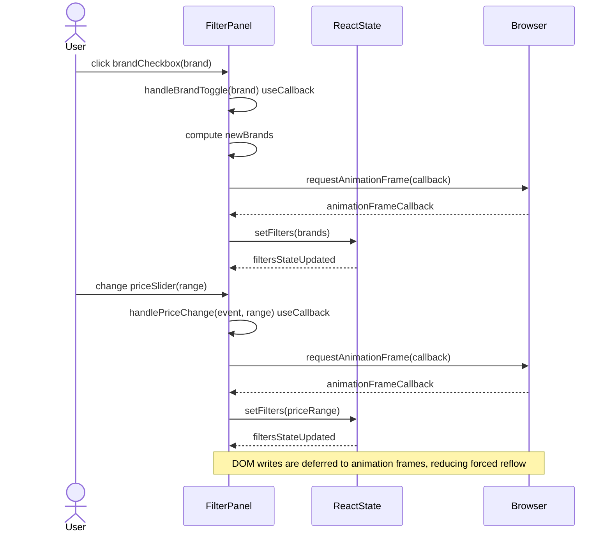
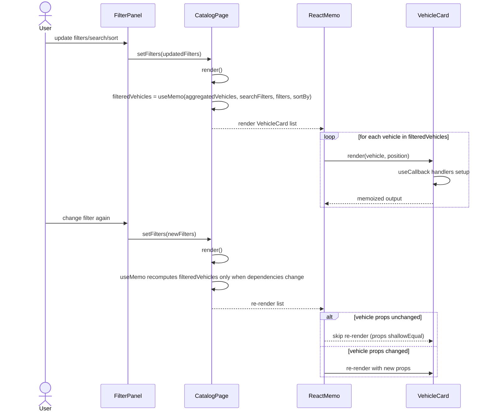
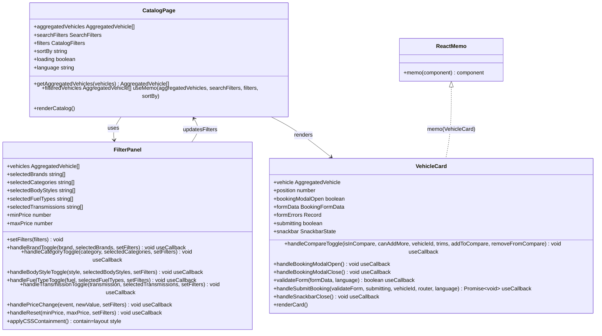

# PR #41 Review Analysis

**Generated**: 2026-01-07T10:58:34.851Z  
**Total Issues**: 1  
**Breakdown**: 1 CRITICAL, 0 HIGH, 0 MEDIUM, 0 LOW

---

## Summary

| Severity | Count | Action Required |
|----------|-------|-----------------|
| CRITICAL | 1 | Fix immediately before merge |
| HIGH | 0 | Fix if <5 min each |
| MEDIUM | 0 | Document for later |
| LOW | 0 | Optional (style/formatting) |

---

## CRITICAL Issues (1)


### 1. Sourcery

```
<!-- Generated by sourcery-ai[bot]: start review_guide -->

## Reviewer's Guide

This PR implements critical performance optimizations for the catalog page by memoizing expensive filtering logic, reducing unnecessary React re-renders, batching filter updates to avoid forced reflows, simplifying the loading DOM, and adding detailed performance documentation and logs.

#### Sequence diagram for FilterPanel requestAnimationFrame batching and memoized handlers



#### Sequence diagram for CatalogPage filteredVehicles memoization and VehicleCard memo rendering



#### Class diagram for CatalogPage, FilterPanel, and VehicleCard performance optimizations



### File-Level Changes

| Change | Details | Files |
| ------ | ------- | ----- |
| Memoize catalog filtering/sorting and simplify the loading state to cut JS work and DOM size. | <ul><li>Wrap filteredVehicles computation (filter + sort) in useMemo with dependencies on aggregatedVehicles, searchFilters, filters, and sortBy to avoid recalculation on unrelated renders.</li><li>Keep the existing search and filter semantics inside the memoized callback so behavior is unchanged.</li><li>Replace the previous invisible skeleton grid loading UI with a simple centered loading message Box + Typography to reduce DOM nodes during loading.</li></ul> | `src/app/[locale]/page.tsx` |
| Optimize FilterPanel interactions to avoid forced reflows and reduce render cost. | <ul><li>Convert all filter change handlers (brand, category, bodyStyle, fuelType, transmission, price range, reset) to useCallback so functions are stable between renders.</li><li>Wrap all setFilters calls inside requestAnimationFrame to batch DOM updates and mitigate forced reflow during filter interactions.</li><li>Add CSS containment (contain: 'layout style') and willChange: 'scroll-position' to the FilterPanel scroll container to isolate layout calculations and hint the browser for smoother scrolling.</li></ul> | `src/components/FilterPanel.tsx` |
| Memoize VehicleCard rendering and event handlers to reduce JS execution and avoid unnecessary re-renders. | <ul><li>Wrap VehicleCard in React.memo so cards do not re-render when their props have not changed.</li><li>Wrap key handlers (compare toggle, booking modal open/close, form validation, booking submit, snackbar close) in useCallback with appropriate dependency arrays to prevent recreating functions every render.</li><li>Keep component logic and behavior otherwise identical (routing, forms, compare logic) while reducing per-render allocations.</li></ul> | `src/components/VehicleCard.tsx` |
| Document the performance sprint work and log execution details and status changes. | <ul><li>Add a detailed PERF_SPRINT_ANALYSIS.md describing root causes, code changes, and expected metrics for PERF-011–PERF-014.</li><li>Add PERF_SPRINT_SUMMARY.md summarizing the sprint, affected files, metrics, and next steps for reviewers and maintainers.</li><li>Extend PERFORMANCE_LOG.md with a new entry describing this sprint’s work, metrics, and verification steps.</li></ul> | `docs/PERF_SPRINT_ANALYSIS.md`<br/>`docs/PERF_SPRINT_SUMMARY.md`<br/>`docs/PERFORMANCE_LOG.md` |
| Update backlog / meta-documentation to reflect PERF sprint completion and Task B investigation, and add supporting Task B docs. | <ul><li>Update BLACKBOX.md Priority 2 section to mark the PERF-011–PERF-014 sprint as complete and reference the new PR, docs, and expected duration.</li><li>Add Task B investigation and summary markdown files plus a dedicated performance log entry describing why a requested timing correction is blocked due to missing source data.</li><li>Create TASK_B_EXECUTION_REPORT.md capturing how Task B was executed, why it is blocked, and recommendations for unblocking.</li></ul> | `BLACKBOX.md`<br/>`TASK_B_EXECUTION_REPORT.md`<br/>`TASK_B_SUMMARY.md`<br/>`docs/BB_TASK_B_INVESTIGATION.md`<br/>`docs/PERFORMANCE_LOG_TASK_B_BLOCKED.md` |

---

<details>
<summary>Tips and commands</summary>

#### Interacting with Sourcery

- **Trigger a new review:** Comment `@sourcery-ai review` on the pull request.
- **Continue discussions:** Reply directly to Sourcery's review comments.
- **Generate a GitHub issue from a review comment:** Ask Sourcery to create an
  issue from a review comment by replying to it. You can also reply to a
  review comment with `@sourcery-ai issue` to create an issue from it.
- **Generate a pull request title:** Write `@sourcery-ai` anywhere in the pull
  request title to generate a title at any time. You can also comment
  `@sourcery-ai title` on the pull request to (re-)generate the title at any time.
- **Generate a pull request summary:** Write `@sourcery-ai summary` anywhere in
  the pull request body to generate a PR summary at any time exactly where you
  want it. You can also comment `@sourcery-ai summary` on the pull request to
  (re-)generate the summary at any time.
- **Generate reviewer's guide:** Comment `@sourcery-ai guide` on the pull
  request to (re-)generate the reviewer's guide at any time.
- **Resolve all Sourcery comments:** Comment `@sourcery-ai resolve` on the
  pull request to resolve all Sourcery comments. Useful if you've already
  addressed all the comments and don't want to see them anymore.
- **Dismiss all Sourcery reviews:** Comment `@sourcery-ai dismiss` on the pull
  request to dismiss all existing Sourcery reviews. Especially useful if you
  want to start fresh with a new review - don't forget to comment
  `@sourcery-ai review` to trigger a new review!

#### Customizing Your Experience

Access your [dashboard](https://app.sourcery.ai) to:
- Enable or disable review features such as the Sourcery-generated pull request
  summary, the reviewer's guide, and others.
- Change the review language.
- Add, remove or edit custom review instructions.
- Adjust other review settings.

#### Getting Help

- [Contact our support team](mailto:support@sourcery.ai) for questions or feedback.
- Visit our [documentation](https://docs.sourcery.ai) for detailed guides and information.
- Keep in touch with the Sourcery team by following us on [X/Twitter](https://x.com/SourceryAI), [LinkedIn](https://www.linkedin.com/company/sourcery-ai/) or [GitHub](https://github.com/sourcery-ai).

</details>

<!-- Generated by sourcery-ai[bot]: end review_guide -->
```


---

## HIGH Issues (0)

_No high-priority issues found._

---

## MEDIUM Issues (0)

_No medium-priority issues found._

---

## LOW Issues (0)

_No low-priority issues found._

---

## Next Steps

1. **Fix CRITICAL issues** (1 found) - Block merge until resolved
2. **Fix HIGH issues** (0 found) - Fix if <5 min each, otherwise document
3. **Document MEDIUM/LOW** (0 found) - Create follow-up issues

**Generated by**: `pnpm run pr:scrape 41`
