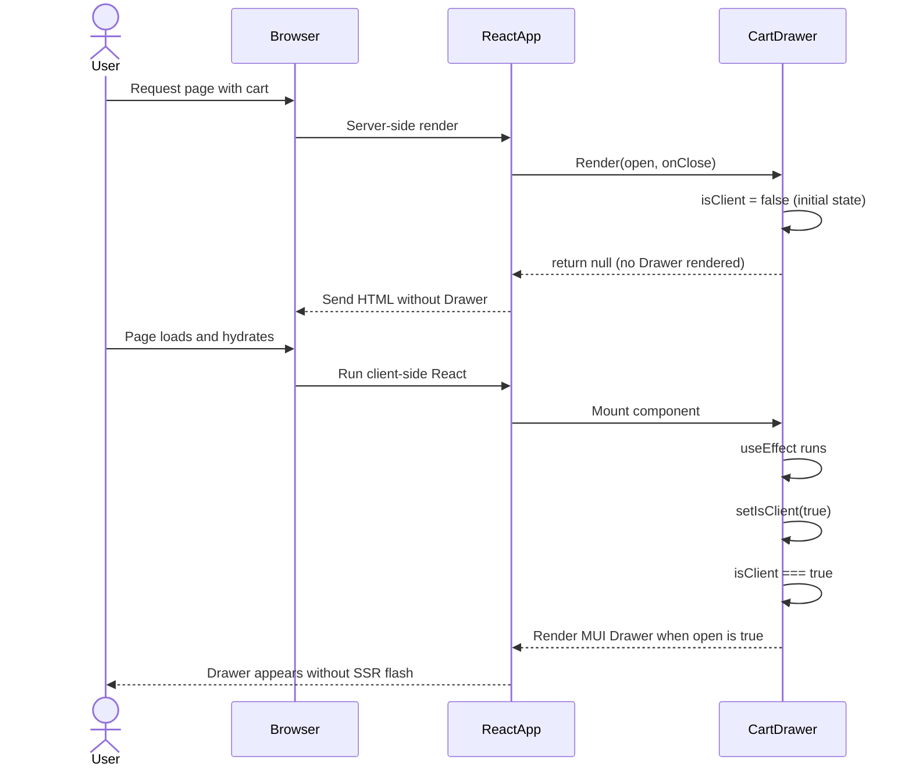
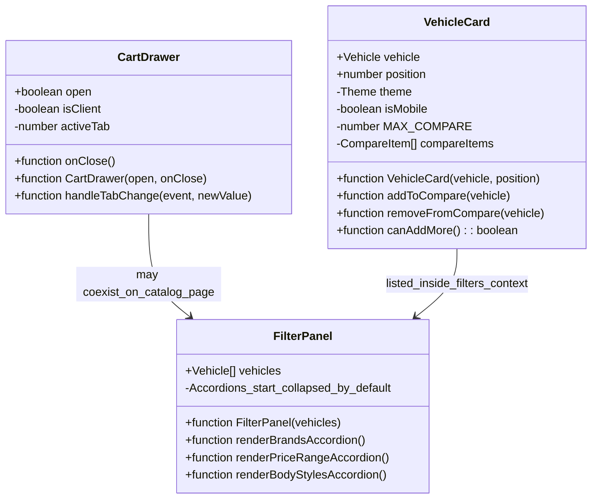

# PR #43 Review Analysis

**Generated**: 2026-01-07T13:48:37.089Z  
**Total Issues**: 5  
**Breakdown**: 1 CRITICAL, 2 HIGH, 1 MEDIUM, 1 LOW

---

## Summary

| Severity | Count | Action Required |
|----------|-------|-----------------|
| CRITICAL | 1 | Fix immediately before merge |
| HIGH | 2 | Fix if <5 min each |
| MEDIUM | 1 | Document for later |
| LOW | 1 | Optional (style/formatting) |

---

## CRITICAL Issues (1)


### 1. CodeRabbit

```
<!-- This is an auto-generated comment: summarize by coderabbit.ai -->
<!-- walkthrough_start -->

## Walkthrough

Updates multiple components and pages with UX enhancements and data changes. Landing and catalog pages replace stat entries from "24/7 Support" to "2 Locations," accordions default to collapsed state, CartDrawer adds SSR-safety mechanism, and VehicleCard implements responsive comparison limits based on device type.

## Changes

| Cohort / File(s) | Summary |
|---|---|
| **Stats Content Updates** <br> `src/app/[locale]/landing-v1/page.tsx`, `src/app/[locale]/landing-v3/page.tsx`, `src/components/catalog/CatalogHero.tsx` | Third/fourth stat entry changed from "24/7" Support to "2" Locations (with Arabic variant support in landing-v3). Simple value and label replacement with no logic changes. |
| **CartDrawer Hydration Guard** <br> `src/components/CartDrawer.tsx` | Adds client-only rendering check via `isClient` state initialized to false and set to true in `useEffect` after mount. Drawer only renders on client to prevent SSR visibility flash. |
| **Filter Panel Accordions** <br> `src/components/FilterPanel.tsx` | Removes `defaultExpanded` prop from three Accordion components (Brands, Price Range, Body Styles), causing them to collapse by default on render. Control flow and event handlers remain unchanged. |
| **Responsive Compare Limits** <br> `src/components/VehicleCard.tsx` | Introduces device-aware comparison limit: 2 items on mobile, 5 on desktop (replacing prior hard-coded limit of 3). Uses theme and media-query hook for breakpoint detection. |

## Estimated code review effort

🎯 3 (Moderate) | ⏱️ ~25 minutes

## Possibly related PRs

- **Hex-Tech-Lab/hex-test-drive-man#33**: Shares modifications to `src/components/VehicleCard.tsx` and related client-side rendering patterns in cart/drawer components; coordinates responsive design and SSR handling across overlapping component boundaries.

<!-- walkthrough_end -->


<!-- pre_merge_checks_walkthrough_start -->

<details>
<summary>🚥 Pre-merge checks | ✅ 3</summary>

<details>
<summary>✅ Passed checks (3 passed)</summary>

|     Check name     | Status   | Explanation                                                                                                                                                                                |
| :----------------: | :------- | :----------------------------------------------------------------------------------------------------------------------------------------------------------------------------------------- |
|  Description Check | ✅ Passed | Check skipped - CodeRabbit’s high-level summary is enabled.                                                                                                                                |
|     Title check    | ✅ Passed | The title accurately reflects the main objectives of the PR, which address three critical UI bugs (BUG-007, 008, 010) including drawer SSR issues, filter defaults, and comparison limits. |
| Docstring Coverage | ✅ Passed | Docstring coverage is 100.00% which is sufficient. The required threshold is 80.00%.                                                                                                       |

</details>

<sub>✏️ Tip: You can configure your own custom pre-merge checks in the settings.</sub>

</details>

<!-- pre_merge_checks_walkthrough_end -->

<!-- finishing_touch_checkbox_start -->

<details>
<summary>✨ Finishing touches</summary>

- [ ] <!-- {"checkboxId": "7962f53c-55bc-4827-bfbf-6a18da830691"} --> 📝 Generate docstrings
<details>
<summary>🧪 Generate unit tests (beta)</summary>

- [ ] <!-- {"checkboxId": "f47ac10b-58cc-4372-a567-0e02b2c3d479", "radioGroupId": "utg-output-choice-group-unknown_comment_id"} -->   Create PR with unit tests
- [ ] <!-- {"checkboxId": "07f1e7d6-8a8e-4e23-9900-8731c2c87f58", "radioGroupId": "utg-output-choice-group-unknown_comment_id"} -->   Post copyable unit tests in a comment
- [ ] <!-- {"checkboxId": "6ba7b810-9dad-11d1-80b4-00c04fd430c8", "radioGroupId": "utg-output-choice-group-unknown_comment_id"} -->   Commit unit tests in branch `bb/interface-bugs-critical`

</details>

</details>

<!-- finishing_touch_checkbox_end -->

<!-- tips_start -->

---

Thanks for using [CodeRabbit](https://coderabbit.ai?utm_source=oss&utm_medium=github&utm_campaign=Hex-Tech-Lab/hex-test-drive-man&utm_content=43)! It's free for OSS, and your support helps us grow. If you like it, consider giving us a shout-out.

<details>
<summary>❤️ Share</summary>

- [X](https://twitter.com/intent/tweet?text=I%20just%20used%20%40coderabbitai%20for%20my%20code%20review%2C%20and%20it%27s%20fantastic%21%20It%27s%20free%20for%20OSS%20and%20offers%20a%20free%20trial%20for%20the%20proprietary%20code.%20Check%20it%20out%3A&url=https%3A//coderabbit.ai)
- [Mastodon](https://mastodon.social/share?text=I%20just%20used%20%40coderabbitai%20for%20my%20code%20review%2C%20and%20it%27s%20fantastic%21%20It%27s%20free%20for%20OSS%20and%20offers%20a%20free%20trial%20for%20the%20proprietary%20code.%20Check%20it%20out%3A%20https%3A%2F%2Fcoderabbit.ai)
- [Reddit](https://www.reddit.com/submit?title=Great%20tool%20for%20code%20review%20-%20CodeRabbit&text=I%20just%20used%20CodeRabbit%20for%20my%20code%20review%2C%20and%20it%27s%20fantastic%21%20It%27s%20free%20for%20OSS%20and%20offers%20a%20free%20trial%20for%20proprietary%20code.%20Check%20it%20out%3A%20https%3A//coderabbit.ai)
- [LinkedIn](https://www.linkedin.com/sharing/share-offsite/?url=https%3A%2F%2Fcoderabbit.ai&mini=true&title=Great%20tool%20for%20code%20review%20-%20CodeRabbit&summary=I%20just%20used%20CodeRabbit%20for%20my%20code%20review%2C%20and%20it%27s%20fantastic%21%20It%27s%20free%20for%20OSS%20and%20offers%20a%20free%20trial%20for%20proprietary%20code)

</details>

<sub>Comment `@coderabbitai help` to get the list of available commands and usage tips.</sub>

<!-- tips_end -->

<!-- internal state start -->


<!-- DwQgtGAEAqAWCWBnSTIEMB26CuAXA9mAOYCmGJATmriQCaQDG+Ats2bgFyQAOFk+AIwBWJBrngA3EsgEBPRvlqU0AgfFwA6NPEgQAfACgjoCEYDEZyAAUASpETZWaCrKPR1AGxJcAZvAAeABTY8ACUXADCFOrwDGgeKBg0FD5oDCSQAthEyFC0VADulAA0kH4eyYilTMzczkj4WB7wzOqQgQBCAKoA4mAADP0A7MWDAByjAIz9oZCQBgByjgKUXAAsAMyQgCgEkADK+NgU6VyqAPTwSZSp6WBZOWAM0eJxCYBJhDDOpJyQzNpY8y6iFWMFEsAAErJuCQABpWHb7XDUbCILj4aEAgxdGwAGS4sFwuG4qLOZyI6lg2AEGhqZ3BJH8YGgYLAOJUZ1gDLANEQuDA+UkJDAfwwZ242A8HjOmzmBiiJGodHQPwATP0VQA2AaTAZDaCTFUcfobDhrACsAC03AhkLZ0LR8tJgchcLAKCQMl0AJKZbLITD0NC0IQo3AuzmQKQIBheBS1eqIRqQZqtTSQCKwTCkf0YegtOpiVFGKDdPrjBEAEUKlEgADUkPA1M1cPIAGIeNCIWD8LA2EgefBByLOXBVtBFPju3OUJW0I6XIj7PZ2OIohfoModrs9yDugdBjSQACCDqVaEYzXYYEQ8CUkFgsny1HgSYYnIYAGt2sDcJAAAZIBEl5JH+iT/iiJAAKI+D4oi4H+syJpAroZE+E49h48hTkoFD+j4yT3o+VDiI0pT9i0lzPhgi4oZunawBoBglr0AzDAirbwBUlDIJB/h1NO9ByJAFYkKkEo/BxXF8GkTAULQL4YMgnRULmVTWNE6SQDYWYkKUHSKPI0BQtIswThk6JkJk8hKGJFQ7swgicSQh59g5Uj0H+NloOJvH8UotCgT4FAsMhEblARMn4HJCnIEhKHyM4GRMJKaDEkqlwxPEmGlPmwUSOuDlNhkiBPB6WAomgpCMcxZbTAirn4FIkAqmsZxDPs2DcNwUW/lYnEeFwfbcB26T0AARC1bUdV1PVjZABQUpAE2QDi+BxCRilzQQCgUO6Yi/E6lULoeXTcLQip5lgf4drmC5gBIkxipVzlhv4f6lNdAZ3RIGxPVVr3vegub/ut8T4EQZwRNQYNEPSwUaAD1XpiwdTRImTQUb+b46Vwp3nTQ9BKPltzjolcaow0GOpsga7UZAACy3qZO6aAft1lxhmBf61iQ0ZeFDckI4gb1cIVTntH+iDMKBAaZP2+AFLMAC8zWMM4iAANzISoXi4GcSiIB+BDcBLUsy8DKiNSQyuQGaau4e0vAkPlhyIJhkBbEmRQCKEjEGJJ0iMJm1FKoEGrhAYkyHogxxnDU3XkEkiCQyOY4TkL/gGCq0ex/HjTsMnknJFYmD9hnBgbDnDBxyj+dJ2cPN8yQAu0OXaxVzXtR12GcfQwOENQ0i/dw/g5dmh3qXcGcADaA6vCQAC6Zw3fJ1H3Y9dT/cLBgahPXUz3P8SL8vX1rz9f0vdvBjMry67ut1FAExwTHpqn1YUFwGD4HR25Jpmcm7nlkGF+RduJcEitFRoyBkodjSoJayolvIVBfnsJEYYuDLVWutGKc15KIGGmgWQdAX4RBRgmRoXA7ZxAdkmA2Rt0SlBVPZRyXgjAiWGvgWQbAkii2cB+JULNaDyB8FFFArA6DwEVAdCgpAtZfwwHcFmH51xMz8P4aQft9DGHAFAMg9B8A+BwAQYgZBlAEzjNwn4vB+DCDgoKGQ8gmA4RUGoTQ2hdBgEMCYKAcBUCoEwEYwgpByDESVDUSxXBCj2EcH8FwVkFDONUOoLQOgtHaNMAYGO1dJ4HzWkfJeK9vob2ehnZ+Y1ykGAsMeL0JiQkXWiU4OJBig46UQEYDMOl6C0VdPAABvJqCQHYHEy4oVipoP9LtQhZRgrMA3JNdqexOoP1/OoEgsztrniwc+KBKAaDMEPHsaEDB4B+FeNlSAABvSM8RsDeEgAAcnmfc0oHYVgDQeYsmaj97mQAAL4oGQPfEaSoFqukudcjwtyuCPOecmFQ/ZoVbI2ogH5vzSjxGSOuAQ+AwW0QwI4SgsQIW3KBl0iMrz+zzQQLGJ2wIKD5TprRBwu1Di3TpryCg2AxBHAyLLbChK6Y+AHAUQ8Cxv44s5HwfuRLRFMCSMFBIQqFYtJDogP25hLBHiktsxSyFv60SUDGZwOrkDNIZMspUojxQCGaAwQZSQYjSGLJAMVKrsx6sGXxHqdAxRUltfa8QLZ7DwCIBgZE7o1XGBFCc6QuAAD65QSCGALB+EpQh0YGGAGcaNsFeQJqckYSCt8/jmKcRkd0+USAFEGTBHqXB6YSMcAYcpY1iwZKyWcHJs88leAKafIg91fqb0vv4MpFSqlHhqcEsxSoHCNPkM07GqqjBeiwLRAAiiET8iJqCxTsaRUZZRDiP27P038BROxuqVEFEKeCCGyHXBNVqQw5qgu7BShIY1PnLK2t/O9HYH10wmq+xaH6lpIpwe0WWskI0J1XouI8VA1B2okPUTAYZfYuvFShKV4NYilHxueJVBRSiiMoMFPgwdaDNDpku91ZNaXsHVS/V15rvW0F9TaolN5Q3hqSsHbMfsi3iBLWExQ5bnbwCrTWkRj962NuYM2ipTF2251ronHuAtRzv1KUp1tE6p2mNCfQOdsSF2GLo06l+J5aDQOAnyRo7t+XRDpkQbAzgunfy02nGs20nZSCSEuOw+UbxNnUMIrc3YhIc2CnOY5dNAL2fsGg3SiRMrNAAF7rjaNtVIHhgTouBj+cQCXfzbVwJyjIIzzwQWgrBfaaB8I1gfE+DaSMRIAcBXogVi5mm0R83wbADqEiJak4F1AFWSWBHdLgI4ur8WSkgHOFzi49jLl9i/L0XdH402BHVuC6ABzURvHeCCqCpGywgjmGTB3cvNBNqN9gZFFLzkZRGPOGmMJYW6zQtd737NI3ppcUR+Yer2hDLySxHqHBfLKxGcg1bRL1b5AITsSoWvEQUkHUQH5mMTu1cij1BrRAdkxzss1XrH6Wr4Na/17BHVtJfg210ihg28dm+6SAQ3LO0C4H+bz79QJsap/QD77AuYdrF/XAX45KAZ1Au6P4lxkB/mF7+Ly4kyjc42q/R+A3AhXIshgUjGAgL4GBH84cev35WGCsSUIf5C3FvqWWwBlbEe1rkwzBTem21gCMJL9TBczigIoCXcgHhdMtsqZqwzdTzGmecOZq9jOoANXcktxBPk+IBmvTM0K7oMhHgYLJeSr4g9J3aB0FStnSi29iBkbSIc9IGURLILwiBQjVG8jeN7ayPUrAUClOB8SNd2WVzQIM/BDHmtz/orAznDw2fSgoghmlwkF0SPJbBdNSysXaq2L0MJSWQH4dwX8DIkAlcXLydv65ZYcq5Rz5yyN5X4EVcKk/ztxdUa8A7RX/wXOGAPOWsjm8gGU4g8Q/AGIyWUifWnIFuECZeuq/iUkdASMrqlmLo2Gkq6AJeUUyBSkg8JARAUUUmakrYtyCQRk0Iak0AKkUsSAN4UCswoizKwUQ28GyYeGdqKwsgjQZKGQroheeBpeMUkAX85ilsUggOwOfAlwNGSULAliyAZkXOZ09S207oQqt2727+sCwItAdwsg/IWedkKwmYLsfAsmh6jWyOZ4+BkCikeOmqBO4h5WEYhqpOJq0+nqFq+iNOfqRK9O4gVmUAYq5ATuImLu4mbuUmHusmPwDa8kTa0eKm/umSamXcGmycjcsQ/MHmUe46setSM6JmMSSevhWBK6b+cWgc54RMDeYApMnOKYbQNhtE8cZMsEfGS+Do4YayvKwMbA8kaAYAAAjrcnEhVKQB6koMkK0OQCgIYsTsTFVsgGLF4ARqJBlHTPTEeDCHGhEAAPL0xWBHg2CQToDIBMJJibFDH0B2wSqUALTAguQkBr6By0S8AviUYeaPDib0BtG/iBAbCmSLT7GHEnFnEXFXEdHvaYA2b0xRRJTxAMASg6on5XaHqIBoBsAMwHFHGnHnGXHEpVZ/ZKHxhoxJgEBEBECxjSooaSKHqdT4yzgfHdbAGyCio4E1gWFoBWFQFYEerObriiLYr4DKJ0yMmgEYDuydFkLUlYBxB1BhZBrCHSCwDv6CSiAsCBywZQKCjQ6lSWQ3gZbORGAarHhuE7IeGoQk7GqE4U7+H8CBFcZ2ohHkHOoREkBRqYAxp5qJrJppCppVTpqNCZrZr+m5rxqJpREtAxF3gVrxEyZ1re4pGKZpEQAZGB7ZHB6gz9wpxDzgwjxFH6YlHTrGYNJmZVECZWYdIhyCGhS9ImZoJgS0SDwwwjzkzdzTIhTnhnpEqPLPo/Lfpg5DLyAbISEEoaQPIqg/IQY7ITmlCslUSLjYpgqoaQoPFwpvLtCXAxjYBcGIYqBEoVaYBuw6qYa+L+hSSqGZgrLID/qEIr6HobB9Jtk2prRfhvqHBlaHBvjrhyoVbv6bjKpkYBa/i/7HSWksb5zxmiai6xHJnSZI5pnJHwCpHKZpLeL2r6KGLeTGKVkxHiI8K7jjjVmVFCRlpIauIpIeJeI6IWLqBxq3iIBxooVFC0Bxr9KPwMXpJ5AqgMAagqi0AqgACcGwqOAgPgGo5oGwYwaAQwkltAZoGoGoJAQwJeYwDA/QZoKoZoCl4ldsOFTF4SLFbFHFkmVadAcaei/FuFTscabAMiJAcab4OO7FvFv4aSFyBgcwY0SAtgHQc8/CtApCpFuAVg5uBMY0vg8QBW/lS0XYhwHgtAIV35tgcVZQCVukSVgViAxxUgu0t4SgGA2VeWiVAV8ktANgQ2FYa0qCK2iAGYOO2Vk2eV1Vt4dVGA7guA/M74H47VlWxQ+VNVPVIkJU0Q5+CkrVn4FVuVo1AVNGYVXoiADg0gTV2V5SS1S0W4uAc1H4fYDgFQiA2V08SVcwflcwN1S0Hln4CweJJA21k1Tw8AM1SYh1Y0u1t1Y0Z6KIw1tyP1N1Y05qN0Oq21h19gyiXUSoUApCSg2kSSuAgAmATIAIBECwBgBeBSAJCJ7DLIBkA6zoHfWXUg0ORKDbUXoUAYALik23UBVkHkhhoeCHWPVsDbUGxvUfXlVk1opk3XUM1jT3Ufjs3PUYJ9Wxgi301C3/VnVcAdXA0BVg2YAQ0S0RiBqxgyRHCKhOaiReCFiHpK5YCCAiBiD2K+G0S2ClAFDRjdhBiOjrUF4eiMDPCxBQFMz3BKR76DAjCQDjClD9DTCzAHmQpcFoQ1hrZ2BMG3JqThQ1hj5hiFZIVUmUzJiYxqoy2/UU3i1LTU203URZ0g17SNB+BubugLX5adVC1M2USs2DVi3bWa3PV83A2C2/Ui2N0YINUMAcrrikLFXPRF0BVy2A3V2/Uq1hobQvVrR920ZWxUCzGoDTD9AaCDAACkVKsQ3YqADgMEsQY2aYcAEmkxvSSoGpKVaVAKkAYwq9G9Ggw9S0OdVNzgBdRAj9Y0tdLNbNT1nNs9FWC4Z1fNSVC8u1Y0+1tgr10109GCaoaAGoZoqQYwQwPgQwGoPgDAPgkwcQaAkwawHoAg4lYwmwJAAgGowwkwYwGotAkwtAYwlDGwawKoQw/Q8DtAQwkwUl4lDAalmDxlaw/QMt4DnYUVNgktudY0GoGw4wBlaAKoPgxD4lylJAwwOlAgxoGwCjKoLUkljW4ltAawGlZo4lPgZoHoPgaw3DGwZotAPD4log2DJeAjawaAQjtA/9K2A9ygpAq6yQLN52NA2V7dyVscXah8vaJ8bKA6D0F8GcQTZNAVBAQ8lBwByK2VkwStS0Pg2uMUAA6hSD3XPTkOk63WTX9aE/vN2vPH2lE4OrE69PEwzUtEk/ECk+bVAuk5k2NNk6k3kwUx44AyU7dfzb9bmQnMHqHuHmXA01wME4kziq0zkx01wBkwk1k0s4pPk66IUwA8dkMzdSMyDWM93MnDLunDM5cms2NC0x4G02kys10z0+05s/073bs8Uys6U6M1keM/XAWeDEWV2ZQKPBc3M80ws7cxs/LZAKs00901C1s7ADs81fs3ML8klei+i5mkxU5S5aQO5YNexfZfoEAA=== -->

<!-- internal state end -->
```


---

## HIGH Issues (2)


### 1. Sourcery

```
<!-- Generated by sourcery-ai[bot]: start review_guide -->

## Reviewer's Guide

Implements four UI bug fixes: prevents CartDrawer from rendering during SSR to avoid visibility flash, collapses filter accordions by default, makes vehicle comparison limits responsive to device size, and replaces misleading "24/7 Support" stats with "2 Locations" across landing and catalog hero components.

#### Sequence diagram for CartDrawer SSR hydration visibility fix



#### Class diagram for updated UI components (CartDrawer, FilterPanel, VehicleCard)



### File-Level Changes

| Change | Details | Files |
| ------ | ------- | ----- |
| Guard CartDrawer rendering until after client hydration to fix SSR visibility flash. | <ul><li>Introduce isClient state initialized to false in CartDrawer</li><li>Set isClient to true in a useEffect to detect client-side hydration</li><li>Return null from CartDrawer when isClient is false to avoid SSR rendering of the drawer</li></ul> | `src/components/CartDrawer.tsx` |
| Ensure filter accordions are collapsed by default instead of expanded. | <ul><li>Remove defaultExpanded prop from Brands accordion</li><li>Remove defaultExpanded prop from Price Range accordion</li><li>Remove defaultExpanded prop from Body Styles accordion</li></ul> | `src/components/FilterPanel.tsx` |
| Make vehicle comparison limit responsive by device breakpoint (2 on mobile, 5 on tablet/desktop). | <ul><li>Import and use MUI useTheme and useMediaQuery in VehicleCard</li><li>Derive isMobile using theme.breakpoints.down('sm')</li><li>Set MAX_COMPARE to 2 for mobile and 5 otherwise</li><li>Update canAddMore logic to compare against MAX_COMPARE instead of a hard-coded value</li></ul> | `src/components/VehicleCard.tsx` |
| Replace misleading "24/7 Support" stat with "2 Locations" across landing and catalog views. | <ul><li>Update CatalogHero stats config to use value "2" and label "Locations" (or Arabic equivalent) instead of "24/7 Support"</li><li>Update LandingV1 stats array to use "2" / "Locations" instead of "24/7" / "Support"</li><li>Update LandingV3 stats grid item to show "2" and "Locations" (or Arabic equivalent) instead of "24/7" / "Support"</li></ul> | `src/components/catalog/CatalogHero.tsx`<br/>`src/app/[locale]/landing-v1/page.tsx`<br/>`src/app/[locale]/landing-v3/page.tsx` |

---

<details>
<summary>Tips and commands</summary>

#### Interacting with Sourcery

- **Trigger a new review:** Comment `@sourcery-ai review` on the pull request.
- **Continue discussions:** Reply directly to Sourcery's review comments.
- **Generate a GitHub issue from a review comment:** Ask Sourcery to create an
  issue from a review comment by replying to it. You can also reply to a
  review comment with `@sourcery-ai issue` to create an issue from it.
- **Generate a pull request title:** Write `@sourcery-ai` anywhere in the pull
  request title to generate a title at any time. You can also comment
  `@sourcery-ai title` on the pull request to (re-)generate the title at any time.
- **Generate a pull request summary:** Write `@sourcery-ai summary` anywhere in
  the pull request body to generate a PR summary at any time exactly where you
  want it. You can also comment `@sourcery-ai summary` on the pull request to
  (re-)generate the summary at any time.
- **Generate reviewer's guide:** Comment `@sourcery-ai guide` on the pull
  request to (re-)generate the reviewer's guide at any time.
- **Resolve all Sourcery comments:** Comment `@sourcery-ai resolve` on the
  pull request to resolve all Sourcery comments. Useful if you've already
  addressed all the comments and don't want to see them anymore.
- **Dismiss all Sourcery reviews:** Comment `@sourcery-ai dismiss` on the pull
  request to dismiss all existing Sourcery reviews. Especially useful if you
  want to start fresh with a new review - don't forget to comment
  `@sourcery-ai review` to trigger a new review!

#### Customizing Your Experience

Access your [dashboard](https://app.sourcery.ai) to:
- Enable or disable review features such as the Sourcery-generated pull request
  summary, the reviewer's guide, and others.
- Change the review language.
- Add, remove or edit custom review instructions.
- Adjust other review settings.

#### Getting Help

- [Contact our support team](mailto:support@sourcery.ai) for questions or feedback.
- Visit our [documentation](https://docs.sourcery.ai) for detailed guides and information.
- Keep in touch with the Sourcery team by following us on [X/Twitter](https://x.com/SourceryAI), [LinkedIn](https://www.linkedin.com/company/sourcery-ai/) or [GitHub](https://github.com/sourcery-ai).

</details>

<!-- Generated by sourcery-ai[bot]: end review_guide -->
```


### 2. CodeRabbit - src/components/CartDrawer.tsx:64

```
_🧹 Nitpick_ | _🔵 Trivial_

**Consider using Next.js dynamic import instead of client-side hydration guard.**

While the current pattern resolves the SSR flash, it causes an unnecessary re-render cycle (null → Drawer) on every mount. A more idiomatic Next.js 15 approach would be:

**Option 1 (Recommended):** Use dynamic import with `ssr: false` in the parent component (Header.tsx):

```typescript
const CartDrawer = dynamic(() => import('@/components/CartDrawer'), { 
  ssr: false,
  loading: () => <CartDrawerSkeleton />
});
```

**Option 2:** If keeping the current structure, show the `CartDrawerSkeleton` instead of `null` during hydration:

```diff
  // BUG-008 FIX: Don't render drawer during SSR to prevent flash
  if (!isClient) {
-   return null;
+   return <CartDrawerSkeleton />;
  }
```

Both approaches eliminate the extra render while providing better UX during the hydration phase.


Also applies to: 77-80, 98-101

<details>
<summary>🤖 Prompt for AI Agents</summary>

```
In @src/components/CartDrawer.tsx around lines 63 - 64, The current SSR
hydration guard in CartDrawer (the isClient state and setIsClient usage) causes
an extra render; replace it by dynamically importing CartDrawer from the parent
(Header.tsx) with ssr: false and a loading component (CartDrawerSkeleton) to
prevent the SSR flash and remove the isClient logic, or if you must keep the
component-level guard, render CartDrawerSkeleton instead of null during
hydration; update references to the isClient state and any conditional render
blocks (inside CartDrawer) and remove the unnecessary useState/useEffect guard
so the component mounts only on client when using dynamic import.
```

</details>

<!-- fingerprinting:phantom:poseidon:puma -->

<!-- This is an auto-generated comment by CodeRabbit -->
```


---

## MEDIUM Issues (1)


### 1. SonarCloud

```
## [](https://sonarcloud.io/dashboard?id=Hex-Tech-Lab_hex-test-drive-man&pullRequest=43) **Quality Gate failed**  
Failed conditions  
 [12.1% Duplication on New Code](https://sonarcloud.io/component_measures?id=Hex-Tech-Lab_hex-test-drive-man&pullRequest=43&metric=new_duplicated_lines_density&view=list) (required ≤ 3%)  
  
[See analysis details on SonarQube Cloud](https://sonarcloud.io/dashboard?id=Hex-Tech-Lab_hex-test-drive-man&pullRequest=43)


```


---

## LOW Issues (1)


### 1. CodeRabbit - src/components/VehicleCard.tsx:76

```
_⚠️ Potential issue_ | _🟡 Minor_

<details>
<summary>🧩 Analysis chain</summary>

🏁 Script executed:

```shell
#!/bin/bash

# First, let's check if the compare page file exists and look at line 24
echo "=== Checking compare page line 24 ==="
if [ -f "src/app/[locale]/compare/page.tsx" ]; then
  sed -n '20,30p' "src/app/[locale]/compare/page.tsx"
else
  echo "File not found at expected path, searching for compare page..."
  find . -name "page.tsx" -path "*/compare/*" 2>/dev/null
fi

echo ""
echo "=== Searching for hardcoded comparison limits ==="
# Search for hardcoded "3" in comparison-related text
rg -n 'Add up to 3|up to 3|MAX_COMPARE|compare.*3|comparison.*3' --type=tsx --type=ts -C 2

echo ""
echo "=== Searching for MAX_COMPARE constants and usage ==="
rg -n 'MAX_COMPARE|MAX.*COMPARE' --type=tsx --type=ts

echo ""
echo "=== Searching for comparison item length checks ==="
rg -n 'compareItems.*length|items.*length.*[<>=].*[0-9]' --type=tsx --type=ts -C 1
```

Repository: Hex-Tech-Lab/hex-test-drive-man

Length of output: 578

---

🏁 Script executed:

```shell
#!/bin/bash

# Get more info about the VehicleCard.tsx file context
echo "=== Checking VehicleCard.tsx around lines 72-76 ==="
if [ -f "src/components/VehicleCard.tsx" ]; then
  wc -l src/components/VehicleCard.tsx
  sed -n '65,85p' src/components/VehicleCard.tsx
else
  echo "File not found, searching..."
  find . -name "VehicleCard.tsx" 2>/dev/null
fi

echo ""
echo "=== Searching for all comparison limit references ==="
rg -n '\bMAX\b.*[=:].*[0-9]|\b(2|3|5)\s*(vehicles?|cars?|compare|items?)' --type=tsx --type=ts | head -30
```

Repository: Hex-Tech-Lab/hex-test-drive-man

Length of output: 1288

---

🏁 Script executed:

```shell
#!/bin/bash

echo "=== Searching for 'Add up to' text ==="
rg -n 'Add up to|up to.*vehicle|up to.*car' --type ts --type js -C 2 2>/dev/null || rg -n 'Add up to|up to.*vehicle|up to.*car' -C 2

echo ""
echo "=== Searching for MAX_COMPARE usage ==="
rg -n 'MAX_COMPARE' -C 2

echo ""
echo "=== Checking compare page structure ==="
if [ -f "src/app/\[locale\]/compare/page.tsx" ]; then
  cat "src/app/\[locale\]/compare/page.tsx"
elif find . -path "*/compare/page.tsx" 2>/dev/null | grep -q .; then
  find . -path "*/compare/page.tsx" -exec cat {} \;
else
  echo "Searching for compare-related files..."
  find . -type f -name "*.tsx" -o -name "*.ts" | xargs grep -l "compare" | head -10
fi

echo ""
echo "=== Searching for hardcoded comparison numbers (2, 3, 5) ==="
rg -n 'compareItems.*length|MAX.*=.*[235]|const.*MAX' -C 1
```

Repository: Hex-Tech-Lab/hex-test-drive-man

Length of output: 14458

---

🏁 Script executed:

```shell
#!/bin/bash

# More targeted search for compare page and limits
echo "=== Listing files in compare directory ==="
find . -type d -name "compare" 2>/dev/null

echo ""
echo "=== Looking for compare page files ==="
find . -type f \( -name "page.tsx" -o -name "page.ts" -o -name "*.tsx" -o -name "*.ts" \) 2>/dev/null | grep -i compare | head -20

echo ""
echo "=== Search for '3 vehicles' or similar UI text ==="
rg -n '"Add|Add.*vehicle|vehicle.*compar' -C 1 | head -50
```

Repository: Hex-Tech-Lab/hex-test-drive-man

Length of output: 50390

---


</details>

**Update compare page UI text to reflect device-aware limits.**

The compare page displays "Add up to 3 vehicles to compare" (line 37), but VehicleCard.tsx enforces device-aware limits: 2 on mobile, 5 on desktop/tablet. The comparison store also permits up to 5 vehicles max. Update the text to either:
- Remove the specific number and use "Add vehicles to compare", or
- Make the text dynamic based on the device limit

The grid layout already handles up to 5 vehicles correctly without breaking responsiveness.

<details>
<summary>🤖 Prompt for AI Agents</summary>

```
In @src/components/VehicleCard.tsx around lines 72 - 76, The compare page UI
text currently hardcodes "Add up to 3 vehicles to compare" which conflicts with
the device-aware MAX_COMPARE in VehicleCard.tsx (isMobile and MAX_COMPARE).
Update the compare page text to either remove the specific number (use "Add
vehicles to compare") or make it dynamic by importing/deriving the same
device-aware value (useMediaQuery(theme.breakpoints.down('sm')) or MAX_COMPARE)
and render "Add up to {MAX_COMPARE} vehicles to compare" so the UI matches the
enforced limits.
```

</details>

<!-- fingerprinting:phantom:poseidon:puma -->

<!-- This is an auto-generated comment by CodeRabbit -->
```


---

## Next Steps

1. **Fix CRITICAL issues** (1 found) - Block merge until resolved
2. **Fix HIGH issues** (2 found) - Fix if <5 min each, otherwise document
3. **Document MEDIUM/LOW** (2 found) - Create follow-up issues

**Generated by**: `pnpm run pr:scrape 43`
