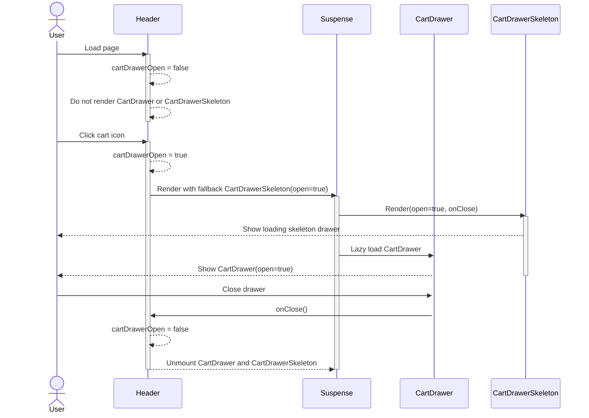
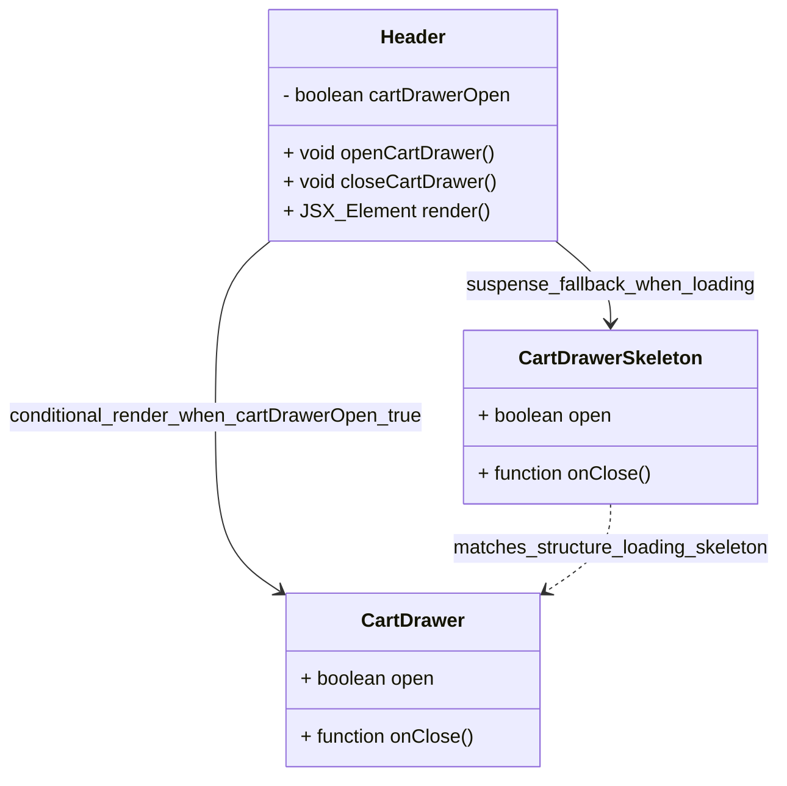

# PR #47 Review Analysis

**Generated**: 2026-01-14T08:36:27.613Z  
**Total Issues**: 4  
**Breakdown**: 0 CRITICAL, 2 HIGH, 1 MEDIUM, 1 LOW

---

## Summary

| Severity | Count | Action Required |
|----------|-------|-----------------|
| CRITICAL | 0 | Fix immediately before merge |
| HIGH | 2 | Fix if <5 min each |
| MEDIUM | 1 | Document for later |
| LOW | 1 | Optional (style/formatting) |

---

## CRITICAL Issues (0)

_No critical issues found._

---

## HIGH Issues (2)


### 1. Sourcery

```
<!-- Generated by sourcery-ai[bot]: start review_guide -->

## Reviewer's Guide

Fixes BUG-011 by making the cart drawer skeleton respect the drawer's open state and restructuring Header to lazy-load and conditionally render the CartDrawer with a Suspense fallback, eliminating the transparent flash on page load.

#### Sequence diagram for cart drawer lazy load and skeleton fallback



#### Updated class diagram for Header, CartDrawer, and CartDrawerSkeleton



### File-Level Changes

| Change | Details | Files |
| ------ | ------- | ----- |
| Make CartDrawerSkeleton controllable so it only appears when the drawer should be open and avoids SSR flash. | <ul><li>Introduced CartDrawerSkeletonProps with optional open and onClose props, defaulting open to false.</li><li>Replaced hardcoded open={true} on the MUI Drawer with open passed from props and wired onClose to the Drawer.</li><li>Adjusted Drawer paper styles to explicitly set background color and opacity to ensure correct visual appearance during skeleton display.</li><li>Updated JSDoc comment to document BUG-011 behavior and new open-prop behavior.</li></ul> | `src/components/skeletons/CartDrawerSkeleton.tsx` |
| Change Header to conditionally render CartDrawer and show the skeleton only while the lazy-loaded CartDrawer is resolving, preventing initial page-load flash. | <ul><li>Removed the loading skeleton from the dynamic CartDrawer import to avoid skeleton rendering during SSR/hydration.</li><li>Wrapped CartDrawer in a Suspense boundary with CartDrawerSkeleton as the fallback, passing open and onClose through to keep behavior consistent.</li><li>Added conditional rendering so the CartDrawer (and its Suspense wrapper) only mount when cartDrawerOpen is true, avoiding any drawer-related UI on initial page load.</li><li>Updated comments to document the BUG-011 fix and the rationale for the new lazy-load and Suspense behavior.</li></ul> | `src/components/Header.tsx` |

---

<details>
<summary>Tips and commands</summary>

#### Interacting with Sourcery

- **Trigger a new review:** Comment `@sourcery-ai review` on the pull request.
- **Continue discussions:** Reply directly to Sourcery's review comments.
- **Generate a GitHub issue from a review comment:** Ask Sourcery to create an
  issue from a review comment by replying to it. You can also reply to a
  review comment with `@sourcery-ai issue` to create an issue from it.
- **Generate a pull request title:** Write `@sourcery-ai` anywhere in the pull
  request title to generate a title at any time. You can also comment
  `@sourcery-ai title` on the pull request to (re-)generate the title at any time.
- **Generate a pull request summary:** Write `@sourcery-ai summary` anywhere in
  the pull request body to generate a PR summary at any time exactly where you
  want it. You can also comment `@sourcery-ai summary` on the pull request to
  (re-)generate the summary at any time.
- **Generate reviewer's guide:** Comment `@sourcery-ai guide` on the pull
  request to (re-)generate the reviewer's guide at any time.
- **Resolve all Sourcery comments:** Comment `@sourcery-ai resolve` on the
  pull request to resolve all Sourcery comments. Useful if you've already
  addressed all the comments and don't want to see them anymore.
- **Dismiss all Sourcery reviews:** Comment `@sourcery-ai dismiss` on the pull
  request to dismiss all existing Sourcery reviews. Especially useful if you
  want to start fresh with a new review - don't forget to comment
  `@sourcery-ai review` to trigger a new review!

#### Customizing Your Experience

Access your [dashboard](https://app.sourcery.ai) to:
- Enable or disable review features such as the Sourcery-generated pull request
  summary, the reviewer's guide, and others.
- Change the review language.
- Add, remove or edit custom review instructions.
- Adjust other review settings.

#### Getting Help

- [Contact our support team](mailto:support@sourcery.ai) for questions or feedback.
- Visit our [documentation](https://docs.sourcery.ai) for detailed guides and information.
- Keep in touch with the Sourcery team by following us on [X/Twitter](https://x.com/SourceryAI), [LinkedIn](https://www.linkedin.com/company/sourcery-ai/) or [GitHub](https://github.com/sourcery-ai).

</details>

<!-- Generated by sourcery-ai[bot]: end review_guide -->
```


### 2. CodeRabbit

```
<!-- This is an auto-generated comment: summarize by coderabbit.ai -->
<!-- walkthrough_start -->

## Walkthrough

This PR refactors the CartDrawer lazy-loading behavior to prevent rendering flashes by introducing React Suspense with conditional rendering and updating CartDrawerSkeleton to accept props for controlled visibility management.

## Changes

| Cohort / File(s) | Summary |
|---|---|
| **Suspense-based lazy loading**<br>`src/components/Header.tsx` | Added Suspense import and wrapped dynamic CartDrawer in a conditional Suspense block that renders only when `cartDrawerOpen` is true. Replaced the `loading` configuration in dynamic import with a `CartDrawerSkeleton` Suspense fallback to delay rendering and show skeleton only during actual load phase. |
| **Skeleton component enhancement**<br>`src/components/skeletons/CartDrawerSkeleton.tsx` | Introduced `CartDrawerSkeletonProps` interface with `open` (boolean, default false) and `onClose` (optional callback). Updated component signature to accept destructured props, wired the `open` prop to Drawer visibility, and added explicit background color and opacity to Drawer paper for consistent styling. |

## Estimated code review effort

🎯 3 (Moderate) | ⏱️ ~20 minutes

## Possibly related PRs

- **Hex-Tech-Lab/hex-test-drive-man#43**: Addresses the same CartDrawer flash/visibility issue by adding a client-only hydration guard inside CartDrawer, complementary approach to SSR rendering control.

<!-- walkthrough_end -->


<!-- pre_merge_checks_walkthrough_start -->

<details>
<summary>🚥 Pre-merge checks | ✅ 3</summary>

<details>
<summary>✅ Passed checks (3 passed)</summary>

|     Check name     | Status   | Explanation                                                                                                                                                       |
| :----------------: | :------- | :---------------------------------------------------------------------------------------------------------------------------------------------------------------- |
|  Description Check | ✅ Passed | Check skipped - CodeRabbit’s high-level summary is enabled.                                                                                                       |
|     Title check    | ✅ Passed | The title directly references the bug fix (BUG-011) and the specific issue being resolved (drawer transparency flash), accurately summarizing the primary change. |
| Docstring Coverage | ✅ Passed | Docstring coverage is 100.00% which is sufficient. The required threshold is 80.00%.                                                                              |

</details>

<sub>✏️ Tip: You can configure your own custom pre-merge checks in the settings.</sub>

</details>

<!-- pre_merge_checks_walkthrough_end -->

<!-- finishing_touch_checkbox_start -->

<details>
<summary>✨ Finishing touches</summary>

- [ ] <!-- {"checkboxId": "7962f53c-55bc-4827-bfbf-6a18da830691"} --> 📝 Generate docstrings
<details>
<summary>🧪 Generate unit tests (beta)</summary>

- [ ] <!-- {"checkboxId": "f47ac10b-58cc-4372-a567-0e02b2c3d479", "radioGroupId": "utg-output-choice-group-unknown_comment_id"} -->   Create PR with unit tests
- [ ] <!-- {"checkboxId": "07f1e7d6-8a8e-4e23-9900-8731c2c87f58", "radioGroupId": "utg-output-choice-group-unknown_comment_id"} -->   Post copyable unit tests in a comment
- [ ] <!-- {"checkboxId": "6ba7b810-9dad-11d1-80b4-00c04fd430c8", "radioGroupId": "utg-output-choice-group-unknown_comment_id"} -->   Commit unit tests in branch `bb/bug-011-drawer-flash-proper-fix`

</details>

</details>

<!-- finishing_touch_checkbox_end -->

<!-- tips_start -->

---

Thanks for using [CodeRabbit](https://coderabbit.ai?utm_source=oss&utm_medium=github&utm_campaign=Hex-Tech-Lab/hex-test-drive-man&utm_content=47)! It's free for OSS, and your support helps us grow. If you like it, consider giving us a shout-out.

<details>
<summary>❤️ Share</summary>

- [X](https://twitter.com/intent/tweet?text=I%20just%20used%20%40coderabbitai%20for%20my%20code%20review%2C%20and%20it%27s%20fantastic%21%20It%27s%20free%20for%20OSS%20and%20offers%20a%20free%20trial%20for%20the%20proprietary%20code.%20Check%20it%20out%3A&url=https%3A//coderabbit.ai)
- [Mastodon](https://mastodon.social/share?text=I%20just%20used%20%40coderabbitai%20for%20my%20code%20review%2C%20and%20it%27s%20fantastic%21%20It%27s%20free%20for%20OSS%20and%20offers%20a%20free%20trial%20for%20the%20proprietary%20code.%20Check%20it%20out%3A%20https%3A%2F%2Fcoderabbit.ai)
- [Reddit](https://www.reddit.com/submit?title=Great%20tool%20for%20code%20review%20-%20CodeRabbit&text=I%20just%20used%20CodeRabbit%20for%20my%20code%20review%2C%20and%20it%27s%20fantastic%21%20It%27s%20free%20for%20OSS%20and%20offers%20a%20free%20trial%20for%20proprietary%20code.%20Check%20it%20out%3A%20https%3A//coderabbit.ai)
- [LinkedIn](https://www.linkedin.com/sharing/share-offsite/?url=https%3A%2F%2Fcoderabbit.ai&mini=true&title=Great%20tool%20for%20code%20review%20-%20CodeRabbit&summary=I%20just%20used%20CodeRabbit%20for%20my%20code%20review%2C%20and%20it%27s%20fantastic%21%20It%27s%20free%20for%20OSS%20and%20offers%20a%20free%20trial%20for%20proprietary%20code)

</details>

<sub>Comment `@coderabbitai help` to get the list of available commands and usage tips.</sub>

<!-- tips_end -->

<!-- internal state start -->


<!-- DwQgtGAEAqAWCWBnSTIEMB26CuAXA9mAOYCmGJATmriQCaQDG+Ats2bgFyQAOFk+AIwBWJBrngA3EsgEBPRvlqU0AgfFwA6NPEgQAfACgjoCEYDEZyAAUASpETZWaCrKPR1AGxJcAZvAAeABTY8ACUXFYU+NyUkH7+cfh8AEIAqgDiYAAMAIw5kLRUAO6xuFQYiNzOZAzyPh5oiLCQkAYAco4ClFwALADskIAoBJAAyvjYFAwkkALlDLBcqgD0AthE2XlghWglFGD1jbBgvNGU+wGQgEmEMM6knJDM2litqYjdMKKwABKyMQAaViGo1w1GwiC4pywwwAwhQSNQ6FwAExZJEANg22T60ByaI4AFY8QBmLIALRaBlSNgAMlxYLhcNxwUslkR1LBsAINExmEsviR/GBoJ8wNSVEtYAKwDRELgthRJCQwI8MEtuNgPB4lv0jJFBF5mBwDFA0plcjkuNBypVqhhcPYANYkLwELDbXZxBpNSASJDwARefhYKqkSBwjz4NC0DTWOG+8bIeKQQK2SBmHr40IFeD0DD4e1wxD4DxSSC4SVh/D5xhoMEkADcKEQDmmMQoiCQNHo8GDUVo2DE8HwGA0RhsVftDFrbyNUGhzlwABFipQRk6XcPILAo/wYhgALwAbzK2BIAF8t85aEwlLQADQ1sE9ogoe0EMNkJR8fsKjAvkYjDYEqyNs4ibo0ZYVhGUbPnEaCagIaAMA6iTfrIGBoMw8AMIEWbwMw3BJLgyAkFIWBFJKWDltM7qxE04wePQXSMBGbzRkYYweHgQ4YEaOQxvOFBLiuFBrs6JCupAeZFOgDBTNwxG7mQ6AYPQw7QqxrZREyyZKD4tYePakL7vpHhvKEMatEiMb8lGlAaMRCR1sgTCqeoPHwR+qmULB77Dh48hwt5fCCcJOyxBRylTkJy7hRQADye6QPuKVlhQp6WQYRICQusUeqgRRUNwMT0EU7KjGCe5vCp9DOZB0yIOuEmbqZHiIchQYBZAkVURWtF8KgSG4Ng8FdZCz6ZT0MY2CQzD4FI9DUY64mST4UTMAU6GYdhuGQNBtCwSc3BlvgPBxuwoyAZ6hyjgYwqys+s6QF8V4fvtyCbkszg1ZASzKVEeDSFweZpZgNpBfaBxNJlc4eNhDqwdF9rYcOXD9UpFTdeVjUrZuP6wQ0ABe8j7TDsaKAOYFYKs8CMWW0hdnt+BTpq8iBNwGDcBtNN0wAZLzPCcxtsoLhZFJQAA6kkDqJkkkA2NA1LJgAglQagMFmmD0NS0B2IEACif5w00WYNLI4zEWTHNczMIR01UzbSLdABitPSIw25/oixr2JMSw8oR5B2ogfLwl+DmIAkwyuQdVOeUFX6wWV5YVZUZDVa0UCIH7AfDuwIc4xuFRLKFeWrk1roR1H6C0LeZ3RMgPY0BQ+lTEYGn4G8yCmhsORGPoxjgFAn78D4OAEMQZDKIzPJsHaXC8PwwiiOIUgyPIN7KKo6haDoA8mFAcCoINWC1hPpDkFQM8sHP9zFPYjiPC4Mwb4oW9qJo2i6GAhiD6YBjZwYP7Fggd86hzshQKuRoABEsCDAWEgMrAAkpPS+CJ6AOCcM/fAY95iYFIIgfuiDa50FTlVaY758KESEsgLW3UiolXqpAUuIkUCnwUG5OOHgyHp2mAGZmKFyzUC8l+D6GAuo9RrDFESiVlKoBPCQGMcAaJbSwgwZhuVWH7VgtJSAdU0A8IqNMVq7UUKBBYXFMSRc8IVBoDuHB6BIBEAjIhbh2i/z1zbLgWQSiEDIF4KRfOKk2HuU8lDZocgCjOjQLIWCCcfIeIcRYj02A7S0wxqQuhT4PFLULs1LA/l5D4xyRWIaI03FoGJmAdxL5uDbjeNNWa81SFLQCfGMETMYJ/i4LtfcehIDAGSeXXGWAlj9Ncn4IgExqA8TiOtTaGE1ExlSNwWg6CFCsCCe+OE9QV5MKTHQro254yQKMOYSwytDLTx4sgd8S0lAMAaFfG5o9IACmoYzOW6oAzYTeWk8Q0giFtFOngr2tzTodiIBhYahZXnvKInQNUnI4bqPYO5J2Rh9YPUeNfJQH5fQkBkiQHwPgiJcAALJ0HgI4AwsDoH93/oA4BBE87ByWHk10IchmiQrsOKBtK4EIOQag6epDMFP3kA40FBCiFILtH2Ac7sDFHUbnaSgrdpjcqsfkvUOk6Hwq7kw3OQd7QQWVdpeUiosAcr5TAPqxKDL2nhUJKS+AZJIXkopAxShZTpTEBMUhKql4iDEFjFOkJdIOo1JDeC5kfrqU0g+Hssow6vIMXmMAtw4ipMHHyn2yjIBlz4LowsMQxC3IrBGo6P0yqwoTZ3Chp0lpFofGQFQcMPGuTKMWLw9BfQdjUHDbx8aFIeW4Y8htMwSDHKHKcqAAA1JA5Son6WjWIphRaeBoDbOgOEZZ4BEHpFPUq5V3kovUDMJCDoiAA1UgoCMfA6HRCQuoWQD54IHowLBG1p9irwjmNMZOzQlpwk8sai6742kXXCT9dOAaOEdhTXaew3iO1EFHFAfW/hOzft5dak8/q92BElBAh8IIBCIAfF29g7671DVmdUNAWY4SPGTQ+VYBZPwJJfLopQe5aDrtaVEX0dcI0SHghlM58CLlXOecOcFTCHlPJmfJuF/gPmkK+ci35aKAWEJ9srEh3Y1UtyQt4SAAADLVeHdWIAs2wyzTLwNsp/VyzRli8NVwswYFoUBXbOgE1wCzkIAD8iwqxeEwBZh8wWMAdzeGF5MWY+k+nwDmbzUAVlrMZs6nL/zZBoyjYZN56miLZowLmjAPndCQGdutILuWV2OvK5VjR0iPMjNwt53zMB8ANdKy6vSzWfA5qpm1sKuxtWukCIeDGyU4JmRIA+et1UzxcGsyM2zoQMvWG0+o5WVgkEe3wdMYlPgV5Gh6wW5z9pIXQvg7oj1JAFK0IKUlLtURuHVqfaO4cnkVvTE9rQLwFBW0YR+R4gUzcMLjuHN27hzS+D9v9LTV9t0sXiBxaQze+L4CEreSSslkBKUHRpXShlv8D5/LUmPM+hAL6ivoLPdgXB77iucPISJm81Yf13t/QwVPZ7qAAPo5kQMLuMeOSi0GFyLF1A8DBU6JD0AQABOPo52AAcOQfACHxDkPoAgfBIi6H0HIDAeg+E12ifEAh+h9E17QfERJ8R9CyMxBXgub4i7FxL0iUu6DC5HvvIeZ0SDC7YBQUgwv5iiBlrLkE8uf5GEPNV6BSBbDJAjMhOg0Ib7sCsJ3Ls0DfCxqW2n+iGpaBZ4EbYEvC23h3jT0geKUgKAKhIRgevplG9p4OrQGwqTFzMxGGUZ8iBoSSmQvXhRTeWjQP74PjA7hcBeEn3Hmf6Vy/z8X0P6QDAFS/bi1Ph03ey9z8gNAjtTpaBIObKeRAo+KD19gRfq/jRcDr+QjNBwhlED14AG1qsWhU8WgwDL9Y9kI2hMISAX9Fx99D8xsv9T8L9wDoERZhp/8uBZ9gCwDoEz1MAVMu8uBoFkDHR4A/16A5w34bAVAP5ABMAmQAQEPWqUCW4XZ2flQDbQDDoA0GgVQLwLmiUBfyKGcC/T/H4NwPnySAPR7HgmQOgLYBfx9QPwoKpnpXALPAENAPAIgJP0UNgJIJX0DEgJQKkMvwwLBE31PAEPnwIOhR4hfwLXEFXxongDhDEC6h2UoBqHdiWlWBfCTECB7nNE1jvVyTLXgD8HUSQBbCnTiWkGLAWl0lYTKDBiqCClqGuhNnfTkmmRoC6g4PgEJl8grF4Hwg52Oy9j4NsMvyEMMMv1EIoHEKIEkN0Mvw8OHEmQDTP0W1qOgRkLZBhwUJgJfxcK8A0LAK0NwJ0LQNMIMLgOZl9VgjzzbzQFIDaN0PQJBEwOsO3y2PsKIMWIYGWM7UR3WOmFQByCyCyA0BuIAFJuoEB5gmwH4SVsI8c7RfFpg4QABHEIOERaWAQsWAYsbsZATXW4h4mo8w6BeokQsQ58TYtAwYuQjwEYpQkg2gJYsfP8f/XAs8arAAXTfy9FwFsHgMQFUKPxfx6DRFoB8B6ByCRB6CRD6CRCRH11rloA1zRDQHxFoCyE1yJGvD6FVxyFoA5JJXxHxFV3xE1zQGuJICyDRCRCUEQiVIYAEFVKJFV0136E2Pf1lFsGMIaOgVVxICJDRCJGVJ6EhLQB6FVwEByFZKyCUDZItx8H1zQCJAYE1z6CJB9POwYCJD6HlLVPOyJGtwzGVyyEtzRB6CJBRFZKRENOxJONxKIFWOUFIDlWh3glHwRHr1mIsJzhAVZWInAXDkcmLNhIIBBA8GdlGxuXrxyH6JGwqypkQAlnZGHwzN/CICwMgD7k0IEPQLLJZRNQLjwzc3a0m08xrK4BLPn3rPgibM7JbK4DbNhI7Mq27N7JxIHKHJHKmOq0JMJMV1DwCQj0oGj1MPF2Dx/iAA -->

<!-- internal state end -->
```


---

## MEDIUM Issues (1)


### 1. SonarCloud

```
## [](https://sonarcloud.io/dashboard?id=Hex-Tech-Lab_hex-test-drive-man&pullRequest=47) **Quality Gate passed**  
Issues  
 [1 New issue](https://sonarcloud.io/project/issues?id=Hex-Tech-Lab_hex-test-drive-man&pullRequest=47&issueStatuses=OPEN,CONFIRMED&sinceLeakPeriod=true)  
 [0 Accepted issues](https://sonarcloud.io/project/issues?id=Hex-Tech-Lab_hex-test-drive-man&pullRequest=47&issueStatuses=ACCEPTED)

Measures  
 [0 Security Hotspots](https://sonarcloud.io/project/security_hotspots?id=Hex-Tech-Lab_hex-test-drive-man&pullRequest=47&issueStatuses=OPEN,CONFIRMED&sinceLeakPeriod=true)  
 [0.0% Coverage on New Code](https://sonarcloud.io/component_measures?id=Hex-Tech-Lab_hex-test-drive-man&pullRequest=47&metric=new_coverage&view=list)  
 [0.0% Duplication on New Code](https://sonarcloud.io/component_measures?id=Hex-Tech-Lab_hex-test-drive-man&pullRequest=47&metric=new_duplicated_lines_density&view=list)  
  
[See analysis details on SonarQube Cloud](https://sonarcloud.io/dashboard?id=Hex-Tech-Lab_hex-test-drive-man&pullRequest=47)


```


---

## LOW Issues (1)


### 1. CodeRabbit - src/components/skeletons/CartDrawerSkeleton.tsx:7

```
_🧹 Nitpick_ | _🔵 Trivial_

**Consider adding a docstring to the interface.**

While the interface structure is correct and the props are well-defined, consider adding a docstring to meet the 80% docstring coverage guideline mentioned in the coding standards.


<details>
<summary>📝 Suggested docstring</summary>

```diff
+/**
+ * Props for CartDrawerSkeleton component
+ * @property {boolean} [open=false] - Controls drawer visibility; defaults to false to prevent flash on load
+ * @property {() => void} [onClose] - Callback to close the drawer
+ */
 interface CartDrawerSkeletonProps {
   open?: boolean;
   onClose?: () => void;
 }
```
</details>

<!-- suggestion_start -->

<details>
<summary>📝 Committable suggestion</summary>

> ‼️ **IMPORTANT**
> Carefully review the code before committing. Ensure that it accurately replaces the highlighted code, contains no missing lines, and has no issues with indentation. Thoroughly test & benchmark the code to ensure it meets the requirements.

```suggestion
/**
 * Props for CartDrawerSkeleton component
 * @property {boolean} [open=false] - Controls drawer visibility; defaults to false to prevent flash on load
 * @property {() => void} [onClose] - Callback to close the drawer
 */
interface CartDrawerSkeletonProps {
  open?: boolean;
  onClose?: () => void;
}
```

</details>

<!-- suggestion_end -->

<details>
<summary>🤖 Prompt for AI Agents</summary>

```
In @src/components/skeletons/CartDrawerSkeleton.tsx around lines 4 - 7, Add a
brief JSDoc docstring above the CartDrawerSkeletonProps interface describing the
purpose of the props and each field; document the interface name
CartDrawerSkeletonProps and the two props open (optional boolean indicating
whether the drawer is visible) and onClose (optional callback invoked to close
the drawer) so the file meets docstring coverage guidelines.
```

</details>

<!-- fingerprinting:phantom:poseidon:puma -->

<!-- This is an auto-generated comment by CodeRabbit -->
```


---

## Next Steps

1. **Fix CRITICAL issues** (0 found) - Block merge until resolved
2. **Fix HIGH issues** (2 found) - Fix if <5 min each, otherwise document
3. **Document MEDIUM/LOW** (2 found) - Create follow-up issues

**Generated by**: `pnpm run pr:scrape 47`
