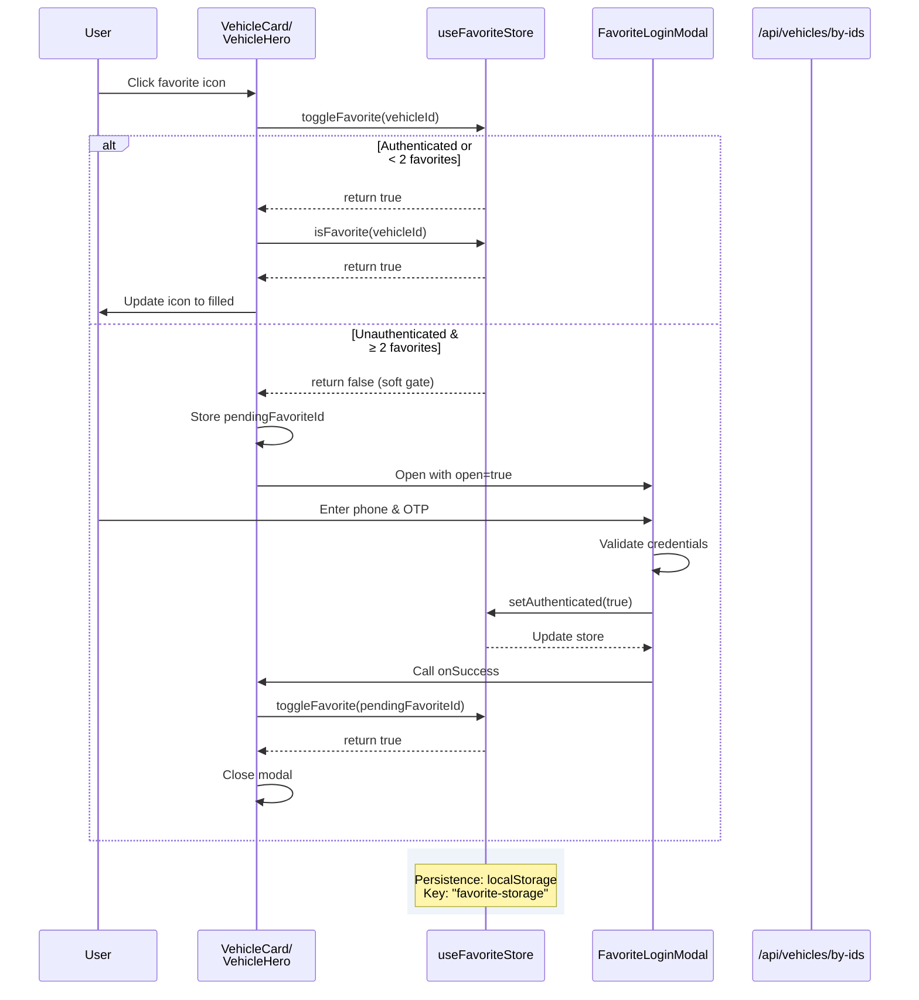

# PR #49 Review Analysis

**Generated**: 2026-01-14T08:36:17.954Z  
**Total Issues**: 9  
**Breakdown**: 0 CRITICAL, 1 HIGH, 2 MEDIUM, 6 LOW

---

## Summary

| Severity | Count | Action Required |
|----------|-------|-----------------|
| CRITICAL | 0 | Fix immediately before merge |
| HIGH | 1 | Fix if <5 min each |
| MEDIUM | 2 | Document for later |
| LOW | 6 | Optional (style/formatting) |

---

## CRITICAL Issues (0)

_No critical issues found._

---

## HIGH Issues (1)


### 1. CodeRabbit - src/app/[locale]/saved/page.tsx:76

```
_⚠️ Potential issue_ | _🟡 Minor_

**Missing abort controller and incomplete error handling in fetch effect.**

Two concerns:

1. **Memory leak risk**: No `AbortController` for cleanup if component unmounts during fetch.
2. **Silent failure**: Non-ok responses (e.g., 400/500) are not handled—vehicles remain empty without user feedback.

<details>
<summary>🔧 Proposed fix</summary>

```diff
   useEffect(() => {
     const fetchFavorites = async () => {
+      const controller = new AbortController();
+      
       if (favoriteIds.length === 0) {
         setLoading(false);
-        return;
+        return controller;
       }

       try {
         setLoading(true);
         const response = await fetch('/api/vehicles/by-ids', {
           method: 'POST',
           headers: { 'Content-Type': 'application/json' },
           body: JSON.stringify({ ids: favoriteIds }),
+          signal: controller.signal,
         });

         if (response.ok) {
           const data = await response.json();
           setVehicles(data);
+        } else {
+          console.error('Failed to fetch favorites:', response.status);
         }
       } catch (error) {
+        if (error instanceof Error && error.name === 'AbortError') return;
         console.error('Error fetching favorite vehicles:', error);
       } finally {
         setLoading(false);
       }
+      return controller;
     };

-    fetchFavorites();
+    const controllerPromise = fetchFavorites();
+    return () => {
+      controllerPromise.then((c) => c?.abort());
+    };
   }, [favoriteIds]);
```
</details>

<!-- suggestion_start -->

<details>
<summary>📝 Committable suggestion</summary>

> ‼️ **IMPORTANT**
> Carefully review the code before committing. Ensure that it accurately replaces the highlighted code, contains no missing lines, and has no issues with indentation. Thoroughly test & benchmark the code to ensure it meets the requirements.

```suggestion
  useEffect(() => {
    const controller = new AbortController();
    
    const fetchFavorites = async () => {
      if (favoriteIds.length === 0) {
        setLoading(false);
        return;
      }

      try {
        setLoading(true);
        const response = await fetch('/api/vehicles/by-ids', {
          method: 'POST',
          headers: { 'Content-Type': 'application/json' },
          body: JSON.stringify({ ids: favoriteIds }),
          signal: controller.signal,
        });

        if (response.ok) {
          const data = await response.json();
          setVehicles(data);
        } else {
          console.error('Failed to fetch favorites:', response.status);
        }
      } catch (error) {
        if (error instanceof Error && error.name === 'AbortError') return;
        console.error('Error fetching favorite vehicles:', error);
      } finally {
        setLoading(false);
      }
    };

    fetchFavorites();
    
    return () => {
      controller.abort();
    };
  }, [favoriteIds]);
```

</details>

<!-- suggestion_end -->

<details>
<summary>🤖 Prompt for AI Agents</summary>

```
In @src/app/[locale]/saved/page.tsx around lines 47 - 76, The fetch effect in
useEffect (fetchFavorites) lacks an AbortController and proper non-ok response
handling; create an AbortController, pass controller.signal to fetch, and in the
cleanup call controller.abort() to avoid leaks; after fetch, if response.ok
handle JSON and call setVehicles(data), otherwise parse error body (or text) and
set an error state (e.g., setFetchError) and/or setVehicles([]) and log the
message so failures aren’t silent; ensure setLoading(true) is set before fetch
and setLoading(false) in both error and abort cases (skip treating AbortError as
a logged failure).
```

</details>

<!-- fingerprinting:phantom:medusa:ocelot -->

<!-- This is an auto-generated comment by CodeRabbit -->
```


---

## MEDIUM Issues (2)


### 1. SonarCloud

```
## [](https://sonarcloud.io/dashboard?id=Hex-Tech-Lab_hex-test-drive-man&pullRequest=49) **Quality Gate passed**  
Issues  
 [11 New issues](https://sonarcloud.io/project/issues?id=Hex-Tech-Lab_hex-test-drive-man&pullRequest=49&issueStatuses=OPEN,CONFIRMED&sinceLeakPeriod=true)  
 [0 Accepted issues](https://sonarcloud.io/project/issues?id=Hex-Tech-Lab_hex-test-drive-man&pullRequest=49&issueStatuses=ACCEPTED)

Measures  
 [0 Security Hotspots](https://sonarcloud.io/project/security_hotspots?id=Hex-Tech-Lab_hex-test-drive-man&pullRequest=49&issueStatuses=OPEN,CONFIRMED&sinceLeakPeriod=true)  
 [0.0% Coverage on New Code](https://sonarcloud.io/component_measures?id=Hex-Tech-Lab_hex-test-drive-man&pullRequest=49&metric=new_coverage&view=list)  
 [0.0% Duplication on New Code](https://sonarcloud.io/component_measures?id=Hex-Tech-Lab_hex-test-drive-man&pullRequest=49&metric=new_duplicated_lines_density&view=list)  
  
[See analysis details on SonarQube Cloud](https://sonarcloud.io/dashboard?id=Hex-Tech-Lab_hex-test-drive-man&pullRequest=49)


```


### 2. CodeRabbit - src/components/FavoriteLoginModal.tsx:142

```
_🧹 Nitpick_ | _🔵 Trivial_

**`onKeyPress` is deprecated in React 18+; prefer `onKeyDown`.**

`onKeyPress` doesn't fire for all keys and is deprecated. Consider using `onKeyDown` for consistency with the OTP field handlers (lines 175-178).

<details>
<summary>♻️ Proposed refactor</summary>

```diff
-              onKeyPress={(e) => handleKeyPress(e, handlePhoneSubmit)}
+              onKeyDown={(e) => handleKeyPress(e, handlePhoneSubmit)}
```
</details>

<!-- suggestion_start -->

<details>
<summary>📝 Committable suggestion</summary>

> ‼️ **IMPORTANT**
> Carefully review the code before committing. Ensure that it accurately replaces the highlighted code, contains no missing lines, and has no issues with indentation. Thoroughly test & benchmark the code to ensure it meets the requirements.

```suggestion
              onKeyDown={(e) => handleKeyPress(e, handlePhoneSubmit)}
```

</details>

<!-- suggestion_end -->

<details>
<summary>🤖 Prompt for AI Agents</summary>

```
In @src/components/FavoriteLoginModal.tsx at line 142, The onKeyPress usage
should be replaced with onKeyDown for React 18+; change the prop from
onKeyPress={(e) => handleKeyPress(e, handlePhoneSubmit)} to onKeyDown and either
update handleKeyPress to accept a KeyboardEvent and use key/keydown semantics or
create a new handleKeyDown wrapper that calls handlePhoneSubmit when e.key ===
'Enter' (matching the OTP field handlers' behavior). Ensure the handler
signature/types align with React.KeyboardEvent and that any preventDefault()
logic is preserved.
```

</details>

<!-- fingerprinting:phantom:medusa:ocelot -->

<!-- This is an auto-generated comment by CodeRabbit -->
```


---

## LOW Issues (6)


### 1. CodeRabbit

```
<!-- This is an auto-generated comment: summarize by coderabbit.ai -->
<!-- walkthrough_start -->

## Walkthrough

Introduces a new favorites feature enabling users to save vehicles with soft-gate OTP authentication. Includes a dedicated saved vehicles page, API endpoint for bulk vehicle fetching, Zustand-based state store with localStorage persistence, OTP-based login modal, and favorite toggles integrated into vehicle display components.

## Changes

| Cohort / File(s) | Summary |
|---|---|
| **New Saved Page** <br> `src/app/[locale]/saved/page.tsx` | Client-side page component that displays user's favorite vehicles; fetches by IDs via POST to `/api/vehicles/by-ids`; includes auth gating via modal; shows loading state and empty state; supports bilingual UI. |
| **API Endpoint for Bulk Fetch** <br> `src/app/api/vehicles/by-ids/route.ts` | New POST endpoint to retrieve vehicles by IDs; aggregates vehicle trims by model/year; returns consolidated vehicle objects with price ranges and trim details; validates input and handles errors. |
| **Favorites Store** <br> `src/stores/useFavoriteStore.ts` | Zustand store managing favorite state with localStorage persistence; tracks favoriteIds, authentication, and loading; implements toggleFavorite with soft-gate logic (max 2 favorites unauthenticated); includes isFavorite query and clearAll. |
| **OTP Authentication Modal** <br> `src/components/FavoriteLoginModal.tsx` | New modal component with two-step OTP flow: phone number validation (Egyptian format) followed by 6-digit OTP collection; supports bilingual UI; fires onSuccess callback post-authentication. |
| **Favorite Integration in Vehicle Components** <br> `src/components/VehicleCard.tsx`, `src/components/vehicle-detail/VehicleHero.tsx` | Both components add favorite icon button (FavoriteIcon/FavoriteBorderIcon) with store integration; implements soft-gate modal trigger on unauthenticated favorite attempts; stores pendingFavoriteId for post-login completion. |

## Sequence Diagram(s)



## Estimated code review effort

🎯 3 (Moderate) | ⏱️ ~22 minutes

## Possibly related PRs

- **PR `#41`**: Modifies `src/components/VehicleCard.tsx` with React.memo and callback memoization, directly affecting the same component where favorites are being integrated in this PR.
- **PR `#33`**: Changes `src/components/VehicleCard.tsx` component props and loading behavior, overlapping with the favorite/modal additions in this PR.

<!-- walkthrough_end -->


<!-- pre_merge_checks_walkthrough_start -->

<details>
<summary>🚥 Pre-merge checks | ✅ 2 | ❌ 1</summary>

<details>
<summary>❌ Failed checks (1 warning)</summary>

|     Check name     | Status     | Explanation                                                                          | Resolution                                                                         |
| :----------------: | :--------- | :----------------------------------------------------------------------------------- | :--------------------------------------------------------------------------------- |
| Docstring Coverage | ⚠️ Warning | Docstring coverage is 0.00% which is insufficient. The required threshold is 80.00%. | Write docstrings for the functions missing them to satisfy the coverage threshold. |

</details>
<details>
<summary>✅ Passed checks (2 passed)</summary>

|     Check name    | Status   | Explanation                                                                                                            |
| :---------------: | :------- | :--------------------------------------------------------------------------------------------------------------------- |
| Description Check | ✅ Passed | Check skipped - CodeRabbit’s high-level summary is enabled.                                                            |
|    Title check    | ✅ Passed | The title accurately reflects the main feature introduced: a favorites system with soft-gate authentication (Phase 0). |

</details>

<sub>✏️ Tip: You can configure your own custom pre-merge checks in the settings.</sub>

</details>

<!-- pre_merge_checks_walkthrough_end -->

<!-- finishing_touch_checkbox_start -->

<details>
<summary>✨ Finishing touches</summary>

- [ ] <!-- {"checkboxId": "7962f53c-55bc-4827-bfbf-6a18da830691"} --> 📝 Generate docstrings
<details>
<summary>🧪 Generate unit tests (beta)</summary>

- [ ] <!-- {"checkboxId": "f47ac10b-58cc-4372-a567-0e02b2c3d479", "radioGroupId": "utg-output-choice-group-unknown_comment_id"} -->   Create PR with unit tests
- [ ] <!-- {"checkboxId": "07f1e7d6-8a8e-4e23-9900-8731c2c87f58", "radioGroupId": "utg-output-choice-group-unknown_comment_id"} -->   Post copyable unit tests in a comment
- [ ] <!-- {"checkboxId": "6ba7b810-9dad-11d1-80b4-00c04fd430c8", "radioGroupId": "utg-output-choice-group-unknown_comment_id"} -->   Commit unit tests in branch `bb/phase0-favorites`

</details>

</details>

<!-- finishing_touch_checkbox_end -->

<!-- tips_start -->

---

Thanks for using [CodeRabbit](https://coderabbit.ai?utm_source=oss&utm_medium=github&utm_campaign=Hex-Tech-Lab/hex-test-drive-man&utm_content=49)! It's free for OSS, and your support helps us grow. If you like it, consider giving us a shout-out.

<details>
<summary>❤️ Share</summary>

- [X](https://twitter.com/intent/tweet?text=I%20just%20used%20%40coderabbitai%20for%20my%20code%20review%2C%20and%20it%27s%20fantastic%21%20It%27s%20free%20for%20OSS%20and%20offers%20a%20free%20trial%20for%20the%20proprietary%20code.%20Check%20it%20out%3A&url=https%3A//coderabbit.ai)
- [Mastodon](https://mastodon.social/share?text=I%20just%20used%20%40coderabbitai%20for%20my%20code%20review%2C%20and%20it%27s%20fantastic%21%20It%27s%20free%20for%20OSS%20and%20offers%20a%20free%20trial%20for%20the%20proprietary%20code.%20Check%20it%20out%3A%20https%3A%2F%2Fcoderabbit.ai)
- [Reddit](https://www.reddit.com/submit?title=Great%20tool%20for%20code%20review%20-%20CodeRabbit&text=I%20just%20used%20CodeRabbit%20for%20my%20code%20review%2C%20and%20it%27s%20fantastic%21%20It%27s%20free%20for%20OSS%20and%20offers%20a%20free%20trial%20for%20proprietary%20code.%20Check%20it%20out%3A%20https%3A//coderabbit.ai)
- [LinkedIn](https://www.linkedin.com/sharing/share-offsite/?url=https%3A%2F%2Fcoderabbit.ai&mini=true&title=Great%20tool%20for%20code%20review%20-%20CodeRabbit&summary=I%20just%20used%20CodeRabbit%20for%20my%20code%20review%2C%20and%20it%27s%20fantastic%21%20It%27s%20free%20for%20OSS%20and%20offers%20a%20free%20trial%20for%20proprietary%20code)

</details>

<sub>Comment `@coderabbitai help` to get the list of available commands and usage tips.</sub>

<!-- tips_end -->

<!-- internal state start -->


<!-- DwQgtGAEAqAWCWBnSTIEMB26CuAXA9mAOYCmGJATmriQCaQDG+Ats2bgFyQAOFk+AIwBWJBrngA3EsgEBPRvlqU0AgfFwA6NPEgQAfACgjoCEYDEZyAAUASpETZWaCrKPR1AGxJcAZiWoAFKoAlFxWsGiIJJAADLqQAGJoEvgU6tKQAMr4PrhgAOLU0ZmyiDTMkAG2kGYALACcwZCQBtnYFAzRAlQYDLBcqgD03BFRMWA+yanpyIBJhDDOpJyQzNpYLQCCeLCpXNCisAASstwkABpWkIAoBFm41NiIXPinWDcAwhT+NLRcAEwxvwAbGAYgBGEEAdmgv1+HAAzAAODi1CEALSMABFpAw0txxPgsAFJmJkASPLJQgYoABJZjcLxsDC4ZBoayjaJxSYpNI0ZCIUrlSAAd3UsHQkAAqtSwGT5AB5aCXRA5PJEIqVDD4SACNAMADWZHo8CZJCIVHxGGCGipkFRDzuGHoZVS3gMzSgVkoiCQ30gBEgHnwDDQHkyBCopEqBtkvimPJIYGdEZIVrd8WyuWI6oo2C8XBDgaFkGw3D9Wt+kC50152pIPhdOFwsHY8GDFut7sgGzE8AJjzLRCIXiS3PSABoUIgR9WSBOGF5nBsPB4J1FcFsmy223QANw8Dy6kg7DxKPj83oAdVFACFdQbHSheh5sEp6PW+D48O1osaaGbqL2GDWlAUqMBEGCkI8aZQIc/gULggxVvGKBMFgaC0K+ZaQAAakerZeG8zj0AEBDcGAXi5BONjQAAMmAaBCs4KboA+uEIPOJCwRQ+B7q2BL2HcNYkHSuDyJgb7wMudCVJ8tBWpAAByWoCNgjpeCgdK6po0FZMk0ncGgkYBIMADagbBl4AC6gyIHpcmQLQSD0mgpSVnG6T0FI7FeMgxrima8C0BOxrzi+GTCXi8hlOqIpNpAbzQBsE7iX6aSDl69gqlmNArIoIb8FgzD4KpuAoD4xYYGg2xbkUtDAVkWVqjlRW0CGHA6eEBI/hg3B4MKoqQAAokQJziJgkASCGgUAfxARgmcC2LYtqadgqlygQEgIOfARDqIgyV4IQ9YMA8K3xNeknGkQ2D5Uw3DyAEZCDM4Z1QAAskGeoTZQ8A+K2M1YLKlRSuRJBSB4qZQBsVjUpAhrcPgv7tZ2Vhypk0CQM93DwIMXn4dIgxyGAgUsgwnR4iyaEUFQ8g5N93nRNSGKU/Qny4O0GAsoOnxNdJeMcb5WCbow1AhvgRCVqkqy4Hu9bLvgQrICQAAePpXfT+M2CQCPeuG8gGbgNAUEBNr7GUiCE9gkk/Dp0AnCQmQ4vAeJcJqcPU6kiAdvEg2ZDRSOQG7lDcRQyABIgTt4sKzgYFdpIYOSr2QNeVsnlwDhk9IiCfh43tQCnak/ppYhcAAXpQ+D1e4bACPgyt/JAOztF7XakEyXDXtelTXge+q18r8lvCwzDqJAnx+J8vR0FwMT1GggK1AiAjWgYFjxcPo9sIgtmQfYjirC4RhD6we0OdiaQCNErLehB6lMM23pSJWXzfhp9LCewAPtVDGE8F6PrSSQukASDZYpimVJmXmAZxathYvQKqcUfAHiILxJ8YV9yHmPKeewshLw3jvIaeq1ITT/hys2ZwpU+JYF/FqNi+NCIUHgaxPCHEuJagCNROiDEmKQ0gLSd+jJSrTnjDRGBGAPqtQ8JUEYXVIAAGpIBrQnGoDwV0borlyvqb6aQ/ptkAk0FKuA0qkD4KhRyFow56ArEAmsqR0CZ23urGydleEfC+NEWyUh6AGUjE2agz9cB9AyDYvmLCfITXgKycgRZUbo0xmgbGuMwkEyJiTOGjoEa/nqthKarULR7EyIMX2/smSW2tjwSIiA9zl24tqVStB1LwGLtpKkYBDAGBMFAQ0/ByoIMIG3ZQvomCsHYFwXg/BhCiHEFIGQ8gmCnhUGoTQ2hdBtI6eAKAcBUCoHGn04gZBBnSWGYIrgVAiwOCcC4bUczFDKFUOoLQOh9BGHWaYAwiAOhY24KZcyIYSDWU8XQYYhkSAaGZPXAwAAiaFq9LAbGlAM800kLkH1puVPomBIJGGIUYxQ2BOgskDiQIs854DsETIFaICkVaaCEMgHx0RhkI3IEydApUPkMC+T8oMfyAV2WBaQMFiBlZ+giKVSep5CUPEoIATAJkAhI1gLDQ69Pi1giBIXsFBv6QC1uhZAvz1I+G4hUbieBogGSoGwI2LNizcDyRkA8EEbqRlQjQZWpV+JFRKvVBIqQCWNjFC1fKnriqst+sWKIfBUCalKgg5sTJ/rfB9SQQJD83KjhyvzcJcg+HMwiayWJGN/RYxxlmlJshia0GQEKeN6aZzUirWBTF0g9yIB2IrcUgZ0Lq2ijlWg7R1Z+FTXAxu4lwkRVEnW+MyB/ydBzuSeqGInIHlcqyLtjkIL2GxhgcgfAa2SWiEOvoV09z4E3BQEUUR7DtqVqKSgyMfYiSioJaIYDxQ6i0f6boCsr0qUNvxFKBr4Dl3oHdeQNayCBy1CEpWqsyh5y7I3fw2C32shg36Tws5313jqf+jAyUHysgCvQOmdCOIMNAywZl7B5V2P8H0KdwCy31TemsO4xp9U8qkb2w9diy37Wgd2iCBH6BBqkRq70Kj1CyD3OBBpGQ417wcbMxggYb4S2FmJ+qWtHQZWEekURu1xF5Ske+ANNULQjtkvAT4JIsLCyAyBse+Az0FVypI1T+Aoj1VERZYDGRQJlDSBBGQkRpL8UdddEFlQNhUDUAwfgfAlCTFzAhQat8kCwFTAYKw2ABCqIYBMXU6sVYI3gvmM+KWPClV1WIBQdIuqssyHZKw0W/Eeo6A/IxRRON+dLgDA6m4E16P4k1K6E48loZTce4TI7eDSE/pZumCr+MrzXuYOF1XBmAWQP6YWSh5zOABqScqpXUi+jsb1fLsCWziGkEYd6KadjwIwtPSAAADZLukvGtdIAEYI73HyqcqYMFquYSCIQPR9jlXKzJcf+c4rxArQXgsB/Md7Z34KVaqtVysqkez8Waz9kF/33sbcgKx2OfgyiJChxsSq5IalGEGmUJptUFBKDHmDMlRY6zvmWG9Og8BHBQpha0sARgYcJO+Qk0tySLapKrYMU1NAhXtWhZC2FXYEUHKRU6fezg0VNogvdm0GwMKEuiYpGlGg6XoG4KWFXlB0m0Eyay/xhb4mJP44TCtJNsm5J61zgAjtgaQpVa60HkP6T4oebNXzQg+TUGAwATrEtTFyPSUBVvqm4oPrJMglhUGF1TZL3cPiPWmstAB9IxTTkC2dSI2szwteD4A1ZhNJDx1asiUOxrw9BsKDUONSN4NFBrV8yINcfCVRX+JCs+JQyBmCpedupT4B5fQb+O5UFqJAPACe6OJAT24iDTGkBObrnMR6OL7BOabGheEbG5qaIPlfQkMxU3vjw1fAoju/9XrIHBI+P6M/maK/t8GRupIICICSA+lAL6nwMLH9KHKVHXhUHTKyN/mAEAc4MFLHGNKouXFzOAWNvxH9Pvo2gEN/g2pfmkMwAJiPBgFYGkJ0BOKsMrCwa2FhugUPCVHQU0gpGgFvEnIgXvAIFEKHuwKlPXlnsLLZGwO5vvjgXBMlA7oaLtlqOgQJiWPasvsaFwZ0KDmgJwawVho3nSGartvQXwUyCJranoTIcwEIVvP1HFKyMcmgGAEIIjOQPQKojTnTOgdXpVIoZNM+NINpimhzLts2OgBnkboZKQezvxugMgAAFKZBygKT1SHBjrhQeyhzwGQC1AxCch2LGjhF/5pLGi9TaSdgACsZRksSWosOoV6UhVywcnsCGTR5RfAqkpWUy0kOYCaih3RocbhYoHhfY+A6kEx0CRAK8AA0iQLTBIZQJNPltEIGLtAwNqliP3tJEPiPmPhPlPjPhjEFurMlsaIOmSieDauQGUCMfvjvv6L1MuH/HwMxmbi/mQVgLsbAt3puqyKxqWNGNJDmgAYFGAAAbgRQBOG3v2gwD3goJzHMdNL6BqsSt8UoR4Coc4FMTwGYWPM2iOugfVtjJvoBCvLltdglpjqVBiiblBFAINMrGVr6J+L0JZt6EQJVOzJ8FwBjpyedmkbggljyQTlgIWgELHmHmUFwNSu6lrFIWUADivOTkuEbO8VoXEQdgeOaDtlnkyeFnwFdgVukuIHdogA9hTk9ooOgK9j8B9oWoDn5H9OpO9lLg7iWkkp/r7pWhbE7kKoDm+vyYKa/KKVyRKb0HjryYBNYGjNAPKSQOqcsCqbgGqYqbgADuTpTr9OHrTupPTiGLIEzgYCzuINLEcrclzjibzj4PzlwILo5CLhrg9m8jDkyo1syIMPpjQIZsaBIiGEKhCp2WvPCvsruuziioblniyVigYDitxCiQpkSiSqouSt6JzrVsyVRn2YkO5EOWIqOVIqhn6EKIQC8aWGtJWIWMqnAIyoeSyuKoaBlFgSZnPqVG3iJLRnwKyDIuQIHI4JfIiRNIHjWMNKNJElgBgGBRlAEKCKCNtLtMyAJBQurG+mCMEJfrWt6CvpvhkFEI6GicCI5OhYooqCOkwFJHZqPBqtfPACKlEBauqLUXgC3NSKVFUY4cLPedQfaLWJAFtJRXtAYo6BOCWPxBnASowc4HqLEdENKoBSyNVMNikZEuKAqkmAniRniIBAWHMgWJTAVIXspiLMuB+l9JfO+IympldE+XEYFiWFyTIJdE6vlG6qVAEOlkOJloMLFioK2JJfQNKsgG9KBL2W+QJgvi+CVoUegF4PBDauuj2i+txZQmgkvpANGLXERKOmpOrH5SaEgVqA4AICPHmYNkdEGA8G5veRQY8fYayJ8GuG5vOF5qCtYHlladDLDKhN6ObFnm3twP2M8JBkEC5guJaBOASG8GptEAEBZB4DZXhSOgSBZfJZUM8BaLdAWOtcqjipQAzphTlN1vqHyDQKWAEAAOTAUkB3UAA+d1Z63Ad1G1j181uApY4lzI9+SVW8O8F+I66Vm6xojkbYPRMAcRSCCsRV8mSsQNWchkg6FRGAfFj4dRE44NEskNiansDkA6m6hFuY7O5AuA15FAX0WkO29hlUGqAJtYVNJAkGt5yATF51oKLyWuOp22fY9mBpogRpO+dMZpJGFpfVN2Catp9p5umEEtVJfZIpyWOOpUTJCZMpx5GaJAw5xmkiAQAA3vwC8PNRgItd1ebdtVnJAAAL5cCDl61nkmYsHPCIAA5A4+mfIxU0YDknnO1GbnnjnvbOUvkNZvkRobkGofZO363nlu3jUellXEjLUxpwxinwR0BNB7b2woAYVjVewFmYBFk04JB04M4VmUDM6s61mUac6fCNlwzNnnatlC4dli4QAS7vI+2vl+1QEkAUbjnq4wpTk66zm+jzlXJ0xLmm4K2W64kKp+D3Cqq/imjGn8T+gD0Ubaqrl4r+ohKDAVS6Uvr5rihW7SpO1hguj4GhQbr41TgB0UnixDgkBO31Tz0631qoSYxf3xjXhN6UDUg/2gQECDiNJCxxHBiMJIlebqCATSSkSgy5B7i6FB5ULahhYkbUKP2611Rm4W7igQKqjqjw1ChcDhpgOv1O1c5CmcxuQH5YaTX0Oshx0u0eYpR6X0qGhXRO0NpYTS7kjoC5DO5Akmw0hMhrn4oZBsNB3fm+2soPDRYpRyYpWVCqNv0B3nk23bw51aiCPR5xEvD32MY5Q6x5BxoWa0k2h73rmErGO8MB38M8b2ZUBaL7oMZlrXrFQngiUhLwIiN8BiMf20BCD2j6ouTFRoH6NkzDx5Q5RW40N/oEAYB7jzaRozIZ1qybrHwWpdB4ApM8BwMWjYUDRfmOQUGsw7SwAIQUQerNlrj1SrHaywbZMSy1z4B6iDqFggFaR7hkAODtWmPRBjabq0D4AZDp1oDNlTLaguZdOboGywAhONpIBO30CniSDIqn0BBc1rMB27PJIaCBTBB6Nc66amKpC2alQn1FBal81bYb30N7bC2HZPMnYZ1cnmk8DS2Mmy1kp2k2hKQ/MMldgww2Q7RRmqqz3IB97DH4NVm13s7zLRCN087N0tkOntnMCi6a7i6S690R1+1lpgB97aAeCDAD1sLD24t83j2HL66XJG4wv2m2PSPwKl47mUp/3ALL1CneDOmNqsjkJY4YPJP8R+TCxUsVySjUgTgiiyQCObnDMgKqoBCX0B3X2fBhXfFgBeMuN7ZuNfT+PnUNUBD7O63BS4MzhyQrO9b5QuMpSrU2WaGI3qRUOqKbroaoYaXiAjZYCjNEBcAaNO3QAv13ymUDjUMB2npYCTCSSvzhwqiQC8wbXMOEqyMjnfmcPhgZAOMQR8NviXZeZ5BiNUleDtgEONqZsG35Rr2kKARcBiam0HL0AQZoRR2AWGwTqusKr7rqRTO+uJq7jmX4o7UaOXN0gVsZCt48NetP100AaBOLHGj1RSiDArpRPG6QRhAJLO6uprDO40ofltsDTb7TLmrFOATqz+g7A07CwqDKjPg0BCM6zwNdRvhP3AMEgpx4Z7jfsYC/uFPOSdD0BINpQ1OVDoRhMjVmbBXxYBiRN4BNBvpjXO5lCyCesaZajpObFdB3hmihr4NQDYRIDqIOE9aO1P0YOICxRBIyAppChs1YB8M/1EiSQD46tO0AOMJANsdROevMTtHhY4PrN7irC/hrDIClzEy6YioqPt7oeiRYcsbGh2KTbnObOgkYTvucwUMEGRJEEZCOSIDOSyDuC4DqQpQWs2uoK4p2NuuaO63aNju23+h/QM7+Z/xkXzu60sjLvBM2jpaDMztxHNuoASqUDSRgKStQN92spGJs0joKuINagLVLWbUYA6PIDOt3hF0vJTmPN6mirRCGlHYWKmmZ0XZS2gu3YAv2nAswtYQS3DC/PWnSb2CQsr3Gcprwsaj6MunK7CSKfeJteiSnCkgfj458ldf8se1raWCFnU5CIV3lmVnVls5DL1lou4l86t2QCHDVO0v4s92cpcODAau61aso5QSTlwr0t657xMuLngTLk/xCvKtO3XUNggkSx2jRQPiof/wvFTzKpYgecblX25sgGUCp2Ph31XSxi60NphzXEQQmSWQbVICiJCYSzTVzH+BzWTgbjxp+vs74+zUbUetOczgkT0ENrpx14QRNAAC8egczBPmAVrTtdPTSDPAkwWRArP7PHTs1c4C4FAS4Hg/2kAbPE0iMQU9gKaJPFmdAuzIYYeAwM1hPwv8vgU9h54DAV4TYt4+ohoMvcvbtN+JAwAKQgUegRCU7H8TIyAl3M413xJpwocPoKwgU8mjEqqKUa6XGWr0W0YkAkKISiY4YIKkKueDYQJ+xOk1PPP6BDalIzQnY1I5UafRoLIHgnw6E8g/jE4nwRUmTo8KUbMMRqUYe3sWf5Ug7Q2ZPvoQfBfyG8gowkA1iAdAm1fxs8qIYV6JEWhxizu18jU6oYmZ0q056l6WG6EjaufWE6GVf0RA/tfPNnYNn8YvPzA6fXAQSV1JJC2U8QOISKPCGHEi4y4/2h/Ev+fpmvfCGa4Kvml3w6vERoQFHNYSAb/LfdAF/pKWN6wBTe94WgHfwwSdAsEzudrErwwrY98AuPTfvK20AYVugZKJBLIHwqQZ2qKaXyIgBx730iEOVDcjGm6j1ZBELIWuH1GIbZQr4Q7f1hOF+BFY/OAYJpOoHsKfh+WmDM3g+EN71RPQ3vEai43qTO5Qi0QSPgHWj6pBY+WEA1KH0FS81CuupCri81K4i1yuJpcWlV2+aWkZaNperkC125VcuAbveMB709JQ4Yc53cwekGu5CpjBvOXQUaBTqHgqOV3XNjaHpJWkrUz2FkC6SwhQ8XQxRFPgc1z6M9BeuvUXoTx0g790ge/fnmjyF6y8Re2vTADpGv6S9b+uvO3rQB0iv9GBtUT/prw56U9UhevfIZ2EN4gCwB5vXXlbyQA288h7SNeEt2LLl1Sylddbkiy24N1ucu3FuuVixbC4cWnZVpO0k6Qu4s8eyRFMi2HijIyS5yA3FchzQos4sSyR5KskMBTDjk6gX/FWmrw7cmOtAavNFCxzPJXkUAWePPEXgfoGiaAEgHPARAxAGitQNmuhFUBzwGADRBED4EBA+BSivwWgAiFqC/AIQ2w4wBskoH7CSYRwgYScOrzdJnkUw+bNXjYAUBSA1eI/kpTOF3ALhayAwEbTTCQokAtgHuJ9DoDHxBEVgEtnQEhSxhGGY4EkW2h8a0AKR+oWwAyIYZRBmRzQUkYgDlBSBqYfvMgNyMmBMiSRjkWgDYFUgYggwYYQXogDeDNh9Q3IoxGHj5ER9pRsojABZwIiqi9Q6onMLOClGBRdRWICOLiAtAqjRARoxkbyJJGesDQtAakNvEVKKjuR0KLUZCgPBlBbR+oLWA4GqyIBuRJkNMM0GJGZ9M+kKHES4RIBejLRkcSzAGKNFajoxkKXtA8GNGaiIxMY0rI6gBhejUx9gLpuoXoBQAh4SgGwIsnUBypG41TUGODCe6opJw6SFQAPg0CQp0xMYvfF6ID6xwII3YvMfyOmBGYQwqY+MV6KXzJjAImuaMXbR7FRjoxEfOMcIQTFcBIU+oxlIaOHEriI+WY0MVwA1Gmj9xkKAsZgCLGbjnyGGSzlfDJjtAigQjceF4DsyaY1gz8briASkagcKs6GfkC8QqARlJ+OUSxu/yTJVB2QsQK0HuJXGQo+xm4gcVdFgkZjG8GAP6NdE+Diih+p4uCWOONATjDRU4zcTaS8DzjM+i4vMcuIzFri2AiYoMMkPXjCjY+PY/kYeOwmSizxF4wUnOM3HyiGAjEpgMxMjCoAYgGgMogAFJhQ7EMUNsk5jYBmyrYMvJoFhqot0yVsRVk2HapYI2xLw8STEAkldjWJEfdqnMTwC8SI+F4ZCOMwElM8iAAFErlrQq4351MJXCoP6FsjiBs4hjF8sJOiBaTpAWCIySOIj4ISI+SEoccZMhT4SGck49cdOIYl2TQxeYu2mmEsg+i/RuAWwEmOtEWTzxPgWgAIHqC0BF4oIBECQCXi/AEQcIeoL8EmA+BQQgIFCgIBiAMBaADRQEE0R8AIg0AtQBonCAhACBQQAgCEBCB8D1AGiZMVqX8NBDBgupvwGqb8Fgm+jIgWU6iJhi9GggYQcIX4TCHqACADsCIX4LUEBC0BQQHUrab8DZoxAMIaAeoPUEBG/AOpAgd4SVIhAPCWpAgOELQBiAAil4cIOqSQDhAxAEQs05aTZOSFDw/JJ1Y2CGDDBFBuR1Eg8Z8mlzcoLICOQFLQGRzjlEZIUyFAQDuAeAEg03HbNyNBBRTpSFiEAfxOSFHjYgKUtMKlNSlXCT+6IygFiJxGIAkRD4fQEAA== -->

<!-- internal state end -->
```


### 2. CodeRabbit - src/app/[locale]/saved/page.tsx:28

```
_⚠️ Potential issue_ | _🟠 Major_

**Object selector causes React 19 infinite loops.**

Destructuring `{ favoriteIds, isAuthenticated }` creates a new object on every store update.

<details>
<summary>🔧 Proposed fix</summary>

```diff
-  const { favoriteIds, isAuthenticated } = useFavoriteStore();
+  const favoriteIds = useFavoriteStore((s) => s.favoriteIds);
+  const isAuthenticated = useFavoriteStore((s) => s.isAuthenticated);
```
</details>

<!-- suggestion_start -->

<details>
<summary>📝 Committable suggestion</summary>

> ‼️ **IMPORTANT**
> Carefully review the code before committing. Ensure that it accurately replaces the highlighted code, contains no missing lines, and has no issues with indentation. Thoroughly test & benchmark the code to ensure it meets the requirements.

```suggestion
  const favoriteIds = useFavoriteStore((s) => s.favoriteIds);
  const isAuthenticated = useFavoriteStore((s) => s.isAuthenticated);
```

</details>

<!-- suggestion_end -->

<details>
<summary>🤖 Prompt for AI Agents</summary>

```
In @src/app/[locale]/saved/page.tsx at line 28, The current destructuring const
{ favoriteIds, isAuthenticated } = useFavoriteStore(); creates a new object on
every store update and triggers React 19 infinite loops; replace it with stable
selectors by calling useFavoriteStore with selectors for each value (e.g.,
useFavoriteStore(s => s.favoriteIds) and useFavoriteStore(s =>
s.isAuthenticated)) or use a selector with a shallow-equal comparator to avoid
creating a new object; update the references to favoriteIds and isAuthenticated
accordingly so they come from the new selector calls rather than via object
destructuring.
```

</details>

<!-- fingerprinting:phantom:medusa:ocelot -->

<!-- This is an auto-generated comment by CodeRabbit -->
```


### 3. CodeRabbit - src/app/api/vehicles/by-ids/route.ts:78

```
_⚠️ Potential issue_ | _🟡 Minor_

**Add input validation for array length and element types.**

The endpoint validates that `ids` is a non-empty array but doesn't:
1. Limit array size (DoS risk with thousands of IDs)
2. Validate that elements are strings (type safety)

<details>
<summary>🔧 Proposed fix</summary>

```diff
+    const MAX_IDS = 100; // Reasonable limit for batch fetching
+
     if (!ids || !Array.isArray(ids) || ids.length === 0) {
       return NextResponse.json(
         { error: 'Invalid request: ids array is required' },
         { status: 400 }
       );
     }
+
+    if (ids.length > MAX_IDS) {
+      return NextResponse.json(
+        { error: `Too many IDs: maximum ${MAX_IDS} allowed` },
+        { status: 400 }
+      );
+    }
+
+    if (!ids.every((id) => typeof id === 'string')) {
+      return NextResponse.json(
+        { error: 'Invalid request: all IDs must be strings' },
+        { status: 400 }
+      );
+    }
```
</details>

<details>
<summary>🤖 Prompt for AI Agents</summary>

```
In @src/app/api/vehicles/by-ids/route.ts around lines 68 - 78, In POST, tighten
validation for the parsed ids: enforce a maximum array length (e.g. const
MAX_IDS = 100) to prevent DoS, verify ids is an array of non-empty strings
(check each element with typeof === 'string' and non-zero length), and return a
clear 400/413 response when the array is too large or contains invalid element
types; update the validation block around the ids variable in the POST handler
to perform these checks before proceeding.
```

</details>

<!-- fingerprinting:phantom:medusa:ocelot -->

<!-- This is an auto-generated comment by CodeRabbit -->
```


### 4. CodeRabbit - src/components/FavoriteLoginModal.tsx:102

```
_⚠️ Potential issue_ | _🟡 Minor_

**Missing `handleClose` in useCallback dependency array.**

`handleOtpSubmit` calls `handleClose()` on line 100 but doesn't include it in the dependency array. This could cause stale closure issues.

<details>
<summary>🔧 Proposed fix</summary>

```diff
-  }, [otp, language, setAuthenticated, onSuccess]);
+  }, [otp, language, setAuthenticated, onSuccess, handleClose]);
```
</details>

Note: Since `handleClose` depends on `onClose`, and both are stable callbacks, this may not cause runtime issues in practice, but it's correct to include it for referential integrity.

<details>
<summary>🤖 Prompt for AI Agents</summary>

```
In @src/components/FavoriteLoginModal.tsx around lines 79 - 102, The useCallback
for handleOtpSubmit omits handleClose from its dependency array which can lead
to a stale-closure; update the dependency array for handleOtpSubmit (currently
[otp, language, setAuthenticated, onSuccess]) to include handleClose so the
callback captures the latest handleClose reference used when calling
handleClose().
```

</details>

<!-- fingerprinting:phantom:medusa:ocelot -->

<!-- This is an auto-generated comment by CodeRabbit -->
```


### 5. CodeRabbit - src/components/vehicle-detail/VehicleHero.tsx:31

```
_⚠️ Potential issue_ | _🟠 Major_

**Object selector causes React 19 infinite loops.**

Same issue as in `VehicleCard.tsx`. Use primitive selectors.

<details>
<summary>🔧 Proposed fix</summary>

```diff
-  const { toggleFavorite, isFavorite } = useFavoriteStore();
+  const toggleFavorite = useFavoriteStore((s) => s.toggleFavorite);
+  const isFavorite = useFavoriteStore((s) => s.isFavorite);
```
</details>

<!-- suggestion_start -->

<details>
<summary>📝 Committable suggestion</summary>

> ‼️ **IMPORTANT**
> Carefully review the code before committing. Ensure that it accurately replaces the highlighted code, contains no missing lines, and has no issues with indentation. Thoroughly test & benchmark the code to ensure it meets the requirements.

```suggestion
  const toggleFavorite = useFavoriteStore((s) => s.toggleFavorite);
  const isFavorite = useFavoriteStore((s) => s.isFavorite);
```

</details>

<!-- suggestion_end -->

<details>
<summary>🤖 Prompt for AI Agents</summary>

```
In @src/components/vehicle-detail/VehicleHero.tsx at line 31, The current object
selector "const { toggleFavorite, isFavorite } = useFavoriteStore();" causes
React 19 infinite re-renders; replace it with primitive selectors by calling
useFavoriteStore separately for each value: e.g. const toggleFavorite =
useFavoriteStore(state => state.toggleFavorite) and const isFavorite =
useFavoriteStore(state => state.isFavorite) (or state =>
state.isFavorite(vehicleId) if isFavorite is a selector function that needs the
vehicle id). Do not return an object from useFavoriteStore; select each property
individually to prevent stale referential equality and infinite loops (same fix
as applied in VehicleCard.tsx).
```

</details>

<!-- fingerprinting:phantom:medusa:ocelot -->

<!-- This is an auto-generated comment by CodeRabbit -->
```


### 6. CodeRabbit - src/components/VehicleCard.tsx:76

```
_⚠️ Potential issue_ | _🟠 Major_

**Object selector causes React 19 infinite loops.**

Per coding guidelines, Zustand object selectors trigger infinite re-renders in React 19. Destructuring `{ toggleFavorite, isFavorite }` creates a new object reference on every store update.

Use primitive selectors instead:

<details>
<summary>🔧 Proposed fix</summary>

```diff
-  const { toggleFavorite, isFavorite } = useFavoriteStore();
+  const toggleFavorite = useFavoriteStore((s) => s.toggleFavorite);
+  const isFavorite = useFavoriteStore((s) => s.isFavorite);
```
</details>

<!-- suggestion_start -->

<details>
<summary>📝 Committable suggestion</summary>

> ‼️ **IMPORTANT**
> Carefully review the code before committing. Ensure that it accurately replaces the highlighted code, contains no missing lines, and has no issues with indentation. Thoroughly test & benchmark the code to ensure it meets the requirements.

```suggestion
  const toggleFavorite = useFavoriteStore((s) => s.toggleFavorite);
  const isFavorite = useFavoriteStore((s) => s.isFavorite);
```

</details>

<!-- suggestion_end -->

<details>
<summary>🤖 Prompt for AI Agents</summary>

```
In @src/components/VehicleCard.tsx at line 76, The current destructuring from
useFavoriteStore in VehicleCard (const { toggleFavorite, isFavorite } =
useFavoriteStore()) creates an object selector that triggers infinite re-renders
in React 19; fix it by replacing with primitive selectors: call
useFavoriteStore(state => state.isFavorite) to get isFavorite and
useFavoriteStore(state => state.toggleFavorite) to get toggleFavorite (wrap
toggleFavorite in useCallback inside VehicleCard if you need a stable reference
for handlers). Ensure you reference the useFavoriteStore, isFavorite, and
toggleFavorite symbols when making the change.
```

</details>

<!-- fingerprinting:phantom:medusa:ocelot -->

<!-- This is an auto-generated comment by CodeRabbit -->
```


---

## Next Steps

1. **Fix CRITICAL issues** (0 found) - Block merge until resolved
2. **Fix HIGH issues** (1 found) - Fix if <5 min each, otherwise document
3. **Document MEDIUM/LOW** (8 found) - Create follow-up issues

**Generated by**: `pnpm run pr:scrape 49`
