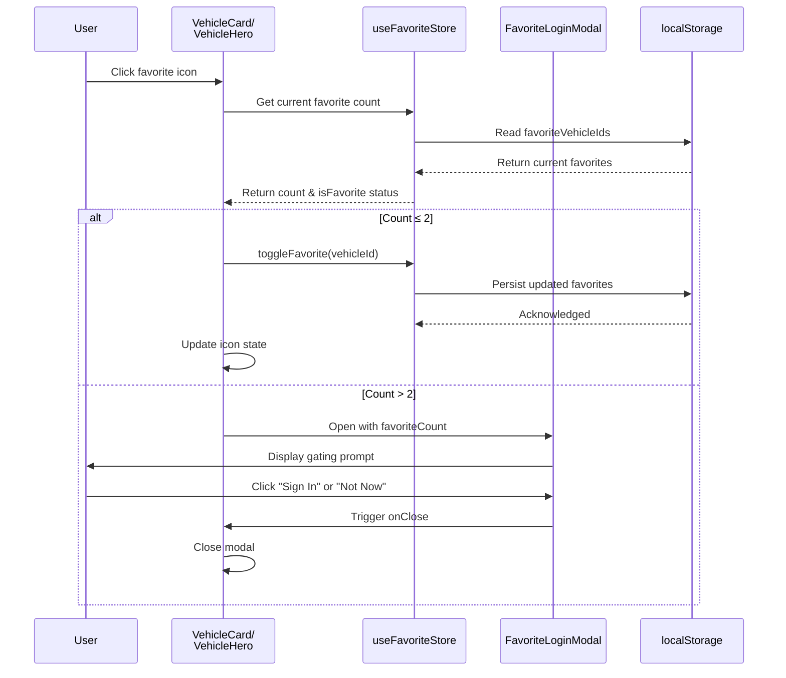

# PR #50 Review Analysis

**Generated**: 2026-01-08T01:59:55.588Z  
**Total Issues**: 10  
**Breakdown**: 4 CRITICAL, 0 HIGH, 2 MEDIUM, 4 LOW

---

## Summary

| Severity | Count | Action Required |
|----------|-------|-----------------|
| CRITICAL | 4 | Fix immediately before merge |
| HIGH | 0 | Fix if <5 min each |
| MEDIUM | 2 | Document for later |
| LOW | 4 | Optional (style/formatting) |

---

## CRITICAL Issues (4)


### 1. SonarCloud

```
## [](https://sonarcloud.io/dashboard?id=Hex-Tech-Lab_hex-test-drive-man&pullRequest=50) **Quality Gate passed**  
Issues  
 [5 New issues](https://sonarcloud.io/project/issues?id=Hex-Tech-Lab_hex-test-drive-man&pullRequest=50&issueStatuses=OPEN,CONFIRMED&sinceLeakPeriod=true)  
 [0 Accepted issues](https://sonarcloud.io/project/issues?id=Hex-Tech-Lab_hex-test-drive-man&pullRequest=50&issueStatuses=ACCEPTED)

Measures  
 [0 Security Hotspots](https://sonarcloud.io/project/security_hotspots?id=Hex-Tech-Lab_hex-test-drive-man&pullRequest=50&issueStatuses=OPEN,CONFIRMED&sinceLeakPeriod=true)  
 [0.0% Coverage on New Code](https://sonarcloud.io/component_measures?id=Hex-Tech-Lab_hex-test-drive-man&pullRequest=50&metric=new_coverage&view=list)  
 [0.0% Duplication on New Code](https://sonarcloud.io/component_measures?id=Hex-Tech-Lab_hex-test-drive-man&pullRequest=50&metric=new_duplicated_lines_density&view=list)  
  
[See analysis details on SonarQube Cloud](https://sonarcloud.io/dashboard?id=Hex-Tech-Lab_hex-test-drive-man&pullRequest=50)


```


### 2. CodeRabbit - src/components/vehicle-detail/VehicleHero.tsx:30

```
_⚠️ Potential issue_ | _🔴 Critical_

**Use primitive selectors to prevent React 19 infinite loops.**

Object destructuring from Zustand stores violates the project's coding guidelines and causes infinite re-render loops in React 19.


<details>
<summary>🔧 Required fix using primitive selectors</summary>

```diff
- const { toggleFavorite, isFavorite } = useFavoriteStore();
+ const toggleFavorite = useFavoriteStore((s) => s.toggleFavorite);
+ const isFavorite = useFavoriteStore((s) => s.isFavorite);
```

</details>

As per coding guidelines: "Use Zustand with primitive selectors only in TypeScript/React files; object selectors cause React 19 infinite loops."

<!-- suggestion_start -->

<details>
<summary>📝 Committable suggestion</summary>

> ‼️ **IMPORTANT**
> Carefully review the code before committing. Ensure that it accurately replaces the highlighted code, contains no missing lines, and has no issues with indentation. Thoroughly test & benchmark the code to ensure it meets the requirements.

```suggestion
  const toggleFavorite = useFavoriteStore((s) => s.toggleFavorite);
  const isFavorite = useFavoriteStore((s) => s.isFavorite);
```

</details>

<!-- suggestion_end -->

<details>
<summary>🤖 Prompt for AI Agents</summary>

```
In @src/components/vehicle-detail/VehicleHero.tsx at line 30, The component
currently destructures functions from the Zustand store (const { toggleFavorite,
isFavorite } = useFavoriteStore()), which can cause React 19 infinite render
loops; replace the object destructuring with primitive selectors by calling
useFavoriteStore with primitive selector functions to individually grab
toggleFavorite and isFavorite (e.g., useFavoriteStore(state =>
state.toggleFavorite) and useFavoriteStore(state => state.isFavorite)) wherever
VehicleHero.tsx uses those values so each hook subscribes to a single primitive
selector instead of an object.
```

</details>

<!-- fingerprinting:phantom:poseidon:puma -->

<!-- This is an auto-generated comment by CodeRabbit -->
```


### 3. CodeRabbit - src/components/VehicleCard.tsx:76

```
_⚠️ Potential issue_ | _🔴 Critical_

**Use primitive selectors to prevent React 19 infinite loops.**

Object destructuring from Zustand stores violates the project's coding guidelines and causes infinite re-render loops in React 19.


<details>
<summary>🔧 Required fix using primitive selectors</summary>

```diff
- const { toggleFavorite, isFavorite } = useFavoriteStore();
+ const toggleFavorite = useFavoriteStore((s) => s.toggleFavorite);
+ const isFavorite = useFavoriteStore((s) => s.isFavorite);
```

</details>

As per coding guidelines: "Use Zustand with primitive selectors only in TypeScript/React files; object selectors cause React 19 infinite loops."

<!-- suggestion_start -->

<details>
<summary>📝 Committable suggestion</summary>

> ‼️ **IMPORTANT**
> Carefully review the code before committing. Ensure that it accurately replaces the highlighted code, contains no missing lines, and has no issues with indentation. Thoroughly test & benchmark the code to ensure it meets the requirements.

```suggestion
  const toggleFavorite = useFavoriteStore((s) => s.toggleFavorite);
  const isFavorite = useFavoriteStore((s) => s.isFavorite);
```

</details>

<!-- suggestion_end -->

<details>
<summary>🤖 Prompt for AI Agents</summary>

```
In @src/components/VehicleCard.tsx at line 76, The destructuring from the
Zustand store in VehicleCard (const { toggleFavorite, isFavorite } =
useFavoriteStore()) can trigger React 19 infinite re-renders; replace it with
primitive selectors by calling useFavoriteStore separately for each property so
you grab toggleFavorite via useFavoriteStore(s => s.toggleFavorite) and
isFavorite via useFavoriteStore(s => s.isFavorite) (i.e., two separate selector
calls inside VehicleCard) to comply with the primitive-selector guideline.
```

</details>

<!-- fingerprinting:phantom:poseidon:puma -->

<!-- This is an auto-generated comment by CodeRabbit -->
```


### 4. CodeRabbit - src/components/VehicleCard.tsx:231

```
_⚠️ Potential issue_ | _🔴 Critical_

**Logic error: Favorite is added before limit check, defeating soft-gate purpose.**

The function toggles the favorite (line 225) before checking if the limit was exceeded (line 228). This means:
1. User with 2 favorites clicks to add 3rd
2. `willExceedLimit` = true
3. Item is immediately added (now have 3 favorites)
4. Modal opens **after** the item was already added

The modal should **prevent** the action, not notify after it's done.


<details>
<summary>🔧 Correct the limit-check order</summary>

```diff
  const handleFavoriteToggle = useCallback((e: React.MouseEvent) => {
    e.preventDefault();
    e.stopPropagation();
    
    // Check if adding (not removing) and count will exceed 2
    const currentCount = useFavoriteStore.getState().getFavoriteCount();
    const willExceedLimit = !isFavorited && currentCount >= 2;
    
-   toggleFavorite(vehicle.id);
-   
    // Trigger soft-gate modal if >2 favorites after toggle
    if (willExceedLimit) {
      setFavoriteLoginModalOpen(true);
+     return; // Don't toggle if limit exceeded
    }
+   
+   // Only toggle if within limit or removing
+   toggleFavorite(vehicle.id);
  }, [vehicle.id, toggleFavorite, isFavorited]);
```

</details>

<!-- suggestion_start -->

<details>
<summary>📝 Committable suggestion</summary>

> ‼️ **IMPORTANT**
> Carefully review the code before committing. Ensure that it accurately replaces the highlighted code, contains no missing lines, and has no issues with indentation. Thoroughly test & benchmark the code to ensure it meets the requirements.

```suggestion
  const handleFavoriteToggle = useCallback((e: React.MouseEvent) => {
    e.preventDefault();
    e.stopPropagation();
    
    // Check if adding (not removing) and count will exceed 2
    const currentCount = useFavoriteStore.getState().getFavoriteCount();
    const willExceedLimit = !isFavorited && currentCount >= 2;
    
    // Trigger soft-gate modal if >2 favorites after toggle
    if (willExceedLimit) {
      setFavoriteLoginModalOpen(true);
      return; // Don't toggle if limit exceeded
    }
    
    // Only toggle if within limit or removing
    toggleFavorite(vehicle.id);
  }, [vehicle.id, toggleFavorite, isFavorited]);
```

</details>

<!-- suggestion_end -->

<details>
<summary>🤖 Prompt for AI Agents</summary>

```
In @src/components/VehicleCard.tsx around lines 217 - 231, handleFavoriteToggle
currently calls toggleFavorite(vehicle.id) before enforcing the 2-favorite
limit, so the new favorite is added before the soft-gate can block it; modify
handleFavoriteToggle to compute currentCount via
useFavoriteStore.getState().getFavoriteCount() and willExceedLimit using
!isFavorited and currentCount >= 2, and if willExceedLimit then call
setFavoriteLoginModalOpen(true) and return early (do not call toggleFavorite);
only call toggleFavorite(vehicle.id) when the limit check passes. Ensure you
keep the existing e.preventDefault()/e.stopPropagation() and the same dependency
array.
```

</details>

<!-- fingerprinting:phantom:poseidon:puma -->

<!-- This is an auto-generated comment by CodeRabbit -->
```


---

## HIGH Issues (0)

_No high-priority issues found._

---

## MEDIUM Issues (2)


### 1. CodeRabbit - src/app/[locale]/saved/page.tsx:19

```
_⚠️ Potential issue_ | _🟠 Major_

**Selector pattern won't react to state changes.**

Selecting `state.getFavoriteCount()` calls the method during selector execution, but the component won't re-subscribe when `favoriteVehicleIds` changes because it's selecting the method, not the underlying array.


<details>
<summary>🔧 Fix selector to enable reactivity</summary>

```diff
- const favoriteCount = useFavoriteStore((state) => state.getFavoriteCount());
+ const favoriteCount = useFavoriteStore((state) => state.favoriteVehicleIds.length);
```

Or, if the store is refactored per my earlier recommendation:

```diff
- const favoriteCount = useFavoriteStore((state) => state.getFavoriteCount());
+ const favoriteCount = useFavoriteStore((state) => state.favoriteCount);
```

</details>

Based on coding guidelines requiring primitive selectors for proper React 19 reactivity.

<!-- suggestion_start -->

<details>
<summary>📝 Committable suggestion</summary>

> ‼️ **IMPORTANT**
> Carefully review the code before committing. Ensure that it accurately replaces the highlighted code, contains no missing lines, and has no issues with indentation. Thoroughly test & benchmark the code to ensure it meets the requirements.

```suggestion
  const favoriteCount = useFavoriteStore((state) => state.favoriteVehicleIds.length);
```

</details>

<!-- suggestion_end -->

<details>
<summary>🤖 Prompt for AI Agents</summary>

```
In @src/app/[locale]/saved/page.tsx at line 19, The selector currently calls
state.getFavoriteCount() inside useFavoriteStore, which selects a function call
instead of a primitive and won't re-subscribe when favoriteVehicleIds changes;
update the selector to pick a primitive derived from state (e.g.,
useFavoriteStore(state => state.favoriteVehicleIds.length)) or select the getter
function reference and call it inside the component (e.g., const
getFavoriteCount = useFavoriteStore(state => state.getFavoriteCount); const
favoriteCount = getFavoriteCount()); reference the getFavoriteCount method and
favoriteVehicleIds array when making the change and ensure favoriteCount is
based on a primitive so React 19 reactivity works.
```

</details>

<!-- fingerprinting:phantom:poseidon:puma -->

<!-- This is an auto-generated comment by CodeRabbit -->
```


### 2. CodeRabbit - src/stores/favorite-store.ts:52

```
_🧹 Nitpick_ | _🔵 Trivial_

**Refactor store to expose primitive values instead of getter methods.**

The store exposes `getFavoriteCount()` and `isFavorite()` as methods, but Zustand with React 19 works best when components select primitive values directly. This design forces consumers to either:
1. Use object destructuring (violates primitive selector guideline and causes infinite loops)
2. Call methods in selectors (breaks reactivity)


<details>
<summary>♻️ Recommended store design for React 19 compatibility</summary>

Refactor to expose computed primitives:

```diff
 interface FavoriteStore {
   favoriteVehicleIds: string[];
+  favoriteCount: number;
   toggleFavorite: (vehicleId: string) => void;
   isFavorite: (vehicleId: string) => boolean;
-  clearFavorites: () => void;
-  getFavoriteCount: () => number;
+  clearFavorites: () => void;
   syncFavorites: () => Promise<void>;
 }

 export const useFavoriteStore = create<FavoriteStore>()(
   persist(
     (set, get) => ({
       favoriteVehicleIds: [],
+      get favoriteCount() {
+        return get().favoriteVehicleIds.length;
+      },
       
       toggleFavorite: (vehicleId: string) => {
         set((state) => {
           const exists = state.favoriteVehicleIds.includes(vehicleId);
           return {
             favoriteVehicleIds: exists
               ? state.favoriteVehicleIds.filter(id => id !== vehicleId)
               : [...state.favoriteVehicleIds, vehicleId],
           };
         });
       },
       
       isFavorite: (vehicleId: string) => {
         return get().favoriteVehicleIds.includes(vehicleId);
       },
       
       clearFavorites: () => {
         set({ favoriteVehicleIds: [] });
       },
-      
-      getFavoriteCount: () => {
-        return get().favoriteVehicleIds.length;
-      },
       
       syncFavorites: async () => {
         console.log('Favorites sync placeholder - auth not implemented yet');
       },
```

Then components can use: `const count = useFavoriteStore((s) => s.favoriteCount);`

</details>

Based on coding guidelines requiring primitive selectors for Zustand stores.


> Committable suggestion skipped: line range outside the PR's diff.

<!-- fingerprinting:phantom:poseidon:puma -->

<!-- This is an auto-generated comment by CodeRabbit -->
```


---

## LOW Issues (4)


### 1. CodeRabbit

```
<!-- This is an auto-generated comment: summarize by coderabbit.ai -->
<!-- walkthrough_start -->

## Walkthrough

Introduces a complete favorites system including a new saved page with authentication gating, favorite toggle functionality on vehicle cards and detail views, and a Zustand-based store with localStorage persistence. When users attempt to exceed a 2-favorite limit, a modal prompts authentication.

## Changes

| Cohort / File(s) | Summary |
|---|---|
| **Page with Authentication Gate** <br> `src/app/[locale]/saved/page.tsx` | New SavedPage client component with soft-gate login modal that automatically opens on mount, displaying favorite count and redirecting to home on modal close. |
| **Modal Component** <br> `src/components/FavoriteLoginModal.tsx` | New Material-UI Dialog component for gated favorite access, displaying favorite count and SMS verification note with localized "Not Now" and "Sign In" actions. Includes RTL support and placeholder for future OTP flow. |
| **Vehicle UI Components** <br> `src/components/VehicleCard.tsx`, `src/components/vehicle-detail/VehicleHero.tsx` | Added favorite toggle functionality with filled/bordered heart icons, favorite state derivation from store, and conditional modal opening when exceeding 2-favorite limit. Maintains RTL-aware positioning alongside existing compare/detail functionality. |
| **State Management** <br> `src/stores/favorite-store.ts` | New Zustand store with localStorage persistence managing favoriteVehicleIds array, providing toggle, check, count, and clear operations; includes placeholder for future backend sync. |

## Sequence Diagram



## Estimated code review effort

🎯 3 (Moderate) | ⏱️ ~22 minutes

## Possibly related PRs

- [`#41`](https://github.com/Hex-Tech-Lab/hex-test-drive-man/pull/41) — Modifies VehicleCard structure and export form, which will interact with this PR's additions of favorite functionality and imports to the same component.

<!-- walkthrough_end -->


<!-- pre_merge_checks_walkthrough_start -->

<details>
<summary>🚥 Pre-merge checks | ✅ 3</summary>

<details>
<summary>✅ Passed checks (3 passed)</summary>

|     Check name     | Status   | Explanation                                                                                                                                                                               |
| :----------------: | :------- | :---------------------------------------------------------------------------------------------------------------------------------------------------------------------------------------- |
|  Description Check | ✅ Passed | Check skipped - CodeRabbit’s high-level summary is enabled.                                                                                                                               |
|     Title check    | ✅ Passed | The title 'feat(mvp1.5): Phase 0 Favorites Soft-Gate' accurately and specifically describes the main change: implementing a soft-gate modal for the Favorites feature in MVP 1.5 Phase 0. |
| Docstring Coverage | ✅ Passed | Docstring coverage is 100.00% which is sufficient. The required threshold is 80.00%.                                                                                                      |

</details>

<sub>✏️ Tip: You can configure your own custom pre-merge checks in the settings.</sub>

</details>

<!-- pre_merge_checks_walkthrough_end -->

<!-- finishing_touch_checkbox_start -->

<details>
<summary>✨ Finishing touches</summary>

- [ ] <!-- {"checkboxId": "7962f53c-55bc-4827-bfbf-6a18da830691"} --> 📝 Generate docstrings
<details>
<summary>🧪 Generate unit tests (beta)</summary>

- [ ] <!-- {"checkboxId": "f47ac10b-58cc-4372-a567-0e02b2c3d479", "radioGroupId": "utg-output-choice-group-unknown_comment_id"} -->   Create PR with unit tests
- [ ] <!-- {"checkboxId": "07f1e7d6-8a8e-4e23-9900-8731c2c87f58", "radioGroupId": "utg-output-choice-group-unknown_comment_id"} -->   Post copyable unit tests in a comment
- [ ] <!-- {"checkboxId": "6ba7b810-9dad-11d1-80b4-00c04fd430c8", "radioGroupId": "utg-output-choice-group-unknown_comment_id"} -->   Commit unit tests in branch `bb/mvp1.5-phase0-favorites`

</details>

</details>

<!-- finishing_touch_checkbox_end -->

<!-- tips_start -->

---

Thanks for using [CodeRabbit](https://coderabbit.ai?utm_source=oss&utm_medium=github&utm_campaign=Hex-Tech-Lab/hex-test-drive-man&utm_content=50)! It's free for OSS, and your support helps us grow. If you like it, consider giving us a shout-out.

<details>
<summary>❤️ Share</summary>

- [X](https://twitter.com/intent/tweet?text=I%20just%20used%20%40coderabbitai%20for%20my%20code%20review%2C%20and%20it%27s%20fantastic%21%20It%27s%20free%20for%20OSS%20and%20offers%20a%20free%20trial%20for%20the%20proprietary%20code.%20Check%20it%20out%3A&url=https%3A//coderabbit.ai)
- [Mastodon](https://mastodon.social/share?text=I%20just%20used%20%40coderabbitai%20for%20my%20code%20review%2C%20and%20it%27s%20fantastic%21%20It%27s%20free%20for%20OSS%20and%20offers%20a%20free%20trial%20for%20the%20proprietary%20code.%20Check%20it%20out%3A%20https%3A%2F%2Fcoderabbit.ai)
- [Reddit](https://www.reddit.com/submit?title=Great%20tool%20for%20code%20review%20-%20CodeRabbit&text=I%20just%20used%20CodeRabbit%20for%20my%20code%20review%2C%20and%20it%27s%20fantastic%21%20It%27s%20free%20for%20OSS%20and%20offers%20a%20free%20trial%20for%20proprietary%20code.%20Check%20it%20out%3A%20https%3A//coderabbit.ai)
- [LinkedIn](https://www.linkedin.com/sharing/share-offsite/?url=https%3A%2F%2Fcoderabbit.ai&mini=true&title=Great%20tool%20for%20code%20review%20-%20CodeRabbit&summary=I%20just%20used%20CodeRabbit%20for%20my%20code%20review%2C%20and%20it%27s%20fantastic%21%20It%27s%20free%20for%20OSS%20and%20offers%20a%20free%20trial%20for%20proprietary%20code)

</details>

<sub>Comment `@coderabbitai help` to get the list of available commands and usage tips.</sub>

<!-- tips_end -->

<!-- internal state start -->


<!-- DwQgtGAEAqAWCWBnSTIEMB26CuAXA9mAOYCmGJATmriQCaQDG+Ats2bgFyQAOFk+AIwBWJBrngA3EsgEBPRvlqU0AgfFwA6NPEgQAfACgjoCEYDEZyAAUASpETZWaCrKPR1AGxJcAZiWoAFMwS3ACMGgCsAJRcVrBoiCSQAAyQAGJoEvgU6tKQAMr4PrhgAOLUSZAGtpBmXBGpgCgEkACqNgAyXLC4uNyIHAD0A0TqsNgCGkzMAwASJAAeYNCisGDtKgOwC2A0iCW0OVJgzJgD3NgeHgMNkFUAgniw2VzLDLAzstwkABpWkM2FbAUBjeSCqAbBMKRMDceKJZJgHyZbK5ZCAJMIYM5SJxICd4FgqvlcNRsP1+F8sM0AMIUfw0ejULgAJmSTIAbGBkqFOQAOaDJZIcAAsEQ4DQAWrcDFSWMx1JBaX5aRgQbQuEKSBFQgBOBhCowAEWkDBy3HE+CwASRYmQvHwEngSloMQMUCsQO4+ESXAAsgA1P7hCLWOFJVLwZjcLxsDDE81YIroSAAIgyWRyu2TkD8JNpkFJ+KI6CwAFEiJ9cJAAFKkkr4pYRpIPXCwHjUGgUS2IIolIgVXGKNAeKIaV2QI0eSTKAReZD4hgebBO4v0E4UADWdAUka8NA4BluUHFtcw9D22SSAHdRpAPPgGEOidk0KQeJREEgaCqkgEIkzb/i0hRAeuiQHMziVvATAYHOsYkEQVD0igsb4JAfokAgC4kFSzgMhg9DoZhXhzBQqEBDY0DtOgl7OCQAA0kAAMz2HGQEgVAaYojQ7T4CMGA+oOHiQNeLaQHcVBqAwK6QCWGBEJOiCtkw3DyAEoSMaEAHkIgwGHpAAyIJkW6kXgSQttQkC4DkRCkBQyAtkkzCCfwWBOdgsaQAEbL/pO2nAVA+TKaCwY+PAs6MPEcl0AxjHsshiQUPGiAMUKkBKLu8AWogo4GK8sAYFBQ5pSQxJhcgAS0p6iV0C6R6UKhAjubQXgoJGaBiJ5PotAAkig0HIEOtJoLQ8h3sNNVjtAnwkIFpqVnsOQdU5ShcEOQmheF3AJIgY4lvk7T4jiqSUKRdljga94LYWChSFQpBcDyADsGgaQApJ5Kj2kkj3JO9fY0MBuXSOIckRaI64KZWAR7CSyA+KRzDWDYtWQAAQtgYX0FtiCJGSbzg3QY7gYlfUWpZvHyXkMN7vmKpbAwm60GOjEUPQSLprklnWbZyDLUOXDufjDOE1ABlGfQJk0Fz8A2e+A60PztNC4zY7iSoUG3veQ5JLQSBRmgsjIEwFC0mIHiyALdME0zUB3g+HhPndSRfHZn4DSaXrILSY1qkr9Mq66YCGAYJhQGQ9CJmgeCEKQ5CIVuUwxjivD8MIojiFIMjyEwSgSWomjaLoQch+AUBwKgqCYDgBDEGQyhIYn7BcFQl72I4a7yHICi5yo+daDo+hGCXpgGIgwIDGg3DcAMADadvawAumLUi0GcL4kBouCIPM+7JnvBgWGJ3W13HFRnu3zjyImbyYKQO0GN1sakbQ2AggNkDkK3C7wOwYAfkoBRxZWHXtuT05APIWTHgwCeU9Z7zy8EvQyK816kE3tvDQMAtigItE3IwUAbDhzlmgRg7BKBbh6sJG8xCPBYiSOzLiSQoIWgYtQrWk4ABeW5xC4BaqeNuAhuFeBYfhJMH4iAYDAPiMEeACAYFHPg/wtBkA0LktgEB8MWBJhUUQNRr5zx5j4fQjMSQmDuUrBoxGxCjGc30RvSa3MiH2B7MQfsd4+LyyKmTNyHku6JB6NdPmHgADyFJyZc2wEkB0xDSQkBLD4PwYh5HWFIg6JQA0EwYCpHeRIkBIrNUoJZeIlYFxejyA5DxQk+G0l1qbLeYTylPDYG2VBY4CH4TlpxYxPE+ICQVh4Bi2MPyg3wBSBiFosmlOEWzZExiZRmJ4KRPoSSSzzCqnU4hSgkQXErAQ9qxSWBgPYIAlewCWkGAANIkE7hhTImUKBcC8fgMxDFylbVfFHAgJxxD23NuSMg79uzFBcVLQJCoSAAEcMY5FBh8rYsZCrxjCQ6EgrdrG7AANyMGyddcpoLqnwFqfZVCDSWDO3XhguASQKE0HmJWYak86kEDEhJDW2QZJyQUq2AQCQtxk20bopIticrmEsHcDwHZqCZRgvUrBSgFzOElVlfgPhIALDWbyvg5wZwa3YOoH+98oB3FoMuLVk4pJquyDiTZUdxXZkFoi/IQD14BCiMhbMYVBXj0ntPOebCSCIPFigjeW95gisgD6TA8A/B7HSB6sSGAhyyE4RQIwB1tIRVvnQLgABqbyAxORGBLHsCMZ9u5JFpMi1uJB4mWt9HQeAjgDB72THgkeUCBhTEObGRAAxOm5G6fiXpQ40E7ybfvQ+dxj6x3rluBwTgXDKozVFe+j8rKKFfnkYhn9IC7I6p2nBHk+3cV4oO5y0Nx77vAVvXtMz+0nv4oJEdI5IDdUrMqXO78I0dngEOMAFCDQ/rcYUiyeyBrv3+luO0kZzFsqQddNF0gXkOOqWCK+FIMFWEWbBBcS4kgjLIGMzJ2T6LSQQ3M2MGCWi4y0bfAVLELxhIcFPS1zL1ZST4bJeSSBWw0twFM5COG0n7jHBMnJjUehkxEq2Ci7QwBoBonmT0H54yFiSeBXOlDRLUNobk/wJMmFYD4fA+AnD6CCLsVAGUcEPK60QPrWQOKsEYEcAIApiYEPpIZB/fAUtPp4AKD6fIkBbpRoRVKhiUmeA0JBE8DwH7sxsp8HgIESQgnQCsBPR42Y7yXiSXcMQUqyQADkfOQBK63AITyeGAWdNJfIMssCP08tBUq5BnQMQED51sxnTNJLSPgHzBSMCDfQJ1/z/o/hKCkHebgSccolhNmyvJvkiyoDlAVE4lSRG8BLTkX5II4J8GcE8kRFCfA5cxeUtLfxzv4FbpXKL7UML4DiwU8ylY3HvzYDjEBfCSnUdxY+zBJiDkHsgsgRIHgfBgBa9oNrmmlJrW5QzXJp4vB2WkkxtZMgEga3am/D8ahJy4FGioEgHhsphrwWJY1WbxzVptSUC11V6C7v2ZGMHkAAAGR6SADofX0gIABvP5GBCOiZI2Rk7lYAC+XBef86HR4TDIydJc7dVz9tl72A9oV/epXI6udJJ4vbZCHZrSgh57e49PTBIq76OrzZ+Jrqmo1naPonl8Ni5chLhiUuzGuoCMNmmwfVWrMtZB8YZrzYjjHO6bVDBETtWumIhNuAUtLvuh/FF8sLhJGZyDIsxDtexkxcNsPn4XdR41ncKwvUb7LrCV1gpy08+U4PqK8V9dCsyp1qIGhiEe+JgLxqng1fzXwvENIanRqnRcBlBzq93O9e276erqRreWqa4vaDq9uvrd8/14+kN6vIup9zN4di3OC/FS2bapLKpEUr9PYLkXXvxfEb9wf8jsv5cH8V3blhlEFzqrLTr7KupQBbp5DthIP2EypviQK6lbhzDbi/kOPbogFzvuHpFzodJAU9ukP/kfn0hgZAG/hSFwJ1i9v4BgJiuMsRlwC6pAAALx6DBb4COiYr+6xhcDObMCuYUCYoy4gEGBpp5AN6kC+zZrqShD5rJCFrFpfIJyKDlokCVqqo1qJR1q6yNrNqtpgBGBa67464DCERQReA4Sswjq7zjqipTp1zxznzzpXwqoSHT5jirrPwbrvzboIYDAeaMCTzqzE5XxYBmFYSWFqhX6z7IC86kzSoBC87dTQT6SEEoEkCozZC5zJEWiup8LEIEA2QtTLZvaoQnAJqvhorXTEJSBER2J6QQEIQVDvwIb0Z5gBAxK86OyIFhJDR4Srh4D9itHUwkZ/YHKmRziIC85sxsr+BvCBFWHRHGoArOIQYVKeTP4C5DiurvboBTx6bICXhwroA9AkDQY4qoQLAghbjUIRjyjuYH7lRMh5HFAFIFEUxeCjh6QxGaym4jEJZ8AIYAF9IhJkBhItakRCTlKAq9j9igoOiE5hTqCyBfGgQ/FIDTHFSHCzqsTSTYDcAKy7CFJ0IH6tC9QBAGZ5EMDGy6wcoolLFKJJhOgIpbglG87QAfFmRFILJqE6636M4MT4mEl5Aeb8bQS6zxhrRob/LElOJAprGgpRqymThyiViXhPJxZgj57zDXFOiolQAAZ2Y0KGyymtEGZurlIPisy6bjR8CRZVzOA/pgA0KuZCRKAUi0lFh8p+qeQybUS0TaQ6TSTil6oWhFQbRCRMB3h2nHF7JThJKXIkAe4LCV6gydq0R2qP5SpDjInSQyZyYKbOxeihkFRyQdb+bDRCC1j2RYJmkpHGlVbgn4ApkxqRblItmF6gIZnmkBCdaiT5nya0Sx4KLtIY6bFK4I5SLhEWG4SMbOJ2zrjZjW7XRmJhT5gJSazuKoCdq7jRRtg4yOYmJAjKjmKkmmIeQWKylCpjg+j4hsqu7QIPlgC169QECvxbD9BX7dQc6JTIDboPmqqT76p/7pE5He686ZGsyUBgWCmJBdEEC0gMTjmPpDwd5iRd6D5KpMrlJyoD6KrSrD7h4s78Carj6AXcL6rU7flrLoBgEgUMJgXZgIyQAADkAAAswBjAMAZogMcBUDkEODeukSxR4T+XSnRWkQwpBdkSkZeexZxfANxf1Hxd+oJRBVkZQCJVANRSxsNHPuuSQPBQxnJWxQZAhdIP4Qfn/OZVpS+mJbRfpchX0kxZouxR2sYd2kJQwsCUOCJQYCVjTCVpnmUqhA/gVhaB2jQjjPYA1hfsgIReqqvABbqlPocWQriONJdlgm4QNAYsaiWfFSqhGNjniYZK+ImP+WRSXterYu3ofBGgVNGpWGkHGncAmubMmqmoBEbJFJITmlqPmkyAoeIEofQDnKoeodWj4LWuGvWrofvIHAYaPDvoviYbUeYSQGAEoKVFcNOSQCRPgNYWOi2hOvYafEhHOh3IujlVRU/Oum/EmIADgECGgAuATZh0gZ7YVYJ7UHXYJL5dx6Xwakn/HlHrxJzBY/pJjbqdEH7dG5IDbrgYI/FJEpF8LqVQUUCMXFWWqeZgqjnpIvrQTowSZYBKYllbhSZSLlLAIuwKCxhw6UARY3gDmFmPYghzY06MkYkH5ni4m5xThszMXc3pEBDrVYQaCOh5EiLEJskH4clFF0L2pSqUIobYWcm86i0YQbUS21YFigwxI4SXDI6I2tAEnNHWCTwFKw6AR8BMrziLgALeySpSA8DFkqagxMpPAxrlIqDdiLhSxgXE2yIUpYIULDaty2b2YtFhReD0BbAQTCTHEIb9FJidYY2sl6aVjN4UDXiJBM1aZTyLICW+bUnSCIkhG3hk4rZI3LGV2qLrwFkZmOloDOlV3SQjQJpyhSTmnvqUCqaQCJnJnzCplFgNn+YUknCkAdZUAiJuL4AvKeAkY7YggMR2aiBBmHR7KJ1xpfQUDGmHlLnpF01roeA5QToYX4VEqym4UKpJSLoj4RykUJ7kV6ruFQAlbkBdXppuFSGMTJCDXHX6GGHjy1WWXpHWUXhoI2EnV2EnwzpOFXXXy9XuGeH3WbrZ6tzHgwz4RgDcqJDTJH22IAkZUVHXRi0tQBGRYuwfh7BkAggYJGihTppVx4EUBQFGV5j21Lgp64n5HhUwS+AH57XdRKIvLq0H4MTC0MIMRYTOC87JSQDYi84/78aICyAqjyOeR7DjDPorJKZ5Aw3pFw0mh0gU03jUOfi4iOj5Ks0BDwKOwgKbgWwpgIYQNOzJhRADIpKOiFjCZQAIbCNKJcBXRyQzwLxjiFGUwa3kMkAiMxDkwK22i0iJDfhuoeZjhSPGKa11FxOUEDZeBVzKxjiyMUDyMurNzSAlRX1nFmiuBQBKPf7S7lNgrp6dh/kuZuYqrpNQBqMaOPHNP6wxYvYaYJDqNSRhWIr2l01+1JBuJuBYJEMxLIDYiY4lRhL80u0bNbiwGLh5ABAbxEAaCSNTESOKMlTKPS5S30BCnm3/ERicXEgzgokvoqgO3oODPPavaAmJbJZ5jG3hz2BjNm7wSYVyKoXn0Sp31fV97yqguFVh6JUkVj7P0pWUVjhFY56sNQF6V064GHbsOw3mXr5YDb7QKgOuNCpbwgHv054P3TPEgQISVc4379SViGMMLdHEvc7trktWWUuYEI6WTTS37O6IrTW21YJYMMu80MZ61FjIEctEthoNVRrAyxotRtWJqdWiHdXBVSF/hyHDUloNwqFgqTWaE4g+hzXMCAOBzByhyAURwqofIxwOGlqNw8EKjyZtzOGoZlp5zqD9xFyGAOuJzqAAD6joiA4bFaP8l4dA4bMMJMg8w8UAj0oQbIAojEJAPI3kJAoQpdaAjE2ooQQoD4bIDAEQj0PIyQDAOoeoPgrmDAAgbIPIwbxgpc24qpkbSiMbahcbCbALg8DrvAJA4bbAFApA4bys0bSblYKbQuIEyYSAtgqMC5dAC+ScVgXo9IyYgjFO9ES7ikGptAa79464tge7S5B7dES7SAQSt0OQtOGAV7SIN7S7ustANg7kF0DARI0KRAiAVI/sV7VkESt7twyYn737GA7gPC2EIHXAYHh7kH0HP7xoc0UqwH4Mr7Q4edS7vkjM3UOMESiA/7V7e8EHKYUVuA2HDMBCDg4qiAV7M8IEtwi7twnHKYysRWaAbAFHRoiAJo8AZoytdH64yYVHXHyY1MpIoHFA4HbHnHyYaqKi+FFH4n9g64InXw9AlmKhNgvc6ggAmATIAIBECrBeDTY+tXWoBkAqCx0aCSdKeQfLQkAUcKallEDOdceQcoh8RDjie8f8dcBQcYcifxgtpccy5SdkEufcf+zBfuehdwctTKw+e+cydxhydIcKcoeZeqeYDqcpdYLmasU5i4BBAhBBjxNxA8opCSXGLICFBArlA0AsXoDUlAgVC/J8Jr0MChY/LyBpLCeuY1mORw7BVcDFXRi6owpymwkgrOTiuymaMVcZ5SITaQBBghj1fJBOexeucqEefOBecZfSemwWihQ6K0i4fvu+cpj+f4iBeJd8fJcpjmZReccxdKcceZc8dvcCeXRWTXQyi3TrznfKeyfMe5eKcPcqerJqeRehe/shNFhMDg+vioChACgaACjvRHFQStioAODxJQQ/wUbA5gqQoEpcKwDJOxb0CoA1t4+/QHfxfJhucnediFiQ9+fWTPceBBeA+he0DA8AfMdKcy4gQLxUfJg0e2CCfCeicWgUe0ACAMC0A/Q8hChMg1skACDai0DJBCi0ChAkBsg6hm9CgCDJBoAkBMjahshCiPRsi6gRDagRARA1vq/O+MQ8hMg+A6hoCltMgkDahMh/gRAZfy8JC4C2CpfvfJg+BlsB9oAB8NCMR/2e9oACgCARDZtCg4+hDpvqTJBIiajNuuY5tsgCBMgMBu9G/JCPQRCiBoCPT59MihDm8B8x9i8MBo9g/KCkAQGdiPisRXt/eQftrepwJ+oBrIJvLBrbyT8c8EDEgeBpBK1ZRXuhCHcuPb8wQADqowqPIPckMP23UvsXMnK1Xa16Tlw6Iaq/8P6/Q4W/WZO/XAe/HPEzhWJ/LYM/hL137X8lOt/aBNVR7QxMtqJUbQLtS1pYQDqI6F/plzf6b9D+l/H/vDz/5ZQABsAIAYWEwFS8QI0vaXqmx5LjtKAU7GduGyHZBwgAA== -->

<!-- internal state end -->
```


### 2. CodeRabbit - src/app/[locale]/saved/page.tsx:31

```
_⚠️ Potential issue_ | _🟡 Minor_

**Consider preserving locale in redirect.**

The redirect to `'/'` may not preserve the current locale in the `[locale]` dynamic route segment. Users in Arabic locale would be redirected to the root instead of `/ar`.


<details>
<summary>🌐 Suggested locale-aware redirect</summary>

```diff
+ const params = useParams();
+ const locale = (params.locale as string) || 'en';
+
  const handleModalClose = () => {
    setModalOpen(false);
-   router.push('/');
+   router.push(`/${locale}`);
  };
```

</details>

<details>
<summary>🤖 Prompt for AI Agents</summary>

```
In @src/app/[locale]/saved/page.tsx around lines 27 - 31, The handleModalClose
currently calls router.push('/') which drops the [locale] segment; update
handleModalClose to perform a locale-aware redirect by using the current locale
(e.g., router.locale or the locale param) when calling router.push so users
remain on '/{locale}' instead of root; locate handleModalClose in
src/app/[locale]/saved/page.tsx and replace the hardcoded '/' push with a push
that includes the current locale (or use router.push('/', undefined, { locale
})) to preserve language.
```

</details>

<!-- fingerprinting:phantom:poseidon:puma -->

<!-- This is an auto-generated comment by CodeRabbit -->
```


### 3. CodeRabbit - src/components/VehicleCard.tsx:454

```
_⚠️ Potential issue_ | _🟠 Major_

**Using getState() in render breaks reactivity.**

Line 453 calls `useFavoriteStore.getState().getFavoriteCount()` directly in the render. This won't create a subscription, so the modal's `favoriteCount` prop won't update when favorites change.


<details>
<summary>🔧 Use reactive selector or state</summary>

Option 1: Add a reactive selector above:

```diff
+ const favoriteCount = useFavoriteStore((s) => s.favoriteVehicleIds.length);
+
  return (
    <Card ...>
      ...
      <FavoriteLoginModal
        open={favoriteLoginModalOpen}
        onClose={() => setFavoriteLoginModalOpen(false)}
-       favoriteCount={useFavoriteStore.getState().getFavoriteCount()}
+       favoriteCount={favoriteCount}
      />
    </Card>
```

Option 2: If modal only needs count when opening, pass it when setting state:

```diff
+ const [favoriteCount, setFavoriteCount] = useState(0);
  const handleFavoriteToggle = useCallback((e: React.MouseEvent) => {
    ...
    if (willExceedLimit) {
+     setFavoriteCount(currentCount);
      setFavoriteLoginModalOpen(true);
    }
  }, ...);

  <FavoriteLoginModal
    ...
-   favoriteCount={useFavoriteStore.getState().getFavoriteCount()}
+   favoriteCount={favoriteCount}
  />
```

</details>


> Committable suggestion skipped: line range outside the PR's diff.

<details>
<summary>🤖 Prompt for AI Agents</summary>

```
In @src/components/VehicleCard.tsx around lines 449 - 454, The render uses
useFavoriteStore.getState().getFavoriteCount() which bypasses subscription and
breaks reactivity; replace that call with a reactive value from the store (e.g.,
useFavoriteStore(state => state.getFavoriteCount()) assigned to a local
variable) and pass that variable into FavoriteLoginModal, or alternatively
capture the count at the moment you open the modal (use
setFavoriteLoginModalOpen(true) and pass the current count into state) so
FavoriteLoginModal (props favoriteCount) updates correctly; update references
around FavoriteLoginModal, favoriteLoginModalOpen, setFavoriteLoginModalOpen,
and useFavoriteStore.getState().getFavoriteCount() accordingly.
```

</details>

<!-- fingerprinting:phantom:poseidon:puma -->

<!-- This is an auto-generated comment by CodeRabbit -->
```


### 4. CodeRabbit - src/stores/favorite-store.ts:12

```
_⚠️ Potential issue_ | _🟠 Major_

**Add docstring for public interface and store.**

The exported `FavoriteStore` interface and `useFavoriteStore` lack docstrings, which may impact the 80% coverage requirement enforced by the pre-commit hook.


<details>
<summary>📝 Proposed docstring addition</summary>

```diff
+/**
+ * Favorite store state and actions interface
+ * Manages vehicle favorite IDs with localStorage persistence
+ */
 interface FavoriteStore {
   favoriteVehicleIds: string[];
   toggleFavorite: (vehicleId: string) => void;
   isFavorite: (vehicleId: string) => boolean;
   clearFavorites: () => void;
   getFavoriteCount: () => number;
   // Placeholder for future sync with backend
   syncFavorites: () => Promise<void>;
 }

+/**
+ * Zustand store for managing favorite vehicles
+ * Persists to localStorage under 'favorite-storage' key
+ * 
+ * @example
+ * const favoriteIds = useFavoriteStore((s) => s.favoriteVehicleIds);
+ * const toggleFavorite = useFavoriteStore((s) => s.toggleFavorite);
+ */
 export const useFavoriteStore = create<FavoriteStore>()(
```

</details>


> Committable suggestion skipped: line range outside the PR's diff.

<details>
<summary>🤖 Prompt for AI Agents</summary>

```
In @src/stores/favorite-store.ts around lines 4 - 12, Add concise JSDoc/TSDoc
comments for the exported FavoriteStore interface and the useFavoriteStore store
to satisfy documentation coverage: document the module purpose, describe the
FavoriteStore interface and each member (favoriteVehicleIds, toggleFavorite,
isFavorite, clearFavorites, getFavoriteCount, syncFavorites) and annotate
useFavoriteStore with a summary of its behavior and return type. Place the
docstrings immediately above the FavoriteStore declaration and the
useFavoriteStore export, using standard /** ... */ format so the pre-commit hook
counts them as public documentation.
```

</details>

<!-- fingerprinting:phantom:poseidon:puma -->

<!-- This is an auto-generated comment by CodeRabbit -->
```


---

## Next Steps

1. **Fix CRITICAL issues** (4 found) - Block merge until resolved
2. **Fix HIGH issues** (0 found) - Fix if <5 min each, otherwise document
3. **Document MEDIUM/LOW** (6 found) - Create follow-up issues

**Generated by**: `pnpm run pr:scrape 50`
