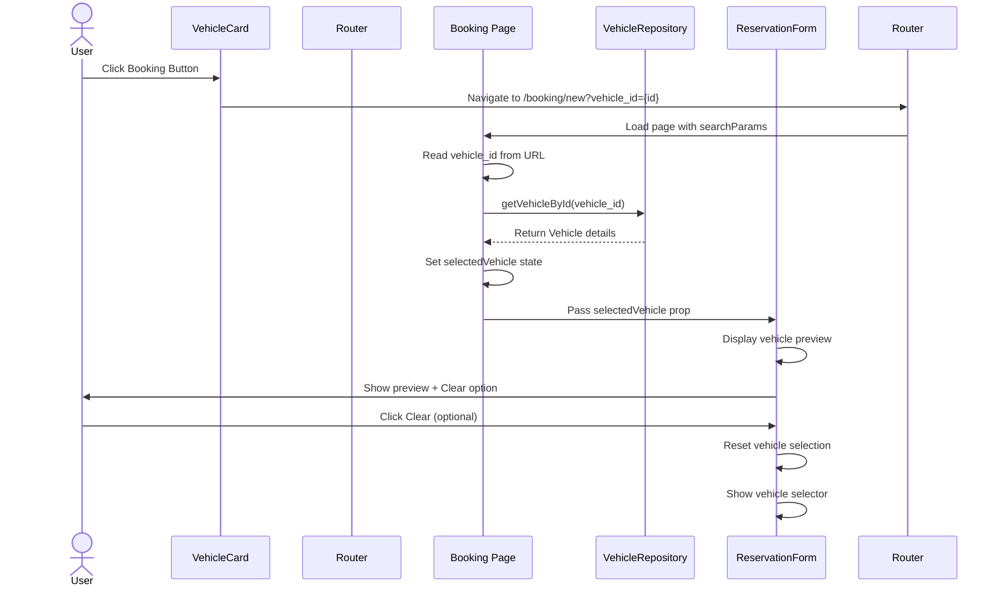

# PR #54 Review Analysis

**Generated**: 2026-01-12T07:40:55.234Z  
**Total Issues**: 4  
**Breakdown**: 0 CRITICAL, 1 HIGH, 1 MEDIUM, 2 LOW

---

## Summary

| Severity | Count | Action Required |
|----------|-------|-----------------|
| CRITICAL | 0 | Fix immediately before merge |
| HIGH | 1 | Fix if <5 min each |
| MEDIUM | 1 | Document for later |
| LOW | 2 | Optional (style/formatting) |

---

## CRITICAL Issues (0)

_No critical issues found._

---

## HIGH Issues (1)


### 1. CodeRabbit

```
<!-- This is an auto-generated comment: summarize by coderabbit.ai -->
<!-- This is an auto-generated comment: skip review by coderabbit.ai -->

> [!IMPORTANT]
> ## Review skipped
> 
> Review was skipped due to path filters
> 
> <details>
> <summary>:no_entry: Files ignored due to path filters (1)</summary>
> 
> * `docs/PERFORMANCE_LOG.md` is excluded by `!**/*.md`
> 
> </details>
> 
> CodeRabbit blocks several paths by default. You can override this behavior by explicitly including those paths in the path filters. For example, including `**/dist/**` will override the default block on the `dist` directory, by removing the pattern from both the lists.
> 
> You can disable this status message by setting the `reviews.review_status` to `false` in the CodeRabbit configuration file.

<!-- end of auto-generated comment: skip review by coderabbit.ai -->

<!-- walkthrough_start -->

## Walkthrough

The VehicleCard booking button navigates to a booking page with vehicle_id as a URL parameter. The booking page reads this parameter, fetches vehicle details, and passes them to ReservationForm, which displays a preview instead of the vehicle selector, allowing users to clear and choose a different vehicle.

## Changes

| Cohort / File(s) | Summary |
|---|---|
| **Booking Page Integration** <br> `src/app/[locale]/booking/new/page.tsx` | Added `useSearchParams` hook to extract `vehicle_id` from URL; introduced `selectedVehicle` state with an effect that fetches vehicle details via `vehicleRepository.getVehicleById()`; passes fetched vehicle and URL-derived vehicleId to ReservationForm component. |
| **Vehicle Card Navigation** <br> `src/components/VehicleCard.tsx` | Changed Booking button behavior from triggering a modal (`handleBookingModalOpen`) to navigating via Link to `/{locale}/booking/new?vehicle_id={vehicle.id}`, removing in-component modal flow. |
| **Reservation Form Enhancement** <br> `src/components/booking/ReservationForm.tsx` | Added `selectedVehicle` prop and internal state; displays a Card-based vehicle preview (image, brand, model, year, trim, price) when vehicle is pre-selected; preview includes a CloseIcon button that calls new `handleClearVehicle` function to reset vehicle and form fields; vehicle selector hidden when preview is shown. |

## Sequence Diagram



## Estimated code review effort

🎯 3 (Moderate) | ⏱️ ~20 minutes

## Possibly related PRs

- **#41**: Modifies VehicleCard booking interaction flow—changes handler refactoring and memoization that may interact with the new navigation-based booking approach.
- **#33**: Updates VehicleCard component with image handling and additional props—shares the same component modifications, potential for merge conflicts.
- **#22**: Alters VehicleCard booking behavior and adds submission debouncing—overlaps with booking flow changes in this PR.

<!-- walkthrough_end -->

<!-- pre_merge_checks_walkthrough_start -->

<details>
<summary>🚥 Pre-merge checks | ✅ 2 | ❌ 1</summary>

<details>
<summary>❌ Failed checks (1 warning)</summary>

|     Check name     | Status     | Explanation                                                                           | Resolution                                                                         |
| :----------------: | :--------- | :------------------------------------------------------------------------------------ | :--------------------------------------------------------------------------------- |
| Docstring Coverage | ⚠️ Warning | Docstring coverage is 50.00% which is insufficient. The required threshold is 80.00%. | Write docstrings for the functions missing them to satisfy the coverage threshold. |

</details>
<details>
<summary>✅ Passed checks (2 passed)</summary>

|     Check name    | Status   | Explanation                                                                                                                                                                                |
| :---------------: | :------- | :----------------------------------------------------------------------------------------------------------------------------------------------------------------------------------------- |
| Description Check | ✅ Passed | Check skipped - CodeRabbit’s high-level summary is enabled.                                                                                                                                |
|    Title check    | ✅ Passed | The title 'feat: Pre-select vehicle in booking form' directly and concisely summarizes the main change—enabling vehicle pre-selection in the booking workflow across three modified files. |

</details>

<sub>✏️ Tip: You can configure your own custom pre-merge checks in the settings.</sub>

</details>

<!-- pre_merge_checks_walkthrough_end -->

<!-- finishing_touch_checkbox_start -->

<details>
<summary>✨ Finishing touches</summary>

<details>
<summary>🧪 Generate unit tests (beta)</summary>

- [ ] <!-- {"checkboxId": "f47ac10b-58cc-4372-a567-0e02b2c3d479", "radioGroupId": "utg-output-choice-group-unknown_comment_id"} -->   Create PR with unit tests
- [ ] <!-- {"checkboxId": "07f1e7d6-8a8e-4e23-9900-8731c2c87f58", "radioGroupId": "utg-output-choice-group-unknown_comment_id"} -->   Post copyable unit tests in a comment
- [ ] <!-- {"checkboxId": "6ba7b810-9dad-11d1-80b4-00c04fd430c8", "radioGroupId": "utg-output-choice-group-unknown_comment_id"} -->   Commit unit tests in branch `agent/bb/fix-vehicle-preselection`

</details>

</details>

<!-- finishing_touch_checkbox_end -->

<!-- tips_start -->

---

Thanks for using [CodeRabbit](https://coderabbit.ai?utm_source=oss&utm_medium=github&utm_campaign=Hex-Tech-Lab/hex-test-drive-man&utm_content=54)! It's free for OSS, and your support helps us grow. If you like it, consider giving us a shout-out.

<details>
<summary>❤️ Share</summary>

- [X](https://twitter.com/intent/tweet?text=I%20just%20used%20%40coderabbitai%20for%20my%20code%20review%2C%20and%20it%27s%20fantastic%21%20It%27s%20free%20for%20OSS%20and%20offers%20a%20free%20trial%20for%20the%20proprietary%20code.%20Check%20it%20out%3A&url=https%3A//coderabbit.ai)
- [Mastodon](https://mastodon.social/share?text=I%20just%20used%20%40coderabbitai%20for%20my%20code%20review%2C%20and%20it%27s%20fantastic%21%20It%27s%20free%20for%20OSS%20and%20offers%20a%20free%20trial%20for%20the%20proprietary%20code.%20Check%20it%20out%3A%20https%3A%2F%2Fcoderabbit.ai)
- [Reddit](https://www.reddit.com/submit?title=Great%20tool%20for%20code%20review%20-%20CodeRabbit&text=I%20just%20used%20CodeRabbit%20for%20my%20code%20review%2C%20and%20it%27s%20fantastic%21%20It%27s%20free%20for%20OSS%20and%20offers%20a%20free%20trial%20for%20proprietary%20code.%20Check%20it%20out%3A%20https%3A//coderabbit.ai)
- [LinkedIn](https://www.linkedin.com/sharing/share-offsite/?url=https%3A%2F%2Fcoderabbit.ai&mini=true&title=Great%20tool%20for%20code%20review%20-%20CodeRabbit&summary=I%20just%20used%20CodeRabbit%20for%20my%20code%20review%2C%20and%20it%27s%20fantastic%21%20It%27s%20free%20for%20OSS%20and%20offers%20a%20free%20trial%20for%20proprietary%20code)

</details>

<sub>Comment `@coderabbitai help` to get the list of available commands and usage tips.</sub>

<!-- tips_end -->

<!-- internal state start -->


<!-- DwQgtGAEAqAWCWBnSTIEMB26CuAXA9mAOYCmGJATmriQCaQDG+Ats2bgFyQAOFk+AIwBWJBrngA3EsgEBPRvlqU0AgfFwA6NPEgQAfACgjoCEYDEZyAAUASpETZWaCrKPR1AGxJcAZiWpcVhQkYIgkXmKQUggMXihYAvj4ANbwGESQPvgUzJAAFLaQZgCsACwAlJCQBgCqNgAyXLC4uNyIHAD0HUTqsNgCGkzMHQASJAAeYNCisGD1Kh2wE2A0iLhgtBSSIcyYHdzYHh4dZVUGAIJ4sNlc0wywI7LcJAAaVmcAyvjYFAwkkAIqBh7lw0KQMLgOqoOj54JNovBYiFeNJwqJxPgsIAkwhgzlIuABQJBkF2aU+uGo2Ha/GeWEAKASMYLUOiQABMAAZWQA2MDsgCMvIAHNA+QB2DgAZlKHHZEoAWkYACLSBhbbgYjAcAxQACSzG4XjYEOQ0DQiGSbK4ADUSDE4kEQh80WJ4Jj8lZ2eUNNrIABhWCYUjIXZKLVVKCIX4dIbcTHsRAdG12ki+5y0DS4RDjLj+wMsgDkACEkhbpmtIIqtlJ8wC8AQsARIB40haAO69KK2xFeAD68HoAEdsJR5NxnGg2DQKN7w/Yo2huNwOgBtDz4BhoLwAXShJbSRA65Fb+zBJAzWa451oSnoVJITuc9ys4+YyEbTPoCKRffoPgoLEgOp6nQDBfxIXB7k7ZNICUCl4A8ZAJHgNBIGCWNEHUbJZBnXQ5wYaMWFjchjV3FJ9w6GxUQoCRqFdDAADFsmYc9swrJADTQUdglCZ0aE/LskUgdtcFgFBdlIHhgiQkhW0YNMQPoNBr0gfNc3Sf4k27EgawEOs3UbJFnHsXi6O9KBzgYP51UwP5GXUShkPsCk+IUklnGSFlEFoxBYToMNcN9ZsGFSdIVOLFIYGkAlK22Gs3UweQvziFEwFhI43yWAE91CrIciEjsROoKCtJwqBNMElFpNk2h2I8TiZCBWgABoSUUcIWtkfwKBa3AtmYFreEREgWswegln/MTT1KwCwj4DcsEMvgRP+MIIg1Vz7iSMJ0Bg+AfD8YIIWKpEzMitZ90gDB8FWfyoAAWUwbBNxzIKLSLEszuiqttMyf9cg3Ck1wyHEpC2HxEoE5LuNW9E6Gmwt/1bWbbii/gsF4RRsBdN0gPQHwpxJShSFO+j4OkRgA3U2guAlTIycQFqAE5WXiWaNQZyBihgtF2fycqvFTCh00zcYWsSMj0kPGST2JkWWso2aaI1RichYr1zEsX0WGYdRCcQLyg3sRxdhcIwoCCeATfkIYdYJS2DRII1M0kkIYexrAyFoFZCE961IZTeTmwwZJkDSWJsCUY7e37MXsoPI8eFPVD/FoRD/Z/Vy/AgpY0+TeWqKVuiVdyRBriRl2eLWlkkv+UbJPwJClGQVTKYk/mft0lpMVOq8ao1TcFFYdQE3YLZpFuyAHooDy5u13W0hqgGLtNc02UHh2NWmxV10cdhaLdbBuFoZlqSsABRGx6IAeRsO7zgAOV9M+e3qK+AHENGYeg8jCfW6O5uCCEWq0B+PvLAfJBQkjSHgaQLU+TsgAKSQGwKBSgtZaD4kqHXQs9Rzi+gANKFivi8T+9AnTu05u6GwOob46mgAATUgHydWs49QOydmAo2TgXAwR3k7dA14WTCVEmgSyJBrLAn+KDPaiIwEDUoLlXYkjCa9URBzVY4hQocQwCNUCl0JgEjWOIxA3ptRgEMAYEwUBPb8B8DgAgxAyDKBcjbdgXBeD8GEOibYMhrZtSoKodQWgdD6EseAKAcBUCoEwPYwg4JnEslcRCLgVBZIOG4fIOQCglABLUJobQuhzFGDCaYAwkZ8ILiXKudcm4SA7nFiFeO0sxyywvAYAARJ0gwFhIDnB1I48gVAXLpKtrYimeZEBm16YI+g5BxiQgwGgJCRBOHXAineB8vxYDPioK+Vyd56C63fCnKOJAM5/gAstQCDRTo6ghP+EBfx+LJjAMEOqLlj4UkyGuVsXAE5rGZMZKutB26uRiSQfa6JICFQJFne45Ma4AO0AhKIjka6UXQphFwGh8Tt0LLIHUtA8g10JZUVsSwsA1wzqgFEYQISnTPvMz2LIWn/DSOoZCzYABenDGw5O2Kcwlv0AJhEfNsl8yA66NmuB4RSQLYYgv9p4kQkRcq8NbBgNYTJchUimj6Z8+sWQoX+bxOgoKMbcHiI2BWlBC6YmLmC2gQgqQuRJfQC1ydED4A8Hgf+jYUQHSyhLIg9EfkaDdT1Cl1zgJUpjtCqNKClCwnIOmH0vdq7+wxfgDCBAeH22yASOuoLcBPDZfqAtmRsjQtLaENAfhICU1oEHDI+A7GIs+WgUxPTzgeCnGAt8+B43/CULEccvNW2QAmLGCgLkq0HAEEFSdEIOXSCmXdcC1x6AYSIIs3APx/iH0+X5SAAADG11EwHFxPevOMR0yQnvKQRctxFMykUaRRAul6mIsWvdUWc6bZkyR4P0RdFquAPtNYq5MftoIAB9LqHA8NevI+aZ0sgubkE9AABDoJbngJhrie8oUz75AfnUFDoGElBgAhX4SIbzmT0BHXVIZ/8UPlpnYgcoXA/24TYRWpSN5wMbK6k+CV16MOnrmQspZ8AVkamvfex9lSVxrg3NuN95EjwyzPCLX9BhWEccLTM8D6LxHZqxbICTf1T04bQhZ3N8BpAdDM5i3NVmziGencZoTp68MaX9tZgC2HcOloI4FjWk9MB7VRqTOI5xFkeFkFyygRh6hpHJvcPM1NIAAGpWQSg6GAVkHSulmLAEYR9MZb2vvboLYWbTOntO6ZYPpAyElbuNs4eQE6svqUmQYOA/xwqNNrF3LAZI6tphYkJM04yqbCtyKoogpAtihRQswRQA8kIoUbV4Eb+47pbY8FfWk0LB2LOWbRUKjYUI3lkS5BpF1WUaBgJlQseksBXVkodHJkrJWQHS8HfKIkG3BDsWEAkjYOgAG81O1IAL6aclkeAA/LG2gABeGHNcND9gRy1YIm2kI3cymkMA1WX1BtG5t4+Hhvn4FkmqkS0T3amMiz2vtvNGxXOY2OuiyAJ1ToLSyOdIHERLvEOIVdPp76DvI4iDowu0Ne3YOoeQ27d37vm4bWCCrTFA8y63Y9+Wit8iMGfc6uwXFtWTlVSd+0C1cHXTVRwpXmvlcq1GSn8ZkcHnPXahi36RZaiay13p/T4lDM8l1nhvXjcDfMteZADhFwVrVTVRAHFZAXRQilN2rqlWVSc7JOui0LpBMgHc3qmM/gA5NcC0FAKaBgoUBQYIWfMQ1VCuy8Qm4nSN6L/+bgLV2zBHoI2N1r3e4A7vGfSFkRGyIFkMCeIHL++QeLYOtIU5EtOWZAyploFkA1B1CDkRfo0xgAEGaFl0NIOnJdvb9jp4xaNRarT9qkBOrOB6n1XR7qWwfwZKHYMSaQQc/wgU2aJAOoTACQn252jAXgRkVyBepkb2NKUkJeKAKeZcWA5KZAO0iKmBDc/Y1cjkFqJiaayeO0Cce2KYyBFAoKPgKCFCxykOpyry4QjGdM4Qqc+QEa8qYgZq/swCzIAB0KlsJA6sUAZ8GAlMdeQ6j+aBboPgPyXAVyiKBeVa32ycqCFAguGASWQkUay0wQOBl08u9+wKpyr2AA6lGnntYQqo/hMEgJmJGitLxFWqgAgIIhNlgD4EslWhOlcsXjJLcvcrXuTAnKhpmDmGmC1PVlrBCOwEkWmC7shC1LAZiB9uNkkWuGEDkToq5DXFwe8iyL6s2NLgmP5sgHkO3C1Liv7HqKeF6L0ghIOoJsgLqhJKETnGyg2JlAHl+nlKfq5EDIiD3DQcamRsPogSMcrExEEPgG0FwAXiIcmKjjBlpJAPBhgIhhIYeifEoT7kdJrpSOYbdmIuqEIXxKCnNk4asfkIdBOCyDvpQIlsYY2L3pygPgqu3DIZAPgiQMYpOuMO4RdAILaLJlWhnsyLhlIXcXRGLHgJYbJDUSgFDoOmEddGrgPPng/loc5GeMUuHpzs4gLogbzqICxv2mMsrrOnwArgwJLiuonlXqkRQEEbZLTjIkvJiFwIsUXMscPpMv+jMvXM8DOrIOsZvv7NsZAKCvsYhj6FrM+uwPYHJlruYccTQEKZ+ksTkAZrhMqFqljHumthkLoaIlZM7BsVBlpFwL8RvoPtBHkB6osmwOCehEainvKcmMRqwlyXvs3oMevtyuhjZi6R4P8cIY6UiJFg9BgDFuWHFv8AlpuMlqlgYIbsgH1qQDlrllyKKEViVgYJbuINbokrblgUBrRk7pPHQPAG7mHmYhYlYkuvQBOmgHgHEk4tHvQEkpwKhGgGkrHpkn4jkioHksEoUoYJ2TbOoD+IgD2HWa2HQD2ACjOvOcYOEnJKyKoCWYKCQNyKKFKP4AIIeVyLQIzKUMULQAIIKH4I+VyIzEEWKAwNyLuSUlAEubgCuWuSQFVJuTYqEp2SiD2GwBQKQD2PCsFKuduQSKEgYDDiae0kgLYIWGph5LQOqU7FYNmnxO0r4JuGEE1OhaXN8LKtheuMkLYCRZkGRcNOhUgFfKDFsP4YxUEQhCxVUO0jVLQDYCgtvAwB8KoukIgP6KIMkIxb1MOBRfxYJcJRgO4LgALEsMFHJRQApehcpSJSqGqBqNJVpaRbxYpZAO0kHLhTqPrMOIgOJRQIxZ0hZVZWaLgCZckArIcJmIxcuCaVUGhVUMFZZfBckPfG8c5WaaqPAOqP/J5e0hZSFe0s3lSNpbpSFfxVOnVLunRM5Z5fYKkIuCyFAFrEoDYDOeoIAJgEyACARAswXgUg9OIy3WFhZAKgXg6YiVAVwV7Sn+zlrYzgKZ6Q3VmVll2QcmaQm4nlEVbAzlTcMVcVmIzWIVBOPVQVmV7SYVs1JAzlalcQYVo1m1qViA6VfFm12VmAYCe1mUUucQ+YfgAQ1gzhkQxBCQcclaOQNYNUwQYgxhZemIDASA4QGuse8AKWGU/wpIC0xudI7VC6F0iKhJa0/8ZIVyT2oUrY2QyQahjO6Aqo2aGUwQUNigMi6G9MGgR1yVHe3qvqy1fyhxPV/F/VXA7Sg1FAw1RAVNvVv1mIsIRA+63FzFSVvVE1PQiWM1kVrNd1u1PVa1IVG1yV21UtllolWqF0WsoMp43N/FJ1Qt5lTNlll1uV9Nqt646toUTAWtEkqAxQ7IGg7IiCJhiIokUSmq2A+0iITm9Kb2/wwQQ48A4+8aHeMqhyyAgo9tjtCClNIt/FNNPqGozldhWwLetA5tElRAyAzOmULBwIvMOsf8pOjsiBXk4gPk8gVyVtygEkIkId3qXVsdllLNll7NnNOt41Ww4t01ml4VKtAl6dVpp1ctJpW4rldUawtg0VRleVrNaAnIfIPgpQjMxQEoDA7IG4X5JAAg7ItADApQPg3IxQPgC9JAgoXIgodtpQEoXI59+0G4Pgx8aAgoT9ooXIDAR97IgotAR9aAfI3IR1blE9Ng+1u1rNPgjMgozMtAJZpQJAUoAgxQDAjMDAtArIgoooooF9goAg75+9ooAgN4DA29DAfIEDfIdaXIrItA6DpQODAgpQoofgjMjMJAXIEoAgADadDAFtRAmt1dMBIZ/eJJjFitllVWhENWCYGN/uhpIpqsIsIjht7SBAgM9ErB7MjFfIjd7Sud7siAdhvQatGdp1XA5uq1ItKV84i4qmNSGm0jUsx4L2CjXAoj/FKjm4ajedAumj2juj7MBjIkRjg9jF7Iw9VQCOBgETv5LsUFRMZyYVq5YF5iQAA=== -->

<!-- internal state end -->
```


---

## MEDIUM Issues (1)


### 1. SonarCloud

```
## [](https://sonarcloud.io/dashboard?id=Hex-Tech-Lab_hex-test-drive-man&pullRequest=54) **Quality Gate passed**  
Issues  
 [1 New issue](https://sonarcloud.io/project/issues?id=Hex-Tech-Lab_hex-test-drive-man&pullRequest=54&issueStatuses=OPEN,CONFIRMED&sinceLeakPeriod=true)  
 [0 Accepted issues](https://sonarcloud.io/project/issues?id=Hex-Tech-Lab_hex-test-drive-man&pullRequest=54&issueStatuses=ACCEPTED)

Measures  
 [0 Security Hotspots](https://sonarcloud.io/project/security_hotspots?id=Hex-Tech-Lab_hex-test-drive-man&pullRequest=54&issueStatuses=OPEN,CONFIRMED&sinceLeakPeriod=true)  
 [0.0% Coverage on New Code](https://sonarcloud.io/component_measures?id=Hex-Tech-Lab_hex-test-drive-man&pullRequest=54&metric=new_coverage&view=list)  
 [0.0% Duplication on New Code](https://sonarcloud.io/component_measures?id=Hex-Tech-Lab_hex-test-drive-man&pullRequest=54&metric=new_duplicated_lines_density&view=list)  
  
[See analysis details on SonarQube Cloud](https://sonarcloud.io/dashboard?id=Hex-Tech-Lab_hex-test-drive-man&pullRequest=54)


```


---

## LOW Issues (2)


### 1. CodeRabbit - src/app/[locale]/booking/new/page.tsx:76

```
_⚠️ Potential issue_ | _🟠 Major_

**Add error handling and loading state for vehicle fetch.**

The vehicle fetch effect lacks error handling and user feedback, leading to silent failures when:
- The vehicle_id is invalid or not found
- Network errors occur
- The repository returns an error

Users will see no pre-selected vehicle without explanation, creating a poor experience.


<details>
<summary>🔧 Proposed fix with error handling</summary>

```diff
+ const [loadingVehicle, setLoadingVehicle] = useState(false);
+ const [vehicleError, setVehicleError] = useState<string | null>(null);
+
  // Fetch vehicle details if vehicle_id is provided
  useEffect(() => {
    const fetchVehicle = async () => {
      if (vehicleId) {
+       setLoadingVehicle(true);
+       setVehicleError(null);
        const { data, error } = await vehicleRepository.getVehicleById(vehicleId);
-       if (data && !error) {
+       if (error) {
+         console.error('Error fetching vehicle:', error);
+         setVehicleError(
+           isArabic
+             ? 'فشل تحميل بيانات السيارة'
+             : 'Failed to load vehicle details'
+         );
+       } else if (data) {
          setSelectedVehicle(data);
+       } else {
+         setVehicleError(
+           isArabic ? 'السيارة غير موجودة' : 'Vehicle not found'
+         );
        }
+       setLoadingVehicle(false);
      }
    };

    fetchVehicle();
- }, [vehicleId]);
+ }, [vehicleId, isArabic]);
```

Then display the error near line 273:

```diff
  {error && (
    <Alert severity="error" sx={{ mb: 3 }} onClose={() => setError(null)}>
      {error}
    </Alert>
  )}
+
+ {vehicleError && (
+   <Alert severity="warning" sx={{ mb: 3 }} onClose={() => setVehicleError(null)}>
+     {vehicleError}
+   </Alert>
+ )}
```

</details>

<details>
<summary>🤖 Prompt for AI Agents</summary>

```
In @src/app/[locale]/booking/new/page.tsx around lines 64 - 76, The vehicle
fetch useEffect (fetchVehicle) lacks loading and error handling; add two state
variables (e.g., isLoadingVehicle, vehicleFetchError), set isLoadingVehicle true
before calling vehicleRepository.getVehicleById(vehicleId) and false in finally,
check the returned { data, error } and when error or no data set
vehicleFetchError to a user-friendly message and do not call setSelectedVehicle,
otherwise setSelectedVehicle(data); also catch/network exceptions and set
vehicleFetchError accordingly. Finally, surface isLoadingVehicle
(spinner/disabled state) and vehicleFetchError in the UI near the vehicle
selection/rendering code so users see loading and error feedback.
```

</details>

<!-- fingerprinting:phantom:poseidon:puma -->

<!-- This is an auto-generated comment by CodeRabbit -->
```


### 2. CodeRabbit - src/components/booking/ReservationForm.tsx:155

```
_🧹 Nitpick_ | _🔵 Trivial_

**Add docstring for handleClearVehicle function.**

The function lacks a docstring, which may violate the ≥80% coverage requirement enforced by ESLint pre-commit hooks.


<details>
<summary>📝 Proposed docstring</summary>

```diff
+ /**
+  * Clears the pre-selected vehicle and resets associated form fields
+  * (vehicle ID, date, and time selection)
+  */
  const handleClearVehicle = () => {
    setSelectedVehicle(null);
    setVehicleId('');
    setSelectedDate(null);
    setSelectedTime('');
  };
```

</details>

As per coding guidelines: "Enforce ≥80% docstring coverage in TypeScript files via ESLint pre-commit hooks"

<!-- suggestion_start -->

<details>
<summary>📝 Committable suggestion</summary>

> ‼️ **IMPORTANT**
> Carefully review the code before committing. Ensure that it accurately replaces the highlighted code, contains no missing lines, and has no issues with indentation. Thoroughly test & benchmark the code to ensure it meets the requirements.

```suggestion
  /**
   * Clears the pre-selected vehicle and resets associated form fields
   * (vehicle ID, date, and time selection)
   */
  const handleClearVehicle = () => {
    setSelectedVehicle(null);
    setVehicleId('');
    setSelectedDate(null);
    setSelectedTime('');
  };
```

</details>

<!-- suggestion_end -->

<details>
<summary>🤖 Prompt for AI Agents</summary>

```
In @src/components/booking/ReservationForm.tsx around lines 150 - 155, Add a
JSDoc comment above the handleClearVehicle function describing its purpose
(clears vehicle-related selection state), listing any side effects (calls
setSelectedVehicle, setVehicleId, setSelectedDate, setSelectedTime) and noting
it returns void; ensure the docstring follows TypeScript/JSDoc style (/** ...
*/) so ESLint recognizes it and boosts docstring coverage.
```

</details>

<!-- fingerprinting:phantom:poseidon:puma -->

<!-- This is an auto-generated comment by CodeRabbit -->
```


---

## Next Steps

1. **Fix CRITICAL issues** (0 found) - Block merge until resolved
2. **Fix HIGH issues** (1 found) - Fix if <5 min each, otherwise document
3. **Document MEDIUM/LOW** (3 found) - Create follow-up issues

**Generated by**: `pnpm run pr:scrape 54`
