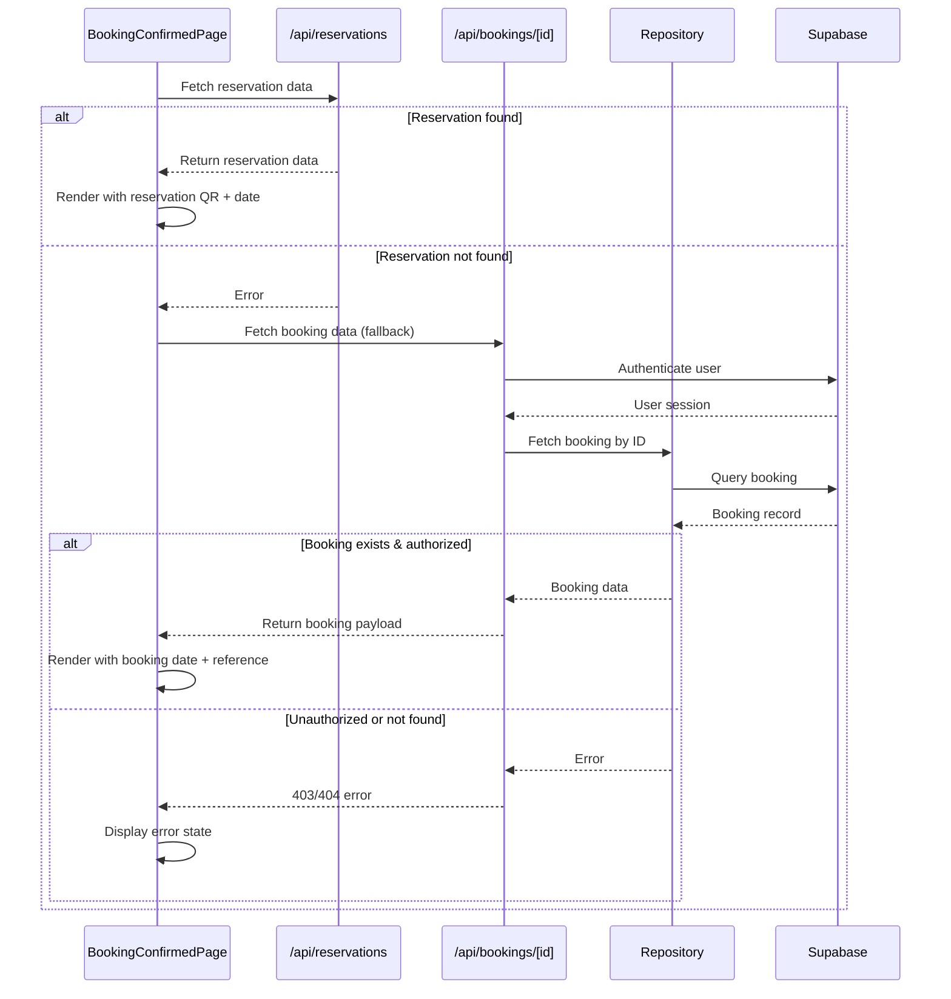

# PR #55 Review Analysis

**Generated**: 2026-01-11T21:39:18.332Z  
**Total Issues**: 6  
**Breakdown**: 2 CRITICAL, 1 HIGH, 1 MEDIUM, 2 LOW

---

## Summary

| Severity | Count | Action Required |
|----------|-------|-----------------|
| CRITICAL | 2 | Fix immediately before merge |
| HIGH | 1 | Fix if <5 min each |
| MEDIUM | 1 | Document for later |
| LOW | 2 | Optional (style/formatting) |

---

## CRITICAL Issues (2)


### 1. CodeRabbit - src/app/api/bookings/[id]/route.ts:50

```
_⚠️ Potential issue_ | _🔴 Critical_

<details>
<summary>🧩 Analysis chain</summary>

🏁 Script executed:

```shell
#!/bin/bash
# Check the createClient implementation
echo "=== Checking src/lib/supabase.ts implementation ==="
cat -n src/lib/supabase.ts

echo ""
echo "=== Looking for server-side Supabase client utilities ==="
rg -n "createServerClient|createRouteHandlerClient|createServerComponentClient|createSupabaseClient" --type=ts

echo ""
echo "=== Checking the actual route file being reviewed ==="
cat -n src/app/api/bookings/\[id\]/route.ts | head -60
```

Repository: Hex-Tech-Lab/hex-test-drive-man

Length of output: 3050

---

🏁 Script executed:

```shell
#!/bin/bash
# Check other API routes to see if they use the same pattern
echo "=== Checking other API routes for Supabase usage patterns ==="
fd -e ts -path 'src/app/api/**/route.ts' --exec grep -l "createClient\|createServerClient\|createRouteHandlerClient" {} \;

echo ""
echo "=== Look at package.json for available Supabase auth helpers ==="
cat package.json | grep -A5 -B5 supabase
```

Repository: Hex-Tech-Lab/hex-test-drive-man

Length of output: 763

---

🏁 Script executed:

```shell
#!/bin/bash
# Find all API route files
echo "=== All API route files ==="
find src/app/api -name "route.ts" -o -name "route.js"

echo ""
echo "=== Check bookingRepository implementation ==="
cat -n src/repositories/bookingRepository.ts | head -40
```

Repository: Hex-Tech-Lab/hex-test-drive-man

Length of output: 2388

---

🏁 Script executed:

```shell
#!/bin/bash
# Get full bookingRepository implementation
echo "=== Full bookingRepository.ts ==="
cat src/repositories/bookingRepository.ts

echo ""
echo "=== Check one of the other API routes to see the pattern ==="
head -60 src/app/api/bookings/route.ts
```

Repository: Hex-Tech-Lab/hex-test-drive-man

Length of output: 5638

---


</details>

**Authentication check is non-functional: browser client cannot access cookies in server context.**

The `createClient()` uses the browser client (`@supabase/supabase-js` with `NEXT_PUBLIC_` env vars), which cannot read authentication cookies in an API route context. Calling `supabase.auth.getUser()` without the request object will always return `null`, causing all requests to return 401.

This endpoint also lacks ownership verification—`getBookingById()` does not filter results by user, so even if authentication worked, any authenticated user could access any booking.

**Required fixes:**
1. Implement server-side authentication using the request context (requires adding `@supabase/auth-helpers-nextjs` or custom auth middleware)
2. Add user_id filtering to repository queries to verify booking ownership
3. This pattern affects all 17 API routes in the codebase

<!-- fingerprinting:phantom:medusa:ocelot -->

<!-- This is an auto-generated comment by CodeRabbit -->
```


### 2. CodeRabbit - src/app/api/bookings/[id]/route.ts:71

```
_⚠️ Potential issue_ | _🔴 Critical_

**Critical security flaw: Authorization check is ineffective.**

The ownership check on line 66 only executes if `bookingWithUser.user_id` exists. However, based on the `bookingRepository.getBookingById` implementation in the relevant snippets, the `user_id` field is **not included** in the returned `Booking` object. This means:

1. `bookingWithUser.user_id` will always be `undefined`
2. The condition `bookingWithUser.user_id && ...` will always be falsy
3. **Any authenticated user can access any booking** (IDOR vulnerability)


<details>
<summary>🔒 Recommended fix: Include user_id in repository and enforce ownership</summary>

First, update the repository to include `user_id`:

```diff
// In src/repositories/bookingRepository.ts
  return {
    id: data.id,
+   user_id: data.user_id,
    name: '',
    phone: data.phone_number,
    ...
  };
```

Then update the Booking type and fix the authorization check:

```diff
-    // 4. Authorization check (CRITICAL) - Verify ownership
-    // Note: Booking type needs userId field added, currently using type assertion
-    const bookingWithUser = booking as typeof booking & { user_id?: string };
-
-    if (bookingWithUser.user_id && bookingWithUser.user_id !== user.id) {
+    // 4. Authorization check (CRITICAL) - Verify ownership
+    if (!booking.user_id) {
+      // If no owner recorded, deny access for safety
+      return NextResponse.json(
+        { error: 'Forbidden - Booking ownership cannot be verified' },
+        { status: 403 }
+      );
+    }
+
+    if (booking.user_id !== user.id) {
       return NextResponse.json(
         { error: 'Forbidden - You do not have access to this booking' },
         { status: 403 }
       );
     }
```

</details>

<details>
<summary>🤖 Prompt for AI Agents</summary>

```
In @src/app/api/bookings/[id]/route.ts around lines 62 - 71, The authorization
check in the route handler is ineffective because
bookingRepository.getBookingById does not return user_id and the current
conditional (bookingWithUser.user_id && bookingWithUser.user_id !== user.id) is
always falsy; update the repository function getBookingById to include the
booking owner's user_id in the returned Booking shape, update the Booking type
to include user_id (or a separate interface like BookingWithUser), and then
replace the conditional in the route handler (where bookingWithUser is used)
with a strict ownership check that returns 403 if booking.user_id is missing or
does not equal user.id (i.e., ensure you explicitly check for undefined and deny
access when user_id is absent or mismatched).
```

</details>

<!-- fingerprinting:phantom:medusa:ocelot -->

<!-- This is an auto-generated comment by CodeRabbit -->
```


---

## HIGH Issues (1)


### 1. CodeRabbit

```
<!-- This is an auto-generated comment: summarize by coderabbit.ai -->
<!-- walkthrough_start -->

## Walkthrough

Adds a fallback data source mechanism to the booking confirmation page by introducing a new single-booking API endpoint. The confirmation page first attempts to fetch reservation data; if that fails, it falls back to the new bookings endpoint. The API endpoint validates booking IDs, authenticates users, enforces authorization, and returns appropriate error responses.

## Changes

| Cohort / File(s) | Summary |
|---|---|
| **New API Endpoint** <br> `src/app/api/bookings/[id]/route.ts` | Introduces GET endpoint for single booking retrieval. Validates UUID format, authenticates via Supabase, fetches from repository, enforces ownership authorization, returns booking payload or appropriate HTTP error responses with Sentry reporting. |
| **Booking Confirmation Page Integration** <br> `src/app/[locale]/bookings/[id]/confirmed/page.tsx` | Implements dual data source handling with fallback pattern. Adds local state for booking data, attempts reservation API fetch first, falls back to bookings API on failure. Updates rendering to use either data source (QR code from reservations only, date from either source, unified booking reference). |

## Sequence Diagram



## Estimated code review effort

🎯 3 (Moderate) | ⏱️ ~20 minutes

<!-- walkthrough_end -->


<!-- pre_merge_checks_walkthrough_start -->

<details>
<summary>🚥 Pre-merge checks | ✅ 2 | ❌ 1</summary>

<details>
<summary>❌ Failed checks (1 warning)</summary>

|     Check name     | Status     | Explanation                                                                           | Resolution                                                                         |
| :----------------: | :--------- | :------------------------------------------------------------------------------------ | :--------------------------------------------------------------------------------- |
| Docstring Coverage | ⚠️ Warning | Docstring coverage is 50.00% which is insufficient. The required threshold is 80.00%. | Write docstrings for the functions missing them to satisfy the coverage threshold. |

</details>
<details>
<summary>✅ Passed checks (2 passed)</summary>

|     Check name    | Status   | Explanation                                                                                                                                                          |
| :---------------: | :------- | :------------------------------------------------------------------------------------------------------------------------------------------------------------------- |
| Description Check | ✅ Passed | Check skipped - CodeRabbit’s high-level summary is enabled.                                                                                                          |
|    Title check    | ✅ Passed | The title accurately summarizes the main changes: adding a new GET endpoint for the bookings API and implementing dual-system support in the booking confirmed page. |

</details>

<sub>✏️ Tip: You can configure your own custom pre-merge checks in the settings.</sub>

</details>

<!-- pre_merge_checks_walkthrough_end -->

<!-- finishing_touch_checkbox_start -->

<details>
<summary>✨ Finishing touches</summary>

- [ ] <!-- {"checkboxId": "7962f53c-55bc-4827-bfbf-6a18da830691"} --> 📝 Generate docstrings
<details>
<summary>🧪 Generate unit tests (beta)</summary>

- [ ] <!-- {"checkboxId": "f47ac10b-58cc-4372-a567-0e02b2c3d479", "radioGroupId": "utg-output-choice-group-unknown_comment_id"} -->   Create PR with unit tests
- [ ] <!-- {"checkboxId": "07f1e7d6-8a8e-4e23-9900-8731c2c87f58", "radioGroupId": "utg-output-choice-group-unknown_comment_id"} -->   Post copyable unit tests in a comment
- [ ] <!-- {"checkboxId": "6ba7b810-9dad-11d1-80b4-00c04fd430c8", "radioGroupId": "utg-output-choice-group-unknown_comment_id"} -->   Commit unit tests in branch `bb/verify-booking-confirmed-page`

</details>

</details>

<!-- finishing_touch_checkbox_end -->

<!-- tips_start -->

---

Thanks for using [CodeRabbit](https://coderabbit.ai?utm_source=oss&utm_medium=github&utm_campaign=Hex-Tech-Lab/hex-test-drive-man&utm_content=55)! It's free for OSS, and your support helps us grow. If you like it, consider giving us a shout-out.

<details>
<summary>❤️ Share</summary>

- [X](https://twitter.com/intent/tweet?text=I%20just%20used%20%40coderabbitai%20for%20my%20code%20review%2C%20and%20it%27s%20fantastic%21%20It%27s%20free%20for%20OSS%20and%20offers%20a%20free%20trial%20for%20the%20proprietary%20code.%20Check%20it%20out%3A&url=https%3A//coderabbit.ai)
- [Mastodon](https://mastodon.social/share?text=I%20just%20used%20%40coderabbitai%20for%20my%20code%20review%2C%20and%20it%27s%20fantastic%21%20It%27s%20free%20for%20OSS%20and%20offers%20a%20free%20trial%20for%20the%20proprietary%20code.%20Check%20it%20out%3A%20https%3A%2F%2Fcoderabbit.ai)
- [Reddit](https://www.reddit.com/submit?title=Great%20tool%20for%20code%20review%20-%20CodeRabbit&text=I%20just%20used%20CodeRabbit%20for%20my%20code%20review%2C%20and%20it%27s%20fantastic%21%20It%27s%20free%20for%20OSS%20and%20offers%20a%20free%20trial%20for%20proprietary%20code.%20Check%20it%20out%3A%20https%3A//coderabbit.ai)
- [LinkedIn](https://www.linkedin.com/sharing/share-offsite/?url=https%3A%2F%2Fcoderabbit.ai&mini=true&title=Great%20tool%20for%20code%20review%20-%20CodeRabbit&summary=I%20just%20used%20CodeRabbit%20for%20my%20code%20review%2C%20and%20it%27s%20fantastic%21%20It%27s%20free%20for%20OSS%20and%20offers%20a%20free%20trial%20for%20proprietary%20code)

</details>

<sub>Comment `@coderabbitai help` to get the list of available commands and usage tips.</sub>

<!-- tips_end -->

<!-- internal state start -->


<!-- DwQgtGAEAqAWCWBnSTIEMB26CuAXA9mAOYCmGJATmriQCaQDG+Ats2bgFyQAOFk+AIwBWJBrngA3EsgEBPRvlqU0AgfFwA6NPEgQAfACgjoCEYDEZyAAUASpETZWaCrKPR1AGxJcAZiWpcAIK09ADiAKLQkGS03PjwGLiQPvh8Avj4ANYJRMiBVgCSkADUkLTYaB5giLKINMz22NxxFEkAFLaQZgCs3QCUkJAGAKqIlFzQorAAErLcJAAaVpCAKASQAMr42BQM3pCqAPRSFPA+smDpWTlgTBg+8BRstGDcaKSQgEmEMM6knJDM2iwawAwhR/DRaFwAEwABihADYwDCAIxIgAc0GRAHYOABmHG9ABaqw2uGo2EQXHw8wwRnWjgBLg4BigwVoyDQ/yQiBykAiURicQSSWokAOaG48AOl2yGFyBwA2vBaABdSAESBg3AnEhSdD7DKyoj7eQFAAikDa5AA7sl4F4uIgduLmi6pTKcohFcqVQcKFsaBpcIg+hoWZBhtxaNRpOrYCQDVc5Qo7g8njw3gm2k6GC7uIqPPgGJUSL6PXKvUrVQdbvdHnQDq9SEHEAAPAYahzNVJJcqVey1eqU9UuOMJmzSSgSajwfAYPKFS0AWQAastkRp+naKHV0Bh6D5Kh59mgGJl1fgx5AvERT/IAEKGz2QfIFMNQArMbheNiJZCUf0+FgTBaA8XlrXUWANnYUdhRIIgqHEOd3w2WB8GtZAAEU7CYJR+AwDx5BSPgwTGChpyQ+dNVEVJ2TjUUEgYDxsDwgBHCgAH1cJIDjozJFDoDmEh1gYE5uCSOoTjEf5FATV5EDGRAAG4yiLSTeSYY5M0gABODd4SxABSS0VHwPUsRhYzbxoUNw0mOocgmISRLEpImC/e0ZznAAaVSGHU5NNOUd5rJIXyANSSBgP3MDk2IrkFN5ctcl8kCygqKoajqEgGkPDwPAEU9z0LIh4AYSBjlOeA6BQz9XjEXx4FbWMABYYRa6IKEA5A50TI0UzrAFKIzUhEF8gFhUBGQiutZx6Hc15xDUMDcHkCDcCgm87wHbLmFS/dGm7VpkA2hMbWosiKNnKisvqMMDAAMXtWMGGi0hIXDHM8zdaUnwrb1q39PASBbS0bV87ooWvBJpD6T7nQlfMFULYsvDLP75SrX1azTBsmxB4NW0tZhFCquhfOKNFugOMBkX6cxLGBFhmHUf5pEQTNkAcJwXCMJnWHUZAwR8LxpL8ckwRQL8f3YLyMF82g1P2+gxgYbZ1HkYCKCUDBHPDOqZcSOg+UiMUJXdDHKx9Pd6CaPjjZx+t6Hxi8eGFygLqnOWFyKdaoOSn3kiPQqzxUtAQmN9YYPkCKgJA2LjTS7CblklNaHUa7+3TxBvzQWQULNItHFl4a7ZjDkDvmChiIBDBdgOMlEGK/BcnQCPaBUxX/O1DSzOChMwRaCF0CSPSNAMwyUKjtWTlWqK5rIXlw6USEI2Gc1klSIaKsqZU5c3tIMcgc1fLBVjsAeBN6VeQqxhwU7EjK/e2ja5EUB8SBsAwNA8HjR/iwhH0XylUzh9V5OhcgO4EDcEtG1XE79IAYHwEkCBlAgE23VPAIgsAaB8B/htAAXgcWO9gyS4ApPPGKvINS8F1OwT+39f6pHgAQ42p5dgKXuvoYw4AoAxH4B/fBhBSCQJjPNZm7AuC8H4MIUQ4gpAyHkNxKgqh1BaB0NwkwUA4CoFQJge+wiyDKGHu5X8fwqC2m5oyeQcgFBKBUWoTQ2hdBgEMDw0wBgvqIwLEWEs6MkyYx9DWOcg08aZhbK2ZkAAiGJBgLAvgKMQIxiFjZWOcPIfAH9XqYFGkYD8iR/TlA4elLO1BOSIC2DsBM0VQKOW3Luag9RxKuz8LgV6ntyL7z4pyHw/oGg/VIl7SiXoAAkABvZKBRaAAF8VKnHokkQ89oxpB3ytNM8rsfoBwOOMyZMyNCQAnDyMCZBdhtxXgfa88Ftq3RyihNkyBzoo37HUGMrs0IeHoMlMoZTkh9KvKrOc0ZRwVO2LsLgj4AmQAAD6IOwPle5tAhAUmDJ1QClDanJg1MLUWSRvmtPaUs5ipEMElQ5AwJg2sciERQpGe2QsYiUF5CVMqrsuxDx+WSP5LBoiQQ9rc5gXAFrA2QNnXOsgzRvN6TywZnTKIaFlVdOcvEYziDYPwQ+ASNC0L8F1OgkqaCdyZQo/UiA0KtCMfQMVHg85TO5Q0PZKEmb7gznOI88gwT7koMgde0RDaotvsbXq1oEDtO6fYSpZzeBmWVMbbpXBsJ2ITKgM1ED8KEUgCGsgHSlVYHDSQVsSBgydzeYVWg7w0o2oECQY8zgEzWrzsbLNWBOT2xQByacnkBBeBUt892nqzkUljKdBhZMrVIHFVMlCABpEgJBuD/kLQ5ZMvrJpi0iiO1cywRboV8iG560RWyvBdYFFgi14DLQ1pmyCe5+CfI9gHF8hR7oMxfB4XB3tXYjqUExZwn7MmHqHkGvg3BsDdtZewDO0g8nHy/D2c5dAuDwDg60dUQlIBjMgJC/q0z7WQAAOQAAEG5CS9MlfDKAsBeNdMjXxaNfoBKttWR2TxGzhMJuGdYZD62iBtYha6CHV63F3AqZKvkxi4GwzkNUABeT+YwuMxmAFJ5MsKMDwo8HoK0GmBgJCwxjZ1oTaBWEzEYAAMjDZA2S5SIZKC1NENM6ZGHCA5IaDtU5ggkNVW0JAfDET+EuOg8BHAGBiVEvJHjqP5nNgxo0THfRA0DMGaJsT4mBESSI4xqSGTpIEYwN60GDAFAKYobAxTOTnR5HKLwFwj78ifUUQU8REgjzNpKWLnoAYqgOXABMTXhQ7zAvSq83yN411FG0YY68zToPwX/cQADh3xnkx7LznJr4qDQGMXyBL4wnWW/i/5I7B74B5AQFwytoh3FSMU1BUD4AwLm8wghcsDkAHkqNlY4Ss1mWpthURHd814shCzhxUr1Il2wwooCSH9igVFEb+l4PAN50xoDQGWCQ0icR5yxhfjCGElyy2UdA7gXyr9Llfzm5BxbtBycwngfFYiagI7y0gG1Dq8UkGLK2PuCGBPLmXQ9rHEMByChJEYsxJQ/4uqRRqQna9G1oIFI9fOnsvJ4pwXh/2EXL64mWECO+4x10TqXm/bxv9wy8sFqA/QSKoHwPlUg+IQrUAAByJAfNHp7MbHwX8xDXS4AAA35G0M+2BpB/A962XAE5z6R98ph14VBmDIGmVwJPf7U9cCsH0pAJBgCYeVI6HuyZpl6EgNMvoQfKOQCD1FrZlsut+gDATRAQfX1LkwKcSPkAnpeBfN/QirCKDmcs/lnJtnKY6RpjCZzrmxFJuol5z30Q/M9i4NMLBsBQuxJZK49xfCDoAaEUk0RJiJGJC4BYxoPMbFKNkg4tRzjNG8IUALXAHFlSIA4p57zdAOJXlUNuEDAtFohkQdI0AfBkQlAsQfA0RCpugYCWpVB4QYRuhcR4RsQWpaBcRq00QdIoQ2p4QSALIXE3EwDTF1Av92Rf9dR/9aAOJ+FX8IA3YeI2AKBSAuJ4wzwf8gCkgQCxkDBBgokkBbB7wUZMg6B+YzErBTsIQolfBKhtthDIAolU14VaAJCixMhbBFDVkVCRCkA3tjgThWd9C8pDC1D05aAbAv5C4GAuMTgKxgQeDMh9DtQI9vJVCokbC7CMB3BcAvBXDRB3CuBPCwofC/D7DpBRIHtKIQizwLDlDIiRDYopDaACgFII9EAnD9CYlvC0ittcBEjMgjl4Vgx9CFRVDBghDBh6i1DXpQi3c0A2B8izRYjXIBNSiolCiGi1DXlyFEAPCKAvCaj6iokbcbVv5KJ8jSj7BshmhjYoAmYlAbAVBHFABMAmQAQGwTAC8CkGPDSVgn/G/m7Rql6PGJEJJiUHyNmnhxyEuP6LUOYVKiH1KJaLaK4F8M6PiOunCwaOmT6NqKuMaLcM+JIHyMCIHyaKSOBImMGIpBGLGOeMmKPWmLlihOW3ECCITHYW2BjAzWOJYSWwTAmiwGs1Gi4GXiXkQVX3q36xa3ikB0tgawwWQ2/Bykg2TD7EykHBykOg5T0xZKhRY2Nnxg0CeP6KiRuMhO+PuN1jlClIaKiTBBxiICh2SI8CsJVNeISEqA+NaLlLUJxK8ABPqKBPGLqOlNhMyAhPaLUlL2NCZi0lIGVIRLISRKUO1NSOlKmMwExO+IcICmNCCioHeFQG6BhA0AJ2Mn3XaV0XnGwD8zKmqkSB62W3D0vnoA2lIg+XoFQDRGjNjMlPhJENInwGYlmO+IAHVZ561HTnDW5mTls/c64rcWZEosV4wGhOwZxEBQER0wztJczpB8zSzQSZTZI7jnBFSiB3SRC9T3jwSjT8iu4QzhjxjplVCVQ+iokbU6hbAOjEA4jxJ/jvjkQBAsDkRYRoC0CoQdIfAoQGBkQCCfBaABAdIGBaACcBAWp7MYR4R7M4D3zCooRcRcQYQSAoQsRYQsQ0Q0RIK0QoRkQWo0BYQGBugpT9zijbBoTjSolUKUC0ASAWpfMfAsQGB4Q0QfBcQoRwKdIdI0R4RaB4QqK0RYL4RugEKOKlAdI0DaAyKgKWo9I50BBkRSDIYlA/AsR7NsL1ynSXT+5itcEh9FMaB9DrSRCG9aNUZSwOt/osZglUwnY2NmxCZNLJyCAyQPAHp/dhl9DkQyy1C2yA85xEAazIJgynThiuA59AT4T1CEZXQYttkjLEs29LLUTrLKg7L2yTdHLnKolXLhlPKNpvKmzfLIBkQtzVDtztzQC39aEOIOCuDbSf9mDXEgA== -->

<!-- internal state end -->
```


---

## MEDIUM Issues (1)


### 1. SonarCloud

```
## [](https://sonarcloud.io/dashboard?id=Hex-Tech-Lab_hex-test-drive-man&pullRequest=55) **Quality Gate passed**  
Issues  
 [0 New issues](https://sonarcloud.io/project/issues?id=Hex-Tech-Lab_hex-test-drive-man&pullRequest=55&issueStatuses=OPEN,CONFIRMED&sinceLeakPeriod=true)  
 [0 Accepted issues](https://sonarcloud.io/project/issues?id=Hex-Tech-Lab_hex-test-drive-man&pullRequest=55&issueStatuses=ACCEPTED)

Measures  
 [0 Security Hotspots](https://sonarcloud.io/project/security_hotspots?id=Hex-Tech-Lab_hex-test-drive-man&pullRequest=55&issueStatuses=OPEN,CONFIRMED&sinceLeakPeriod=true)  
 [0.0% Coverage on New Code](https://sonarcloud.io/component_measures?id=Hex-Tech-Lab_hex-test-drive-man&pullRequest=55&metric=new_coverage&view=list)  
 [0.0% Duplication on New Code](https://sonarcloud.io/component_measures?id=Hex-Tech-Lab_hex-test-drive-man&pullRequest=55&metric=new_duplicated_lines_density&view=list)  
  
[See analysis details on SonarQube Cloud](https://sonarcloud.io/dashboard?id=Hex-Tech-Lab_hex-test-drive-man&pullRequest=55)


```


---

## LOW Issues (2)


### 1. CodeRabbit - src/app/[locale]/bookings/[id]/confirmed/page.tsx:53

```
_⚠️ Potential issue_ | _🟡 Minor_

**Missing fetch credentials and cleanup may cause issues.**

Two concerns with the fetch logic:

1. **Missing credentials**: The API endpoint requires authentication. Browser `fetch` doesn't include cookies by default for same-origin requests in all contexts. Consider adding `credentials: 'include'` to ensure auth cookies are sent.

2. **No abort on unmount**: If the component unmounts before the fetch completes, React will warn about state updates on unmounted components.


<details>
<summary>🔧 Suggested improvements</summary>

```diff
  useEffect(() => {
+   const controller = new AbortController()
+   
    const fetchBookingData = async () => {
      try {
        // Try reservations API first (MVP 1.5 system)
-       let response = await fetch(`/api/reservations/${bookingId}`)
+       let response = await fetch(`/api/reservations/${bookingId}`, {
+         credentials: 'include',
+         signal: controller.signal
+       })
        
        if (response.ok) {
          const data = await response.json()
          setReservation(data.reservation)
          return
        }

        // Fallback to bookings API (legacy system)
-       response = await fetch(`/api/bookings/${bookingId}`)
+       response = await fetch(`/api/bookings/${bookingId}`, {
+         credentials: 'include',
+         signal: controller.signal
+       })
        
        // ... rest of logic
      } catch (err) {
+       if (err instanceof Error && err.name === 'AbortError') return
        console.error('Error fetching booking:', err)
        setError('Failed to load booking details')
      } finally {
        setLoading(false)
      }
    }

    fetchBookingData()
+   return () => controller.abort()
  }, [bookingId])
```

</details>

<!-- suggestion_start -->

<details>
<summary>📝 Committable suggestion</summary>

> ‼️ **IMPORTANT**
> Carefully review the code before committing. Ensure that it accurately replaces the highlighted code, contains no missing lines, and has no issues with indentation. Thoroughly test & benchmark the code to ensure it meets the requirements.

```suggestion
  useEffect(() => {
    const controller = new AbortController()
    
    const fetchBookingData = async () => {
      try {
        // Try reservations API first (MVP 1.5 system)
        let response = await fetch(`/api/reservations/${bookingId}`, {
          credentials: 'include',
          signal: controller.signal
        })
        
        if (response.ok) {
          const data = await response.json()
          setReservation(data.reservation)
          return
        }

        // Fallback to bookings API (legacy system)
        response = await fetch(`/api/bookings/${bookingId}`, {
          credentials: 'include',
          signal: controller.signal
        })
        
        if (!response.ok) {
          throw new Error('Failed to fetch booking details')
        }
        
        const data = await response.json()
        setBooking(data)
      } catch (err) {
        if (err instanceof Error && err.name === 'AbortError') return
        console.error('Error fetching booking:', err)
        setError('Failed to load booking details')
      } finally {
        setLoading(false)
      }
    }

    fetchBookingData()
    return () => controller.abort()
  }, [bookingId])
```

</details>

<!-- suggestion_end -->

<details>
<summary>🤖 Prompt for AI Agents</summary>

```
In @src/app/[locale]/bookings/[id]/confirmed/page.tsx around lines 23 - 53, The
fetchBookingData useEffect currently omits credentials and lacks abort handling;
update the async fetches in fetchBookingData (used inside the useEffect) to pass
{ credentials: 'include', signal } so cookies are sent and requests can be
cancelled, create an AbortController at the top of the effect and pass
controller.signal into both fetch calls, add a cleanup that calls
controller.abort(), and guard state updates (setReservation, setBooking,
setError, setLoading) to avoid running after abort/unmount (e.g., ignore
DOMException or check controller.signal.aborted before calling setters).
```

</details>

<!-- fingerprinting:phantom:medusa:ocelot -->

<!-- This is an auto-generated comment by CodeRabbit -->
```


### 2. CodeRabbit - src/app/api/bookings/[id]/route.ts:76

```
_🧹 Nitpick_ | _🔵 Trivial_

**Minor: Redundant ID in response.**

The response includes both `bookingId` and `id` (via spread) with the same value. This appears intentional for API compatibility with the frontend, but consider documenting this contract.

<details>
<summary>🤖 Prompt for AI Agents</summary>

```
In @src/app/api/bookings/[id]/route.ts around lines 73 - 76, The response
currently returns both bookingId and id (via the spread of booking) which
duplicates the same value; update the code around the return that constructs the
response (the bookingId key and the spread of booking) by either removing the
redundant bookingId if not needed, or—if it must remain for frontend
compatibility—leave it but add a concise inline comment documenting the contract
and intent (and update any API docs) so future readers know bookingId duplicates
booking.id intentionally.
```

</details>

<!-- fingerprinting:phantom:medusa:ocelot -->

<!-- This is an auto-generated comment by CodeRabbit -->
```


---

## Next Steps

1. **Fix CRITICAL issues** (2 found) - Block merge until resolved
2. **Fix HIGH issues** (1 found) - Fix if <5 min each, otherwise document
3. **Document MEDIUM/LOW** (3 found) - Create follow-up issues

**Generated by**: `pnpm run pr:scrape 55`
