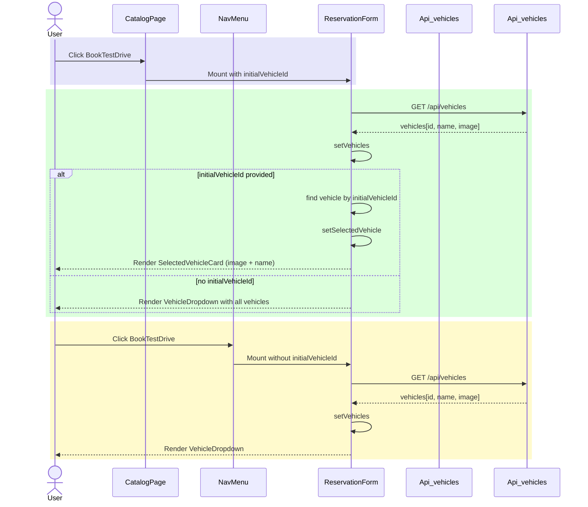
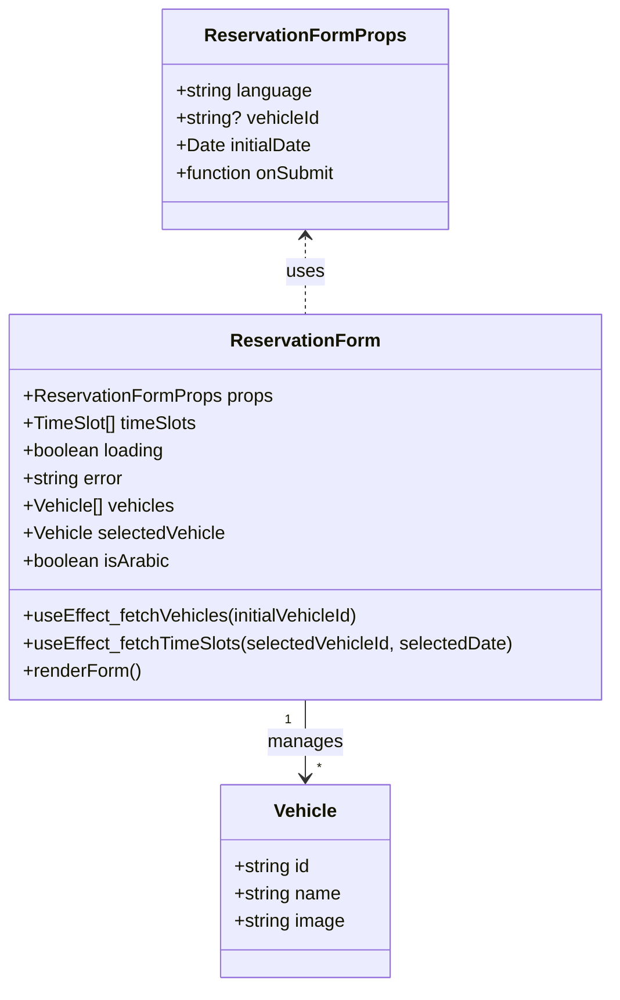

# PR #59 Review Analysis

**Generated**: 2026-01-11T21:39:15.332Z  
**Total Issues**: 11  
**Breakdown**: 2 CRITICAL, 1 HIGH, 2 MEDIUM, 6 LOW

---

## Summary

| Severity | Count | Action Required |
|----------|-------|-----------------|
| CRITICAL | 2 | Fix immediately before merge |
| HIGH | 1 | Fix if <5 min each |
| MEDIUM | 2 | Document for later |
| LOW | 6 | Optional (style/formatting) |

---

## CRITICAL Issues (2)


### 1. CodeRabbit - src/components/booking/ReservationForm.tsx:170

```
_⚠️ Potential issue_ | _🔴 Critical_

**Implement required image fallback system.**

The `CardMedia` component directly uses `selectedVehicle.image` without the established image fallback pattern. This violates project learnings and could cause image loading failures, performance issues, and infinite loops on error.


Based on learnings, vehicle images must use:
1. `getVehicleImage()` helper function
2. `srcSet` attribute for 2x/3x responsive images
3. `onError` handler to prevent infinite loops
4. Lazy loading

<details>
<summary>🖼️ Proposed fix to implement image fallback system</summary>

First, ensure the `getVehicleImage()` helper is imported (add to imports if not present):

```typescript
import { getVehicleImage } from '@/lib/utils/image';
```

Then update the CardMedia implementation:

```diff
               {selectedVehicle.image && (
                 <CardMedia
                   component="img"
                   sx={{ width: 120, height: 80, objectFit: 'cover', borderRadius: 1, mr: 2 }}
-                  image={selectedVehicle.image}
+                  image={getVehicleImage(selectedVehicle.image)}
+                  srcSet={`${getVehicleImage(selectedVehicle.image)} 1x, ${getVehicleImage(selectedVehicle.image, '2x')} 2x, ${getVehicleImage(selectedVehicle.image, '3x')} 3x`}
+                  loading="lazy"
+                  onError={(e) => {
+                    const target = e.target as HTMLImageElement;
+                    if (target.src !== getVehicleImage()) {
+                      target.src = getVehicleImage(); // fallback to default
+                    }
+                  }}
                   alt={selectedVehicle.name}
                 />
               )}
```

Note: Adjust the `getVehicleImage()` helper signature based on your actual implementation.
</details>


> Committable suggestion skipped: line range outside the PR's diff.

<details>
<summary>🤖 Prompt for AI Agents</summary>

```
In @src/components/booking/ReservationForm.tsx around lines 162 - 169, The
CardMedia currently uses selectedVehicle.image directly; replace it with the
project's image fallback pattern by importing and using
getVehicleImage(selectedVehicle) to supply image src and srcSet (2x/3x), add
loading="lazy" and an onError handler that swaps to the fallback returned by
getVehicleImage and prevents infinite loops (e.g., check current src before
replacing), and apply these props to the CardMedia component that renders the
selectedVehicle image.
```

</details>

<!-- fingerprinting:phantom:poseidon:puma -->

<!-- This is an auto-generated comment by CodeRabbit -->
```


### 2. CodeRabbit - src/components/booking/ReservationForm.tsx:82

```
_⚠️ Potential issue_ | _🔴 Critical_

**Critical: Handle case when initialVehicleId doesn't match any vehicle.**

If `initialVehicleId` is provided but no matching vehicle is found, `selectedVehicle` remains null. This creates a broken UI state where:
- Line 160: Vehicle card won't render (selectedVehicle is null)
- Line 185: Vehicle dropdown won't render (!initialVehicleId is false)

The user has no way to select a vehicle and cannot proceed with booking.


<details>
<summary>🐛 Proposed fix to handle invalid vehicle ID</summary>

```diff
         // If initialVehicleId provided, find and set the vehicle
         if (initialVehicleId) {
           const vehicle = (data.vehicles || []).find((v: any) => v.id === initialVehicleId);
           if (vehicle) {
             setSelectedVehicle(vehicle);
+          } else {
+            // Vehicle not found - clear initialVehicleId to show dropdown
+            console.warn(`Vehicle with ID ${initialVehicleId} not found`);
+            setError(
+              isArabic
+                ? 'السيارة المحددة غير متوفرة'
+                : 'Selected vehicle is not available'
+            );
           }
         }
```

Alternatively, you could clear the `vehicleId` state to allow the user to select from the dropdown, but this requires refactoring the component to use a ref or different state management since `initialVehicleId` is a prop.
</details>

<details>
<summary>🤖 Prompt for AI Agents</summary>

```
In @src/components/booking/ReservationForm.tsx around lines 75 - 82, When
initialVehicleId is provided but find(...) returns no match, ensure the
component falls back to allowing manual selection instead of leaving
selectedVehicle null and blocking the UI: inside the block that checks
initialVehicleId update state to clear any locked vehicle selection (call
setSelectedVehicle(null) if not already and also reset the vehicleId selection
state via setVehicleId('') or a similar setter) so the vehicle dropdown renders;
alternatively set a flag like allowManualVehicleSelection to true when no match
is found and use that to render the dropdown. Make the change near the existing
initialVehicleId handling (the code using initialVehicleId, selectedVehicle,
setSelectedVehicle) so the UI can recover when the provided ID is invalid.
```

</details>

<!-- fingerprinting:phantom:poseidon:puma -->

<!-- This is an auto-generated comment by CodeRabbit -->
```


---

## HIGH Issues (1)


### 1. Sourcery - src/components/booking/ReservationForm.tsx:169

```
**issue (bug_risk):** When the initialVehicleId is not found in the fetched list, users are left without any vehicle UI or a way to select one.

Because `selectedVehicle` stays null when no fetched vehicle matches `initialVehicleId`, the "Selected Vehicle" card never renders. And since the selector is hidden whenever `initialVehicleId` is truthy, the user is left with no vehicle shown and no way to pick one. You could instead render the selector when no matching vehicle is found (e.g., track a "no match" state and treat it like `initialVehicleId` was not provided).
```


---

## MEDIUM Issues (2)


### 1. SonarCloud

```
## [](https://sonarcloud.io/dashboard?id=Hex-Tech-Lab_hex-test-drive-man&pullRequest=59) **Quality Gate passed**  
Issues  
 [0 New issues](https://sonarcloud.io/project/issues?id=Hex-Tech-Lab_hex-test-drive-man&pullRequest=59&issueStatuses=OPEN,CONFIRMED&sinceLeakPeriod=true)  
 [0 Accepted issues](https://sonarcloud.io/project/issues?id=Hex-Tech-Lab_hex-test-drive-man&pullRequest=59&issueStatuses=ACCEPTED)

Measures  
 [0 Security Hotspots](https://sonarcloud.io/project/security_hotspots?id=Hex-Tech-Lab_hex-test-drive-man&pullRequest=59&issueStatuses=OPEN,CONFIRMED&sinceLeakPeriod=true)  
 [0.0% Coverage on New Code](https://sonarcloud.io/component_measures?id=Hex-Tech-Lab_hex-test-drive-man&pullRequest=59&metric=new_coverage&view=list)  
 [0.0% Duplication on New Code](https://sonarcloud.io/component_measures?id=Hex-Tech-Lab_hex-test-drive-man&pullRequest=59&metric=new_duplicated_lines_density&view=list)  
  
[See analysis details on SonarQube Cloud](https://sonarcloud.io/dashboard?id=Hex-Tech-Lab_hex-test-drive-man&pullRequest=59)


```


### 2. CodeRabbit - src/components/booking/ReservationForm.tsx:63

```
_🧹 Nitpick_ | _🔵 Trivial_

**Consider extracting vehicle type to an interface.**

The inline type definition `{ id: string; name: string; image?: string }` is repeated for both `vehicles` and `selectedVehicle`. Extracting to an interface improves type safety and maintainability.


<details>
<summary>♻️ Proposed refactor to extract vehicle type</summary>

```diff
+interface VehicleOption {
+  id: string;
+  name: string;
+  image?: string;
+}
+
-  const [vehicles, setVehicles] = useState<Array<{ id: string; name: string; image?: string }>>([]);
-  const [selectedVehicle, setSelectedVehicle] = useState<{ id: string; name: string; image?: string } | null>(null);
+  const [vehicles, setVehicles] = useState<VehicleOption[]>([]);
+  const [selectedVehicle, setSelectedVehicle] = useState<VehicleOption | null>(null);
```
</details>

As per coding guidelines: prefer interface over type for defining object shapes in TypeScript.

<!-- suggestion_start -->

<details>
<summary>📝 Committable suggestion</summary>

> ‼️ **IMPORTANT**
> Carefully review the code before committing. Ensure that it accurately replaces the highlighted code, contains no missing lines, and has no issues with indentation. Thoroughly test & benchmark the code to ensure it meets the requirements.

```suggestion
  interface VehicleOption {
    id: string;
    name: string;
    image?: string;
  }

  const [vehicles, setVehicles] = useState<VehicleOption[]>([]);
  const [selectedVehicle, setSelectedVehicle] = useState<VehicleOption | null>(null);
```

</details>

<!-- suggestion_end -->

<details>
<summary>🤖 Prompt for AI Agents</summary>

```
In @src/components/booking/ReservationForm.tsx around lines 62 - 63, The
repeated inline object type used for vehicles and selectedVehicle should be
extracted into a shared interface to improve reuse and maintainability: create
an interface (e.g., Vehicle) describing { id: string; name: string; image?:
string } and replace the inline types in the useState calls for vehicles
(useState<Array<...>>) and selectedVehicle (useState<... | null>) with the new
interface; update any other occurrences that use the same shape to reference
Vehicle, following the project guideline to prefer interface over inline types.
```

</details>

<!-- fingerprinting:phantom:poseidon:puma -->

<!-- This is an auto-generated comment by CodeRabbit -->
```


---

## LOW Issues (6)


### 1. Sourcery

```
<!-- Generated by sourcery-ai[bot]: start review_guide -->

## Reviewer's Guide

Updates the ReservationForm to hide the vehicle dropdown when a vehicle is pre-selected, instead showing a card with the selected vehicle’s image and name populated from the vehicles API, while preserving the dropdown for bookings without an initial vehicle context.

#### Sequence diagram for ReservationForm behavior with and without initialVehicleId



#### Updated class diagram for ReservationForm component state and props



### File-Level Changes

| Change | Details | Files |
| ------ | ------- | ----- |
| Add support for selected vehicle details including optional image fetched from the vehicles API. | <ul><li>Extend vehicles state items to include an optional image field in addition to id and name.</li><li>Introduce selectedVehicle state to hold the currently chosen vehicle’s full details.</li><li>After fetching vehicles, if an initial vehicle ID is provided, locate the matching vehicle in the response and set it as selectedVehicle.</li><li>Update the vehicles-fetching effect dependency to react to changes in the initial vehicle ID.</li></ul> | `src/components/booking/ReservationForm.tsx` |
| Conditionally render either a selected vehicle card or the vehicle dropdown based on whether a vehicle is pre-selected. | <ul><li>Render a Card showing the selected vehicle’s image (if available), label text (localized), and name with an icon when initialVehicleId and selectedVehicle are present.</li><li>Restrict the vehicle dropdown to only render when there is no initialVehicleId and vehicles have been loaded.</li><li>Clarify component documentation comments to describe the new behavior when a vehicleId is provided.</li><li>Update the file header metadata to record the new change.</li></ul> | `src/components/booking/ReservationForm.tsx` |

---

<details>
<summary>Tips and commands</summary>

#### Interacting with Sourcery

- **Trigger a new review:** Comment `@sourcery-ai review` on the pull request.
- **Continue discussions:** Reply directly to Sourcery's review comments.
- **Generate a GitHub issue from a review comment:** Ask Sourcery to create an
  issue from a review comment by replying to it. You can also reply to a
  review comment with `@sourcery-ai issue` to create an issue from it.
- **Generate a pull request title:** Write `@sourcery-ai` anywhere in the pull
  request title to generate a title at any time. You can also comment
  `@sourcery-ai title` on the pull request to (re-)generate the title at any time.
- **Generate a pull request summary:** Write `@sourcery-ai summary` anywhere in
  the pull request body to generate a PR summary at any time exactly where you
  want it. You can also comment `@sourcery-ai summary` on the pull request to
  (re-)generate the summary at any time.
- **Generate reviewer's guide:** Comment `@sourcery-ai guide` on the pull
  request to (re-)generate the reviewer's guide at any time.
- **Resolve all Sourcery comments:** Comment `@sourcery-ai resolve` on the
  pull request to resolve all Sourcery comments. Useful if you've already
  addressed all the comments and don't want to see them anymore.
- **Dismiss all Sourcery reviews:** Comment `@sourcery-ai dismiss` on the pull
  request to dismiss all existing Sourcery reviews. Especially useful if you
  want to start fresh with a new review - don't forget to comment
  `@sourcery-ai review` to trigger a new review!

#### Customizing Your Experience

Access your [dashboard](https://app.sourcery.ai) to:
- Enable or disable review features such as the Sourcery-generated pull request
  summary, the reviewer's guide, and others.
- Change the review language.
- Add, remove or edit custom review instructions.
- Adjust other review settings.

#### Getting Help

- [Contact our support team](mailto:support@sourcery.ai) for questions or feedback.
- Visit our [documentation](https://docs.sourcery.ai) for detailed guides and information.
- Keep in touch with the Sourcery team by following us on [X/Twitter](https://x.com/SourceryAI), [LinkedIn](https://www.linkedin.com/company/sourcery-ai/) or [GitHub](https://github.com/sourcery-ai).

</details>

<!-- Generated by sourcery-ai[bot]: end review_guide -->
```


### 2. CodeRabbit

```
<!-- This is an auto-generated comment: summarize by coderabbit.ai -->
<!-- walkthrough_start -->

## Walkthrough

The ReservationForm now supports displaying a pre-selected vehicle (with optional image) when a `vehicleId` prop is provided. Vehicles are fetched on mount, `selectedVehicle` is set when the initial id exists, and the component conditionally renders a vehicle Card with image or the existing dropdown selector.

## Changes

| Cohort / File(s) | Summary |
|---|---|
| **Vehicle Selection UI Enhancement** <br> `src/components/booking/ReservationForm.tsx` | Add optional `image` to vehicle items and `selectedVehicle` state. Fetch vehicles on mount and pre-select when `vehicleId` (internally `initialVehicleId`) is provided. Render a `Card` with `CardMedia` and localized "Selected Vehicle" label when pre-selected; otherwise show the vehicle dropdown selector. Minor Arabic localization text added. |

## Estimated code review effort

🎯 3 (Moderate) | ⏱️ ~20 minutes

<!-- walkthrough_end -->


<!-- pre_merge_checks_walkthrough_start -->

<details>
<summary>🚥 Pre-merge checks | ✅ 3</summary>

<details>
<summary>✅ Passed checks (3 passed)</summary>

|     Check name     | Status   | Explanation                                                                                                                                                  |
| :----------------: | :------- | :----------------------------------------------------------------------------------------------------------------------------------------------------------- |
|  Description Check | ✅ Passed | Check skipped - CodeRabbit’s high-level summary is enabled.                                                                                                  |
|     Title check    | ✅ Passed | The title accurately summarizes the main changes: hiding the vehicle dropdown when a vehicle is pre-selected and adding vehicle image display functionality. |
| Docstring Coverage | ✅ Passed | Docstring coverage is 100.00% which is sufficient. The required threshold is 80.00%.                                                                         |

</details>

<sub>✏️ Tip: You can configure your own custom pre-merge checks in the settings.</sub>

</details>

<!-- pre_merge_checks_walkthrough_end -->

<!-- finishing_touch_checkbox_start -->

<details>
<summary>✨ Finishing touches</summary>

- [ ] <!-- {"checkboxId": "7962f53c-55bc-4827-bfbf-6a18da830691"} --> 📝 Generate docstrings
<details>
<summary>🧪 Generate unit tests (beta)</summary>

- [ ] <!-- {"checkboxId": "f47ac10b-58cc-4372-a567-0e02b2c3d479", "radioGroupId": "utg-output-choice-group-unknown_comment_id"} -->   Create PR with unit tests
- [ ] <!-- {"checkboxId": "07f1e7d6-8a8e-4e23-9900-8731c2c87f58", "radioGroupId": "utg-output-choice-group-unknown_comment_id"} -->   Post copyable unit tests in a comment
- [ ] <!-- {"checkboxId": "6ba7b810-9dad-11d1-80b4-00c04fd430c8", "radioGroupId": "utg-output-choice-group-unknown_comment_id"} -->   Commit unit tests in branch `kwsl/fix-booking-dropdown-with-image`

</details>

</details>

<!-- finishing_touch_checkbox_end -->

<!-- tips_start -->

---

Thanks for using [CodeRabbit](https://coderabbit.ai?utm_source=oss&utm_medium=github&utm_campaign=Hex-Tech-Lab/hex-test-drive-man&utm_content=59)! It's free for OSS, and your support helps us grow. If you like it, consider giving us a shout-out.

<details>
<summary>❤️ Share</summary>

- [X](https://twitter.com/intent/tweet?text=I%20just%20used%20%40coderabbitai%20for%20my%20code%20review%2C%20and%20it%27s%20fantastic%21%20It%27s%20free%20for%20OSS%20and%20offers%20a%20free%20trial%20for%20the%20proprietary%20code.%20Check%20it%20out%3A&url=https%3A//coderabbit.ai)
- [Mastodon](https://mastodon.social/share?text=I%20just%20used%20%40coderabbitai%20for%20my%20code%20review%2C%20and%20it%27s%20fantastic%21%20It%27s%20free%20for%20OSS%20and%20offers%20a%20free%20trial%20for%20the%20proprietary%20code.%20Check%20it%20out%3A%20https%3A%2F%2Fcoderabbit.ai)
- [Reddit](https://www.reddit.com/submit?title=Great%20tool%20for%20code%20review%20-%20CodeRabbit&text=I%20just%20used%20CodeRabbit%20for%20my%20code%20review%2C%20and%20it%27s%20fantastic%21%20It%27s%20free%20for%20OSS%20and%20offers%20a%20free%20trial%20for%20proprietary%20code.%20Check%20it%20out%3A%20https%3A//coderabbit.ai)
- [LinkedIn](https://www.linkedin.com/sharing/share-offsite/?url=https%3A%2F%2Fcoderabbit.ai&mini=true&title=Great%20tool%20for%20code%20review%20-%20CodeRabbit&summary=I%20just%20used%20CodeRabbit%20for%20my%20code%20review%2C%20and%20it%27s%20fantastic%21%20It%27s%20free%20for%20OSS%20and%20offers%20a%20free%20trial%20for%20proprietary%20code)

</details>

<sub>Comment `@coderabbitai help` to get the list of available commands and usage tips.</sub>

<!-- tips_end -->

<!-- internal state start -->


<!-- DwQgtGAEAqAWCWBnSTIEMB26CuAXA9mAOYCmGJATmriQCaQDG+Ats2bgFyQAOFk+AIwBWJBrngA3EsgEBPRvlqU0AgfFwA6NPEgQAfACgjoCEYDEZyAAUASpETZWaCrKPR1AGxJcAZvAAeABQC+PgA1vAYRACUXAhKkLQU+Ny0+ADuWOmwZJBSCAxePBQkYIgkXmJ0kADU6LT08MxopJCBtpBmAKwAnNGQkAYAquUUXNCisAASstwkABpWkAA+kADK+NgUDN6QYemIHgD0fv5gIeGRRGBJKWmZYOnqsGBNLSSQgEmEMM6knJDNSIrda4ajYRBcFK5VYAYRK1DoXAATAAGJEANjAKIAjFietBsdiOEiiaiAFoDYY2AAycVwuG4EKORyIz2wAg0TGYRymJDOEwYL2pKiOOTONEQuBuFEkpWaGCO3GwHmOvTcCGQHVO0nQkAE2CIkGylA+uBykBKowk1Hg+CwPnwFGY9lgGWqaESyVSGSyz3QKryJAKXmQgQAfl0USiav0SFIsjksGaPhcIlFID4PBkjWhkJF1PAEfQfMlnR7EHMGPA/AxA8GPtx3hpIAB1RPoLD58RoDwANSD8EKJAAkvReCkUMhxxJ4EpaAAaSDJjOO50YbPxHXL/KDoq3b2ZDv0WhIbgeNCyZAendDlDNVoMZz0RCup7p5flSo0eg3ryATAJkAwNA2CPHhXQIZs4A+fd7iwEpAQwK9rXgc8BCKY0sFTK5J3sUEKG/I1nk2XA613D4mAwGh/BIwISA0IgNEXEsWCXc0gJnIgbTtAEyGwaJIPNJozxINhKK4+0SFwQUdV/aDJO0Dw8wwQpsBPdM3lIZBmOdI40G4eAjlkxBFzQBpkE/URv37etcIREyMHoCiT3EO0ew8eQSgcyhkBIZ5KFY6CvVg/g+G3Adb0fChaGbXskGwHtGFgTBSC4AQSAdEpIEAFAJPTuH1CLNSBI2jRhnGQDD+DmDBsO03VZJ4d4AG50B8Gg+ByyLn1fbCPwqSzqnqjSPkweggLYRd11yg8MEg6RcAhPVQjTQ1avqx9QSzQ0XwyZA1qfUDJpgn1mqw9NavYl0dozZUPCm2DmsG+8PizUzkCYCgSjEdzmolAigQAUSiDwkFgUCAEEqDUBhmwAMRQnVBWSxF7G2I4uW4O12EQI5TqII4bGkShrRcjAYdXDR5v8NoagAFgAZkgI5dC6foctMud7D6qpaGssjbJoRcYX29HMcogrQaGxJT3PWR7Mcu1nNtIDbs8pQZSiZsCfPb9fACHVwUoMASgx/Dqlxu78v1Q1Al+znEEQJXIFRDEsVxFE+ma9GvFE+bIAAIT9gByN7nBIphsEo/zTmay18A8KRkDMABtYc1jWIZ/oAfQAOSGABZP3/psABdDRzEsIZUiLfhhEs2VzMcZoXHL6w7AcJxm4MdxcC8XWglx2JIE3C3Dwq+reFKCzudqepGieyls8cNKxiKnpsqH+lGQ4ZlWTNdlORYHk+TAAUhRFMUwF+6VZTAeVFRuo5ekpEZKHGSYZjmRZgQ2LYdi4fZDgnACOcJaVxpR5QeE8M0rx57fGgL8SSXAELf1BLgcEkIqrAjhCQIsyI0SYhxHiAkpJSQojJEYAAItIBgMpuAkw4AYKAVhkhoRElwP2oCzqrkugcXUR1R5+jcpACMUZSJDnKu2KE5Biyll1BWUQ1ZBxiKKI2VotF6KMUgNnJAiBMDrAjhgWQ/RIiShwfQfAPgh52kdD1c0E8yhcwIrJMuUAYRJSiNIBhAwoBTFnB8eq/CEy5C7IWPs4UvCjmKBOVA04/HRQMN4yAYMGh1XCR8SWnVWLUClhWGWyBepfgGmkgCkAxrDQcmBfAEEEm6HWK+EeWA7TuSNO2c2qBJSh2qFA10eBlHkTtFRGidEGJMVkRdUSfEy6JJhpJQUfTEjyRQqGSIKk1KGiGv0Wqul9KGTSfk/APAUjKgRAFUqUUpm1OSRzKeVk0n8xIJ7BWBZXIqzIGrbCaVcDpBILkQJoE9rnMYZAWKDgew4yDGgGcjoEqIw8RCGpUA/bpUdLsP53SipRjqJFCRuQpHVFqteO5qi6IIqSa1V+ZyuoZGwjcopNlJYjVKcBB5pSDlovbCEnsvMhyRJiZadgLiYBzSuF42p/YZR+DNpwlasi9obXwFtV8u07mZMZYdIKPoLlQHFYoqVlx0wdNNjIliF1tq8J8DdBpWrgWUF1T+O5ksXq0EQD9Oa1QAZAxBuDSGg5BVwxDIlJGtBRVQEQKjEW5BKLY1xvjQmFBiZKzJk6CmiAqaBFpgzJmYAWZcHZtUWlPM7kdIFpAIWUUFDMAxpGkiGU7zvEXE5Z5ysLRvNtRrIFWtcGQDhv4fWowjYkBNgRc2fyrZtFtuUe2jtnYELdn0TW0g44J06CnNOGcc750LiXMuBgLClpYMwdQPF7bvAbh3VwQK0gMAWp9R0HNaDxVuqcO2DtuJMCkOrQ0Aczlh02JHPgjKADSLY1jUkWvqw0gTHmVq8ARKwRcYYAHkbB5zBtnGEWdqSIYAOKQHYC4QVpxgjSsHjQgsj5bqwtaAQSABtIB/G5RE+eOQPBzD4ECAmVpxJJuYCmqmZbaB5zoIWNoQlHQEVqgAASOMDAQRwhq8lY5QfoNHYkJElj4NyAg0AMDCKBSF+BZwoAwH4aqNBIBZhSNjNjGV5Q7Hk09MATrsI6OwNIZsftsAoWDdYMGacd36GMOAKAbz+CWLQHgQgpByBUAIlyH2XBeA1xEGIeuep5BMDVioNQmhtC6DAIYEwUA4CoFQHoiLBBiBkGUHFg97AuBUHSPYRuzh5ByAUFl1Q6gtA6EC0F0wBgw0MDRiwKtWMcbStjVxkmPG+MMIAESLd3ZYMGw4qsxeru3Ju8gLGBrhUYKAVzlX0vng4bgQ7QL2ILWAAJ0sLwtNyIS+skTxzcBwmpgaInXuIGbMOSiyQH07HMo4ugjGPjFvKfQVW3ldQCfFpVEmCUGUVLKcZ0xpkwunICRqw8QIzTZMfOUQV/1qJvOO3zWg1ByxJTmEuA5KyPCqXKQjpWSP56So8LQB6ez7msqa7gWYXS/SzgmsyxcQ0AD8frZk5HJ+Io8i4KqcrCc9xoU5+WUUXFdxx+TzTvUtFWtZ8ygQQ7aAWsH/EgXuDYGULMNaZfYXgtoRCS54DVBo2tdxmlFz6hIsrsHkT3G0GBumdcTXIiZjc8pHUyuW1eU/elnhtiGwlAcYU+1NlOqCoJmeHTOolCaeVCRbHEDfSFQ9Nr9P8yTy5Pu2PNJvL1f4BnHOZqVScgUCeOUH3EKoV8CdyYunce1apJsjcx0gqjulv2oygTQmTwejE/hK8FT9fSEN9hIYw4ATODCNgN7tblyV/6hnind3ZDNWYM3/POO4KtoT2lBAFSPTkCa42kmgq/u4AB9gIHxmCxcoN60BgBoDpDOAfDQ6fpcBmpXjrAg70Bg6UoPadhmahIB5q6cy4DNSbi67g6OKOjGZZIkSIA7BAQyj4CCp5yRAEHnhRDxSkAgFgGZSDK0ZVwShD5nYXY1656yDYSAA4BGsPATavWIALgEFmKgFQoEfBgA5GCAAiYIAMxggAUmDSGACMYIAJRgkAchgAomCAB0YIAFRgqhahYhQIEMKgvqQKVg7IwMtYDsRAQEaCloXA2cByVGpoByy4nGRM3G3CEa7AJSfIQ6+a8AdhYImUBB6gU4VhSikQbUmmOwAkKeE4skjeuEKEt0OmOwdCdAPuvSy4mW6S/6yszSPYhYk6KAJENG/uQBzUk0fIbUzaYMVg2+rhOEAR+A5Q8SUA2cJA4ehRCUpujKkBHyVAyksuiQBy64JEPYbUeG/ggR9AAucwMgJAsgCsxm9RCUlOoILoekHwgQeac87wGYbunOQ+g0NAzAK+9AL+PRnM6eiBEOluy2gwzxYMHgbU4k+ypySghQzgnxmObRRqIUPAURtY7ABY0gB21goJ9gwR9hWwHwEcrhPmnh8a3hToFaY2lE/hcx4mQRIRDhEBIkzuuB9gzKNRBydRlADRTRe2rQqAbRHRgqlhaE0R/6cRuwqJCadoPGzCVmLaCEyASJXu1QgQyRtAEu0B3+VwbeGAaw7Ih6WB4hdB7wEuluXRBy7e/kgJ3498rJtYPx54sWSs5UJoAIigdqhBHoYB8g+OYcIpuB8AfAth8Jlov2fRt0puixOo3ymUVJXk9AYpDq7OJxtA/QvurKJEOpdAO6ecmA1Yc0Rg1IkQCMIpPmtMNMRw2aRg/0kobwtWCQJQM4tx6UGU/w8+8AjgBgi282B2BW/WIWFSu2FWUW1WsW1Q8W9WFooBzW56ie+RkMOWPW+WhWwWFaipmcs4iAmcRZbu3ytAmchqJEfWRWiQAgXQtA2IaA6ISIJAAA7HOAABzYgkAki0Drl7nYh7nrnYjog7k9B0wCBIh0yoi0B7keiBarmHk+Cog+B/k9C0A0w9B7k0wogkAog0wMDohoA4LpSAU+BdACA+B7kMDvmwXuz0CfljlohIhdBdB0ynl0w9DbkIUIW0A9DoiPn4V0znkMCoUoXYhdAwUMA9A+AAUjkNnjnqCTnOozlxhzl0CZyhZYUQDFAkCZxsAUCkCZzSS6bTlLkcUGAADeNS82SAtgfsWYumdAMIdWlEVg7R3482vgPY3eql20yotAml+AumtgxlGYplJA84qlSAiGH6MoDQZA9lmmikTlqlJ4tANgEcFCNlaw0pUQiAbiogYQ9l3+bmzlAw82AVQVGA3cXgUVumsVFA8V/ls4KVVCJBtCJMGVMVJlvlCVkA82IeYQdAw49sbmiAYVFA9li2FVVVuYuAJVnGReiA9lScNSAwKlAww1lVslYQ2czKLVBVZGdCjsJV82FVI182xa4IWVOVI1iVARtB4kLVJV9gEQ521QriigJANg2W6gJSCARALwXgUgnpLWLgrRQErC0UC1A1w182V+SgLVTB1UUQb1G1lVNirIysJVE1bALVSghV8As1dotZI1AAvotZAENRtfNmNeDSQC1WleRDkJlcjYlStb1VwHFX5YDfNltZgDtVwPNlBK7j3MNHRVsAiM0lts4PAAAF5bjmjIKuELTxDJ7V637IGj58x8qTxCGMrszYSPRHHcEyzXTKSI7AwC4aAA1o1fVY002/VXDq1LW3ombBEIneWOUE1A0ygg09hg2TU03iAM3w3DVI3vWo1LUY022VUhXXrhWGi6UfrvB60fVE1rVk1o2U32FKxTU2WSgJ7vrKD0nIDYhRgaBRgACkLSg4EsDcf5g4bulECRLaAAjl5iUAsbAJaK6KcagIeSiMnSiCnWrWbZ9SdT9c4H9UQAHYlcDZEFbXjeNe7UlVHd7b1e9QjTUsXG1eeJKLYNNUVRHTTXhXuV0NiAIDTEvSvSRSiIBTTCQFuYveediAwDTAIHRQwLQD4EhWgD4DTHuSBXuX+VeT8jTNiD0D0LeeiCiOiDTA0JRWgOre1VPTYDjS1SQIebhdeaA10D4IeeiLQJ/QILQAwFuT0NvWgLhXRT0CiIefhWgC+V0KiDBbuSiMVNiKiDTEiMhYSE/VfdiIeV/X/VetHVcL7XHSOB6WFQiPZS7ZVUNiNpWqLPNBNhBlNl4TNuTJTJw+9YlQQBtDDEiSTMTZANiI3RakrSaS2M8J7YwxFfZdiCPTUqPaPQYKuRPBJZQNJWNdOcJQVkAA= -->

<!-- internal state end -->
```


### 3. Sourcery - src/components/booking/ReservationForm.tsx:82

```
**suggestion:** Avoid using `any` for the vehicle type in the `find` call and reuse the existing vehicle type instead.

Since `vehicles` is already typed as `{ id: string; name: string; image?: string }`, use that type instead of `(v: any)`—either by inferring from `data.vehicles` or reusing the same type alias. This preserves type safety and lets TypeScript catch future changes to the vehicle shape.

```suggestion
        // If initialVehicleId provided, find and set the vehicle
        if (initialVehicleId) {
          const vehicle = (data.vehicles || []).find(
            (v: { id: string; name: string; image?: string }) => v.id === initialVehicleId
          );
          if (vehicle) {
            setSelectedVehicle(vehicle);
          }
        }
```
```


### 4. CodeRabbit - src/components/booking/ReservationForm.tsx:185

```
_⚠️ Potential issue_ | _🟠 Major_

**Handle case when pre-selected vehicle is not found.**

If `initialVehicleId` is provided but the vehicle is not found in the API response, neither the vehicle card nor the dropdown will render, leaving users unable to proceed.


<details>
<summary>🛡️ Proposed fix to add error handling</summary>

Add state to track if vehicle fetch failed:

```diff
   const [selectedVehicle, setSelectedVehicle] = useState<{ id: string; name: string; image?: string } | null>(null);
+  const [vehicleNotFound, setVehicleNotFound] = useState(false);
```

Update the vehicle fetch logic:

```diff
         // If initialVehicleId provided, find and set the vehicle
         if (initialVehicleId) {
           const vehicle = (data.vehicles || []).find((v: any) => v.id === initialVehicleId);
           if (vehicle) {
             setSelectedVehicle(vehicle);
+          } else {
+            setVehicleNotFound(true);
           }
         }
```

Add error message in JSX before the vehicle card:

```diff
         )}

+        {/* Vehicle not found error */}
+        {initialVehicleId && vehicleNotFound && (
+          <Alert severity="warning" sx={{ mb: 2 }}>
+            {isArabic 
+              ? 'السيارة المحددة غير متاحة. يرجى اختيار سيارة أخرى.' 
+              : 'Selected vehicle not available. Please choose another vehicle.'}
+          </Alert>
+        )}
+
         {/* Vehicle Image + Name (when pre-selected from catalog) */}
```

Update dropdown condition to show when vehicle not found:

```diff
-        {!initialVehicleId && vehicles.length > 0 && (
+        {(!initialVehicleId || vehicleNotFound) && vehicles.length > 0 && (
```
</details>


> Committable suggestion skipped: line range outside the PR's diff.

<!-- fingerprinting:phantom:poseidon:puma -->

<!-- This is an auto-generated comment by CodeRabbit -->
```


### 5. CodeRabbit - src/components/booking/ReservationForm.tsx:182

```
_⚠️ Potential issue_ | _🟡 Minor_

<details>
<summary>🧩 Analysis chain</summary>

🏁 Script executed:

```shell
# Find getVehicleImage helper function
rg -t ts -t tsx "export.*getVehicleImage|function\s+getVehicleImage" -A 15
```

Repository: Hex-Tech-Lab/hex-test-drive-man

Length of output: 102

---

🏁 Script executed:

```shell
# Search for how getVehicleImage is currently used in codebase
rg -t ts -t tsx "getVehicleImage" -B 2 -A 2
```

Repository: Hex-Tech-Lab/hex-test-drive-man

Length of output: 102

---

🏁 Script executed:

```shell
# Check the ReservationForm.tsx file in full to understand the context
wc -l src/components/booking/ReservationForm.tsx
```

Repository: Hex-Tech-Lab/hex-test-drive-man

Length of output: 121

---

🏁 Script executed:

```shell
# Find getVehicleImage without type restriction
rg "export.*getVehicleImage|function\s+getVehicleImage" -A 15
```

Repository: Hex-Tech-Lab/hex-test-drive-man

Length of output: 2141

---

🏁 Script executed:

```shell
# View the ReservationForm.tsx around the flagged lines
sed -n '150,190p' src/components/booking/ReservationForm.tsx
```

Repository: Hex-Tech-Lab/hex-test-drive-man

Length of output: 1720

---

🏁 Script executed:

```shell
# Search for existing onError patterns in components
rg "onError.*=>" --max-count 10 -B 2 -A 4
```

Repository: Hex-Tech-Lab/hex-test-drive-man

Length of output: 1564

---

🏁 Script executed:

```shell
# Check the line lengths in proposed onError handler
python3 << 'EOF'
lines = [
'                onError={(e) => {',
'                  const img = e.currentTarget;',
'                  if (img.dataset.fallbackApplied) return;',
'                  img.dataset.fallbackApplied = \'1\';',
'                  img.src = getVehicleImage(null);',
'                }}',
]
for i, line in enumerate(lines, 1):
    # Count actual characters (not indentation spaces count as per guidelines)
    content = line.rstrip()
    print(f"Line {i}: {len(content)} chars | {content}")
EOF
```

Repository: Hex-Tech-Lab/hex-test-drive-man

Length of output: 161

---

🏁 Script executed:

```shell
# Check PLACEHOLDER_IMAGE constant definition
rg "PLACEHOLDER_IMAGE\s*=" -A 2 src/lib/imageHelper.ts
```

Repository: Hex-Tech-Lab/hex-test-drive-man

Length of output: 290

---

🏁 Script executed:

```shell
# View full imageHelper.ts to understand all image helpers
cat -n src/lib/imageHelper.ts | head -50
```

Repository: Hex-Tech-Lab/hex-test-drive-man

Length of output: 2352

---


</details>

**Add onError fallback and always render the image element to prevent gaps in the "Selected Vehicle" card.**

The card currently hides the image area when `selectedVehicle.image` is missing or falsy. Removing the conditional is safe because `getVehicleImage()` handles null/undefined by returning the placeholder image (`/images/vehicles/hero/placeholder.webp`). However, the proposed `onError` handler is missing the TypeScript type annotation required by strict mode. Use `React.SyntheticEvent<HTMLImageElement>` to match the existing pattern in `VehicleCard.tsx` and `compare/page.tsx`. Also, align the fallback detection with the established codebase pattern: check `if (!img.src.includes('/images/vehicles/hero/placeholder'))` rather than using a dataset flag, for consistency.

<details>
<summary>Corrected approach</summary>

```diff
              <CardMedia
                component="img"
                sx={{
                  width: 120,
                  height: 80,
                  objectFit: 'cover',
                  objectPosition: 'center',
                  borderRadius: 1,
                  mr: 2,
                }}
                image={getVehicleImage(selectedVehicle.image)}
                alt={selectedVehicle.name}
                onError={(e: React.SyntheticEvent<HTMLImageElement>) => {
                  const img = e.currentTarget;
                  if (!img.src.includes('/images/vehicles/hero/placeholder')) {
                    img.src = getVehicleImage(null);
                  }
                }}
              />
```
</details>

<details>
<summary>🤖 Prompt for AI Agents</summary>

```
In @src/components/booking/ReservationForm.tsx around lines 159 - 182, The
Selected Vehicle card conditionally omits the image when selectedVehicle.image
is falsy, causing layout gaps; always render the img using
getVehicleImage(selectedVehicle.image) and add an onError handler typed as
React.SyntheticEvent<HTMLImageElement> (matching VehicleCard.tsx and
compare/page.tsx) that replaces the broken src with the placeholder only if the
current src does not already include '/images/vehicles/hero/placeholder' to
avoid infinite loops; remove the conditional around the CardMedia and implement
this typed onError fallback.
```

</details>

<!-- This is an auto-generated comment by CodeRabbit -->
```


### 6. CodeRabbit - src/components/booking/ReservationForm.tsx:78

```
_⚠️ Potential issue_ | _🟠 Major_

**Remove `any` type and use proper typing.**

Using `any` type without justification violates coding guidelines. The vehicle parameter type can be inferred from the vehicles array or properly typed.


<details>
<summary>🔧 Proposed fix</summary>

```diff
-          const vehicle = (data.vehicles || []).find((v: any) => v.id === initialVehicleId);
+          const vehicle = (data.vehicles || []).find(
+            (v: { id: string; name: string; image?: string }) => v.id === initialVehicleId
+          );
```

Even better with the extracted interface from the previous comment:

```diff
-          const vehicle = (data.vehicles || []).find((v: any) => v.id === initialVehicleId);
+          const vehicle = (data.vehicles || []).find((v: VehicleOption) => v.id === initialVehicleId);
```
</details>

As per coding guidelines: Never use @ts-ignore (or `any`) without documented justification.

<!-- suggestion_start -->

<details>
<summary>📝 Committable suggestion</summary>

> ‼️ **IMPORTANT**
> Carefully review the code before committing. Ensure that it accurately replaces the highlighted code, contains no missing lines, and has no issues with indentation. Thoroughly test & benchmark the code to ensure it meets the requirements.

```suggestion
          const vehicle = (data.vehicles || []).find(
            (v: { id: string; name: string; image?: string }) => v.id === initialVehicleId
          );
```

</details>

<!-- suggestion_end -->

<details>
<summary>🤖 Prompt for AI Agents</summary>

```
In @src/components/booking/ReservationForm.tsx at line 78, The line declaring
vehicle uses an untyped parameter "(v: any)" — replace the any by the real
vehicle type (e.g., Vehicle) or infer it from the vehicles array type so
TypeScript knows the element shape; update the vehicles collection typing
(data.vehicles: Vehicle[] or similar) or extract an interface (Vehicle) used
across the component, then change the find callback to (v: Vehicle) => v.id ===
initialVehicleId (or use typeof data.vehicles[number]) so the value of vehicle
is properly typed and no any/@ts-ignore remains.
```

</details>

<!-- fingerprinting:phantom:poseidon:puma -->

<!-- This is an auto-generated comment by CodeRabbit -->
```


---

## Next Steps

1. **Fix CRITICAL issues** (2 found) - Block merge until resolved
2. **Fix HIGH issues** (1 found) - Fix if <5 min each, otherwise document
3. **Document MEDIUM/LOW** (8 found) - Create follow-up issues

**Generated by**: `pnpm run pr:scrape 59`
