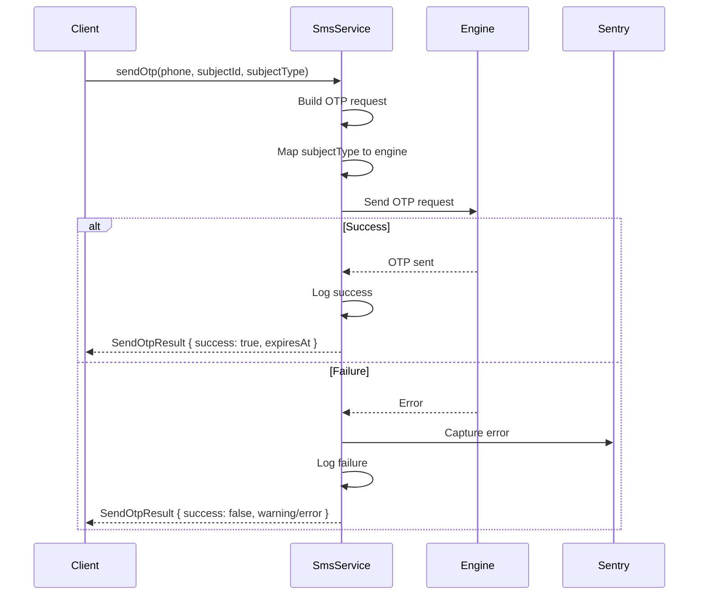
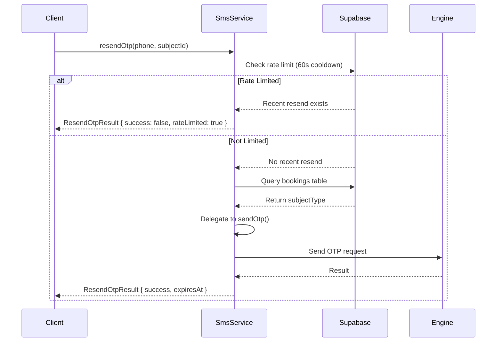
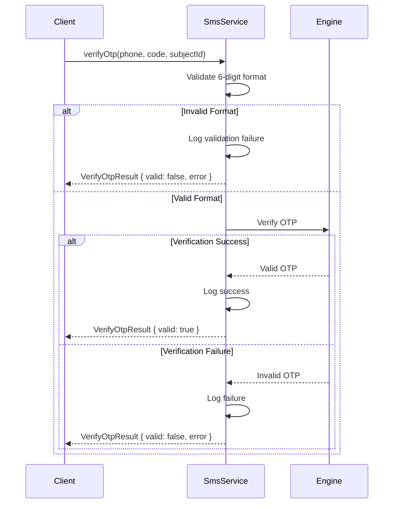

# PR #61 Review Analysis

**Generated**: 2026-01-09T19:01:18.109Z  
**Total Issues**: 5  
**Breakdown**: 2 CRITICAL, 1 HIGH, 0 MEDIUM, 2 LOW

---

## Summary

| Severity | Count | Action Required |
|----------|-------|-----------------|
| CRITICAL | 2 | Fix immediately before merge |
| HIGH | 1 | Fix if <5 min each |
| MEDIUM | 0 | Document for later |
| LOW | 2 | Optional (style/formatting) |

---

## CRITICAL Issues (2)


### 1. SonarCloud

```
## [](https://sonarcloud.io/dashboard?id=Hex-Tech-Lab_hex-test-drive-man&pullRequest=61) **Quality Gate passed**  
Issues  
 [0 New issues](https://sonarcloud.io/project/issues?id=Hex-Tech-Lab_hex-test-drive-man&pullRequest=61&issueStatuses=OPEN,CONFIRMED&sinceLeakPeriod=true)  
 [0 Accepted issues](https://sonarcloud.io/project/issues?id=Hex-Tech-Lab_hex-test-drive-man&pullRequest=61&issueStatuses=ACCEPTED)

Measures  
 [0 Security Hotspots](https://sonarcloud.io/project/security_hotspots?id=Hex-Tech-Lab_hex-test-drive-man&pullRequest=61&issueStatuses=OPEN,CONFIRMED&sinceLeakPeriod=true)  
 [0.0% Coverage on New Code](https://sonarcloud.io/component_measures?id=Hex-Tech-Lab_hex-test-drive-man&pullRequest=61&metric=new_coverage&view=list)  
 [0.0% Duplication on New Code](https://sonarcloud.io/component_measures?id=Hex-Tech-Lab_hex-test-drive-man&pullRequest=61&metric=new_duplicated_lines_density&view=list)  
  
[See analysis details on SonarQube Cloud](https://sonarcloud.io/dashboard?id=Hex-Tech-Lab_hex-test-drive-man&pullRequest=61)


```


### 2. CodeRabbit - src/services/SmsService.ts:63

```
_⚠️ Potential issue_ | _🔴 Critical_

<details>
<summary>🧩 Analysis chain</summary>

🏁 Script executed:

```shell
# Find the SMS engine module referenced in the imports
fd -type f -name "*.ts" -path "*services*sms*" | head -20
```

Repository: Hex-Tech-Lab/hex-test-drive-man

Length of output: 245

---

🏁 Script executed:

```shell
# Find the SMS engine module - check tsconfig first for @/ alias mapping, then locate files
cat tsconfig.json | grep -A5 '"@/\*"'

# Search for sms engine files
fd engine src/services/sms/

# Also search for OtpSubjectType or RequestOtpParams definitions
rg -nP --type=ts "(OtpSubjectType|RequestOtpParams)" src/
```

Repository: Hex-Tech-Lab/hex-test-drive-man

Length of output: 760

---

🏁 Script executed:

```shell
# Check the complete RequestOtpParams interface and requestOtp function signature
cat -n src/services/sms/engine.ts | head -50
```

Repository: Hex-Tech-Lab/hex-test-drive-man

Length of output: 1830

---

🏁 Script executed:

```shell
# Check if sendOtp is actually called with 'reservation' anywhere
rg -nP "sendOtp.*reservation" src/

# Check all calls to sendOtp
rg -nP "\.sendOtp\(" src/ -B2 -A2
```

Repository: Hex-Tech-Lab/hex-test-drive-man

Length of output: 354

---

🏁 Script executed:

```shell
# Check what SmsSubjectType is defined as in SmsService
rg -nP "SmsSubjectType\s*=" src/services/SmsService.ts

# Find all calls to sendOtp outside of SmsService 
rg -nP "\.sendOtp\(" src/ --not-path="src/services/SmsService.ts"

# Check the full SmsService class to see sendOtp method signature and usage
sed -n '33,70p' src/services/SmsService.ts
```

Repository: Hex-Tech-Lab/hex-test-drive-man

Length of output: 1849

---

🏁 Script executed:

```shell
# Check what the engine does with the subjectType - does it handle 'reservation'?
rg -nP "subjectType" src/services/sms/engine.ts -B2 -A2

# Also check if there's any database query that uses subjectType with 'reservation'
cat -n src/services/sms/engine.ts | sed -n '40,100p'
```

Repository: Hex-Tech-Lab/hex-test-drive-man

Length of output: 3046

---


</details>

**Critical: Type assertion masks incompatible type without mapping logic.**

Line 61 casts `SmsSubjectType` (`'booking' | 'reservation'`) to `'booking' | 'login'`, but when input is `'reservation'` (set at line 243), this value is passed to the engine's `RequestOtpParams` which strictly requires `OtpSubjectType` (`'booking' | 'login'`). The type assertion bypasses TypeScript's type safety without any actual mapping logic. Although the engine currently only logs `subjectType` without using it functionally, this violates the type contract and will break if future code depends on `subjectType` being one of the declared values.

Either add mapping logic (e.g., map `'reservation'` to `'booking'`) or update the engine to accept `'reservation'`:

```diff
+    // Map reservation to booking for engine compatibility
+    const engineSubjectType: 'booking' | 'login' = 
+      subjectType === 'reservation' ? 'booking' : subjectType;
+
     const params: RequestOtpParams = {
       phone: phone.trim(),
-      subjectType: subjectType as 'booking' | 'login', // Map to engine types
+      subjectType: engineSubjectType,
       subjectId,
     };
```


> Committable suggestion skipped: line range outside the PR's diff.

<details>
<summary>🤖 Prompt for AI Agents</summary>

```
In @src/services/SmsService.ts around lines 59 - 63, The code casts
SmsSubjectType to OtpSubjectType unsafely; update SmsService to explicitly map
values instead of asserting: introduce a small mapper (e.g., mapSmsToOtpSubject
or a switch/if) that converts 'reservation' -> 'booking' and passes through
'booking', then build RequestOtpParams using the mapped value (no "as" cast);
alternatively, if you prefer changing the engine, update
RequestOtpParams/OtpSubjectType to include 'reservation' and propagate that
change — but do not use a type assertion in SmsService when creating the params.
```

</details>

<!-- fingerprinting:phantom:poseidon:puma -->

<!-- This is an auto-generated comment by CodeRabbit -->
```


---

## HIGH Issues (1)


### 1. CodeRabbit

```
<!-- This is an auto-generated comment: summarize by coderabbit.ai -->
<!-- walkthrough_start -->

## Walkthrough

A new unified SMS/OTP service module is introduced with a SmsService class providing methods for sending, verifying, and resending OTPs. Features include rate limiting for resend operations, integration with external SMS engines, error handling with Sentry logging, and graceful degradation on failures.

## Changes

| Cohort / File(s) | Summary |
|---|---|
| **SMS/OTP Service Implementation** <br> `src/services/SmsService.ts` | New service module introducing SmsService class with three core OTP methods: `sendOtp` (builds request, maps subject type to engine, handles errors gracefully with Sentry capture), `verifyOtp` (validates 6-digit format, delegates verification, logs outcomes), and `resendOtp` (enforces 60s rate limiting via Supabase, infers subject type from bookings table). Exports type definitions (SmsSubjectType, SendOtpResult, VerifyOtpResult, ResendOtpResult) and singleton instance. +287 lines. |

## Sequence Diagram(s)







## Estimated code review effort

🎯 3 (Moderate) | ⏱️ ~25 minutes

<!-- walkthrough_end -->


<!-- pre_merge_checks_walkthrough_start -->

<details>
<summary>🚥 Pre-merge checks | ✅ 3</summary>

<details>
<summary>✅ Passed checks (3 passed)</summary>

|     Check name     | Status   | Explanation                                                                                                |
| :----------------: | :------- | :--------------------------------------------------------------------------------------------------------- |
|  Description Check | ✅ Passed | Check skipped - CodeRabbit’s high-level summary is enabled.                                                |
|     Title check    | ✅ Passed | The title accurately describes the main change: introducing a unified SMS service layer as a new feature.  |
| Docstring Coverage | ✅ Passed | No functions found in the changed files to evaluate docstring coverage. Skipping docstring coverage check. |

</details>

<sub>✏️ Tip: You can configure your own custom pre-merge checks in the settings.</sub>

</details>

<!-- pre_merge_checks_walkthrough_end -->

<!-- finishing_touch_checkbox_start -->

<details>
<summary>✨ Finishing touches</summary>

- [ ] <!-- {"checkboxId": "7962f53c-55bc-4827-bfbf-6a18da830691"} --> 📝 Generate docstrings
<details>
<summary>🧪 Generate unit tests (beta)</summary>

- [ ] <!-- {"checkboxId": "f47ac10b-58cc-4372-a567-0e02b2c3d479", "radioGroupId": "utg-output-choice-group-unknown_comment_id"} -->   Create PR with unit tests
- [ ] <!-- {"checkboxId": "07f1e7d6-8a8e-4e23-9900-8731c2c87f58", "radioGroupId": "utg-output-choice-group-unknown_comment_id"} -->   Post copyable unit tests in a comment
- [ ] <!-- {"checkboxId": "6ba7b810-9dad-11d1-80b4-00c04fd430c8", "radioGroupId": "utg-output-choice-group-unknown_comment_id"} -->   Commit unit tests in branch `bb/mvp1.6-sms-service-layer`

</details>

</details>

<!-- finishing_touch_checkbox_end -->

<!-- tips_start -->

---

Thanks for using [CodeRabbit](https://coderabbit.ai?utm_source=oss&utm_medium=github&utm_campaign=Hex-Tech-Lab/hex-test-drive-man&utm_content=61)! It's free for OSS, and your support helps us grow. If you like it, consider giving us a shout-out.

<details>
<summary>❤️ Share</summary>

- [X](https://twitter.com/intent/tweet?text=I%20just%20used%20%40coderabbitai%20for%20my%20code%20review%2C%20and%20it%27s%20fantastic%21%20It%27s%20free%20for%20OSS%20and%20offers%20a%20free%20trial%20for%20the%20proprietary%20code.%20Check%20it%20out%3A&url=https%3A//coderabbit.ai)
- [Mastodon](https://mastodon.social/share?text=I%20just%20used%20%40coderabbitai%20for%20my%20code%20review%2C%20and%20it%27s%20fantastic%21%20It%27s%20free%20for%20OSS%20and%20offers%20a%20free%20trial%20for%20the%20proprietary%20code.%20Check%20it%20out%3A%20https%3A%2F%2Fcoderabbit.ai)
- [Reddit](https://www.reddit.com/submit?title=Great%20tool%20for%20code%20review%20-%20CodeRabbit&text=I%20just%20used%20CodeRabbit%20for%20my%20code%20review%2C%20and%20it%27s%20fantastic%21%20It%27s%20free%20for%20OSS%20and%20offers%20a%20free%20trial%20for%20proprietary%20code.%20Check%20it%20out%3A%20https%3A//coderabbit.ai)
- [LinkedIn](https://www.linkedin.com/sharing/share-offsite/?url=https%3A%2F%2Fcoderabbit.ai&mini=true&title=Great%20tool%20for%20code%20review%20-%20CodeRabbit&summary=I%20just%20used%20CodeRabbit%20for%20my%20code%20review%2C%20and%20it%27s%20fantastic%21%20It%27s%20free%20for%20OSS%20and%20offers%20a%20free%20trial%20for%20proprietary%20code)

</details>

<sub>Comment `@coderabbitai help` to get the list of available commands and usage tips.</sub>

<!-- tips_end -->

<!-- internal state start -->


<!-- DwQgtGAEAqAWCWBnSTIEMB26CuAXA9mAOYCmGJATmriQCaQDG+Ats2bgFyQAOFk+AIwBWJBrngA3EsgEBPRvlqU0AgfFwA6NPEgQAfACgjoCEYDEZyAAUASpETZWaCrKPR1AGxJcAZiWoAFIiUEvAM0gCUXACCtPTYGPA+8HSQAMoAsmn2IWEkkB5ospSQARkAalaQAIwaAGwRkIAoBNZ2ZnXVkHIworAAErLcJAAaVQECVBgMsFyqAPTMEty1dWCIzIhrueFghcV8gEmEkMzaGBEANIwU/jT0AEwADHerD9VgDwCc0NUArBwALP8OHc7gAtS6IXDUbCILj4IYYDRGNKOE4uDgGKCxWjINCQcgAdxyFFC4RQzG4XjYGCh4nwWGo9goDDmwRJeUQczSGzS2xIGlwyACdwAHAB2ArwciIRrMRQkLz0NA+Gh8ABC+HwAGspUQAOr4ChanwefAE3nsskEHgUfChJSQBJJFL0TJpOYAeWgVXhyjpGEQSKgAEkKVT2Mg2LhYIpYQZILochhaB7cNwAtwY+QIdhhKJcMHaDm82JoIMSI0WsFk8gvVUCepYJAiFRwj5sB5IEoW2haNR4PT+FgfNoPNhrogANzxxNSChJWSp9OZ+kkS5MJTFkRiQuVyBz53SSCrWjwIjqSB16cJqATsgptMZrNr+y57cF2h7u81y/eyAN6N0GPB4tiYZNICoGhJWYdQg3SbBuG4Q1BVfEtcEgXBy2QAByARNR1DAiGw9BwOwu8SX7elsLggBRChbT4WBMFoDxdS4U0iGQSgGMQS4pRoHsaGQACm15GkXEuZiu3wI8MHwdDo1tIlBzdSAR3gMcJzgmxqHyViYPEQiuDIHxDXCXFgOQJh8A8WgzSwAQSFwAkSDICDpHvdBcBoClBTgtJdS8AgsBIAAPJCKE4SAwoi9CwMheweT5SAAF58RIIluUQC1SRIAIIiRAwAEVsDQVjMObXTcXAoTDKIDEoDLIY0gYeduHQyF5zEY55S4KxojSNJaLSAAZfi+oG7IAgeaL6MNXjIBmglnESQjkCldIkstflBQKzFIDVbANNoCbBtKJgKQ01IHAYczEHbDwPFkPaoAAEXwBhOt1BQ5zQUguA+FYRQAUkndBHui8LkNSdspn9ZA7IYRx2FSETIAAKTSd6GDggA5fBIaQOq1KuyNFEPWgwbZXKUGQXgSG4ZwYcNFAaRIQSBywfiCbw7VdTmciJEo4dTQJar6DRLVUjQOnnHQ/AfEgCoqhWYkab2Ep4ps+A+39Qr9GMcAoE8hWcAIYgyD9VILupKLeH4NDJCPboN2UVRYO0XQwEMExGoQdbqrNwhSHISDrZYW2uCoIkHCcFwunkV2qHdzRPYNw3TAMRBmVZPlOSynK8gFOMACIy4MCxIGiYMLdD3T6FjtF5FN6ZMFIRAjGDcTFGwcygMJR1EmSVI3U9P9qbyHraA7fJGWzlkJ/Mrktty4uNGsW17SPPEC+ShhCkQYTGwUa5fyqE0zWOJyYxxLhqwfbhLgPHxFzTSTwO/B/LkpGEgMQQKnKDhishRK2U+TrwANIkHkI5JioRDQNSTA/WYR1bK1j/NcAAjtgaQuBLgnG4MgBwaEmr5GtGQc82ZIBMWTF4Ihvc7pzHUppfIaMOKUKICRegPY2wdi7OzKgutObnTQO1ccR5uLzX3PAHe7B45SWuLgccAZ7C4AoL3JR1x6ATg7OhNG8J/RlX/Ctb6BJYBuV4HaHWJRmEyjgs/V+3AuBC1YrrI8J4zwXlMhQE46FTQMDKk9S4SgvBECqvuSgzoAn+gwgTChUoXyKOUUQtRGjxHaOkLotSLMXE6zmFKXJ9AAnBHFgUfAnF+B4AutIMGASxETkHjFfMqRJEUEDPtT+S5jIYG8X3MO0F1DfRhN9PEdQHhWU1LZey0id4IRUDLfIkJDQvilH4NpqF3wYXLGpW0zAuj4V1MgKEAgvDBIVOzcJ1p75LiHK+W60gFpSn3tgJQXE5qMWYqxQi/5j5iTUYnURmjt7gU6mkrR7kHAeD8vtAAqiU5srYSAPX4T2IRg40CtXwIfNSo5xFCjkhgMAikzS6kuGjVpcxloUFWpwtgh8/qRC4QoCk1xzEBidmUogHDsl8DURi/wahyqyFolDSKRztlKGSIkeGPKz5qVFkKAub58ykMuGJB+NhMlQsuOUSJL8lyashXgyAhr7wGq1bgRoUk8TcFzKxBg9gAHBVZpCTAZJ1hgO2oVcwlhohQr9JzI5BNoz5CUPvZwwtkCm2AZFVILNbUnLCNFGkgzpBGCgAAYQPriOIdAuAAANd7bXzazEmXhID5vnrnba+cV5F0FPm/apD0C5pOhWmNCltlKpIdstKuEDmEWIgAH0gGRDyFF/TYUbSGNmFARxkl7EoNtM4oD5o7azVU878jqvNUayAABvO5d1ZiTP8BgMGMV4ATmiLgAA/HfNRuoL3vPvao+chEwZUppa+r6H7IAAF9p2QC7pu/lLal1cBXe20V6F+KUC3ZAXV859VpkNVkw9hST02TPc+hiP7H1/sA/tED8GwOLrzZAKDa6YMbtI2SU1yZd3oaPQ8rDXhMAXvCle6QN78PvqILhw0fGn0QV0mNAydBX283Y+egDQGMjX0UI6ogGBoSn3I8um8FaZayCmEgpcT5VwPv41ufMhZjOko2Sq8sXBu3vlIVEDeLAkAkGADu1DFq9DycUw3M8qmgXgYo1RnTemHEGZXOQCzhF1y9TfZZ4h75zNxcIo5qwuyXPACQwuJjUKvP7QU9GJT/8VNqdnq2yDWn80hYdZ0x8EXvDJaIKZncbbf1EFS+l4IwAGMas80Bqwdqk3ro0wW9d8UOp1rJGlAeRbcr5UnI2gwY1pSMBoaQNtABqUUYo5jvCMDRSE8BfHhwdNcUIGVoo+G8VFBTp5HAGDLiXdN3sM7G3AqbNAeBg6WzDkUiO7Ao5oBjqiZwMDE7ymTmoVOOgDa+2ZQZAA+jrRACOzspBcrQBHrrIpe0MAYOHDwRS0DuGgB4YoQQMAAMxKH+NTj4DAPg+DqD8EU1QHiOTQB8MUHxew/B8CTpnit05w5tuoJHOJUckHOxjhHnlYdGxtCQBHbAKCkAR9MUQWoUfY/QunfdM4S5IFsGqfxUtaAZv+zSKwWLbgl18GVYI5wDeIBjB2WgJuPpalsHbnFHhHcG6QB6Oc85c0YB9yOP3a4DenloDYBI2M0gEc4hm8xDAtQ+9SVHhMJcY9x4wO4XAXgU+a4z+orPkAc86zz69aQrV4DtU5sXtP4eHfl5Ll8s3wZD44Oymon3ZcnfZ4PrgJvWo0NQsQD7gA2jOBM+uEwL4rxrtPuM0BsH7zXxAdeG+DlHyXQfi+K+uqUZPrgmeD+L5LjFQo/nOb99H/YHUiFUiZvlDpFOgBMAmQAgIgsBdhS4VFfDjnkFQDIBUEVA0H31nwXxLjlCUH7y/V1CgMPwr0NE8VUw8FH1X3Xy4Bz1rzan9Ce0X3/QvwPWgOz2Xy1GwJIH7wL3LUoOQMPxLmPxhFLxwVIOz2v0wGFloPMQwk8FnlunHF0ien4S33nEciOT4JOA2lbkIga34ltGngYBGUHgpnSCyDVkng1j4Bln7guz8FK0gI4IrzgJoNwMQMIkYMv2uDAmSCIHERb0jxMJLjQMoTKiwLX3MIr3EELxoOgJIOgPnyYMoOoI3w+ja0gAt1+lIGsJgJYNPwwjLxcK4Nv3pH73xjUgSDEEDWyQSHoA2hDVWzbhhlJliWihcVKigkRkiKYBiP5HSCf24G+hqKTx+mUFIFW012MPIIrwnBsjwDv1wL1HnGqIiKT2QG8Qwj4NhhyPpEjCQH/m+RDT2SuX7HunkCKLqI6LIVgAnBjFsh6JQNgPlAQJMSsJcLcKlA8NTyoK8P71aP40nwCJnAAF0D928ZZcBbBN9t9CDcC6gxQ0ASA6gGAxR/hew7gfg0A6gRQMVYSfBHJQTKd/gxlKc7hqgSBqgPg6gBAfgBA0B/gGA4SAkRQRRKc0BHgHhiSfgSAPhKdYToTgTGDPjIRbA6DvCS4PgfgfhqhaABB/hXgVAHh+Sfg+wSAHg+cQQ6huSRQBAKSRR/AfAfgOgMT8SRQfgPg6BBSPgiTaTaBqgGBqhqg/BaARQHgaCPjHjdRoidiSNqUypE9dIfd91/0DA3T8cFd6ZldKA1dKCUc5dvYgA= -->

<!-- internal state end -->
```


---

## MEDIUM Issues (0)

_No medium-priority issues found._

---

## LOW Issues (2)


### 1. CodeRabbit - src/services/SmsService.ts:57

```
_⚠️ Potential issue_ | _🟠 Major_

**Major: Phone numbers (PII) logged in plain text throughout the service.**

Multiple console.log statements include phone numbers directly:
- Lines 53-57 (sendOtp)
- Lines 86-90 (sendOtp success)
- Lines 132-136 (verifyOtp)
- Lines 199-202 (resendOtp)
- Lines 223-226 (rate limit)
- Lines 255-259 (resend success)

Per coding guidelines, logging user identifiers like phone numbers is a compliance/privacy risk (GDPR/CCPA). Phone numbers are PII that should not be logged in plain text.


<details>
<summary>🔒 Proposed fix: Mask phone numbers in logs</summary>

Create a helper function to mask phone numbers:

```typescript
/**
 * Mask phone number for logging (shows last 4 digits)
 * @param phone - Phone number to mask
 * @returns Masked phone number (e.g., "***1234")
 */
function maskPhone(phone: string): string {
  if (phone.length <= 4) return '***';
  return `***${phone.slice(-4)}`;
}
```

Then update all logging statements:

```diff
     console.log('[SMS_SERVICE] Sending OTP:', {
-      phone,
+      phone: maskPhone(phone),
       subjectId,
       subjectType,
     });
```

Apply similar changes to all other logging statements that include `phone`.

Alternatively, remove phone numbers from logs entirely and rely on `subjectId` for tracing.
</details>


Also applies to: 86-90, 132-136, 199-202, 223-226, 255-259

<details>
<summary>🤖 Prompt for AI Agents</summary>

```
In @src/services/SmsService.ts around lines 53 - 57, Create a small helper
function (e.g., maskPhone(phone: string): string) that returns a masked
representation (showing only last 4 digits or a fixed placeholder) and replace
all direct phone number logging in SmsService with the masked value;
specifically update logging in sendOtp, sendOtp success, verifyOtp, resendOtp,
rate-limit logs, and resend success to call maskPhone(phone) (or omit phone
altogether) while keeping subjectId/subjectType for tracing and preserving
existing log structure and log levels.
```

</details>

<!-- fingerprinting:phantom:poseidon:puma -->

<!-- This is an auto-generated comment by CodeRabbit -->
```


### 2. CodeRabbit - src/services/SmsService.ts:145

```
_🧹 Nitpick_ | _🔵 Trivial_

**Consider trimming the OTP code for better UX.**

The format validation at line 139 will reject codes with leading/trailing whitespace (e.g., user accidentally copies " 123456 "). Consider trimming the code before validation to improve user experience, as this is a common input error.


<details>
<summary>♻️ Proposed enhancement</summary>

```diff
     // Validate code format
-    if (!/^\d{6}$/.test(code)) {
+    const trimmedCode = code.trim();
+    if (!/^\d{6}$/.test(trimmedCode)) {
       console.log('[SMS_SERVICE] Invalid OTP format:', code);
       return {
         valid: false,
         error: 'OTP must be 6 digits',
       };
     }

-    const isValid = await engineVerifyOtp(phone.trim(), code);
+    const isValid = await engineVerifyOtp(phone.trim(), trimmedCode);
```
</details>


> Committable suggestion skipped: line range outside the PR's diff.

<details>
<summary>🤖 Prompt for AI Agents</summary>

```
In @src/services/SmsService.ts around lines 138 - 145, Trim the incoming OTP
string before validating so leading/trailing whitespace doesn't cause valid
codes to be rejected; in SmsService (where the variable code is tested with
/^\d{6}$/) call code = code.trim() (or use a trimmed copy) prior to the regex
test and update the console/processLogger message and returned error flow to use
the trimmed value.
```

</details>

<!-- fingerprinting:phantom:poseidon:puma -->

<!-- This is an auto-generated comment by CodeRabbit -->
```


---

## Next Steps

1. **Fix CRITICAL issues** (2 found) - Block merge until resolved
2. **Fix HIGH issues** (1 found) - Fix if <5 min each, otherwise document
3. **Document MEDIUM/LOW** (2 found) - Create follow-up issues

**Generated by**: `pnpm run pr:scrape 61`
