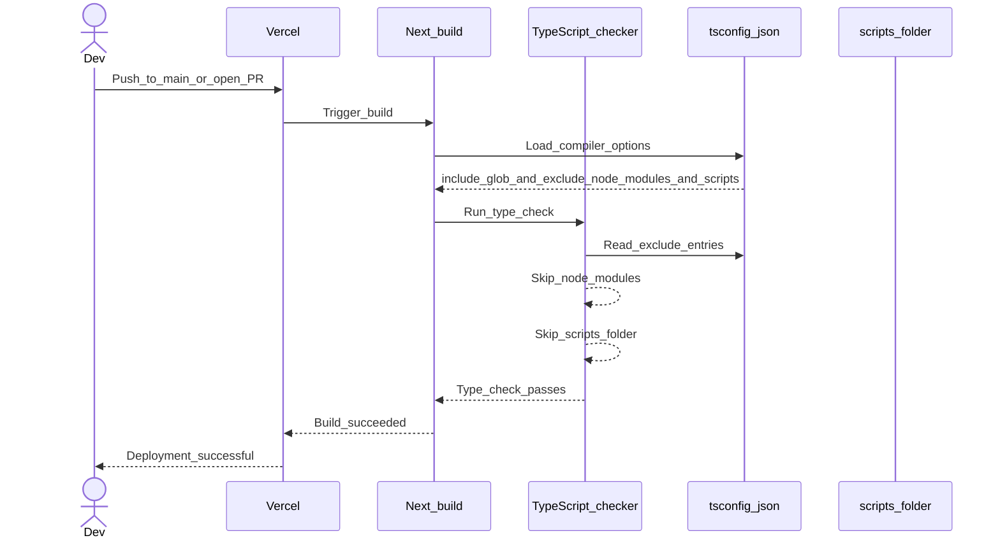

# PR #63 Review Analysis

**Generated**: 2026-01-10T15:50:17.090Z  
**Total Issues**: 1  
**Breakdown**: 0 CRITICAL, 0 HIGH, 0 MEDIUM, 1 LOW

---

## Summary

| Severity | Count | Action Required |
|----------|-------|-----------------|
| CRITICAL | 0 | Fix immediately before merge |
| HIGH | 0 | Fix if <5 min each |
| MEDIUM | 0 | Document for later |
| LOW | 1 | Optional (style/formatting) |

---

## CRITICAL Issues (0)

_No critical issues found._

---

## HIGH Issues (0)

_No high-priority issues found._

---

## MEDIUM Issues (0)

_No medium-priority issues found._

---

## LOW Issues (1)


### 1. Sourcery

```
<!-- Generated by sourcery-ai[bot]: start review_guide -->

<details>
<summary>Reviewer's guide (collapsed on small PRs)</summary>

## Reviewer's Guide

This PR fixes Vercel deployment TypeScript errors by excluding the scripts directory from tsconfig type-checking, cleaning up a duplicate dotenv config import in the PR scraping script, and removing a deprecated Next.js swcMinify configuration option.

#### Sequence diagram for updated Vercel deployment type-checking behavior



### File-Level Changes

| Change | Details | Files |
| ------ | ------- | ----- |
| Prevent TypeScript from type-checking the scripts directory during Next.js builds to avoid deployment failures. | <ul><li>Updated the tsconfig exclude array to include the scripts directory alongside node_modules</li><li>Ensured build tooling no longer traverses script files for type-checking in CI/Vercel environments</li></ul> | `tsconfig.json` |
| Clean up PR scraping script configuration to resolve duplicate identifier issues while preserving script behavior. | <ul><li>Removed a duplicate dotenv config import/definition that caused a duplicate config identifier error</li><li>Confirmed the script remains runnable via existing pnpm run pr:scrape command without behavior changes</li></ul> | `scripts/pr-scrape.ts` |
| Modernize Next.js configuration by removing deprecated swcMinify option now enabled by default. | <ul><li>Deleted the swcMinify flag from the Next.js configuration to silence deprecation warnings in Next.js 15 builds</li><li>Relied on the framework’s default SWC minification behavior without altering runtime behavior</li></ul> | `next.config.mjs` |

</details>

---

<details>
<summary>Tips and commands</summary>

#### Interacting with Sourcery

- **Trigger a new review:** Comment `@sourcery-ai review` on the pull request.
- **Continue discussions:** Reply directly to Sourcery's review comments.
- **Generate a GitHub issue from a review comment:** Ask Sourcery to create an
  issue from a review comment by replying to it. You can also reply to a
  review comment with `@sourcery-ai issue` to create an issue from it.
- **Generate a pull request title:** Write `@sourcery-ai` anywhere in the pull
  request title to generate a title at any time. You can also comment
  `@sourcery-ai title` on the pull request to (re-)generate the title at any time.
- **Generate a pull request summary:** Write `@sourcery-ai summary` anywhere in
  the pull request body to generate a PR summary at any time exactly where you
  want it. You can also comment `@sourcery-ai summary` on the pull request to
  (re-)generate the summary at any time.
- **Generate reviewer's guide:** Comment `@sourcery-ai guide` on the pull
  request to (re-)generate the reviewer's guide at any time.
- **Resolve all Sourcery comments:** Comment `@sourcery-ai resolve` on the
  pull request to resolve all Sourcery comments. Useful if you've already
  addressed all the comments and don't want to see them anymore.
- **Dismiss all Sourcery reviews:** Comment `@sourcery-ai dismiss` on the pull
  request to dismiss all existing Sourcery reviews. Especially useful if you
  want to start fresh with a new review - don't forget to comment
  `@sourcery-ai review` to trigger a new review!

#### Customizing Your Experience

Access your [dashboard](https://app.sourcery.ai) to:
- Enable or disable review features such as the Sourcery-generated pull request
  summary, the reviewer's guide, and others.
- Change the review language.
- Add, remove or edit custom review instructions.
- Adjust other review settings.

#### Getting Help

- [Contact our support team](mailto:support@sourcery.ai) for questions or feedback.
- Visit our [documentation](https://docs.sourcery.ai) for detailed guides and information.
- Keep in touch with the Sourcery team by following us on [X/Twitter](https://x.com/SourceryAI), [LinkedIn](https://www.linkedin.com/company/sourcery-ai/) or [GitHub](https://github.com/sourcery-ai).

</details>

<!-- Generated by sourcery-ai[bot]: end review_guide -->
```


---

## Next Steps

1. **Fix CRITICAL issues** (0 found) - Block merge until resolved
2. **Fix HIGH issues** (0 found) - Fix if <5 min each, otherwise document
3. **Document MEDIUM/LOW** (1 found) - Create follow-up issues

**Generated by**: `pnpm run pr:scrape 63`
