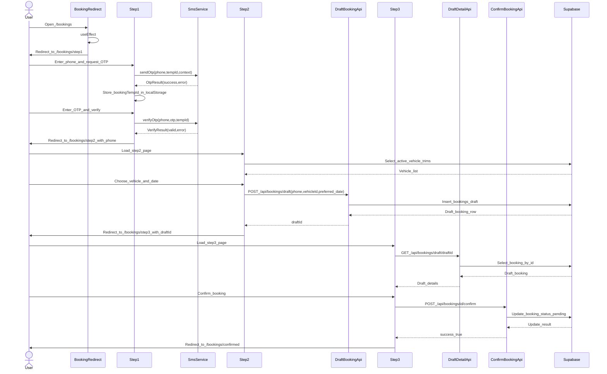
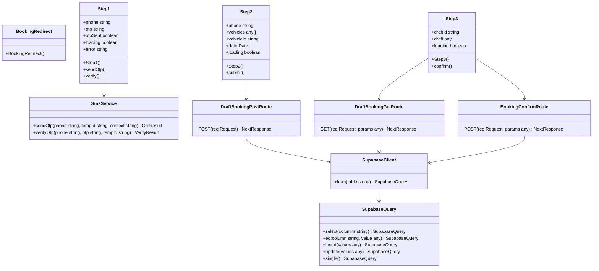

# PR #66 Review Analysis

**Generated**: 2026-01-11T15:33:32.882Z  
**Total Issues**: 1  
**Breakdown**: 0 CRITICAL, 0 HIGH, 0 MEDIUM, 1 LOW

---

## Summary

| Severity | Count | Action Required |
|----------|-------|-----------------|
| CRITICAL | 0 | Fix immediately before merge |
| HIGH | 0 | Fix if <5 min each |
| MEDIUM | 0 | Document for later |
| LOW | 1 | Optional (style/formatting) |

---

## CRITICAL Issues (0)

_No critical issues found._

---

## HIGH Issues (0)

_No high-priority issues found._

---

## MEDIUM Issues (0)

_No medium-priority issues found._

---

## LOW Issues (1)


### 1. Sourcery

```
<!-- Generated by sourcery-ai[bot]: start review_guide -->

## Reviewer's Guide

Rebuilds the bookings flow into a new 3-step test-drive booking UI using phone OTP verification, vehicle/date selection, and a confirmation step backed by draft booking APIs, while replacing the old bookings list page with a redirect into the new flow.

#### Sequence diagram for new 3-step booking and draft confirmation flow



#### Updated class diagram for booking steps, API routes, and SmsService usage



### File-Level Changes

| Change | Details | Files |
| ------ | ------- | ----- |
| Replace the bookings index page with a redirect into the new multi-step booking flow. | <ul><li>Remove legacy bookings list, QR display, and cancellation UI logic.</li><li>Simplify the bookings page component to a client component that immediately pushes to the step 1 route using useRouter in a useEffect hook.</li></ul> | `src/app/[locale]/bookings/page.tsx` |
| Add Step 1 UI for phone-based OTP verification using SmsService. | <ul><li>Implement phone input and OTP input states with loading and error handling.</li><li>Integrate smsService.sendOtp and smsService.verifyOtp, storing a temporary booking ID in localStorage.</li><li>On successful verification, navigate to step 2 with the phone number passed as a query parameter.</li></ul> | `src/app/[locale]/bookings/step1/page.tsx` |
| Add Step 2 UI for vehicle and preferred date selection, creating a draft booking via API. | <ul><li>Fetch active vehicles from Supabase vehicle_trims table on mount.</li><li>Allow users to choose a vehicle and preferred date via MUI Select and DatePicker components.</li><li>POST a draft booking to the draft API and navigate to step 3 with the returned draftId.</li></ul> | `src/app/[locale]/bookings/step2/page.tsx` |
| Add Step 3 UI for reviewing and confirming a draft booking. | <ul><li>Fetch draft booking details by draftId from a new draft API endpoint.</li><li>Display phone, vehicle, and preferred date in a summary Paper.</li><li>Confirm the booking via a confirm API call and redirect to a generic confirmed page.</li></ul> | `src/app/[locale]/bookings/step3/page.tsx` |
| Introduce backend API endpoints to support draft and confirmation stages of bookings. | <ul><li>Create POST /api/bookings/draft to insert a draft booking row in Supabase with phone, vehicle, preferred date, and draft status.</li><li>Create POST /api/bookings/[id]/confirm to update a booking’s status to pending in Supabase.</li><li>Create GET /api/bookings/draft/[draftId] to retrieve a single draft booking by ID from Supabase.</li></ul> | `src/app/api/bookings/draft/route.ts`<br/>`src/app/api/bookings/[id]/confirm/route.ts`<br/>`src/app/api/bookings/draft/[draftId]/route.ts` |

---

<details>
<summary>Tips and commands</summary>

#### Interacting with Sourcery

- **Trigger a new review:** Comment `@sourcery-ai review` on the pull request.
- **Continue discussions:** Reply directly to Sourcery's review comments.
- **Generate a GitHub issue from a review comment:** Ask Sourcery to create an
  issue from a review comment by replying to it. You can also reply to a
  review comment with `@sourcery-ai issue` to create an issue from it.
- **Generate a pull request title:** Write `@sourcery-ai` anywhere in the pull
  request title to generate a title at any time. You can also comment
  `@sourcery-ai title` on the pull request to (re-)generate the title at any time.
- **Generate a pull request summary:** Write `@sourcery-ai summary` anywhere in
  the pull request body to generate a PR summary at any time exactly where you
  want it. You can also comment `@sourcery-ai summary` on the pull request to
  (re-)generate the summary at any time.
- **Generate reviewer's guide:** Comment `@sourcery-ai guide` on the pull
  request to (re-)generate the reviewer's guide at any time.
- **Resolve all Sourcery comments:** Comment `@sourcery-ai resolve` on the
  pull request to resolve all Sourcery comments. Useful if you've already
  addressed all the comments and don't want to see them anymore.
- **Dismiss all Sourcery reviews:** Comment `@sourcery-ai dismiss` on the pull
  request to dismiss all existing Sourcery reviews. Especially useful if you
  want to start fresh with a new review - don't forget to comment
  `@sourcery-ai review` to trigger a new review!

#### Customizing Your Experience

Access your [dashboard](https://app.sourcery.ai) to:
- Enable or disable review features such as the Sourcery-generated pull request
  summary, the reviewer's guide, and others.
- Change the review language.
- Add, remove or edit custom review instructions.
- Adjust other review settings.

#### Getting Help

- [Contact our support team](mailto:support@sourcery.ai) for questions or feedback.
- Visit our [documentation](https://docs.sourcery.ai) for detailed guides and information.
- Keep in touch with the Sourcery team by following us on [X/Twitter](https://x.com/SourceryAI), [LinkedIn](https://www.linkedin.com/company/sourcery-ai/) or [GitHub](https://github.com/sourcery-ai).

</details>

<!-- Generated by sourcery-ai[bot]: end review_guide -->
```


---

## Next Steps

1. **Fix CRITICAL issues** (0 found) - Block merge until resolved
2. **Fix HIGH issues** (0 found) - Fix if <5 min each, otherwise document
3. **Document MEDIUM/LOW** (1 found) - Create follow-up issues

**Generated by**: `pnpm run pr:scrape 66`
