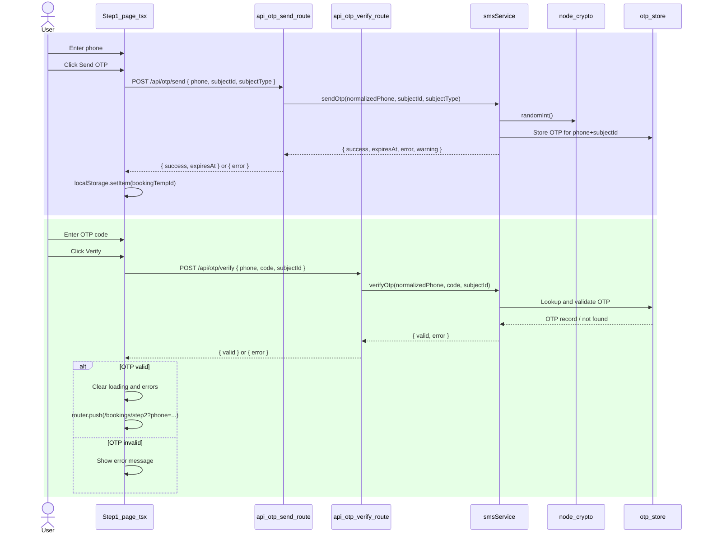
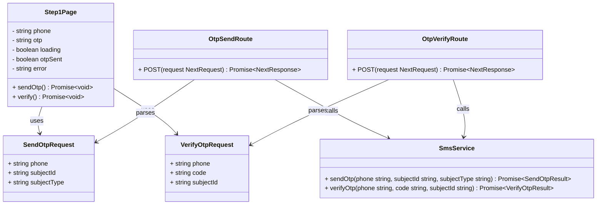

# PR #67 Review Analysis

**Generated**: 2026-01-12T07:40:31.292Z  
**Total Issues**: 4  
**Breakdown**: 2 CRITICAL, 1 HIGH, 0 MEDIUM, 1 LOW

---

## Summary

| Severity | Count | Action Required |
|----------|-------|-----------------|
| CRITICAL | 2 | Fix immediately before merge |
| HIGH | 1 | Fix if <5 min each |
| MEDIUM | 0 | Document for later |
| LOW | 1 | Optional (style/formatting) |

---

## CRITICAL Issues (2)


### 1. Sourcery

```
<!-- Generated by sourcery-ai[bot]: start review_guide -->

## Reviewer's Guide

Implements server-side OTP sending and verification via new Next.js API routes and updates the booking step1 client to call these routes instead of importing the Node-dependent smsService directly, resolving the browser crypto.randomInt error and improving security and bundle size.

#### Sequence diagram for the updated OTP send and verify flow



#### Class diagram for OTP request types and Step1 page handlers



### File-Level Changes

| Change | Details | Files |
| ------ | ------- | ----- |
| Decouple the step1 booking page from smsService by switching to OTP API calls from the client. | <ul><li>Remove direct smsService import from the Step1 React client component.</li><li>Generate a temporary subject ID with crypto.randomUUID and persist it in localStorage for OTP verification.</li><li>Call the new /api/otp/send endpoint via fetch to trigger OTP SMS delivery and handle success/error responses.</li><li>Call the new /api/otp/verify endpoint via fetch to validate the OTP and navigate to step2 on success.</li><li>Update component comments to document the architectural change to API-based OTP handling.</li></ul> | `src/app/[locale]/bookings/step1/page.tsx` |
| Introduce dedicated server-side API route for sending OTP codes via SMS. | <ul><li>Define a POST handler that parses and validates phone, subjectId, and subjectType from the JSON body.</li><li>Normalize and minimally validate phone numbers before invoking smsService.sendOtp.</li><li>Invoke smsService.sendOtp on the server and map its result to a structured JSON response including success, error, warning, and expiresAt fields.</li><li>Return appropriate HTTP status codes for validation failures, downstream service errors, and unexpected exceptions.</li><li>Capture unexpected errors with captureSentryError for observability and log a tagged console error.</li></ul> | `src/app/api/otp/send/route.ts` |
| Introduce dedicated server-side API route for verifying OTP codes. | <ul><li>Define a POST handler that parses and validates phone, code, and subjectId from the JSON body.</li><li>Normalize and minimally validate phone numbers before calling smsService.verifyOtp.</li><li>Invoke smsService.verifyOtp on the server and translate its result into a JSON response with valid and error fields.</li><li>Return 400 responses for invalid inputs or failed OTP validation and 500 for unexpected server errors.</li><li>Capture unexpected verification errors with captureSentryError and log them with contextual endpoint metadata.</li></ul> | `src/app/api/otp/verify/route.ts` |

---

<details>
<summary>Tips and commands</summary>

#### Interacting with Sourcery

- **Trigger a new review:** Comment `@sourcery-ai review` on the pull request.
- **Continue discussions:** Reply directly to Sourcery's review comments.
- **Generate a GitHub issue from a review comment:** Ask Sourcery to create an
  issue from a review comment by replying to it. You can also reply to a
  review comment with `@sourcery-ai issue` to create an issue from it.
- **Generate a pull request title:** Write `@sourcery-ai` anywhere in the pull
  request title to generate a title at any time. You can also comment
  `@sourcery-ai title` on the pull request to (re-)generate the title at any time.
- **Generate a pull request summary:** Write `@sourcery-ai summary` anywhere in
  the pull request body to generate a PR summary at any time exactly where you
  want it. You can also comment `@sourcery-ai summary` on the pull request to
  (re-)generate the summary at any time.
- **Generate reviewer's guide:** Comment `@sourcery-ai guide` on the pull
  request to (re-)generate the reviewer's guide at any time.
- **Resolve all Sourcery comments:** Comment `@sourcery-ai resolve` on the
  pull request to resolve all Sourcery comments. Useful if you've already
  addressed all the comments and don't want to see them anymore.
- **Dismiss all Sourcery reviews:** Comment `@sourcery-ai dismiss` on the pull
  request to dismiss all existing Sourcery reviews. Especially useful if you
  want to start fresh with a new review - don't forget to comment
  `@sourcery-ai review` to trigger a new review!

#### Customizing Your Experience

Access your [dashboard](https://app.sourcery.ai) to:
- Enable or disable review features such as the Sourcery-generated pull request
  summary, the reviewer's guide, and others.
- Change the review language.
- Add, remove or edit custom review instructions.
- Adjust other review settings.

#### Getting Help

- [Contact our support team](mailto:support@sourcery.ai) for questions or feedback.
- Visit our [documentation](https://docs.sourcery.ai) for detailed guides and information.
- Keep in touch with the Sourcery team by following us on [X/Twitter](https://x.com/SourceryAI), [LinkedIn](https://www.linkedin.com/company/sourcery-ai/) or [GitHub](https://github.com/sourcery-ai).

</details>

<!-- Generated by sourcery-ai[bot]: end review_guide -->
```


### 2. Sourcery - src/app/api/otp/send/route.ts:74

```
**🚨 suggestion (security):** Propagating smsService error messages directly may leak internal or provider details.

Currently the client shows `result.error` from `smsService` on failure, which may expose internal or provider details. Consider mapping failures to a small set of generic user-facing messages and logging the detailed error (e.g., to Sentry/console) instead, consistent with the catch block behavior.
```


---

## HIGH Issues (1)


### 1. CodeRabbit

```
<!-- This is an auto-generated comment: summarize by coderabbit.ai -->
<!-- This is an auto-generated comment: rate limited by coderabbit.ai -->

> [!WARNING]
> ## Rate limit exceeded
> 
> @TechHypeXP has exceeded the limit for the number of commits that can be reviewed per hour. Please wait **16 minutes and 29 seconds** before requesting another review.
> 
> <details>
> <summary>⌛ How to resolve this issue?</summary>
> 
> After the wait time has elapsed, a review can be triggered using the `@coderabbitai review` command as a PR comment. Alternatively, push new commits to this PR.
> 
> We recommend that you space out your commits to avoid hitting the rate limit.
> 
> </details>
> 
> 
> <details>
> <summary>🚦 How do rate limits work?</summary>
> 
> CodeRabbit enforces hourly rate limits for each developer per organization.
> 
> Our paid plans have higher rate limits than the trial, open-source and free plans. In all cases, we re-allow further reviews after a brief timeout.
> 
> Please see our [FAQ](https://docs.coderabbit.ai/faq) for further information.
> 
> </details>
> 
> <details>
> <summary>📥 Commits</summary>
> 
> Reviewing files that changed from the base of the PR and between 1ed36f336d0507972ad8e9bf448200dcbe3d2d89 and 6ca418b4d9249fca64b3c5e8ccff5f9c551e6904.
> 
> </details>
> 
> <details>
> <summary>⛔ Files ignored due to path filters (3)</summary>
> 
> * `CLAUDE.md` is excluded by `!**/*.md`
> * `docs/BOOKING_WIZARD_SPEC.md` is excluded by `!**/*.md`
> * `docs/PERFORMANCE_LOG.md` is excluded by `!**/*.md`
> 
> </details>
> 
> <details>
> <summary>📒 Files selected for processing (3)</summary>
> 
> * `src/app/[locale]/bookings/step1/page.tsx`
> * `src/app/api/otp/send/route.ts`
> * `src/app/api/otp/verify/route.ts`
> 
> </details>

<!-- end of auto-generated comment: rate limited by coderabbit.ai -->


<!-- finishing_touch_checkbox_start -->

<details>
<summary>✨ Finishing touches</summary>

<details>
<summary>🧪 Generate unit tests (beta)</summary>

- [ ] <!-- {"checkboxId": "f47ac10b-58cc-4372-a567-0e02b2c3d479", "radioGroupId": "utg-output-choice-group-unknown_comment_id"} -->   Create PR with unit tests
- [ ] <!-- {"checkboxId": "07f1e7d6-8a8e-4e23-9900-8731c2c87f58", "radioGroupId": "utg-output-choice-group-unknown_comment_id"} -->   Post copyable unit tests in a comment
- [ ] <!-- {"checkboxId": "6ba7b810-9dad-11d1-80b4-00c04fd430c8", "radioGroupId": "utg-output-choice-group-unknown_comment_id"} -->   Commit unit tests in branch `cc/fix-otp-randomint`

</details>

</details>

<!-- finishing_touch_checkbox_end -->

<!-- tips_start -->

---

Thanks for using [CodeRabbit](https://coderabbit.ai?utm_source=oss&utm_medium=github&utm_campaign=Hex-Tech-Lab/hex-test-drive-man&utm_content=67)! It's free for OSS, and your support helps us grow. If you like it, consider giving us a shout-out.

<details>
<summary>❤️ Share</summary>

- [X](https://twitter.com/intent/tweet?text=I%20just%20used%20%40coderabbitai%20for%20my%20code%20review%2C%20and%20it%27s%20fantastic%21%20It%27s%20free%20for%20OSS%20and%20offers%20a%20free%20trial%20for%20the%20proprietary%20code.%20Check%20it%20out%3A&url=https%3A//coderabbit.ai)
- [Mastodon](https://mastodon.social/share?text=I%20just%20used%20%40coderabbitai%20for%20my%20code%20review%2C%20and%20it%27s%20fantastic%21%20It%27s%20free%20for%20OSS%20and%20offers%20a%20free%20trial%20for%20the%20proprietary%20code.%20Check%20it%20out%3A%20https%3A%2F%2Fcoderabbit.ai)
- [Reddit](https://www.reddit.com/submit?title=Great%20tool%20for%20code%20review%20-%20CodeRabbit&text=I%20just%20used%20CodeRabbit%20for%20my%20code%20review%2C%20and%20it%27s%20fantastic%21%20It%27s%20free%20for%20OSS%20and%20offers%20a%20free%20trial%20for%20proprietary%20code.%20Check%20it%20out%3A%20https%3A//coderabbit.ai)
- [LinkedIn](https://www.linkedin.com/sharing/share-offsite/?url=https%3A%2F%2Fcoderabbit.ai&mini=true&title=Great%20tool%20for%20code%20review%20-%20CodeRabbit&summary=I%20just%20used%20CodeRabbit%20for%20my%20code%20review%2C%20and%20it%27s%20fantastic%21%20It%27s%20free%20for%20OSS%20and%20offers%20a%20free%20trial%20for%20proprietary%20code)

</details>

<sub>Comment `@coderabbitai help` to get the list of available commands and usage tips.</sub>

<!-- tips_end -->
```


---

## MEDIUM Issues (0)

_No medium-priority issues found._

---

## LOW Issues (1)


### 1. SonarCloud

```
Please retry analysis of this Pull-Request directly on SonarQube Cloud
```


---

## Next Steps

1. **Fix CRITICAL issues** (2 found) - Block merge until resolved
2. **Fix HIGH issues** (1 found) - Fix if <5 min each, otherwise document
3. **Document MEDIUM/LOW** (1 found) - Create follow-up issues

**Generated by**: `pnpm run pr:scrape 67`
