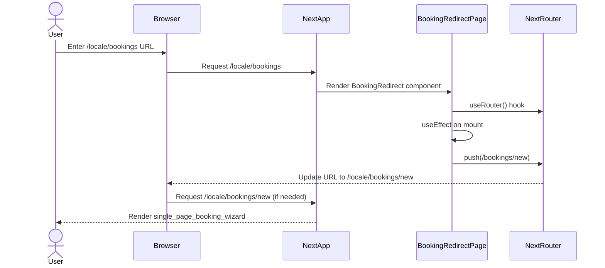

# PR #70 Review Analysis

**Generated**: 2026-01-12T18:56:22.186Z  
**Total Issues**: 6  
**Breakdown**: 1 CRITICAL, 1 HIGH, 1 MEDIUM, 3 LOW

---

## Summary

| Severity | Count | Action Required |
|----------|-------|-----------------|
| CRITICAL | 1 | Fix immediately before merge |
| HIGH | 1 | Fix if <5 min each |
| MEDIUM | 1 | Document for later |
| LOW | 3 | Optional (style/formatting) |

---

## CRITICAL Issues (1)


### 1. CodeRabbit - next.config.mjs:55

```
_⚠️ Potential issue_ | _🔴 Critical_

<details>
<summary>🧩 Analysis chain</summary>

🏁 Script executed:

```shell
# First, let's find and read the next.config.mjs file
find . -name "next.config.mjs" -type f
```

Repository: Hex-Tech-Lab/hex-test-drive-man

Length of output: 92

---

🏁 Script executed:

```shell
# After reading the file, search for stale references to old booking step routes
rg -i '(bookings/step[123]|/step[123]/)' --type ts --type tsx --type js -g '!node_modules' -g '!.next'
```

Repository: Hex-Tech-Lab/hex-test-drive-man

Length of output: 102

---

🏁 Script executed:

```shell
# Also check for hardcoded navigation or links to the old routes in components and pages
rg -i "(href|link|route).*bookings.*step" --type ts --type tsx --type jsx -g '!node_modules' -g '!.next'
```

Repository: Hex-Tech-Lab/hex-test-drive-man

Length of output: 102

---

🏁 Script executed:

```shell
cat -n next.config.mjs | sed -n '40,60p'
```

Repository: Hex-Tech-Lab/hex-test-drive-man

Length of output: 652

---

🏁 Script executed:

```shell
# Search for stale references with correct file types
rg '(bookings/step[123]|/step[123]/)' --type ts --type js -g '!node_modules' -g '!.next'
```

Repository: Hex-Tech-Lab/hex-test-drive-man

Length of output: 57

---

🏁 Script executed:

```shell
# Search for hardcoded navigation to old routes
rg 'bookings.*step' --type ts --type js -g '!node_modules' -g '!.next'
```

Repository: Hex-Tech-Lab/hex-test-drive-man

Length of output: 57

---

🏁 Script executed:

```shell
# Let me verify the Next.js redirect syntax is correct by checking documentation or examples in the codebase
# First, check the Next.js version
cat -n package.json | grep -i next
```

Repository: Hex-Tech-Lab/hex-test-drive-man

Length of output: 289

---

🏁 Script executed:

```shell
# Search for any other redirect configurations in the codebase to compare syntax
rg 'redirects:\s*async' -A 10
```

Repository: Hex-Tech-Lab/hex-test-drive-man

Length of output: 964

---

🏁 Script executed:

```shell
# Verify the redirect regex syntax is valid for Next.js 15
# Check if there are any test files or examples that validate this syntax
rg 'step:num|step:step' -i
```

Repository: Hex-Tech-Lab/hex-test-drive-man

Length of output: 218

---

🏁 Script executed:

```shell
# Let me also check the documentation file that mentions this
cat -n docs/BOOKING_LINKS_AUDIT.md | head -50
```

Repository: Hex-Tech-Lab/hex-test-drive-man

Length of output: 1690

---

🌐 Web query:

`Next.js 15 redirect regex pattern syntax step:num(1|2|3)`

💡 Result:

Use Next’s named‑param + inline regex syntax: :paramName(<regex>). Example to match only steps 1,2 or 3:

next.config.js
{
  async redirects() {
    return [
      {
        source: '/checkout/step/:step(1|2|3)', // matches only 1,2,3
        destination: '/new-checkout/step/:step',
        permanent: false,
      },
    ]
  },
}

Notes:
- The syntax is documented as :name(<pattern>) in Next.js redirects. [1][2]
- In JS strings you may need to escape backslashes if you use backslash sequences. [2]

Sources:
[1] Next.js Redirecting guide.  
[2] next.config.js redirects API reference.

---


</details>

**Fix redirect pattern syntax for Next.js 15.**

The redirect source pattern is using incorrect syntax. Next.js 15 uses `:paramName(regex)` format, not `paramName:num(regex)`. The current pattern `step:num(1|2|3)` won't match the intended routes.

Correct pattern should be: `/:locale/bookings/:step(1|2|3)` with destination `/:locale/bookings/new?step=:step` (if you need to preserve the step value), or simply `/:locale/bookings/new` if the step parameter isn't needed.

The permanent: true setting is appropriate for deprecated routes.

<details>
<summary>🤖 Prompt for AI Agents</summary>

```
In @next.config.mjs around lines 48 - 55, The redirect source pattern in the
redirects async function is using the old incorrect syntax
`/:locale/bookings/step:num(1|2|3)` so update the source to Next.js 15 syntax
`/:locale/bookings/:step(1|2|3)` and adjust the destination to either
`/:locale/bookings/new?step=:step` to preserve the step param or leave it as
`/:locale/bookings/new` if you don't need the step value; keep `permanent: true`
as-is in the redirects array.
```

</details>

<!-- fingerprinting:phantom:poseidon:ocelot -->

<!-- This is an auto-generated comment by CodeRabbit -->
```


---

## HIGH Issues (1)


### 1. Sourcery - src/app/[locale]/bookings/page.tsx:13

```
**issue (bug_risk):** Hardcoding `/bookings/new` may drop the current locale segment in the URL.

Because this route is nested under `[locale]/bookings`, an absolute `/bookings/new` URL will likely strip the locale and break localized routing.

Prefer either:
- A relative navigation like `router.push('new')` / `'./new'`, or
- Including the locale explicitly, e.g. ``router.push(`/${locale}/bookings/new`)``.

Also consider whether `router.replace` is preferable so the intermediate page isn’t left in the history stack.
```


---

## MEDIUM Issues (1)


### 1. SonarCloud

```
## [](https://sonarcloud.io/dashboard?id=Hex-Tech-Lab_hex-test-drive-man&pullRequest=70) **Quality Gate passed**  
Issues  
 [0 New issues](https://sonarcloud.io/project/issues?id=Hex-Tech-Lab_hex-test-drive-man&pullRequest=70&issueStatuses=OPEN,CONFIRMED&sinceLeakPeriod=true)  
 [0 Accepted issues](https://sonarcloud.io/project/issues?id=Hex-Tech-Lab_hex-test-drive-man&pullRequest=70&issueStatuses=ACCEPTED)

Measures  
 [0 Security Hotspots](https://sonarcloud.io/project/security_hotspots?id=Hex-Tech-Lab_hex-test-drive-man&pullRequest=70&issueStatuses=OPEN,CONFIRMED&sinceLeakPeriod=true)  
 [0.0% Coverage on New Code](https://sonarcloud.io/component_measures?id=Hex-Tech-Lab_hex-test-drive-man&pullRequest=70&metric=new_coverage&view=list)  
 [0.0% Duplication on New Code](https://sonarcloud.io/component_measures?id=Hex-Tech-Lab_hex-test-drive-man&pullRequest=70&metric=new_duplicated_lines_density&view=list)  
  
[See analysis details on SonarQube Cloud](https://sonarcloud.io/dashboard?id=Hex-Tech-Lab_hex-test-drive-man&pullRequest=70)


```


---

## LOW Issues (3)


### 1. Sourcery

```
<!-- Generated by sourcery-ai[bot]: start review_guide -->

## Reviewer's Guide

This PR removes the legacy multi-step booking pages in favor of the new single-page booking wizard, adds server-side redirects for any old step URLs, updates the main bookings entry route to push to the new wizard, and documents the system-wide audit of booking links.

#### Sequence diagram for /bookings client-side redirect to /bookings/new



### File-Level Changes

| Change | Details | Files |
| ------ | ------- | ----- |
| Add Next.js config redirect for legacy booking step URLs to the new booking wizard. | <ul><li>Define a redirects() function in Next.js config that returns a single permanent redirect rule.</li><li>Match locale-specific legacy step URLs using a dynamic :locale segment and a step:num(1|2|3) parameter.</li><li>Redirect all matched legacy step URLs to the locale-scoped /bookings/new wizard entry point.</li></ul> | `next.config.mjs` |
| Update the /[locale]/bookings entry page to route users directly to the new single-page booking wizard. | <ul><li>Adjust JSDoc comment to describe redirect to the new single-page booking wizard instead of step 1.</li><li>Change router.push target from the old /bookings/step1 route to /bookings/new inside the useEffect hook.</li><li>Keep component behavior as a client-side redirect-only page returning null UI.</li></ul> | `src/app/[locale]/bookings/page.tsx` |
| Document and codify the audit of booking-related links across the codebase. | <ul><li>Add an audit document describing the search commands used to find booking links.</li><li>Record the locations and statuses of all discovered booking URLs, including the one fixed in this PR.</li><li>Summarize deletion of old step route files and the newly added redirect behavior for legacy URLs.</li><li>Provide a short verification and next-steps checklist for validating booking flows after deployment.</li></ul> | `docs/BOOKING_LINKS_AUDIT.md` |
| Remove obsolete multi-step booking route pages now superseded by the new wizard. | <ul><li>Delete the step1 booking page implementation under the localized bookings directory.</li><li>Delete the step2 booking page implementation under the localized bookings directory.</li><li>Delete the step3 booking page implementation under the localized bookings directory.</li></ul> | `src/app/[locale]/bookings/step1/page.tsx`<br/>`src/app/[locale]/bookings/step2/page.tsx`<br/>`src/app/[locale]/bookings/step3/page.tsx` |

---

<details>
<summary>Tips and commands</summary>

#### Interacting with Sourcery

- **Trigger a new review:** Comment `@sourcery-ai review` on the pull request.
- **Continue discussions:** Reply directly to Sourcery's review comments.
- **Generate a GitHub issue from a review comment:** Ask Sourcery to create an
  issue from a review comment by replying to it. You can also reply to a
  review comment with `@sourcery-ai issue` to create an issue from it.
- **Generate a pull request title:** Write `@sourcery-ai` anywhere in the pull
  request title to generate a title at any time. You can also comment
  `@sourcery-ai title` on the pull request to (re-)generate the title at any time.
- **Generate a pull request summary:** Write `@sourcery-ai summary` anywhere in
  the pull request body to generate a PR summary at any time exactly where you
  want it. You can also comment `@sourcery-ai summary` on the pull request to
  (re-)generate the summary at any time.
- **Generate reviewer's guide:** Comment `@sourcery-ai guide` on the pull
  request to (re-)generate the reviewer's guide at any time.
- **Resolve all Sourcery comments:** Comment `@sourcery-ai resolve` on the
  pull request to resolve all Sourcery comments. Useful if you've already
  addressed all the comments and don't want to see them anymore.
- **Dismiss all Sourcery reviews:** Comment `@sourcery-ai dismiss` on the pull
  request to dismiss all existing Sourcery reviews. Especially useful if you
  want to start fresh with a new review - don't forget to comment
  `@sourcery-ai review` to trigger a new review!

#### Customizing Your Experience

Access your [dashboard](https://app.sourcery.ai) to:
- Enable or disable review features such as the Sourcery-generated pull request
  summary, the reviewer's guide, and others.
- Change the review language.
- Add, remove or edit custom review instructions.
- Adjust other review settings.

#### Getting Help

- [Contact our support team](mailto:support@sourcery.ai) for questions or feedback.
- Visit our [documentation](https://docs.sourcery.ai) for detailed guides and information.
- Keep in touch with the Sourcery team by following us on [X/Twitter](https://x.com/SourceryAI), [LinkedIn](https://www.linkedin.com/company/sourcery-ai/) or [GitHub](https://github.com/sourcery-ai).

</details>

<!-- Generated by sourcery-ai[bot]: end review_guide -->
```


### 2. CodeRabbit

```
<!-- This is an auto-generated comment: summarize by coderabbit.ai -->
<!-- walkthrough_start -->

## Walkthrough

This PR consolidates the multi-step booking flow into a single-page wizard. Old step-based routes (step1, step2, step3) are deprecated via a Next.js redirect rule in the configuration, and their corresponding server page components are removed. The main bookings page now directs users to the unified booking experience.

## Changes

| Cohort / File(s) | Summary |
|---|---|
| **Configuration** <br> `next.config.mjs` | Added `redirects` function to permanently redirect legacy step-based booking URLs (`/:locale/bookings/step:num(1\|2\|3)`) to new unified booking page (`/:locale/bookings/new`) |
| **Booking Router Update** <br> `src/app/[locale]/bookings/page.tsx` | Updated BookingRedirect component navigation target from `/bookings/step1` to `/bookings/new` |
| **Deprecated Step Pages** <br> `src/app/[locale]/bookings/step{1,2,3}/page.tsx` | Removed three deprecated redirect components that previously implemented step-based booking flow and redirected to `/bookings/new` on mount |

## Estimated Code Review Effort

🎯 2 (Simple) | ⏱️ ~10 minutes

## Possibly Related PRs

- **#60** — Modifies booking routes and addresses routing conflicts between single-page and multi-step booking flows to align with the migration strategy.
- **#68** — Consolidates multi-step booking flow into single-page wizard by modifying the same step page files and redirect logic.
- **#66** — Affects the same booking route files (step1/step2/step3 and bookings page) with potentially conflicting changes to the booking flow structure.

<!-- walkthrough_end -->


<!-- pre_merge_checks_walkthrough_start -->

<details>
<summary>🚥 Pre-merge checks | ✅ 3</summary>

<details>
<summary>✅ Passed checks (3 passed)</summary>

|     Check name     | Status   | Explanation                                                                                                                                             |
| :----------------: | :------- | :------------------------------------------------------------------------------------------------------------------------------------------------------ |
|  Description Check | ✅ Passed | Check skipped - CodeRabbit’s high-level summary is enabled.                                                                                             |
|     Title check    | ✅ Passed | The title accurately summarizes the main changes: removing old step routes and adding server-side redirects, matching the primary objectives of the PR. |
| Docstring Coverage | ✅ Passed | Docstring coverage is 100.00% which is sufficient. The required threshold is 80.00%.                                                                    |

</details>

<sub>✏️ Tip: You can configure your own custom pre-merge checks in the settings.</sub>

</details>

<!-- pre_merge_checks_walkthrough_end -->

<!-- finishing_touch_checkbox_start -->

<details>
<summary>✨ Finishing touches</summary>

- [ ] <!-- {"checkboxId": "7962f53c-55bc-4827-bfbf-6a18da830691"} --> 📝 Generate docstrings
<details>
<summary>🧪 Generate unit tests (beta)</summary>

- [ ] <!-- {"checkboxId": "f47ac10b-58cc-4372-a567-0e02b2c3d479", "radioGroupId": "utg-output-choice-group-unknown_comment_id"} -->   Create PR with unit tests
- [ ] <!-- {"checkboxId": "07f1e7d6-8a8e-4e23-9900-8731c2c87f58", "radioGroupId": "utg-output-choice-group-unknown_comment_id"} -->   Post copyable unit tests in a comment
- [ ] <!-- {"checkboxId": "6ba7b810-9dad-11d1-80b4-00c04fd430c8", "radioGroupId": "utg-output-choice-group-unknown_comment_id"} -->   Commit unit tests in branch `cc/cleanup-old-booking-routes`

</details>

</details>

<!-- finishing_touch_checkbox_end -->

<!-- tips_start -->

---

Thanks for using [CodeRabbit](https://coderabbit.ai?utm_source=oss&utm_medium=github&utm_campaign=Hex-Tech-Lab/hex-test-drive-man&utm_content=70)! It's free for OSS, and your support helps us grow. If you like it, consider giving us a shout-out.

<details>
<summary>❤️ Share</summary>

- [X](https://twitter.com/intent/tweet?text=I%20just%20used%20%40coderabbitai%20for%20my%20code%20review%2C%20and%20it%27s%20fantastic%21%20It%27s%20free%20for%20OSS%20and%20offers%20a%20free%20trial%20for%20the%20proprietary%20code.%20Check%20it%20out%3A&url=https%3A//coderabbit.ai)
- [Mastodon](https://mastodon.social/share?text=I%20just%20used%20%40coderabbitai%20for%20my%20code%20review%2C%20and%20it%27s%20fantastic%21%20It%27s%20free%20for%20OSS%20and%20offers%20a%20free%20trial%20for%20the%20proprietary%20code.%20Check%20it%20out%3A%20https%3A%2F%2Fcoderabbit.ai)
- [Reddit](https://www.reddit.com/submit?title=Great%20tool%20for%20code%20review%20-%20CodeRabbit&text=I%20just%20used%20CodeRabbit%20for%20my%20code%20review%2C%20and%20it%27s%20fantastic%21%20It%27s%20free%20for%20OSS%20and%20offers%20a%20free%20trial%20for%20proprietary%20code.%20Check%20it%20out%3A%20https%3A//coderabbit.ai)
- [LinkedIn](https://www.linkedin.com/sharing/share-offsite/?url=https%3A%2F%2Fcoderabbit.ai&mini=true&title=Great%20tool%20for%20code%20review%20-%20CodeRabbit&summary=I%20just%20used%20CodeRabbit%20for%20my%20code%20review%2C%20and%20it%27s%20fantastic%21%20It%27s%20free%20for%20OSS%20and%20offers%20a%20free%20trial%20for%20proprietary%20code)

</details>

<sub>Comment `@coderabbitai help` to get the list of available commands and usage tips.</sub>

<!-- tips_end -->

<!-- internal state start -->


<!-- DwQgtGAEAqAWCWBnSTIEMB26CuAXA9mAOYCmGJATmriQCaQDG+Ats2bgFyQAOFk+AIwBWJBrngA3EsgEBPRvlqU0AgfFwA6NPEgQAfACgjoCEYDEZyAAUASpETZWaCrKPR1AGxJcKJAGZoYvgUABQC+PgA1vAYRACUXDYkzPhS/B70iDTckBT4eNIANOi0mZRSFGCI8Eq5dPC+YsghtpBmAOwADHGQkAYAqjYAMlywuLjciBwA9NNE6rDYAhpMzNMAEiQAHmDQorBgQyrTsNtgNFlgtBSSJGDMmNPc2B4e0129BgCCeLDBXHsGLB1rJuCQABpWT4AZXyFAYJEgAioGCBXAYDGmDC8mGw3DA+AyYHCURiRDAeQKyEASYQwZykXBIlFoyAPGKfADCvmodC4ACZOnyAGxgToARjAYr50DFAA4OAAWPkcPligBaRmhjgeLn4fkYsEwpCmBigABESF4aPRcLBfIjBIhCSQaPZsrl8hcOAZelBEPDpmhuNxpgBtDz4BhoLwAXWmJOisUQ0yyJG4YqeaFIGlwiC2Pt09gDQZD4cj0ZIcYTZOTqe4fMz2dz+d9RcxJbDEajsfjEUTRFr2QAzI2SDm86bIF9SnR7OVKFUaojfLQGqJcygsOQtpomBg/PAiBpmEITa2ndh4d5IAByaYcLsV3ukpMp7IcDCOEJigA+fJ/Q5xDekC0koWQxNQ8D4BgXB3g+5ZeM+/bJuQADuN7FGCFAPOQGCcJAuAUNgJCTgAYvAWyzmgboVowHjwOwi61PRGCRN657FsGnYIZWSE1qO45bJALGImKQ4+J6lAaM8iCwCEd7Vq+dZijePS0pSNAUNJ2CyfJfGvmhqmTlYlB+MEbD0NRiCyKmzBgKhS44KujK0JGjjsLO7KuQwyYAEIAPL+QA0gAkgAcgA4gA+kM4VBdCUVfP0ZohdAx60OxhY/M5VGvEifZkh6BR1H4lBkAizQKpAZnYBgtAJJAQ6QKhZXoB43K0PITAUI0uDFGK1UUXQBZQGF+CQAARNCfyoZASSIOUkHQYgE00V4wkxJEyA1XVRgAGqUPAB5RuI0HoHVrIumgtDUGg3pQL52DwBkXDcBg3DMEiT0ZAozDcFas4OBi0iIH4LweK4UDQKCJDQgwNzcPhGDjZQeQUIgk5mpGWQ3LECgVFm14AJwAKwaCT7QAKSTl8eUsVtkDI7N3D4DEjIEJA+kDtMaGTv5P0adIzXPR4dSrr1kASPA1Hbru0EHkeJ4YwYSQeDy9C2MgmD0KszDqCaUCq+rXCtGYQqypAIS+QVeMOQAXs49DwH9XhsHhS0YMUbAUKQ9UANzWHYZtE5b2L4AtlnICutU3XhcSTgAsuwUHkDrLB6/hQokAqJMCEOIchFICDYiQIX0NwaCINUeMHls8cGHs4F40CoiRPRWSW14fiMmZfC+FLJAtRQ0wXOIsQJHzAuSVH9QSxzXMoYPk5hYPwsOxQ9ARtdyAObakskMX60V1QbCaZOC9Fa6K5rk0BHjfbjuTgdh8kByjuTdbUQwNIjJmjcUirQEHgAgWBULBC2kYfQxhwBQDIPQfA+o0B4EIKQcgVBrS/TdvhXg/BhDrluDILqihlCqHUFoHQUCTBQwQMgVAmAcAEGIGQZQGDdbsB8GgWaDgnC6jkAoJQVBSGaG0LoMAhhoGmAMLLFY8tDzHlPN6CaSiDAWCnCFJhaD1b2G1M4eQCCDRGmkEYactAtaM1XtfXqyBeD4CwrgeQHNbSIhXjuDQp4FD7kPJeD2xQ2Z5FoNgBghUrJknWpY9cuQXiIl7vlF8RA3RpmQBzQW6R6CDCGEk8aTjzGzUUgOHghMNAwFOJE9aqAlAHlTugLWWBK6yFRGLG+PdapiBTnUXAl4MCFWgsuWeETBAiDEFwC8V5bz3kfIhPJg40wfi/L+f8gFgIczghMkgC8eaDwwjwSgOF2EESImOSAY1+BOL4HuBW3jTpYCBIY5AwQPGEUJGAPwEZZrRk0h7LWvhWSKCOgxSyx8e55E+tkmI2IdJtP0baVA4SxCbgIiU7YLMKAYNlhyWR8SBnrg0EYcwlhaYfKuZkhFiIlDYmcJ8vUkAkXBAwfc54Ah6IMGpXhdQDFlZQCsHkOx8hrpKAypAAABrC3Mgr4XZJpSi2cLjNDuPOYeXBgzGQhEFdI+VitTyCriEU6Eh4MDUEvIiG5sRrx8qFSKqY1T6nMpCD0AAvHoSAoYADe9g4QIlguMni6y6yzOYN+P8AEgLFDAmPD2nr4LdjWVMjZ6FMI7MwHswixFIAAF8YxiscSU1V2xcDos8UQMVZK1boJTjilRlgE6YCOj/SA5F1pfH1RDO2lAjBDBiELY1vsuAAGpZTTFFEYAAouBB4rDiF1AHrNfwvd8JJ1XI4AwSiJqQMkf6dsXEyxRqrDbbmFcmx5kUco1RXx1GoJYYDHRup9FdqMZOfo3AboYOyZ/fsSRxYRNWCzXC7NxoszZnfdAOT7ChLuPuxEeS17vxiKma6VLsm8BIFLfIyBmAvHEFUd0Lz8CoRxdQxE+qpZEA9gRekLoDEmu2sCzmMblKAfWWhAO2TfAdyhSUiM8xmW+DZBgJJJTEBoDYHhyACcYj3N7mOseRBpioQQBcCuCIShCB0rgLB6BKQXWyTpEgQ6/ClThYyyMkQA7Iwo6QQDe5Hmi2w286otQ/DUeyaGiCVzIDpJxZ8PFU4PCEpTsSpzogS2Uv0ZKulfAGVMpZeIcQd7RrjVvcS0Ls56VLEi8nexkBi0UqJeW1RVaumlQ7vWxEjboyyBbRQNtHbkC3oFT2kcYAhzDtHVopgtR+4MWnXp2lXB53wEXcu1dYAjDrsDJu1ZO64nTPTAJZsR6V0nrPcw9Bl6eF6P1AlowSQUhSBtIi1l3ylCIZOrOaE2QxTvqaXRBieFfrfvYOgRko2OxborJN5Cb40wZnA4JIpcAjUsHu7dxDyGdIQ3upAC05KVzVKA9iG7jIv09LwsJ/oEcjm5rccgQjh4SN/CiM0bTNhJIUGKNpqwFLmCIB6BzARtxhI8WE/5LAKRap9Uab1Wc89nWrNTQx1eUtqKCy0r4f6gQxyTiSHVMqllGAeRh1vARbmQrCz3hyBoDAXjOC5fgIgLGamy9WVUMg1RxBpDYFXQmzUEBhL6a02I5arCpfgAwMASX6DpfkNx1IvJMv+CQT5t3WxkUYLBqiVzZ2vuXYlrvWAIGiD6o6d86oesS2AdC37gI6HqotIj+d6P65bVcAAFLQnBBoIdrsHshHZNkxAYIgkHlnAeLw2qjChlwFmLgMYvMEpYX5wDAXofBf1O7/g4XnfMvS+yyBImXR/HoN73bXBBWR/TAXsQYqQgVID4yULPR2SCue+Nni73+LKVm3mMVfRehcqQ1BHS8fE+GpXxnnf2ew+tLOmvi7dvcBF8gFL3L0r2SHYC30riAySECER0B2R1wHrjy2rUK0ZGKynCbXK1bQMHbXIBq0NBNTq06AHQVE6Ga3EDHVnDa16SnWpW6xRV63qAG2UVNDXU4lLAmx9WyAbB+zmyXWPXxSW00QwW4R1HWzMzvW2x91lyO0aFa3ogeyRx/QRWoG2QoAkyog5wiXZGojX0gD5FiWQmqleT+xKSUABnoBb0RDH2onfx8zmhIGgLuzgMgDXz5A33Z1kxd1gG9HvXRxlSx0vkoHOnLkp2JSUE0j1nIAZyjUthsKk0AxvDIFUmEyHUok1wwWom010301wGJErlnBFXox5x4j5xjTQn4BZ3yBR0lzgRlzh3l1nEV0KhiFXBOnuRCHV3hC1woB1z1xBh6G1iAyN3r1ED+WZQtwE3Mw8Ntw/XtyPCMGOXwFOQZ043H2pR6nuTwNoBYniQEBIFkGgj216RmMZAGJT3+kRH6BV1QggMQwWhR2KQdAEAWgoAkBUHWlvRQD4wBxdhdFJUtBdEhX1GhRq1gMUIsKCJQA3FiOpWD1pXLV7x8372WkHxMMC2ywHxC1hKlXgQn0ZRdyizZVizrVzzaSX190FWhIzxcLcLFXZHBKP1YO4m3Q4LTC4MKWbEFS83yxrSK2ehK3QIqyqxwLEIIKIJIIMBHTINawnQ61XhnR6znwXWYF4JXWYOGwMGPzYNPxZO4BHG4MPRVIrTUQ0QvUyCvVEM2xVmSEkJJT92Oy0TXyHDcMcMUNtGUJBwf0QAhhQB+KwSoiwEJEyGyFyPR0gxs2MOiT5JhJD3UOhKgLhQUIezdMZG03oD8PcRx2I1cxCCJxJzJwWgpxPmp0AzpzSFWWqmoxSWPkEwNw0LEC53GmmCKKjRKN3UXlmkFwCJFzTDVkUxg0cgyIWiyOxUgBCkZF8Glxh2ogRDwlqMaLxnrxiDQVVzj2oiGIb1GMukt0mJt0RCwgk0KmYz/wjLqB22jGpXogiJ5D4xhT/wKT3gGP1mV18RdlkEPJKUDOcPdCahs0+MZnGgjBNT4DQFeOejeIl1xSgBSJjMyFkGYHCFFjJIFUpKxMZFX2HBpPhQZI3S1OZNo2HEvy2E5OMBwh5NwCigsMMAU0iEKVPGggMGAGmFIuQIor5KFM7TwO7UgB7UILAGINIOdmlPa3vzlNoPwiGBw0NOYPESoRZXgUQWQRNJWzTlYD2SoC4XNKRCIQERUDUGEQoTEQYpgUwXUCihqEQCillJaloCiiyGcEZCgSMogEgEFBJj5AED5DQE6G8rFBJjQFlDQBJhJhziJj8BJllFlCFAYGCs6BJiHFoAECJllAxHaHaBDkctkt1lMvMsspEusqijgVEUMFksQyim9lICihbgYC2lss7xRSKqMGdQLAmiQFsF8i7EiDoHRVUrwisHDmtAmi4ACA8AWkKGatknyAyHaqM1sEGuqmjFGuaqQH8gqBuBnAwDmuGsWt6AmlXFoBsFqixgYDO1xgHA5FOGqrmuTRIDGp2r2oOowHcFwC8HOtbiuoOVusmnusOukHhngERhTlesuqGoWpuuavpjoBCirmIkQBOrmqUU+omjViyCBsiHmnQxWi4FDALF6Cat6HxsmiqsiDCkExIHhotEQD+oBrOlRomk+oJomjso6Uxv2WInpvxomiRTVkTxTnhtRvsGiGDFnCgHRSUBsF0vUEAEwCZABAIgA4LwKQUWYQ3RP8sgcC2gDQOmnGjmlIJQeG64igLpWILWgmna4IQ8CCDwVGkmtgeGsCKmq5FdAm1NdmvG02iaImm2smrgCaJ694i6yIE292pmnSd6tm7WnarmzAD2eG/7AiTwREQITXFbb05Wm4FtL41kbQa5Ti6QHwa0qWPGT8usAI2svlQqZ4ioJiI4ppRAL2agIEd8vcm4EQxVfBKQO5IEkpWwTW9mna3W72yaA2o2ogIOhmxoDFQ1Ta0Gvuyac2+YJta20m+G6LLwJ2/Gl27Wt2hmz25en2o6nGQqdFAmUgMejmkOlm662ezm4PbmmO/e7GQiQqJgE+xEVAMUbyjQbyyma3Twv8hwPTF3BHE83wAARyehh1tBYz+B+lQFlE6C/s6Epl7ojsmgHv1ucBHrPrNpuAXujCXttp9u8kPqTHXt6FTQLBjERuRtwFsApodt5p9rCvaDQAVFSvNhJhICJlVECDYc6ACAYG4c6HaD8DFCJiJhIE6H5USr5HCtUD5AYHaAYDFGumFE6CHFlD0yHAVFoEis6AYAECDqRsrloZsD9sHomllFoD0wSpIA8r8CHD8EEdoHaAEFlDFDoAVA8oEBEdYeCpugYCHE6ECsiqJloDFD8HaGIKFFKnaAidJhunivCd2LQCMeIaftiGPuUFIBClnMNujDOx5Dmu3smk1KZLe3WX1K2GKdQYmgIE7w8FIhJOWjmrFGvs/yJQAHUFgD6MmBxWntaKHyGDAKGnKoBSryqSBKqA6LLCr9AgA= -->

<!-- internal state end -->
```


### 3. CodeRabbit - src/app/[locale]/bookings/page.tsx:16

```
_⚠️ Potential issue_ | _🟠 Major_

**Missing locale prefix in redirect path breaks i18n.**

The redirect to `/bookings/new` doesn't include the locale prefix. Users visiting `/{locale}/bookings` will be redirected to `/bookings/new`, losing their locale context. This is inconsistent with the server-side redirect in `next.config.mjs` which correctly preserves the locale.


<details>
<summary>🐛 Proposed fix to preserve locale</summary>

```diff
 'use client'
 
-import { useEffect } from 'react'
+import { useEffect } from 'react';
 import { useRouter } from 'next/navigation'
+import { useParams } from 'next/navigation';
 
 /**
  * Booking redirect page - redirects to new single-page booking wizard
  */
 export default function BookingRedirect() {
-  const router = useRouter()
+  const router = useRouter();
+  const params = useParams();
+  const locale = params.locale as string;
 
   useEffect(() => {
-    router.push('/bookings/new')
-  }, [router])
+    router.push(`/${locale}/bookings/new`);
+  }, [router, locale]);
   
-  return null
+  return null;
 }
```
</details>

Based on learnings, dynamic routes should be used for locale-aware pages to maintain i18n support.

<details>
<summary>🤖 Prompt for AI Agents</summary>

```
In @src/app/[locale]/bookings/page.tsx around lines 9 - 16, The redirect in
BookingRedirect uses router.push('/bookings/new') which drops the locale; update
the effect to preserve locale by pushing a locale-aware path (use router.locale
or router.push with the locale option). For example, in the BookingRedirect
component use router.locale (fallback to default if needed) when building the
target path or call router.push('/bookings/new', undefined, { locale:
router.locale }) and update the effect deps to include router.locale to avoid
stale values.
```

</details>

<!-- fingerprinting:phantom:poseidon:ocelot -->

<!-- This is an auto-generated comment by CodeRabbit -->
```


---

## Next Steps

1. **Fix CRITICAL issues** (1 found) - Block merge until resolved
2. **Fix HIGH issues** (1 found) - Fix if <5 min each, otherwise document
3. **Document MEDIUM/LOW** (4 found) - Create follow-up issues

**Generated by**: `pnpm run pr:scrape 70`
