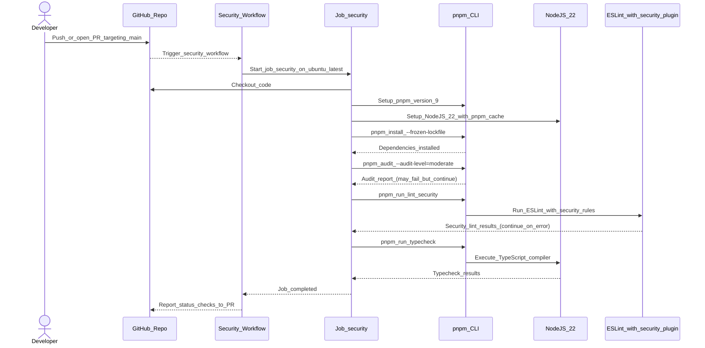
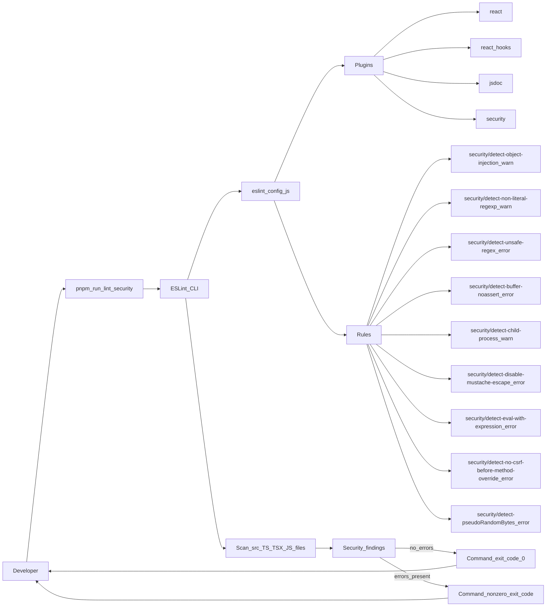

# PR #71 Review Analysis

**Generated**: 2026-01-12T18:56:24.754Z  
**Total Issues**: 10  
**Breakdown**: 10 CRITICAL, 0 HIGH, 0 MEDIUM, 0 LOW

---

## Summary

| Severity | Count | Action Required |
|----------|-------|-----------------|
| CRITICAL | 10 | Fix immediately before merge |
| HIGH | 0 | Fix if <5 min each |
| MEDIUM | 0 | Document for later |
| LOW | 0 | Optional (style/formatting) |

---

## CRITICAL Issues (10)


### 1. Sourcery

```
<!-- Generated by sourcery-ai[bot]: start review_guide -->

## Reviewer's Guide

Adds ESLint security plugin coverage and CI workflow, updates vulnerable PDF-related Python dependencies, fixes a Python regex SyntaxWarning, and documents the completed security audit and new tooling.

#### Sequence diagram for the GitHub Actions security job execution



#### Flow diagram for local lint:security command using ESLint security plugin



### File-Level Changes

| Change | Details | Files |
| ------ | ------- | ----- |
| Integrate eslint-plugin-security into the existing ESLint configuration and enable key security rules. | <ul><li>Import security plugin into shared ESLint config alongside existing plugins.</li><li>Register security plugin under ESLint plugins for both main and test configs.</li><li>Enable a focused set of security rules (object injection, non-literal/unsafe regex, buffer, child-process, eval, CSRF, pseudo-random bytes) with appropriate warn/error levels.</li></ul> | `eslint.config.js` |
| Introduce a dedicated security lint script and dependency in the Node tooling. | <ul><li>Add lint:security npm script that runs ESLint with quiet output over the codebase.</li><li>Add eslint-plugin-security as a devDependency so the security rules can run in CI and locally.</li><li>Update pnpm lockfile to capture the new dependency graph.</li></ul> | `package.json`<br/>`pnpm-lock.yaml` |
| Upgrade Python PDF-related dependencies to address Dependabot security alerts. | <ul><li>Bump pypdf from 6.4.0 to 6.6.0 in the main extraction engine requirements.</li><li>Bump pdfminer.six from 20251107 to 20251230 in the benchmarking requirements file used for non-production workloads.</li></ul> | `extraction_engine/requirements.txt`<br/>`extraction_engine/requirements_benchmark_pdfminer.txt` |
| Resolve a Python SyntaxWarning in the docstring coverage script by correcting regex string handling. | <ul><li>Change the grep command string to a raw string literal to avoid invalid escape sequence warnings in the embedded regex.</li><li>Preserve the existing grep-based logic for counting TypeScript/TSX functions and classes.</li></ul> | `scripts/check_docstring_coverage.py` |
| Add a GitHub Actions security workflow to run audit, ESLint security, and typechecking on pushes and PRs. | <ul><li>Create a new security workflow triggered on push and pull_request to main.</li><li>Set up pnpm, Node 22, and cached dependencies for faster runs.</li><li>Run pnpm audit with a moderate threshold and allow it to fail without breaking the workflow.</li><li>Run the new lint:security script and TypeScript typecheck, both as dedicated steps.</li></ul> | `.github/workflows/security.yml` |
| Document the completed security audit, dependency updates, and new security tooling. | <ul><li>Add a SECURITY_AUDIT.md document describing the audit scope, dependency upgrades, tooling configuration, and test results.</li><li>Record enabled ESLint security rules, CI security checks, and follow-up recommendations for future security improvements.</li></ul> | `docs/SECURITY_AUDIT.md` |

---

<details>
<summary>Tips and commands</summary>

#### Interacting with Sourcery

- **Trigger a new review:** Comment `@sourcery-ai review` on the pull request.
- **Continue discussions:** Reply directly to Sourcery's review comments.
- **Generate a GitHub issue from a review comment:** Ask Sourcery to create an
  issue from a review comment by replying to it. You can also reply to a
  review comment with `@sourcery-ai issue` to create an issue from it.
- **Generate a pull request title:** Write `@sourcery-ai` anywhere in the pull
  request title to generate a title at any time. You can also comment
  `@sourcery-ai title` on the pull request to (re-)generate the title at any time.
- **Generate a pull request summary:** Write `@sourcery-ai summary` anywhere in
  the pull request body to generate a PR summary at any time exactly where you
  want it. You can also comment `@sourcery-ai summary` on the pull request to
  (re-)generate the summary at any time.
- **Generate reviewer's guide:** Comment `@sourcery-ai guide` on the pull
  request to (re-)generate the reviewer's guide at any time.
- **Resolve all Sourcery comments:** Comment `@sourcery-ai resolve` on the
  pull request to resolve all Sourcery comments. Useful if you've already
  addressed all the comments and don't want to see them anymore.
- **Dismiss all Sourcery reviews:** Comment `@sourcery-ai dismiss` on the pull
  request to dismiss all existing Sourcery reviews. Especially useful if you
  want to start fresh with a new review - don't forget to comment
  `@sourcery-ai review` to trigger a new review!

#### Customizing Your Experience

Access your [dashboard](https://app.sourcery.ai) to:
- Enable or disable review features such as the Sourcery-generated pull request
  summary, the reviewer's guide, and others.
- Change the review language.
- Add, remove or edit custom review instructions.
- Adjust other review settings.

#### Getting Help

- [Contact our support team](mailto:support@sourcery.ai) for questions or feedback.
- Visit our [documentation](https://docs.sourcery.ai) for detailed guides and information.
- Keep in touch with the Sourcery team by following us on [X/Twitter](https://x.com/SourceryAI), [LinkedIn](https://www.linkedin.com/company/sourcery-ai/) or [GitHub](https://github.com/sourcery-ai).

</details>

<!-- Generated by sourcery-ai[bot]: end review_guide -->
```


### 2. CodeRabbit

```
<!-- This is an auto-generated comment: summarize by coderabbit.ai -->
<!-- This is an auto-generated comment: review in progress by coderabbit.ai -->

> [!NOTE]
> Currently processing new changes in this PR. This may take a few minutes, please wait...
> 
> <details>
> <summary>📥 Commits</summary>
> 
> Reviewing files that changed from the base of the PR and between 6e45b3910b688e614c9bc1844596ba177e422222 and 2b07c47e242d8698ffb9977fc3f1134b126cc955.
> 
> </details>
> 
> <details>
> <summary>⛔ Files ignored due to path filters (5)</summary>
> 
> * `.github/workflows/security.yml` is excluded by `!.github/**`
> * `BLACKBOX.md` is excluded by `!**/*.md`
> * `docs/PERFORMANCE_LOG.md` is excluded by `!**/*.md`
> * `docs/SECURITY_AUDIT.md` is excluded by `!**/*.md`
> * `pnpm-lock.yaml` is excluded by `!**/pnpm-lock.yaml`, `!pnpm-lock.yaml`
> 
> </details>
> 
> <details>
> <summary>📒 Files selected for processing (5)</summary>
> 
> * `eslint.config.js`
> * `extraction_engine/requirements.txt`
> * `extraction_engine/requirements_benchmark_pdfminer.txt`
> * `package.json`
> * `scripts/check_docstring_coverage.py`
> 
> </details>
> 
> ```ascii
>  _______________________________________________________________________________________________________________________________________
> < Test your estimates. Mathematical analysis of algorithms doesn't tell you everything. Try timing your code in its target environment. >
>  ---------------------------------------------------------------------------------------------------------------------------------------
>   \
>    \   \
>         \ /\
>         ( )
>       .( o ).
> ```

<!-- end of auto-generated comment: review in progress by coderabbit.ai -->


<!-- finishing_touch_checkbox_start -->

<details>
<summary>✨ Finishing touches</summary>

- [ ] <!-- {"checkboxId": "7962f53c-55bc-4827-bfbf-6a18da830691"} --> 📝 Generate docstrings
<details>
<summary>🧪 Generate unit tests (beta)</summary>

- [ ] <!-- {"checkboxId": "f47ac10b-58cc-4372-a567-0e02b2c3d479", "radioGroupId": "utg-output-choice-group-unknown_comment_id"} -->   Create PR with unit tests
- [ ] <!-- {"checkboxId": "07f1e7d6-8a8e-4e23-9900-8731c2c87f58", "radioGroupId": "utg-output-choice-group-unknown_comment_id"} -->   Post copyable unit tests in a comment
- [ ] <!-- {"checkboxId": "6ba7b810-9dad-11d1-80b4-00c04fd430c8", "radioGroupId": "utg-output-choice-group-unknown_comment_id"} -->   Commit unit tests in branch `bb/security-audit-complete-jan12`

</details>

</details>

<!-- finishing_touch_checkbox_end -->

<!-- tips_start -->

---

Thanks for using [CodeRabbit](https://coderabbit.ai?utm_source=oss&utm_medium=github&utm_campaign=Hex-Tech-Lab/hex-test-drive-man&utm_content=71)! It's free for OSS, and your support helps us grow. If you like it, consider giving us a shout-out.

<details>
<summary>❤️ Share</summary>

- [X](https://twitter.com/intent/tweet?text=I%20just%20used%20%40coderabbitai%20for%20my%20code%20review%2C%20and%20it%27s%20fantastic%21%20It%27s%20free%20for%20OSS%20and%20offers%20a%20free%20trial%20for%20the%20proprietary%20code.%20Check%20it%20out%3A&url=https%3A//coderabbit.ai)
- [Mastodon](https://mastodon.social/share?text=I%20just%20used%20%40coderabbitai%20for%20my%20code%20review%2C%20and%20it%27s%20fantastic%21%20It%27s%20free%20for%20OSS%20and%20offers%20a%20free%20trial%20for%20the%20proprietary%20code.%20Check%20it%20out%3A%20https%3A%2F%2Fcoderabbit.ai)
- [Reddit](https://www.reddit.com/submit?title=Great%20tool%20for%20code%20review%20-%20CodeRabbit&text=I%20just%20used%20CodeRabbit%20for%20my%20code%20review%2C%20and%20it%27s%20fantastic%21%20It%27s%20free%20for%20OSS%20and%20offers%20a%20free%20trial%20for%20proprietary%20code.%20Check%20it%20out%3A%20https%3A//coderabbit.ai)
- [LinkedIn](https://www.linkedin.com/sharing/share-offsite/?url=https%3A%2F%2Fcoderabbit.ai&mini=true&title=Great%20tool%20for%20code%20review%20-%20CodeRabbit&summary=I%20just%20used%20CodeRabbit%20for%20my%20code%20review%2C%20and%20it%27s%20fantastic%21%20It%27s%20free%20for%20OSS%20and%20offers%20a%20free%20trial%20for%20proprietary%20code)

</details>

<sub>Comment `@coderabbitai help` to get the list of available commands and usage tips.</sub>

<!-- tips_end -->
```


### 3. Sourcery - package.json:11

```
**🚨 issue (security):** Using `--quiet` suppresses security warnings even though most security rules are configured as `warn`.

Because `--quiet` only reports errors, most `security/*` rules (currently set to `warn` in `eslint.config.js`) will never show up in `lint:security` output. Adjust this by either promoting the critical security rules to `error` or removing `--quiet` here so that security warnings are visible in CI logs.
```


### 4. Sourcery - .github/workflows/security.yml:33

```
**🚨 question (security):** `continue-on-error: true` for `pnpm audit` may hide meaningful security problems from failing CI.

With `continue-on-error: true`, this step will succeed even when `pnpm audit --audit-level=moderate` reports vulnerabilities, so CI won’t enforce that baseline. Consider failing the job on moderate (and above) issues by removing `continue-on-error`, or only using it when auditing for low-severity findings.
```


### 5. Sourcery - .github/workflows/security.yml:37

```
**🚨 suggestion (security):** Security linting step is non-blocking, which may reduce its effectiveness.

Because this step uses `continue-on-error: true`, security lint findings will never fail the job, even if they are severe. If you want security issues to block merges, remove `continue-on-error` here and ensure critical security rules are configured as `error` so they fail the pipeline as intended.

```suggestion
      - name: Run ESLint security checks
        run: pnpm run lint:security
```
```


### 6. Sourcery - docs/SECURITY_AUDIT.md:175

```
**suggestion (typo):** Consider adding a definite article before the project name for grammatical correctness.

Suggested wording: "*This audit is part of the ongoing security maintenance program for the hex-test-drive-man project.*"
```


### 7. Sourcery - scripts/check_docstring_coverage.py:64

```
**security (python.lang.security.audit.dangerous-subprocess-use-audit):** Detected subprocess function 'run' without a static string. If this data can be controlled by a malicious actor, it may be an instance of command injection. Audit the use of this call to ensure it is not controllable by an external resource. You may consider using 'shlex.escape()'.

*Source: opengrep*
```


### 8. Sourcery - scripts/check_docstring_coverage.py:64

```
**security (python.lang.security.audit.subprocess-shell-true):** Found 'subprocess' function 'run' with 'shell=True'. This is dangerous because this call will spawn the command using a shell process. Doing so propagates current shell settings and variables, which makes it much easier for a malicious actor to execute commands. Use 'shell=False' instead.

```suggestion
        grep_result = subprocess.run(grep_cmd, shell=False, capture_output=True, text=True)
```

*Source: opengrep*
```


### 9. Sourcery - scripts/check_docstring_coverage.py:64

```
**security (python.lang.security.audit.dangerous-subprocess-use-audit):** Detected subprocess function 'run' without a static string. If this data can be controlled by a malicious actor, it may be an instance of command injection. Audit the use of this call to ensure it is not controllable by an external resource. You may consider using 'shlex.escape()'.

*Source: opengrep*
```


### 10. Sourcery - scripts/check_docstring_coverage.py:64

```
**security (python.lang.security.audit.subprocess-shell-true):** Found 'subprocess' function 'run' with 'shell=True'. This is dangerous because this call will spawn the command using a shell process. Doing so propagates current shell settings and variables, which makes it much easier for a malicious actor to execute commands. Use 'shell=False' instead.

```suggestion
        grep_result = subprocess.run(grep_cmd, shell=False, capture_output=True, text=True)
```

*Source: opengrep*
```


---

## HIGH Issues (0)

_No high-priority issues found._

---

## MEDIUM Issues (0)

_No medium-priority issues found._

---

## LOW Issues (0)

_No low-priority issues found._

---

## Next Steps

1. **Fix CRITICAL issues** (10 found) - Block merge until resolved
2. **Fix HIGH issues** (0 found) - Fix if <5 min each, otherwise document
3. **Document MEDIUM/LOW** (0 found) - Create follow-up issues

**Generated by**: `pnpm run pr:scrape 71`
