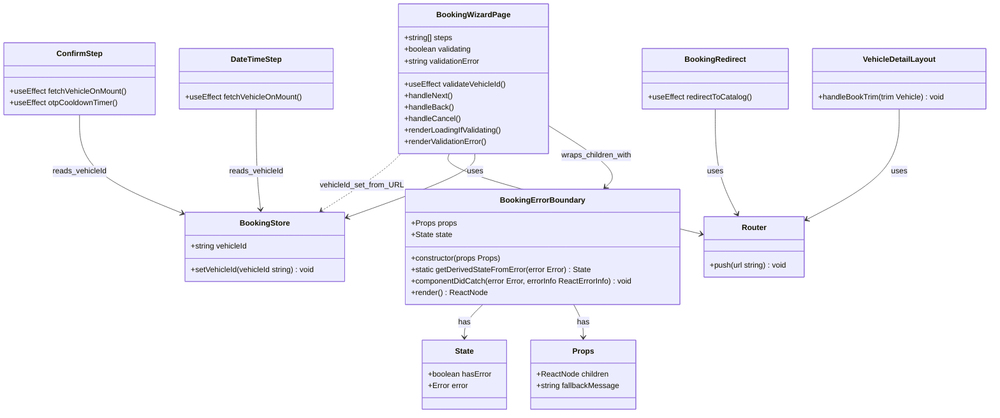
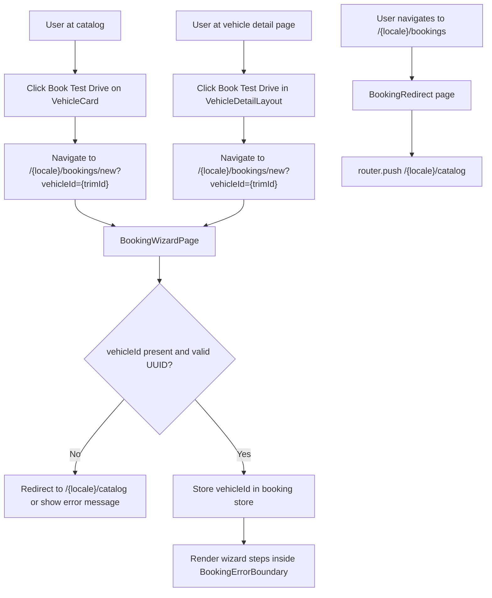
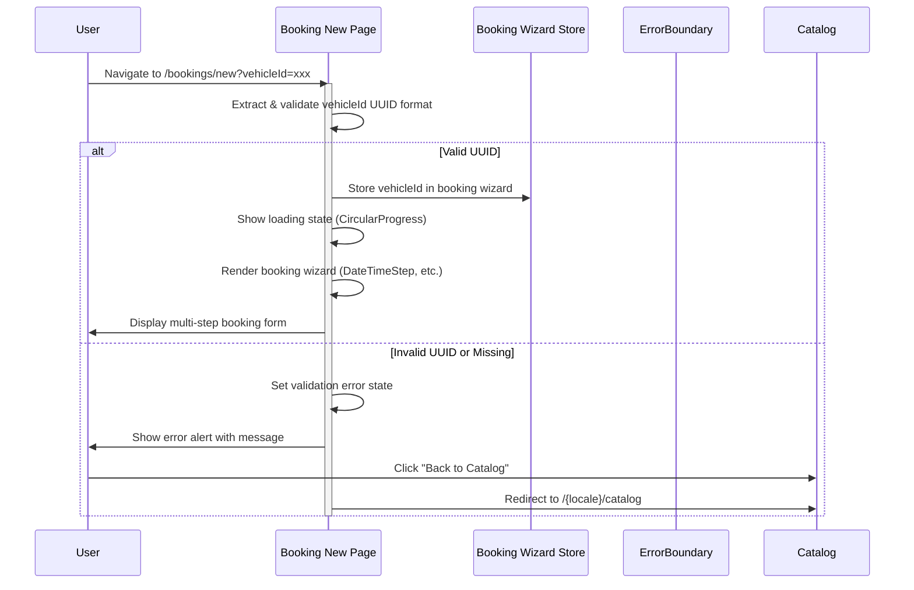

# PR #72 Review Analysis

**Generated**: 2026-01-12T21:24:30.486Z  
**Total Issues**: 6  
**Breakdown**: 0 CRITICAL, 2 HIGH, 2 MEDIUM, 2 LOW

---

## Summary

| Severity | Count | Action Required |
|----------|-------|-----------------|
| CRITICAL | 0 | Fix immediately before merge |
| HIGH | 2 | Fix if <5 min each |
| MEDIUM | 2 | Document for later |
| LOW | 2 | Optional (style/formatting) |

---

## CRITICAL Issues (0)

_No critical issues found._

---

## HIGH Issues (2)


### 1. Sourcery

```
<!-- Generated by sourcery-ai[bot]: start review_guide -->

## Reviewer's Guide

Aligns booking wizard URL parameters across entry points, hardens the booking flow with URL validation and an error boundary, and reduces redundant vehicle fetches in wizard steps, plus documents the system with an in-depth audit.

#### Updated class diagram for booking wizard components and error boundary



#### Flow diagram for booking entry points and URL parameter alignment



### File-Level Changes

| Change | Details | Files |
| ------ | ------- | ----- |
| Align booking wizard URL parameters and entry-point behavior so all flows consistently use vehicleId and require selection from catalog. | <ul><li>Update vehicle-detail booking navigation to pass vehicleId instead of trim in the query string when routing to the booking wizard.</li><li>Change the generic bookings route to redirect users to the localized catalog page instead of directly into the wizard, ensuring vehicle selection happens first.</li><li>Document the full booking wizard architecture, issues, and fix plan in a new system audit markdown document.</li></ul> | `src/components/vehicle-detail/VehicleDetailLayout.tsx`<br/>`src/app/[locale]/bookings/page.tsx`<br/>`docs/WIZARD_SYSTEM_AUDIT.md` |
| Add robust URL validation and error handling around the booking wizard entry page to avoid crashes and confusing states. | <ul><li>Introduce local validation state and a UUID regex to verify vehicleId from search params before initializing the wizard.</li><li>Redirect users to the localized catalog if vehicleId is missing, and show a clear error + back button when the format is invalid.</li><li>Render a loading spinner during validation to prevent flashing incomplete wizard UI.</li><li>Wrap the wizard UI in a new BookingErrorBoundary component so unexpected React/runtime errors show a controlled fallback screen instead of a crash.</li></ul> | `src/app/[locale]/bookings/new/page.tsx`<br/>`src/components/booking/BookingErrorBoundary.tsx` |
| Reduce redundant Supabase vehicle fetches in wizard steps to improve performance and avoid unnecessary re-renders. | <ul><li>Change DateTimeStep and ConfirmStep effects that fetch vehicle data to run only once on mount rather than depending on vehicleId changes.</li><li>Suppress the exhaustive-deps lint warning with comments explaining why vehicleId is intentionally omitted from dependency arrays.</li></ul> | `src/components/booking/wizard/DateTimeStep.tsx`<br/>`src/components/booking/wizard/ConfirmStep.tsx` |

---

<details>
<summary>Tips and commands</summary>

#### Interacting with Sourcery

- **Trigger a new review:** Comment `@sourcery-ai review` on the pull request.
- **Continue discussions:** Reply directly to Sourcery's review comments.
- **Generate a GitHub issue from a review comment:** Ask Sourcery to create an
  issue from a review comment by replying to it. You can also reply to a
  review comment with `@sourcery-ai issue` to create an issue from it.
- **Generate a pull request title:** Write `@sourcery-ai` anywhere in the pull
  request title to generate a title at any time. You can also comment
  `@sourcery-ai title` on the pull request to (re-)generate the title at any time.
- **Generate a pull request summary:** Write `@sourcery-ai summary` anywhere in
  the pull request body to generate a PR summary at any time exactly where you
  want it. You can also comment `@sourcery-ai summary` on the pull request to
  (re-)generate the summary at any time.
- **Generate reviewer's guide:** Comment `@sourcery-ai guide` on the pull
  request to (re-)generate the reviewer's guide at any time.
- **Resolve all Sourcery comments:** Comment `@sourcery-ai resolve` on the
  pull request to resolve all Sourcery comments. Useful if you've already
  addressed all the comments and don't want to see them anymore.
- **Dismiss all Sourcery reviews:** Comment `@sourcery-ai dismiss` on the pull
  request to dismiss all existing Sourcery reviews. Especially useful if you
  want to start fresh with a new review - don't forget to comment
  `@sourcery-ai review` to trigger a new review!

#### Customizing Your Experience

Access your [dashboard](https://app.sourcery.ai) to:
- Enable or disable review features such as the Sourcery-generated pull request
  summary, the reviewer's guide, and others.
- Change the review language.
- Add, remove or edit custom review instructions.
- Adjust other review settings.

#### Getting Help

- [Contact our support team](mailto:support@sourcery.ai) for questions or feedback.
- Visit our [documentation](https://docs.sourcery.ai) for detailed guides and information.
- Keep in touch with the Sourcery team by following us on [X/Twitter](https://x.com/SourceryAI), [LinkedIn](https://www.linkedin.com/company/sourcery-ai/) or [GitHub](https://github.com/sourcery-ai).

</details>

<!-- Generated by sourcery-ai[bot]: end review_guide -->
```


### 2. CodeRabbit

```
<!-- This is an auto-generated comment: summarize by coderabbit.ai -->
<!-- walkthrough_start -->

## Walkthrough

The pull request adds vehicleId validation on mount to the booking new page, displaying loading and error states accordingly. A new BookingErrorBoundary component provides error fallback UI. Booking wizard steps now fetch data only on mount instead of re-fetching on vehicleId changes. The bookings redirect is updated to use locale-aware catalog paths, and vehicle detail layout's navigation parameter is renamed from trim to vehicleId.

## Changes

| Cohort / File(s) | Summary |
|---|---|
| **Booking initialization & validation** <br> `src/app/[locale]/bookings/new/page.tsx`, `src/app/[locale]/bookings/page.tsx` | Adds UUID format validation for vehicleId on page mount, with loading UI (CircularProgress) and error alert with "Back to Catalog" action; updates redirect to use locale-aware catalog path and adds router/locale dependency. |
| **Error boundary component** <br> `src/components/booking/BookingErrorBoundary.tsx` | New React error boundary class component that catches booking errors, displays fallback UI with error message and "Try Again"/"Back to Catalog" actions, logs errors via componentDidCatch for Sentry integration. |
| **Booking wizard steps** <br> `src/components/booking/wizard/ConfirmStep.tsx`, `src/components/booking/wizard/DateTimeStep.tsx` | Changes useEffect dependency arrays from `[vehicleId]` to `[]`, converting reactive fetches to one-time mount-only execution; assumes vehicleId won't change during wizard session. |
| **Vehicle navigation** <br> `src/components/vehicle-detail/VehicleDetailLayout.tsx` | Renames booking URL navigation parameter from `trim` to `vehicleId`. |

## Sequence Diagram



## Estimated code review effort

🎯 3 (Moderate) | ⏱️ ~20 minutes

## Possibly related PRs

- **Hex-Tech-Lab/hex-test-drive-man#68**: Introduces the single-page booking wizard that these changes extend with validation and error handling logic.
- **Hex-Tech-Lab/hex-test-drive-man#60**: Removes conflicting static route that would override the dynamic locale-based booking page being modified here.
- **Hex-Tech-Lab/hex-test-drive-man#66**: Modifies the same booking pages for multi-step form structure in parallel.

<!-- walkthrough_end -->


<!-- pre_merge_checks_walkthrough_start -->

<details>
<summary>🚥 Pre-merge checks | ✅ 3</summary>

<details>
<summary>✅ Passed checks (3 passed)</summary>

|     Check name     | Status   | Explanation                                                                                                                                                                        |
| :----------------: | :------- | :--------------------------------------------------------------------------------------------------------------------------------------------------------------------------------- |
|  Description Check | ✅ Passed | Check skipped - CodeRabbit’s high-level summary is enabled.                                                                                                                        |
|     Title check    | ✅ Passed | The title accurately summarizes the three main aspects of the PR: parameter alignment fixes, error boundary additions, and performance optimizations in the booking wizard system. |
| Docstring Coverage | ✅ Passed | Docstring coverage is 100.00% which is sufficient. The required threshold is 80.00%.                                                                                               |

</details>

<sub>✏️ Tip: You can configure your own custom pre-merge checks in the settings.</sub>

</details>

<!-- pre_merge_checks_walkthrough_end -->

<!-- finishing_touch_checkbox_start -->

<details>
<summary>✨ Finishing touches</summary>

- [ ] <!-- {"checkboxId": "7962f53c-55bc-4827-bfbf-6a18da830691"} --> 📝 Generate docstrings
<details>
<summary>🧪 Generate unit tests (beta)</summary>

- [ ] <!-- {"checkboxId": "f47ac10b-58cc-4372-a567-0e02b2c3d479", "radioGroupId": "utg-output-choice-group-unknown_comment_id"} -->   Create PR with unit tests
- [ ] <!-- {"checkboxId": "07f1e7d6-8a8e-4e23-9900-8731c2c87f58", "radioGroupId": "utg-output-choice-group-unknown_comment_id"} -->   Post copyable unit tests in a comment
- [ ] <!-- {"checkboxId": "6ba7b810-9dad-11d1-80b4-00c04fd430c8", "radioGroupId": "utg-output-choice-group-unknown_comment_id"} -->   Commit unit tests in branch `cc/wizard-system-fixes`

</details>

</details>

<!-- finishing_touch_checkbox_end -->

<!-- tips_start -->

---

Thanks for using [CodeRabbit](https://coderabbit.ai?utm_source=oss&utm_medium=github&utm_campaign=Hex-Tech-Lab/hex-test-drive-man&utm_content=72)! It's free for OSS, and your support helps us grow. If you like it, consider giving us a shout-out.

<details>
<summary>❤️ Share</summary>

- [X](https://twitter.com/intent/tweet?text=I%20just%20used%20%40coderabbitai%20for%20my%20code%20review%2C%20and%20it%27s%20fantastic%21%20It%27s%20free%20for%20OSS%20and%20offers%20a%20free%20trial%20for%20the%20proprietary%20code.%20Check%20it%20out%3A&url=https%3A//coderabbit.ai)
- [Mastodon](https://mastodon.social/share?text=I%20just%20used%20%40coderabbitai%20for%20my%20code%20review%2C%20and%20it%27s%20fantastic%21%20It%27s%20free%20for%20OSS%20and%20offers%20a%20free%20trial%20for%20the%20proprietary%20code.%20Check%20it%20out%3A%20https%3A%2F%2Fcoderabbit.ai)
- [Reddit](https://www.reddit.com/submit?title=Great%20tool%20for%20code%20review%20-%20CodeRabbit&text=I%20just%20used%20CodeRabbit%20for%20my%20code%20review%2C%20and%20it%27s%20fantastic%21%20It%27s%20free%20for%20OSS%20and%20offers%20a%20free%20trial%20for%20proprietary%20code.%20Check%20it%20out%3A%20https%3A//coderabbit.ai)
- [LinkedIn](https://www.linkedin.com/sharing/share-offsite/?url=https%3A%2F%2Fcoderabbit.ai&mini=true&title=Great%20tool%20for%20code%20review%20-%20CodeRabbit&summary=I%20just%20used%20CodeRabbit%20for%20my%20code%20review%2C%20and%20it%27s%20fantastic%21%20It%27s%20free%20for%20OSS%20and%20offers%20a%20free%20trial%20for%20proprietary%20code)

</details>

<sub>Comment `@coderabbitai help` to get the list of available commands and usage tips.</sub>

<!-- tips_end -->

<!-- internal state start -->


<!-- DwQgtGAEAqAWCWBnSTIEMB26CuAXA9mAOYCmGJATmriQCaQDG+Ats2bgFyQAOFk+AIwBWJBrngA3EsgEBPRvlqU0AgfFwA6NPEgQAfACgjoCEYDEZyAAUASpETZWaCrKPR1AGxJcAZvAAeABQC+PgA1vAYRACUXEzMvCSwZIiSJJAA7vAAXs70iLKINMyQfv7SujzOaCVoHvBEGGwYuAA0kJQU+Hwh2Bi0zvDS7dyUPt3MmAzpkAYAco4ClFwA7ABMkIAoBJAAQlQYDLBxDAD0WbkUtGAFRSTMYGUVgEmEkJORW5AAqojLMKKwAAlZKMABpWD4AZVw1GwiC4+FGGCMEMckxcHAMcFQtlKAQqaEgIXCkSImRyeUgFBIRCpiFS+CwcnssgOsC6GByJK+NgAMlUqGwaBREO00LRaFzOt1ILBMLR6lFRf0UAkuhIuaMKOMKJMDiQNJAbKFcIw0LDvPyaiQhSgDgzUrcDvIlrgMiQyJAAGpJeAMLwAEWt2g8PLQsnweEggQABgB+XAUeDMAC80ei6GVuGSZIu9BjsakCD9JAAkrRU+m0D4bbx4NKqT40GJuiLTbCuQA/ADMAAZAMgEABYewBSfg+SBKaHwDxgbhoUiQc3CyAEQnpPoqLwr/CE0JhDRGADSJHkjzhBigVmqtXqjWaJsCEIA6gBRF/ggCM0QMkEq3qLAZBtOobhpGhyYKQ9A+F0JRxgmSaptukBxoWvpeGWiGBAq6QAKwDtEB6/lARIRFEiAnHOC4YPgGSUnQ8BUmIyCrgw1B1PgpIZAgW6JD8FDqlEkAePgrFeIRlQAIIeB4K5su6HQtC4PD4JEuDIIErHQsJRDtJOwa6QxogmiRJKIOm5oKBgDo0C0lqCpQkAYFaiAHhekAvhQXR8LK/QKqSj6vu+kBrN+RGQHMJC0Tse4kh5XnRX0AxKfE3AMuwpq4IcFQ2CQTa4CcKJzgIaA/Cc5Cut0YQdJ5LYZvQEqINwHhhsgBKNtJxUMFVnwlmSWZ0QmsgnJ1VUIuI9riVAT7kpcVQLmKtDIKhxZlpAEh1PAAzjVggSfD1/qlBM1DRAA3K8SCpIJy3ofQ8FEKQy5UhKjEmixbHaWdkTrfUUFHWp9iwDRjBeM41VeS5P6VDy+BilyRTUOkC10BO2CJldG1bXWWCrmgEgqVBzWIAgglSnwbB0vO0iuZeYxHXqUbPm+4JdqFlT+gj7hsFCJDcHVkAAMIMn4Orc7zY1JjkyOrlSzD4FIa0+itUEwYuPwvj4PhGROPNkEoBxDBDYX/mh6RbW11pZfQDLTDwDnnBSPx0ljUbUSamr2NCNCMD5pDRO0T3YAwXKFSoJXpAAjtglAG3zVJgFS/SUBDBgAGLThU4FRMjgQIEQsBCSQUgeLEblSQ05D0HOApwl6iuAVOIZhhGmhqf4orcNwJwANrCaJJAALrDTFZEUZTGit7pInkU+JYAFoSTY/oAPoQgAmhC0AvgAskvEmfP6JbQBozB5uQGTflAcXSj58oknELCpeQLTkSZUQnNFxJRFfFAJf0ziyOPRA/gXaRT9ugDu3de51AHkPT+RByJn1HqQQB/g3JWFpjqKYFoUppWfrA0iRAzgzVoCcdmNBOYkFFig9ogsMDC2YFQ1uRhvSJj8JpLGGIoA7GwNOWg7RoDAkoQwRM3ATRFETGIV4igSBKnoAqN2JUIZQH9CJBQUgqALipKlCgNB6AAE4cIaBwisYcB4oDQGkCaLKXV6hFBQMUZAkQ/TYCUBldiRAnj20uLpICHhPHEIMi9SAJwyD4NMnRZ6Rl2hfQxicZgF0uTXVLPQG+flZGOWtBkSqYNpTtQ8CNVyNgkBhC4PzH2FREBMFGLdHcr9SQ+GEhkM6XQOpNiqk1TAXAqTqKsSweJ/13jdKTukboSgKAGhUQwRw7BqAcIUKqJIKQ0g4AlCaJG9BqATinicGe89F4r3XpvHee8D5HxPtTMAhgDAmCgLrMcOACDEDIMoXR8z7xcF4PwYQRk0gyHkEwMZKg1CaG0LoS51zwDmIQI41qWAzSPNIOQKgrz4jvMpGgWiDgnBKSZAC5Qqh1BaB0PoIwELTAGEQBQU4aAIE9xEtAwedSEGRSQfqVuGIABEXKDAWEgBJEsTykUI3yKif+9zM6kEQEYKAElxTIGErDQSco1oY1mQyUojTDp8CSatdVss+icFtAmRQgcKjfU2rMpVypzWYwZN/D2CNRRfH2lqyYVjkhdXSU9QyTEkKaXcSgcc8SnZRANJ6DGzqSz+lalSD23RkbvCzOkOpOYHYECpJ9DANrXXUGYome6DlMA5L4PDL2WR+oEiXA8JsXJyaIDHqXbARB7zIB6khBsXhJFnwdTQGuRMaKtQFgxKZzUKBWC6DSaQyBy35wJAqiUgk62U0yNxdINrLVEDOg1DphQMzFvQF4HRfVZ27DaUhfm70OLoDEM7eA4513bVKMGRAZ0MhUG4MxbMbwsBMBaOld4BIP4EO/r/JKp5cl1HyWe0mMo5R+TMZAEsCRuj/RIP4OcidaBcCcR4FxFRzRQkdUOql2BR3jo4rSVsUlKBtBgMCCjNLYCyHSUB2KNUf4Rj/i4dJ5pP13FtLJdICcxlcm0r6BDW9tAtCk8gNDSBxCLtI+Ia4NBeYpoaUDQIZD0gADIYBJhkYhg6nwmowz4QLIWDFmDphnYJ+wVpICi3dsq39NlenIafv9AQkZqK0SWMTegv7VlYzqHRROaNSTFR+FbLAD7nalv1G5Y8PNkBOXVEQNVP6GTGo8LC/IqmeATso87MTDB2i2fidRPgtIEyB1wKjLkOMGCosUAjDozgPDyCpPVigVktVCTM1yZVMGEvJ3MJYKSQpMvMR3Em7WfpqjbWQPgccaHtGvOlNwbAAh6gMAUuIcQ0hpXhTSsYXUd7LFLz8F4Qwc4upjyEIgBk1y4mYAu0UK76cjA8kiBncpWHIAAGo9F6JOGAHCPYjAviKEmYVChXHdKGLREgGsUNcC3vRRwBguUculeSyl1LaVQK8Iy4e8DWUoM5dy3l/LBUvORlitE8gVvewgkdtySH1tcHWarEgV5q6lBVuQfw+U0sNEywh6GfcOgi6oDehkXTcqLQG9L6CLBKTN3SFXGorYlCNiU41ncAByMgRuEM5UiZI6EFBSCGolcjNXJQjdhJHmfI3SECT+u0lUfq7ZBLE4tM7gA3gHgAvicL3HEzduXVprSRShER6yDtILgvntaJ/4FgLoeBC3KgDwhwWrB2A12wNwLaUsdwdq1t6l6zs3paSvcqqkkdDL3iQj8TtayFYAWTSj+Nu44EIbmDuLbO3fR8qsCWE4qRGgwljfbmbMv1vI3YOoA2rkfvkGQPbgHwOwc4ShzDt1yM8V0XVJFDoqOdHo8x8wbH3KLz46pRHh+uC1Iu8Iaxr+7HQP/0p/f3HGnAVRFenEVbFZnccBfY7EsRSE1aYQdbtP0IYFoa4TadIHKPKfdXoLjf5V/TzXYMnEDTjMDATAnF/DzYvD/d+Qgn/Ygv/VuA0EsKxagLKWTdjZAWgBrQSObdTRpdoH4AZP9XrULBLJCbdZqeQNqSDEaL4EsdJbSNg8GNaeAT3PA9gf0TaC9TKWAA0OAdINtftDIWFfdX0BkJ1X9PwIgVGTcdIPJEaDHCmBcXgBEdoObViURVGFfdjV4KdSmdJCqa9JbLgQAHAJoAlIJIMtIhABcAijCpHnT4zmkRmVFpGtEUOlAS0rGVGCJ2DPVXC0PcRiMCDFwy17SQhCQwAj0vRiANBfHQxQwSJwXwJKjsz1zNA8BNDWxQ0YIOFwyUGQFLXH1t0DETCkFoEIxoBThgntWG28O0iIA1GammEBg8DGX6whHYCUlUmpGRSxnElJR5Qm3aJeSxkXzmyUAWx2PtHuU6J0WRk2221232zX3ZygH5kJlanFDoC4GjC/yICIMSn/mjAE2jDIMaMoLqWoLgX+JwJQSBMCFaKUyXxQ2/H2IOMgEkw5E1jsTTi3Akick62yEoG+1+233+y4EBwAA5QcwBIcDBodxBj9AtpEz8kdL9tRDUMcJQsccc8cwAjBQS1C8EISvESFaF6FGEgEqdACJtgDnlkUGdRUlIWcoC3Iyk2cEikkJw2JSgLZ84Uc49XpK8+hM9OtM8pEDVCQuseZFjGtswE9dYyAGB5Au4dVaB+5j0907hRFJDPIwx0kFpjDIhsIJwkAbCOhEB5E3l0pbMCRXZ0gsxNlXTMgGQjd3U2cUYIs7MRTdDoUD0hRt9ssWkNUgZHc6I8pllNZtCuR1UkyF8PdM8SAwAGTbDdSzSwTbJ9UWhXJxs+UjjLi+tVwzjRBR1ptri6jbirY+BR9HjV9DspU3Jh9yBiSt9Wcs5d81gwcPxD8GS4dT9EcL99S0d0Tb8ADeT+Tn92z39hTiFSEOYDMJT/ApS0TacQD5SwCmdxVyl5yoV1w1YNYtZ3htMKFRZHIgYKA+hlt6Y9VOMTRIhbgxR7k45wKMAORBIuIPRayvyczTYdZE4nR0BfT5AMhmid9Bd1cXS65kl3TVwu53TlVVCi9bIYysBpBIyGowziKPilAalgZBgfB5AEyTQkzUBXYl8jIK9VyFxODMy5sRT7Ap1dj3JvDUkhtMxsxKzDgBt5i9sZYpM7N602Byt1B845sNKTL80Ho7isBOy1llRSYTh504ZPYKheJKBRjuzny+zRzBy7ThzFsTixzl9JyeAHjx9ZyDZjtFySBly/s2d1zNztzYcUVmT9zkcr8OSTyeTH8+SKULzBT38kkwA9JpwThjZixAwG4QJm5/8eSgC6c3z7BFSIDJL2c1S1y7MU1ijMs1xZR1RpR3gyr65gwqq8BKc7Ns8FNSRtd7I+BE1swU1PheRMhmiE4rRlZ1d4IShVxXT2gJVqyMBTS5tI5KB5BprrQHInI2A+Z1Alo6go57AIwqVDMuJ05CtpA3LbSRl1FINHJcZxdH0NMMgPKacvKlskIhyLjRyWcbiNspzQq9twqXiTslzrlzssTcBPsbsDA7swgHsnskRgBXtMTLtrtoqDBN9Yq1zySNywA1hErGT4chNC5WTDzr9jyuS78sqSUyVbllQWd4VCBXzdy+l2AukMVGrwDLTGaqACUQViVwUbk3l1Al5NpEAl5Uq6Al54Yj1ubFbaABBaA9Eew0AuwAA2U20QEgCktYCHWgNYWgU2gQAcAcD8CkiHU2hgLsAcBgFYBgNYY2sUDYXWyFJWjG1W9W5myKTWu5ElRWxIJeNgG3EgJeaxMINW7Wk0bmoPSGDlJAWwHYXuMIOgQve8KwfAW4WgDlXwOoH4VoHO/tUjWgAukSMIWwKup9XLGRHOpAAAeXUUTE+IwHbvalrpzolFoBsD6EmShAi0QDKVEDCHbtqy7t/A5XHsnowHcFwC8Hnq6iXvApXsgDXs2g3sDEqREW2l3sXurs7rrtXoVCLtoBLDpCjkQBnvbq5TvqPsJlwCvpygcHaMQHbq7khl/Gzt/AgaPtTrmCtA/rPuEXgFEWdivo5S/sgY5VLVhH3qjjQYgY5TW2aicm2g/qvvsAiA7mRleOkRsCBXUEAEwCZAXOWAMALwIuCWj81AMgGw2gDQVB0BvB2WJQD+4i3rEkPhyB1e7oBoSIOoK+mBtgD+vohBpBhkXHSB0PXB8BiRjlaB2BrgDlLercVO8R7RzBoBrgZe3B1eghzATLD+vQlcTwRGZrawmgU0xnQYQkhIrMKkdIb9dARqIyZbccObWwD5a8c6vgDaO8dKM8doGDbAkghaNfe0dJTUbUXUG2cWeJXIMGua5NMnVNWaG4YoXhqxo+wRkgYR5wVCogEx9BxiSzKwqkYemuw+9BqR+Y/EuRvRo+g7LwNRiBjR/hrR9B3RhR/RyZcRLkQWb60gepvBsx7B9pvBmxohrGOBqeeCQSJgOZ9IVAD8HsHsDQI50cF6zS1ABwDWX0ZAzQGAbMZvHhJ6WSWkZY+gVACk4505sp/h1eyp6p0RqIBZyR/NGRjwHpiZo+2gLZ2ewZ38UPSGfuL+jlH+2weBi+jZ/RnwFYMUD8J2nwcUFQLsUQCkzWJsP2lYAxCk02lYdYNAAcCkugLsFYR2hgD8H2nwD8AcTWO202j8D8fWvRBgHwCkz5kgYxExlFkqXAWwQxqprFnwHCBgJ2nsNYNANAHsFYTVikhgU2nsAcHCLsQ5gQI1pYEV02kVnCRsHsHwaYY1nwLsNAC2lYfFvRbl1iNAHVj8NYAQU2yV6FhgaZqIWZ5QUgGAoUfE8Y+VyAUZo+sgmlTuOlPuUnOBciSiNlIBdu2N1eggLSFOPoeXKyduj8cpjlHwAtpbaaLMKZ7Z+BYt/h4Z9B+NonelEnD/ZlDICnVuLN35vp/APNitk44t0t8tg4St4ymt2FrgLc9R3BjBvKigoUsnIhXME4MUqzB8ntiRvtgdsdod6dkdwd+0Kt2ASd0yet2d/h+d04S8l+ZdkU288he81TFBLd7R3NuofNvd+0Yd3tsto9qyE9s9siC9oZudgUxdgqyioq3xUqyiiq4apuUa7trgbNndz9gD8xyAEtv90dwtxAIDmF896dhtyGBFhFnmt6hOygUgFOj1NOpeGOy5IAA -->

<!-- internal state end -->
```


---

## MEDIUM Issues (2)


### 1. SonarCloud

```
## [](https://sonarcloud.io/dashboard?id=Hex-Tech-Lab_hex-test-drive-man&pullRequest=72) **Quality Gate passed**  
Issues  
 [5 New issues](https://sonarcloud.io/project/issues?id=Hex-Tech-Lab_hex-test-drive-man&pullRequest=72&issueStatuses=OPEN,CONFIRMED&sinceLeakPeriod=true)  
 [0 Accepted issues](https://sonarcloud.io/project/issues?id=Hex-Tech-Lab_hex-test-drive-man&pullRequest=72&issueStatuses=ACCEPTED)

Measures  
 [0 Security Hotspots](https://sonarcloud.io/project/security_hotspots?id=Hex-Tech-Lab_hex-test-drive-man&pullRequest=72&issueStatuses=OPEN,CONFIRMED&sinceLeakPeriod=true)  
 [0.0% Coverage on New Code](https://sonarcloud.io/component_measures?id=Hex-Tech-Lab_hex-test-drive-man&pullRequest=72&metric=new_coverage&view=list)  
 [0.0% Duplication on New Code](https://sonarcloud.io/component_measures?id=Hex-Tech-Lab_hex-test-drive-man&pullRequest=72&metric=new_duplicated_lines_density&view=list)  
  
[See analysis details on SonarQube Cloud](https://sonarcloud.io/dashboard?id=Hex-Tech-Lab_hex-test-drive-man&pullRequest=72)


```


### 2. CodeRabbit - src/app/[locale]/bookings/new/page.tsx:41

```
_🧹 Nitpick_ | _🔵 Trivial_

**Move constant regex to module scope.**

`UUID_REGEX` is a static pattern that doesn't depend on component state or props. Defining it inside the component causes unnecessary recreation on each render and may trigger exhaustive-deps warnings.

<details>
<summary>♻️ Suggested refactor</summary>

```diff
+'use client';
+
+import { useEffect, useState } from 'react';
+// ... other imports
+
+/** UUID v4 validation pattern */
+const UUID_REGEX = /^[0-9a-f]{8}-[0-9a-f]{4}-[0-9a-f]{4}-[0-9a-f]{4}-[0-9a-f]{12}$/i;
+
 export default function BookingWizardPage() {
   // ... component code
-  // UUID validation regex
-  const UUID_REGEX = /^[0-9a-f]{8}-[0-9a-f]{4}-[0-9a-f]{4}-[0-9a-f]{4}-[0-9a-f]{12}$/i;
```
</details>

<details>
<summary>🤖 Prompt for AI Agents</summary>

```
In @src/app/[locale]/bookings/new/page.tsx around lines 40 - 41, The UUID_REGEX
constant is defined inside the component causing it to be recreated each render;
move UUID_REGEX to module scope (top-level) so it’s initialized once, remove the
in-component declaration, and update any references (e.g., in the page component
or BookingForm functions that currently use UUID_REGEX) to use the top-level
symbol; ensure imports/exports aren’t affected and run lint/tests to confirm no
exhaustive-deps warnings remain.
```

</details>

<!-- fingerprinting:phantom:poseidon:ocelot -->

<!-- This is an auto-generated comment by CodeRabbit -->
```


---

## LOW Issues (2)


### 1. CodeRabbit - src/components/booking/BookingErrorBoundary.tsx:6

```
_⚠️ Potential issue_ | _🟡 Minor_

**Unused import: `useRouter` cannot be used in class components.**

React hooks like `useRouter` can only be used in functional components. This import is dead code.


<details>
<summary>🧹 Proposed fix</summary>

```diff
-import { useRouter } from 'next/navigation';
```
</details>

<!-- suggestion_start -->

<details>
<summary>📝 Committable suggestion</summary>

> ‼️ **IMPORTANT**
> Carefully review the code before committing. Ensure that it accurately replaces the highlighted code, contains no missing lines, and has no issues with indentation. Thoroughly test & benchmark the code to ensure it meets the requirements.

```suggestion

```

</details>

<!-- suggestion_end -->

<details>
<summary>🤖 Prompt for AI Agents</summary>

```
In @src/components/booking/BookingErrorBoundary.tsx at line 6, The file imports
useRouter but BookingErrorBoundary is a class component, so the hook is unused
and invalid; remove the dead import of useRouter from the top of the file and,
if router navigation is needed inside the BookingErrorBoundary class, replace
hook usage with Next.js router alternatives (e.g., pass router methods via props
or use next/navigation's redirect/server-side APIs) and update any references
accordingly to avoid hook usage inside the BookingErrorBoundary class.
```

</details>

<!-- fingerprinting:phantom:poseidon:ocelot -->

<!-- This is an auto-generated comment by CodeRabbit -->
```


### 2. CodeRabbit - src/components/booking/BookingErrorBoundary.tsx:79

```
_⚠️ Potential issue_ | _🟠 Major_

**Hardcoded locale breaks i18n for Arabic users.**

The "Back to Catalog" button navigates to `/en/catalog`, ignoring the user's current locale. Arabic users would be unexpectedly redirected to the English catalog.

Consider accepting `locale` as a prop or extracting it from the current URL:


<details>
<summary>🐛 Proposed fix - accept locale as prop</summary>

```diff
 interface Props {
   children: ReactNode;
   fallbackMessage?: string;
+  locale?: string;
 }
```

```diff
             <Button
               variant="outlined"
               onClick={() => {
-                window.location.href = '/en/catalog';
+                window.location.href = `/${this.props.locale || 'en'}/catalog`;
               }}
             >
               Back to Catalog
             </Button>
```

Then pass locale from the parent:
```tsx
<BookingErrorBoundary locale={locale}>
```
</details>

<details>
<summary>🤖 Prompt for AI Agents</summary>

```
In @src/components/booking/BookingErrorBoundary.tsx around lines 72 - 79, The
Back to Catalog button currently hardcodes "/en/catalog" causing locale breaks;
update BookingErrorBoundary to accept a locale prop (or derive locale from the
current router/location) and replace the hardcoded path with a computed path
using that locale (e.g., `/${locale}/catalog`), update the BookingErrorBoundary
component props/type signature and any callers to pass the locale (or implement
a small helper that reads locale from the URL/next/router/react-router) so the
Button's onClick uses the correct localized route instead of "/en/catalog".
```

</details>

<!-- fingerprinting:phantom:poseidon:ocelot -->

<!-- This is an auto-generated comment by CodeRabbit -->
```


---

## Next Steps

1. **Fix CRITICAL issues** (0 found) - Block merge until resolved
2. **Fix HIGH issues** (2 found) - Fix if <5 min each, otherwise document
3. **Document MEDIUM/LOW** (4 found) - Create follow-up issues

**Generated by**: `pnpm run pr:scrape 72`
