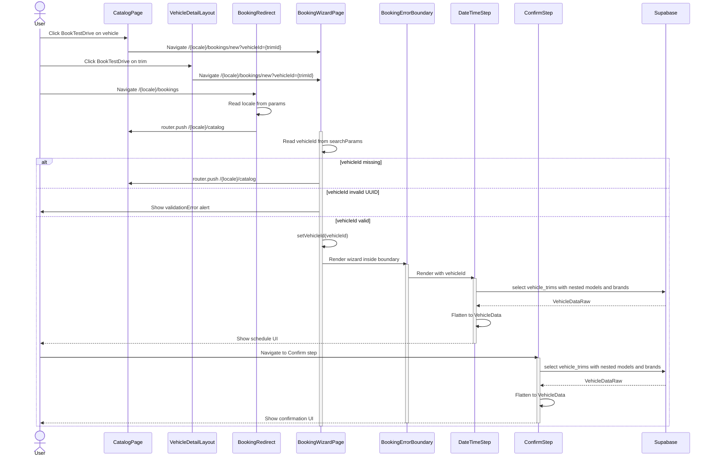
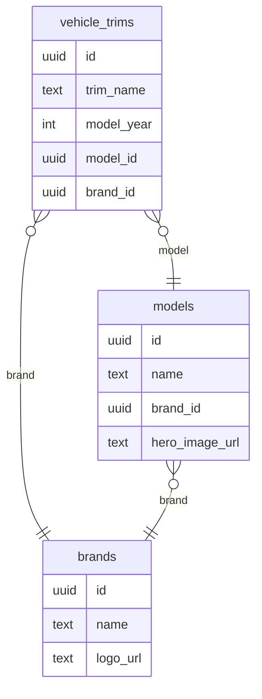
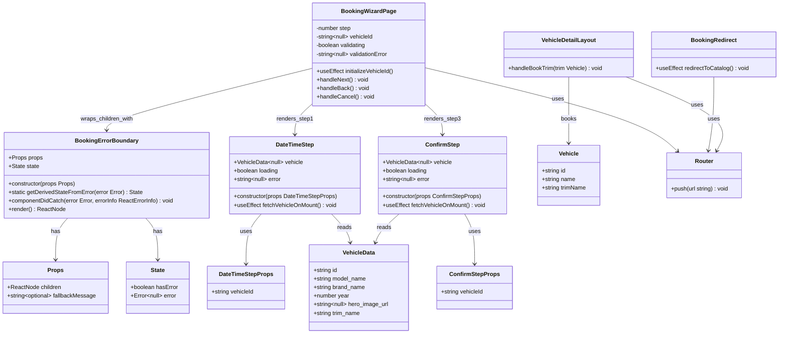
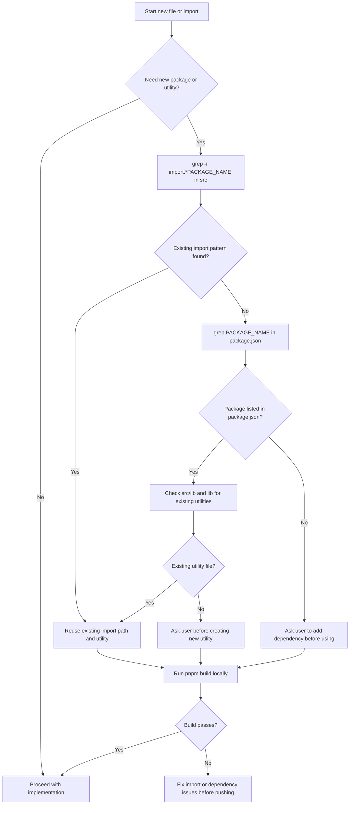
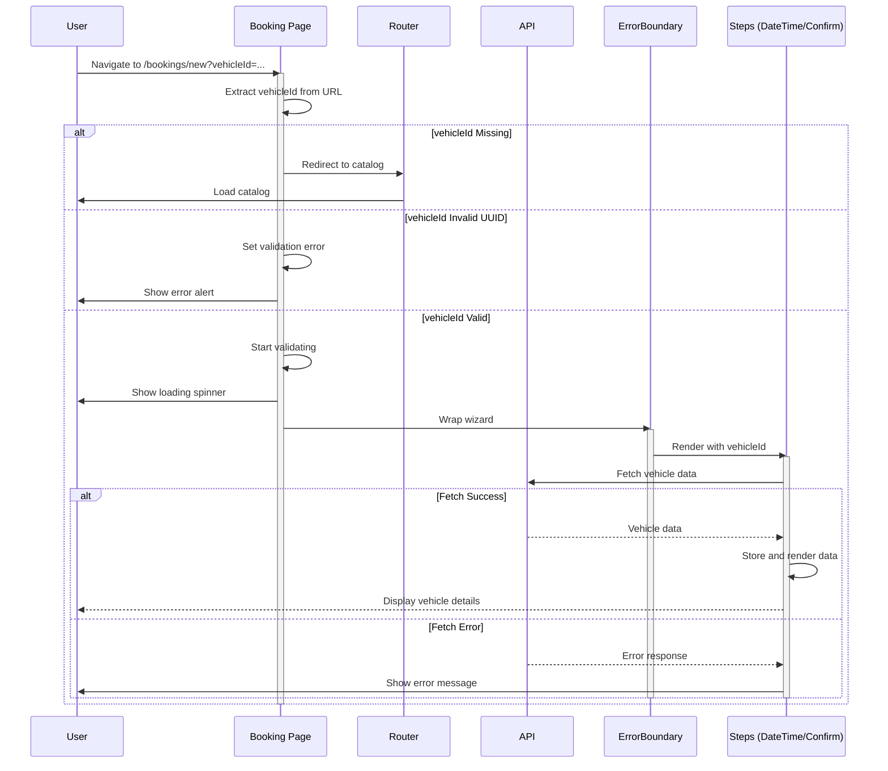

# PR #73 Review Analysis

**Generated**: 2026-01-13T09:22:45.316Z  
**Total Issues**: 19  
**Breakdown**: 3 CRITICAL, 0 HIGH, 7 MEDIUM, 9 LOW

---

## Summary

| Severity | Count | Action Required |
|----------|-------|-----------------|
| CRITICAL | 3 | Fix immediately before merge |
| HIGH | 0 | Fix if <5 min each |
| MEDIUM | 7 | Document for later |
| LOW | 9 | Optional (style/formatting) |

---

## CRITICAL Issues (3)


### 1. Sourcery

```
<!-- Generated by sourcery-ai[bot]: start review_guide -->

## Reviewer's Guide

Aligns booking entry flows on a single vehicleId-based contract, adds a booking error boundary and URL validation to harden the wizard, corrects Supabase vehicle queries to match the real schema, and introduces strict agent/dependency protocols and documentation to prevent future import/schema regressions.

#### Sequence diagram for booking entry and vehicleId validation



#### Entity relationship diagram for vehicle_trims, models, and brands



#### Updated class diagram for booking wizard page and related components



#### Flow diagram for Dependency Check Protocol before new imports



### File-Level Changes

| Change | Details | Files |
| ------ | ------- | ----- |
| Refactored booking wizard flow to validate vehicleId from URL, gate rendering on validation, and wrap the multi-step UI in a dedicated error boundary. | <ul><li>Added validating and validationError state to the booking wizard page and a UUID regex to check vehicleId from search params on mount.</li><li>Redirected users without a vehicleId to the locale-aware catalog route and show a clear error + back-to-catalog action for invalid IDs.</li><li>Wrapped the wizard content in a new BookingErrorBoundary component that catches runtime errors and shows a retry/back UI while preserving a clean layout.</li><li>Updated step rendering to pass vehicleId explicitly into DateTimeStep and ConfirmStep and only render them when vehicleId is present.</li></ul> | `src/app/[locale]/bookings/new/page.tsx`<br/>`src/components/booking/BookingErrorBoundary.tsx` |
| Aligned booking entry points and routing to consistently use vehicleId and require catalog-based vehicle selection. | <ul><li>Changed VehicleDetailLayout booking CTA to navigate with a vehicleId query parameter instead of trim.</li><li>Updated the /[locale]/bookings redirect page to send users to the locale-specific catalog instead of directly into the wizard, ensuring a vehicle is chosen first.</li></ul> | `src/components/vehicle-detail/VehicleDetailLayout.tsx`<br/>`src/app/[locale]/bookings/page.tsx` |
| Updated wizard steps to use the canonical Supabase client and correct vehicle schema, flattening joined data into a local view model. | <ul><li>Switched DateTimeStep and ConfirmStep to import the shared Supabase client from '@/lib/supabase' instead of a duplicate client file.</li><li>Changed vehicle_trims queries to select trim_name, model_year, and nested models(name, brands(name), hero_image_url) instead of non-existent denormalized columns.</li><li>Introduced local raw/flattened vehicle data interfaces and mapping logic, with basic loading and error states before rendering summary markup.</li></ul> | `src/components/booking/wizard/DateTimeStep.tsx`<br/>`src/components/booking/wizard/ConfirmStep.tsx` |
| Documented the booking wizard audit, schema bug, and fixes, and instituted a mandatory dependency/import verification protocol for agents. | <ul><li>Added several detailed markdown reports describing the wizard system audit, schema bug discovery, and fixes, plus a PR#72 review analysis.</li><li>Extended CLAUDE.md with a Dependency Check Protocol that mandates grepping for existing imports, checking package.json, and using existing utilities before adding new ones.</li><li>Introduced AGENT_PROTOCOL.md and a PR template with a pre-merge checklist enforcing the dependency protocol and warning that violations lead to build failures.</li><li>Logged the 2026-01-13 Supabase import crisis and its resolution in PERFORMANCE_LOG.md to provide historical context and rationale for the new protocol.</li></ul> | `docs/WIZARD_SYSTEM_AUDIT.md`<br/>`docs/WIZARD_FIXES_SUMMARY_2026-01-12.md`<br/>`docs/CRITICAL_SCHEMA_BUG_2026-01-12.md`<br/>`docs/PR_72_REVIEW_ANALYSIS.md`<br/>`docs/PR_55_REVIEW_ANALYSIS.md`<br/>`docs/PR_59_REVIEW_ANALYSIS.md`<br/>`docs/PERFORMANCE_LOG.md`<br/>`CLAUDE.md`<br/>`AGENT_PROTOCOL.md`<br/>`.github/PULL_REQUEST_TEMPLATE.md` |

---

<details>
<summary>Tips and commands</summary>

#### Interacting with Sourcery

- **Trigger a new review:** Comment `@sourcery-ai review` on the pull request.
- **Continue discussions:** Reply directly to Sourcery's review comments.
- **Generate a GitHub issue from a review comment:** Ask Sourcery to create an
  issue from a review comment by replying to it. You can also reply to a
  review comment with `@sourcery-ai issue` to create an issue from it.
- **Generate a pull request title:** Write `@sourcery-ai` anywhere in the pull
  request title to generate a title at any time. You can also comment
  `@sourcery-ai title` on the pull request to (re-)generate the title at any time.
- **Generate a pull request summary:** Write `@sourcery-ai summary` anywhere in
  the pull request body to generate a PR summary at any time exactly where you
  want it. You can also comment `@sourcery-ai summary` on the pull request to
  (re-)generate the summary at any time.
- **Generate reviewer's guide:** Comment `@sourcery-ai guide` on the pull
  request to (re-)generate the reviewer's guide at any time.
- **Resolve all Sourcery comments:** Comment `@sourcery-ai resolve` on the
  pull request to resolve all Sourcery comments. Useful if you've already
  addressed all the comments and don't want to see them anymore.
- **Dismiss all Sourcery reviews:** Comment `@sourcery-ai dismiss` on the pull
  request to dismiss all existing Sourcery reviews. Especially useful if you
  want to start fresh with a new review - don't forget to comment
  `@sourcery-ai review` to trigger a new review!

#### Customizing Your Experience

Access your [dashboard](https://app.sourcery.ai) to:
- Enable or disable review features such as the Sourcery-generated pull request
  summary, the reviewer's guide, and others.
- Change the review language.
- Add, remove or edit custom review instructions.
- Adjust other review settings.

#### Getting Help

- [Contact our support team](mailto:support@sourcery.ai) for questions or feedback.
- Visit our [documentation](https://docs.sourcery.ai) for detailed guides and information.
- Keep in touch with the Sourcery team by following us on [X/Twitter](https://x.com/SourceryAI), [LinkedIn](https://www.linkedin.com/company/sourcery-ai/) or [GitHub](https://github.com/sourcery-ai).

</details>

<!-- Generated by sourcery-ai[bot]: end review_guide -->
```


### 2. Sourcery - docs/CRITICAL_SCHEMA_BUG_2026-01-12.md:93

```
**security (curl-auth-header):** Discovered a potential authorization token provided in a curl command header, which could compromise the curl accessed resource.

*Source: gitleaks*
```


### 3. Sourcery - docs/CRITICAL_SCHEMA_BUG_2026-01-12.md:93

```
**security (generic-api-key):** Detected a Generic API Key, potentially exposing access to various services and sensitive operations.

*Source: gitleaks*
```


---

## HIGH Issues (0)

_No high-priority issues found._

---

## MEDIUM Issues (7)


### 1. CodeRabbit

```
<!-- This is an auto-generated comment: summarize by coderabbit.ai -->
<!-- walkthrough_start -->

## Walkthrough

The changes introduce a vehicle selection validation flow for the booking process. The booking page now validates that a vehicleId exists in the URL; if missing, it redirects to the catalog; if invalid, it displays an error state. DateTimeStep and ConfirmStep are refactored to accept vehicleId as a prop and independently fetch vehicle data. A new error boundary component handles runtime errors during the booking flow.

## Changes

| Cohort / File(s) | Summary |
|---|---|
| **Booking Page Validation & Error Handling** <br> `src/app/[locale]/bookings/new/page.tsx`, `src/components/booking/BookingErrorBoundary.tsx` | New validation logic redirects to catalog if vehicleId missing or invalid; conditional rendering for loading/error/success states. New BookingErrorBoundary class wraps wizard to catch and handle rendering errors with fallback UI. |
| **Booking Wizard Steps Refactoring** <br> `src/components/booking/wizard/DateTimeStep.tsx`, `src/components/booking/wizard/ConfirmStep.tsx` | Both components refactored to accept vehicleId as prop instead of relying on global store. ConfirmStep simplified from complex OTP/booking flow to data-loading display component (-358 lines); DateTimeStep similarly streamlined to fetch and display vehicle data (-159 lines). |
| **Routing & Navigation Updates** <br> `src/app/[locale]/bookings/page.tsx`, `src/components/vehicle-detail/VehicleDetailLayout.tsx` | Bookings page redirect now locale-aware, pointing to /{locale}/catalog instead of fixed path. VehicleDetailLayout updated to pass vehicleId as query parameter instead of trim. |

## Sequence Diagram



## Estimated Code Review Effort

🎯 4 (Complex) | ⏱️ ~45 minutes

## Possibly Related PRs

- **PR `#72`** — Modifies the same booking flow files and code-level entities (validation, error boundary, DateTimeStep/ConfirmStep signatures, and parameter handling).
- **PR `#68`** — Modifies the same booking wizard implementation with prop-driven vehicleId changes on top of the single-page wizard foundation.
- **PR `#70`** — Updates the bookings page redirect to point to a locale-aware path, addressing the same routing mechanism in the booking flow.

<!-- walkthrough_end -->


<!-- pre_merge_checks_walkthrough_start -->

<details>
<summary>🚥 Pre-merge checks | ✅ 1 | ❌ 2</summary>

<details>
<summary>❌ Failed checks (2 warnings)</summary>

|     Check name     | Status     | Explanation                                                                                                                                                                                                           | Resolution                                                                                                                                                                                                               |
| :----------------: | :--------- | :-------------------------------------------------------------------------------------------------------------------------------------------------------------------------------------------------------------------- | :----------------------------------------------------------------------------------------------------------------------------------------------------------------------------------------------------------------------- |
|     Title check    | ⚠️ Warning | The PR title 'docs: add agent turn-start enforcement protocol' does not match the actual changeset, which primarily implements booking wizard fixes with URL validation, error boundaries, and component refactoring. | Revise the title to accurately reflect the main changes, such as 'feat: add vehicleId validation and error handling to booking wizard' or 'refactor: restructure booking flow with URL validation and error boundaries'. |
| Docstring Coverage | ⚠️ Warning | Docstring coverage is 60.00% which is insufficient. The required threshold is 80.00%.                                                                                                                                 | Write docstrings for the functions missing them to satisfy the coverage threshold.                                                                                                                                       |

</details>
<details>
<summary>✅ Passed checks (1 passed)</summary>

|     Check name    | Status   | Explanation                                                 |
| :---------------: | :------- | :---------------------------------------------------------- |
| Description Check | ✅ Passed | Check skipped - CodeRabbit’s high-level summary is enabled. |

</details>

<sub>✏️ Tip: You can configure your own custom pre-merge checks in the settings.</sub>

</details>

<!-- pre_merge_checks_walkthrough_end -->

<!-- finishing_touch_checkbox_start -->

<details>
<summary>✨ Finishing touches</summary>

- [ ] <!-- {"checkboxId": "7962f53c-55bc-4827-bfbf-6a18da830691"} --> 📝 Generate docstrings
<details>
<summary>🧪 Generate unit tests (beta)</summary>

- [ ] <!-- {"checkboxId": "f47ac10b-58cc-4372-a567-0e02b2c3d479", "radioGroupId": "utg-output-choice-group-unknown_comment_id"} -->   Create PR with unit tests
- [ ] <!-- {"checkboxId": "07f1e7d6-8a8e-4e23-9900-8731c2c87f58", "radioGroupId": "utg-output-choice-group-unknown_comment_id"} -->   Post copyable unit tests in a comment
- [ ] <!-- {"checkboxId": "6ba7b810-9dad-11d1-80b4-00c04fd430c8", "radioGroupId": "utg-output-choice-group-unknown_comment_id"} -->   Commit unit tests in branch `cc/wizard-system-fixes`

</details>

</details>

<!-- finishing_touch_checkbox_end -->

<!-- tips_start -->

---

Thanks for using [CodeRabbit](https://coderabbit.ai?utm_source=oss&utm_medium=github&utm_campaign=Hex-Tech-Lab/hex-test-drive-man&utm_content=73)! It's free for OSS, and your support helps us grow. If you like it, consider giving us a shout-out.

<details>
<summary>❤️ Share</summary>

- [X](https://twitter.com/intent/tweet?text=I%20just%20used%20%40coderabbitai%20for%20my%20code%20review%2C%20and%20it%27s%20fantastic%21%20It%27s%20free%20for%20OSS%20and%20offers%20a%20free%20trial%20for%20the%20proprietary%20code.%20Check%20it%20out%3A&url=https%3A//coderabbit.ai)
- [Mastodon](https://mastodon.social/share?text=I%20just%20used%20%40coderabbitai%20for%20my%20code%20review%2C%20and%20it%27s%20fantastic%21%20It%27s%20free%20for%20OSS%20and%20offers%20a%20free%20trial%20for%20the%20proprietary%20code.%20Check%20it%20out%3A%20https%3A%2F%2Fcoderabbit.ai)
- [Reddit](https://www.reddit.com/submit?title=Great%20tool%20for%20code%20review%20-%20CodeRabbit&text=I%20just%20used%20CodeRabbit%20for%20my%20code%20review%2C%20and%20it%27s%20fantastic%21%20It%27s%20free%20for%20OSS%20and%20offers%20a%20free%20trial%20for%20proprietary%20code.%20Check%20it%20out%3A%20https%3A//coderabbit.ai)
- [LinkedIn](https://www.linkedin.com/sharing/share-offsite/?url=https%3A%2F%2Fcoderabbit.ai&mini=true&title=Great%20tool%20for%20code%20review%20-%20CodeRabbit&summary=I%20just%20used%20CodeRabbit%20for%20my%20code%20review%2C%20and%20it%27s%20fantastic%21%20It%27s%20free%20for%20OSS%20and%20offers%20a%20free%20trial%20for%20proprietary%20code)

</details>

<sub>Comment `@coderabbitai help` to get the list of available commands and usage tips.</sub>

<!-- tips_end -->

<!-- internal state start -->


<!-- DwQgtGAEAqAWCWBnSTIEMB26CuAXA9mAOYCmGJATmriQCaQDG+Ats2bgFyQAOFk+AIwBWJBrngA3EsgEBPRvlqU0AgfFwA6NPEgQAfACgjoCEYDEZyAAUASpETZWaCrKPR1AGxJda+Boi40Wno0UgxcSFxsCgwwRFxnCLIAM3wKBhI2cJ4KfAImD0gACltIMwB2AGYASkhIAwBVREouaFFYAAlZbhIADStIQBQCSAEqDAZYRgYAegB3eAAvZ1o42XjMsGT4AA9pSEAkwkhmbSxhgGUEqID+HowjAGFYTFIAgygAQWC6SA0idVhsAJplYGgAZUEAfRsAFEAIoNaFnaAQ6DQgCyVlB71RGmY9HmuEmaByJDAbAopEYsFEAGsPEgkhhUul4BgiJAlLclONZNN4MxuGkIhNaYgNG9IJ8lPR3gBxaEAOWRtgA8tAVfcVaDcfQlIgGBR4Go2UdMLRqGl5FEYnEEhQIlJDVsGNR4PgsBRsF5kEUiBQSNwqaLIMyUAKhYgADQ8NAMGmhEgaISId3Rs32dLTekCSD0+Ksoi1dNKBgeZwFyASN1l8Tu5Au7DNEbYeAeejJbQeaLScVQBrcc00ej3LENAAi0J1kDOolrWAAjAAmSAEomQMcBsjchjyR606y5fL4Dy9yD9wffXz+YHQmwAMRVNjR7wV92hENBKtlU9XYcF9sYQ1EFQf0Uy7Od0AwXU/EcdhvkJEhIH9NBChIbY0AFLxijObBuBUNAmwNJBUHdSBFwABkXAA2MByPnMB50qFdqX9dBIHIWYQ1bRD+X/IdIAAAQcPCBAIkhpkQRA+AwPISWabJWRjOMEyTFMsAbYCTQADmbVt207btEGqcUDDafMTRFOM8wiVlS2waVIPoY4KBpb4mEwkgaA4CUR3ecdJzxadZzdBdlyvWDwjoCU5UVZUbDVDUtSnXh8CrPVImiWJ4kSIMrIZCVShoTDqEQlI0gyZBeFJclKUdeBnVdd0JRsEgUMgNCMO4LDwqyfiihwkSxMA4jkAo6jaPoxjqiMFqaz2AhrDsCplyKeYlgodsdmkYyzxsUEuFgXBcG4AJpmmP5CUBDR3OmDo0LANoJjAUEVGmaltjAGh4jAWhDSkMlMGmbgvQ8aYqnMSx7hYZh1COaREATZAHCcFwZpILwJEwYVofUJHYHwTimEi7YInTFK/XhkKRhIWR3XoBCOT8esnjZaRvKgNEvXELrEIEfB8BpCstl2ZB02SVrrT2IJfspk0+YFisGj2mMqGYFBxjrBkyAYeBpGjShcj4PnsCg8s9d20FKxQ+BBxC6MegoZljnGRD8G4cQYaWOco0c+wRWOSAAEdsEoeQmAof0xBC5AFuOVzImpFdFmWEMTaj90UNPGdHTa9yYdwZBhe+Ab8KbfVqQD4PKF1n3pe+eJDTEGBuhIM4iPdyIW8LtJ2OkfihHwVkfbwyTvikBBSxIABJegUpOtMoPajAHH9ehG1d5IE9K7YGQrbMJNw0vENLXWFOXmggn4TeDQlitaFw+kXS+0871ZXOcYL9AvmghgIsuKn2CGjZhyTcUFtZh2pHGHIeQ/DHmjLxIUw1gLIA8PgIgC96aJwTNka0WU7SMmZBkXq0CjwniMPoYw4AoBbivjgAgxAyDKH4nndgXBeD8GEMFKQMgw6KGUKodQWgdAUJMFAOAqBUCYDoYQMITC3LQ1YUhNAnFkbOXkHIBQSgqACM0NoXQYBDCUNMAYKSMw0DcG4NMAA2qgl0XgAC60x5aCzZIgaYHEgYqQLtsbyAAifxBgLCSingw8gVB+KqOcPIfA18WYvHIZKYIKD8BBArOmTG9JbakWSKgzioZx7wEnjPew+BogZHbLkNWSt9r8CwMwUp4R4GbwKUU+gqAYaSQLNGVe8BI6fwWk/FCaCADcKBN5VXkhEAQeB2KyWJBkm2Z4GhTzHNGRA+NZiiywAbHu2UaBJ0JGxAAQrGGkkR8CQHuNQIZ7I3ZzlGfVK2mS1kEFAlvSAKzfYpQyHQGOFz/RgIoKeKe4Rcj3wqgoKC6gQptWWfYS4wDiSoNSSaRA3BWRhOYtxJ5NtXRsgXu1COPcUKUBss062WSsAdlbLXReDNsqmw2iMfmLj2RwryCxeYzRTwtS6rGeaicqpVlKcgNOdNoUZ0KACrRFZfzEiINgZY3xpUtHqHUKAAB1akWAFm2zZFwFVfBkW0ArETBIrJKDinVZALVZAcWUuhESvgaEGTXENYSw2kLzWYt/BgNAVYiCNQwFa3QNrtX2oNVuSg7yjkstlcnJlQ8baISkTso2DTzQuHgeMLsJqTTEguAGB2vt1iBjNewU8UpkCxoVmyR1htY0m0zfIWYVALHRucBm95xxFJrRTgtFKaUU0hhQh4USUC2CSQTLUpCJsPalSdWKCU0ISZbiRjQMt7oaDZENRWAdBFkAtK8MUhaY4SruDYIWwM6YoZMl6cwK9ChwzkHCLS+mFyiYmrnKO+Q7qEJlw3TIMS9BSJHunrPUC2tEzRSSWeKe7UvC9W7kalJeb2TpjTXDKdLxij3F6b/MsFArC5AppJaM7wvD2mjNAboaC22wFkEWReCD7SiuaBcEqIYe62LansxCzsEy9VPMR6QlBuHtR3uZdkfqA1BtzGgwpuHMAZA8NGE5cZowKjQrgWo0yIjzDeYpDi9q5Ppk/RKv1Uqo2GhNHhQkS6jCBMsBRmg4To7nPeSWQjQbkAxIk3xb4PdgYCEfkvcQ4hpAJI3KWZwcncIXloFwAABmemgF7W4bqS0+wUL6bJYCS6Y6Y7kcvsDcc4gscwE20GmKlkg6Wr1ZZkpxWMGR3ai2gYGJLYGZ5cAbgWLLRR14hGQEl4AtX6sbsrCQCex7aAAF4ADe3XaAAF9IDTD0El4yEpoveYgvFkqiXIBJdvVsCgD7MvZfdOwdWx3CvFeu6+pxca2SVfWtV0796GuzOawwVrn9iRz2O8t3ruAbNEAG0N9AI3gCffO4+5bi3ltrY21tkyoILXM2eHQLgABqAAnPj6YYAACs5EjDQnzMcZhfCkIkCrCQTiJBkjMk4JANEdB4COAMP43x5DjGFfMZYmxfgSWOPK64zxpANDeL8QEoJ7wQmyPCfXRwajaETGx4gBJVbIDrysLF5gyAWOk0XshWgyBch4EQnhVWnlo0LRlVIeTdiSDRiUB2Lme6LkAHIyA+55QGMsEKel9MiM4UgERkiVLYkXegPvnu1qIG4jiPuPNItF14MAyjnA2+oJMBPC2eNeBW0V65qCiAB5gxbl3JKPMM2Z+LJunIo08nQBHNAVoLlkBXohUPs5Z3L2Yna4vx84k9glOeEq9YFE4P+czrwTdjMCGm/6t0FBI0mr6X8xg5e0G+39MHXpexmiL/EPmqbM3ELR5YO8wZFfqbMl5i9ogJkIaSg8K5nz9fE5edi97WhNCALEDPgYLULdgaFSLCUBUbvbYYAoGQER+MACA3AeQYCIgP1SWKkLXEBGgMQOgdHTHbA1mI7AnYnEnCnKnQ7TRPvenXWJnFnIULgDnE1bnXnfnMAIwe7FgErJ7CXIgaYGtVletNIRtRlWQGXRAHxHneXZzJXRhFXegSJFwDXcfbXavb4YkYzE+dgOIZNSAFqWMJIJ1ZlJtKJK7XLdACIbg59UrRPVlQQl/EQigMQ5tSQ7YDQD5CID3Ig4jN2H0CYPSAFaMO5GFQoDsDwMdU5DnbDEgJjegDjfZIoJ4RAZw/WJ1HaeoMRROB7Swp+EUS3azCsNNZAe+cHd5fgkMXJSseAYkPZRTSPDcP6OgRIkgO8SpZw32XI9gMcG2K5XACYF5NIAVBdQ2DBOnQFdrCIqIqBOFOVbZEwwpVMLDBGUgcYow6OTwrIyAO8UdcdM5OFWyXNYBcLLCQAHAIzgWBPIEATRZgbtW13QiBABcAjTEYEbAIE9hUCwh7g9zQC5hWITAJUwxJQAnWQJj3UTkw0nVWLd19lwFmAuQ2LrC4DOOgBUPeEDVZCeOKH9GNRjkFWnXTEg0/kwz43iMgDOPUzOQWn6JuWxKKBk3gEDS+g82mDIDLwSAr0yIlBVCwBkliEw13XxRQAiENWZiCLIC2OXTgIjEgCEILGcNcPMIIhAU90/xDBjwZnqXvi8ClKgBBTsnSlEmAgYA9W4zQT+BNAWgZiJjAhTUXkB2D2m2PC0S4z4BnFBXkFZBoD9CDTfycw/y/wAOtN/1ED23cz8yAKFEC1AMQMUxQJrh12/mSxi0kjlKcKdSVJcCy0UgK0zG6L4Jf0cKT0VIzSiXcKy20y3ArBOx4Me1wGAD8PnmnARU22jFXG8mtSsDjNNKjPtB8GZz+PVL7IiD8yS3lLrUzLLOzIMC7J7PsCZMwMMnVjB0UGwHKRqOJAZmMy2C8E7LqFDSS29MoA7AyAPH8MgAWypAlIwC4EMLEBgKUFGWmP2JiJhIAH5QdwdRkVsktZyDyoAjzIpHZ+UWzOMryUjnCuB5YvBMBRk00uBOiAAfdiEGH8v8gMtETAeqPuHY7Fd4SzWQBYSgIwDHcgLHEgvHLSInWiSgj2agpgJQOnBnBg1nZgznNggJN4AXfMus3LMrIsvtDaaYOHC7AMdwuXPnBXeQsJag5Q6JWJLXBJFqU815ZAUSx9G/NWYkBAIgWADwL04CjY53NUKwewoWaohaOo3iekLYS8a5MAY1NJReE1NFMsXhWw8IYTec94KweDTXVmLgDSybJrdAP7AMAHDrS/QpWbL8gsUZIVN0RsKbCgYCUiE1egGSUUkgI/ViOeLZegXE3WEDLAeVVBUSQoeIYYg/UpVzU8VLYkcWAYm4ogSNPlCFRKkVBcjyaKyeDka5OnMHXWDJA5NcepViXIaZeIIOEOFQwkagEMTyAolAWgaMIa5gCEP1NgaMbU9GCEWQVqCgcY8i/iXajwH0La2E0YM0RABkjCOI6MFifACEfkBMCEaIDwaoNa8NHJagbdY3cIREyAAANWmxipIAao4RECbl/DsrbGuBth2r4Q8E2vuujGuqglRu2sgAOucEesoGetetIHeooFU0iENA2suqzgRV9lstEFkEni4FZGhWtmIuSRRXZGtM9BIGfKWupEPTBr6sHGJEUmJHXmhBZwH1mHDWW2IJeFGRZloG9Hkw5t9lJIRVFj+zSDQwMsD3qSkHoEI0pD4gjM3jhXTAr0KS4FMvsGrNezqgajnHRpf0AlvmWMZOZLthLXXIqnXU4yFPQwmsyFSgIJgByL4pu1CvM2/UiN/Ws1eGtQz1Vr4yxSwiasCJNGFsjH/KgFTRMOhOnUeScpNGpXOv4D4DA36oSBQGQA6U0nQRzrYhhgwFesKFZHpHIEhTO2pyphYvsA2QrErqUHNTLvTCJug31NBTXIhWM2PJiDalQJ6B9DRGRp9lBqvwapsGUVqAWn9AmRuwZlshYArF8vg3WXMXtMwWvxrG3W+DhTOuKHXvBoau2wDISRgPIHfxcyYXcxDMQj/zczrEAJlPtBjJ4HnITKgI5muMUAXIwOoG7D1wHEO2S2CoDBzPyxsN4ILnMteyEo+3dG7qvQrIOA1NvySxHNVKHKjzTggjQe4CKGqCywWgoZAe8MHP+OSFoapnoaKCvNlpWy4H4cFtivhXKJWyYcc0wuwvFmmtfiwgIpQiIpIoMDIr2ACtIFIKokXGJ0qBJy0joteppyYv9D7sbyYPZw4uYBkL524s4JMV4s8pwf4Le2WBq3PX5Ay3EtlxsYDMV1CTkSULV3ML8w0agbDsQnG08cfQLP0xVP9FUuGPfTCv+0ggk1c0s16tmyiqHgvhA03n9CGroJNFhi0rYiIHKt41eUTAiYsJu3QKXNYjCYqVvyicvQ3UYY8zaa8YYeEav2KUEcvKyfAzipNAkc8LgH/oGvTpavkz+FNNCqKr2FIgZkHWTXoFloWirhULAwhHWrfXeQDrmcU1mBVOAkwnqmKo81cr5XkGJGbtbpqMZ2KFONhNxqOt9nHtqFydanyfeU6uSuHs7Dvqnk8NBFQ2cvoEw0Vo7vZDuNYgblamYA7vgnn0BW6p5h4CdPxjbEoAOYZmFvJswEQCdjkzKYZlPrpzRTrEQlOdFloCEHeNRegXBWHV+qOmjSfsnkhobnXKwKKCOPsj3QpqxriImcFVMaSuQCeA2jAEYpBYQ0yFKzdMiE8fsFQQLmjCkAwBDgOYvFtrPypnhdoP1u+EUg7AkB7j8yRSZMOjuNte8KQFudoQZhmbHhEamYSH9IV0/x/qAb/pARi0AaH0jLYbAbAPjPCEgPUOgcJFgYaYQdYgOyHGS26e+1zKwfrIEqT1ceErTY3RIbVVDRVDbGS0od+M4e4dInzYDEYayyLagC01mDLbYaocrfGAghrd6eGYGaEZ7aOz6zGckYMGAGmBNRZz2eeuUMWBIEMTUYos0bxwABYdGGISd8dDHqd5ETG6DnnzH+zLHWDrH2C7GuDHHsG3EwMfpPJOxpguWvANwR6XpaY8AJLfHpKAnFD7BgmVDQm1CEkQVIAYWSAhC0T+RvrEIPa5NFnar5oLkGZKi8JKRGxB6PXikVSGZtn5Bbd7rXN1Z1hL4/N1rPCVlulYOYxCRxiQ6qBIiqiCY6ce0sB6V7rRl3QDL3ksPIBXIIEcDyWKaPNltxXaDpqiPE5Kicl6OzNxUY7jnTTc89dxhx9aBvXnNfXg2d8CWwz/9Tb/NoyQDwGQtI3wtEzoCP01CPMRzw2IGo3UC4HGm9hh7ZwCDSKiDmm8dV3FxN2GLadJW93GCD2WCudj2uKKER2qEl4/m/j6FldvPWBFEqAVEf31FeEtEVA1BdFhEDEwuIAn184XqLcIRfO7jaAIRsoAJQvREQxkg/taBKgBBkh8cBB5wqJkhFwSBKhKgGBtHaB5wtItIBBKgtJyJKg0B+vaB6uBBggGAdIKvwu851B8vEBCvd3iuIQaERFwuqoIQaoSAIRLIaQluyuIhQuFt/zfEkBbAjlbFXJaAoY4vwgrB8B1haBfEuAIjmhs66hfEwSvRaAru/AaRbBXuR1zq3czukAVRHRDQvgMBgf3uwevuMqbATYxw/ALhwdEA9w4xgewcQ5PvIBfEkeTZ3BcAvAseaQcfub8fCebZkeMANx9RDR3YQpye4eUIPuzuO6bup5JJdX0fgf/Fqeyx4hyeWoHBP9EBgerF/y6hTuDyDzfF9uFR7qBeGf246HIEKf8f5fvvLhGxKe8eZeFegCyxMCQoBfyf7BBZ216AoAoYlAt6dFABMAmldtccvp3Rm/ZRi9OQDIC+IIN8W14V92oF9OZiALED6N6+7SCZLfg8HJ+V7YAF71HV/N6N5WyD7l/l4J6V5V64F8RJ6wn28j+z4J72X17e/Z4R+z98RN8wCDQF8mcWlVdJ8Qh9yvGuGlnQDCAiFwVtByjKnSCVeyBSlITT18D2CytNGaveSMMVUKDCeaFwHbInkmF4FesNHY5suH8/kqPwa4hFlGothMydrNPTTMKAQOdibp0SfBw0BL5r9AmPDwHN/z5airCbAZlefTz+2iBKnY4SZn5u0JwOWubAcATBockAH3OLGoCBBgg/bE/lTAwwmEYW3uZlEniTjvY08PcH3AkyMJpBI0vLMQIg3E7VFfw1SRAaRGQGepjYjKGuAHgf468Q++fMPi3TZCMCFekcQhkyW7Bs9QeQfaPoaEtIoQE+efAnq8z5zy8M+RvLPjr1z5J98+qPfwENRNBQwc4pADgV93L6S9K+/AqPgTzr5m93QqvJmCoPZBMB1BPEZAFRHIgaByI5EAAKRYoIBEiZeNgBZyFJT4mgWpofhbCrwE4oEHFm0mQBDc7Bjg+/gIIJ5P9wIr/AnhqkND7IO+Zg5DO8i4Ydt3MddCEpkA8wIxxAJLK0OHUsEBDpAQQiIfoN8TMCCerAiPpEN8Qx9hB8fTXonxIDJ9TBGPSQQeRWz/l7EQvAiLgFsBq8mec4ZPvjgYDjcqIDAerrQHKD45yIJOEnGgDq4CAqIiwgQIuHKDzhygA3RcMsOSBbD12+OJdiuwWHlA5hJOKiPjhIBaQGAhOWgFRBmGVBFwyQI4QwAf6+Jhe/QmwIXxaH59pQaAfHB1wEDnDyg1FRiJsMqBLtkgAgJdlRDuHTDYRS7JcFpAhGQjkg5EO4ckAWEMB0RJARcDCIYCVB5w9ggQFUBID2CGAS7N4UkPBxqDlApAEFBkxQitFgesgsvpmCFzWJR84uF/G4iQ6JhvELI8oQQE5J3gq2y8YHvOFqFpD04y8DVP8CUGDtk8Eo9PkH2+7siLEnIzPCQG5FJ4U8jOKXPyKkKCjS+viYUShFFHpC6wEoqUWKMQByjCQCo5IcqKkGqjM2/FXBgIXwYiVuB8OAtgKKEZCi8g5o20daPKHSjvY9o2AI6PaFcBycLoo3mqJmCxNs2DhL0V23cLGia+ZojwBaJlE6DIAkosMbaMjHRiCw+YuMZ0NdHnss20wK9kC1bB3sPWj7TsM+1qoZiAxJo7MbmO9ihiTR4Y6OCWLaFljnRnQ/8l0K6HZcoAW3Hbnt015Ld1uBiIAA== -->

<!-- internal state end -->
```


### 2. SonarCloud

```
## [](https://sonarcloud.io/dashboard?id=Hex-Tech-Lab_hex-test-drive-man&pullRequest=73) **Quality Gate failed**  
Failed conditions  
 [16.1% Duplication on New Code](https://sonarcloud.io/component_measures?id=Hex-Tech-Lab_hex-test-drive-man&pullRequest=73&metric=new_duplicated_lines_density&view=list) (required ≤ 3%)  
  
[See analysis details on SonarQube Cloud](https://sonarcloud.io/dashboard?id=Hex-Tech-Lab_hex-test-drive-man&pullRequest=73)


```


### 3. Sourcery - src/components/booking/wizard/ConfirmStep.tsx:14

```
**suggestion:** The vehicle data types are duplicated here and in DateTimeStep; consider centralizing them.

These `Models`, `VehicleDataRaw`, and `VehicleData` interfaces match those in `DateTimeStep`. Extract them into a shared types module (e.g., a vehicle trims `types` file) so schema changes only need to be made in one place and to simplify future refactors.

Suggested implementation:

```typescript
import { createClient } from '@/lib/supabase';
import type { Models, VehicleDataRaw, VehicleData } from '@/components/booking/wizard/types';

```

```typescript

```

1. Create a new shared types module at `src/components/booking/wizard/types.ts` (or a similarly agreed path) with:
   ```ts
   export interface Models {
     name: string;
     brands: { name: string };
     hero_image_url: string | null;
   }

   export interface VehicleDataRaw {
     id: string;
     trim_name: string;
     model_year: number;
     models: Models | null;
   }

   export interface VehicleData {
     id: string;
     brand_name: string;
     year: number;
     hero_image_url: string | null;
     trim_name: string;
   }
   ```
2. In `DateTimeStep.tsx`, remove the duplicated `Models`, `VehicleDataRaw`, and `VehicleData` interface declarations and add:
   ```ts
   import type { Models, VehicleDataRaw, VehicleData } from '@/components/booking/wizard/types';
   ```
3. Adjust the import path if your project uses a different base alias or folder structure for shared booking wizard types.
```


### 4. CodeRabbit - src/app/[locale]/bookings/new/page.tsx:41

```
_🧹 Nitpick_ | _🔵 Trivial_

**Move constant regex outside the component.**

`UUID_REGEX` is recreated on every render. Since it's a static constant, move it outside the component to avoid unnecessary object allocation.


<details>
<summary>♻️ Suggested refactor</summary>

```diff
+/** UUID v4 validation regex */
+const UUID_REGEX = /^[0-9a-f]{8}-[0-9a-f]{4}-[0-9a-f]{4}-[0-9a-f]{4}-[0-9a-f]{12}$/i;
+
 export default function BookingWizardPage() {
   // ... hooks ...

-  // UUID validation regex
-  const UUID_REGEX = /^[0-9a-f]{8}-[0-9a-f]{4}-[0-9a-f]{4}-[0-9a-f]{4}-[0-9a-f]{12}$/i;
```
</details>

<details>
<summary>🤖 Prompt for AI Agents</summary>

```
In @src/app/[locale]/bookings/new/page.tsx around lines 40 - 41, The UUID_REGEX
constant is currently declared inside the component causing it to be recreated
on every render; move the declaration of UUID_REGEX out of the component
function to module/top-level scope in src/app/[locale]/bookings/new/page.tsx so
it is instantiated once (preserve the existing regex literal and const name),
then remove the in-component declaration and reference the top-level UUID_REGEX
from the component.
```

</details>

<!-- fingerprinting:phantom:poseidon:ocelot -->

<!-- This is an auto-generated comment by CodeRabbit -->
```


### 5. CodeRabbit - src/components/booking/wizard/ConfirmStep.tsx:26

```
_🧹 Nitpick_ | _🔵 Trivial_

**Extract shared types and fetch logic to reduce duplication.**

The interfaces `Models`, `VehicleDataRaw`, and `VehicleData` are duplicated between `ConfirmStep.tsx` and `DateTimeStep.tsx`. The fetch logic is also nearly identical.


Consider:
1. Move shared types to `@/types/vehicle.ts`
2. Extract the fetch logic to a custom hook like `useVehicleData(vehicleId)` in `@/hooks/useVehicleData.ts`

This would follow the DRY principle and align with the learning about using canonical types from `src/types/vehicle.ts`.

<!-- fingerprinting:phantom:poseidon:ocelot -->

<!-- This is an auto-generated comment by CodeRabbit -->
```


### 6. CodeRabbit - src/components/booking/wizard/ConfirmStep.tsx:87

```
_🛠️ Refactor suggestion_ | _🟠 Major_

**Use MUI components instead of raw HTML elements.**

Per coding guidelines, use MUI exclusively for components. The current implementation uses raw HTML elements (`<div>`, `<h2>`, `<p>`, ``).


<details>
<summary>♻️ Proposed fix using MUI components</summary>

```diff
+import { Box, Typography, Card, CardMedia } from '@mui/material';
+import { getVehicleImage } from '@/lib/imageHelper';
```

```diff
   return (
-    <div>
-      <h2>Confirm Your Booking</h2>
-      <div>
-        <strong>Vehicle:</strong> {vehicle.brand_name} {vehicle.model_name} {vehicle.trim_name}
-        <p>Year: {vehicle.year}</p>
-        {vehicle.hero_image_url && (
-          
-        )}
-      </div>
-      {/* Confirmation form here */}
-    </div>
+    <Box>
+      <Typography variant="h5" gutterBottom>Confirm Your Booking</Typography>
+      <Card sx={{ maxWidth: 400 }}>
+        <CardMedia
+          component="img"
+          height="200"
+          image={getVehicleImage(vehicle.hero_image_url)}
+          alt={`${vehicle.brand_name} ${vehicle.model_name}`}
+        />
+        <Box sx={{ p: 2 }}>
+          <Typography variant="h6">
+            {vehicle.brand_name} {vehicle.model_name} {vehicle.trim_name}
+          </Typography>
+          <Typography variant="body2" color="text.secondary">
+            Year: {vehicle.year}
+          </Typography>
+        </Box>
+      </Card>
+      {/* Confirmation form here */}
+    </Box>
   );
```
</details>

Note: Also use `getVehicleImage()` helper for image fallback handling as required by the coding guidelines.

<details>
<summary>🤖 Prompt for AI Agents</summary>

```
In @src/components/booking/wizard/ConfirmStep.tsx around lines 71 - 87, Replace
raw HTML in the ConfirmStep component with MUI components: use MUI Box (or
Stack) instead of outer divs, Typography for headings and text instead of h2 and
p, and CardMedia (or Avatar/ImageListItem) for the vehicle image; call the
getVehicleImage(vehicle) helper to obtain the src (for fallback) and pass that
to the MUI image component, include alt text using vehicle.brand_name and
vehicle.model_name, and preserve the existing inline sizing via sx (e.g.,
maxWidth: 200). Ensure all JSX references to vehicle.brand_name,
vehicle.model_name, vehicle.trim_name and vehicle.year remain the same but
rendered inside Typography elements and that the image rendering is wrapped in a
conditional based on getVehicleImage result.
```

</details>

<!-- fingerprinting:phantom:poseidon:ocelot -->

<!-- This is an auto-generated comment by CodeRabbit -->
```


### 7. CodeRabbit - src/components/booking/wizard/DateTimeStep.tsx:77

```
_🛠️ Refactor suggestion_ | _🟠 Major_

**Use MUI components and image fallback helper.**

Same issues as `ConfirmStep.tsx`: use MUI components instead of raw HTML, and use `getVehicleImage()` helper for image fallback handling.


<details>
<summary>♻️ Proposed fix using MUI components</summary>

```diff
+import { Box, Typography, CardMedia } from '@mui/material';
+import { getVehicleImage } from '@/lib/imageHelper';
```

```diff
   return (
-    <div>
-      <h2>{vehicle?.brand_name} {vehicle?.model_name} {vehicle?.trim_name || ''}</h2>
-      <p>{vehicle?.year}</p>
-      {vehicle?.hero_image_url && }
-    </div>
+    <Box>
+      <Typography variant="h5" gutterBottom>
+        {vehicle?.brand_name} {vehicle?.model_name} {vehicle?.trim_name || ''}
+      </Typography>
+      <Typography variant="body1" color="text.secondary">
+        {vehicle?.year}
+      </Typography>
+      <CardMedia
+        component="img"
+        height="200"
+        image={getVehicleImage(vehicle?.hero_image_url)}
+        alt={`${vehicle?.brand_name} ${vehicle?.model_name}`}
+        sx={{ maxWidth: 400, mt: 2 }}
+      />
+    </Box>
   );
```
</details>

<!-- suggestion_start -->

<details>
<summary>📝 Committable suggestion</summary>

> ‼️ **IMPORTANT**
> Carefully review the code before committing. Ensure that it accurately replaces the highlighted code, contains no missing lines, and has no issues with indentation. Thoroughly test & benchmark the code to ensure it meets the requirements.

```suggestion
import { Box, Typography, CardMedia } from '@mui/material';
import { getVehicleImage } from '@/lib/imageHelper';

  return (
    <Box>
      <Typography variant="h5" gutterBottom>
        {vehicle?.brand_name} {vehicle?.model_name} {vehicle?.trim_name || ''}
      </Typography>
      <Typography variant="body1" color="text.secondary">
        {vehicle?.year}
      </Typography>
      <CardMedia
        component="img"
        height="200"
        image={getVehicleImage(vehicle?.hero_image_url)}
        alt={`${vehicle?.brand_name} ${vehicle?.model_name}`}
        sx={{ maxWidth: 400, mt: 2 }}
      />
    </Box>
  );
```

</details>

<!-- suggestion_end -->

<details>
<summary>🤖 Prompt for AI Agents</summary>

```
In @src/components/booking/wizard/DateTimeStep.tsx around lines 71 - 77,
DateTimeStep.tsx currently renders raw HTML for vehicle info and image (h2, p,
img with vehicle.hero_image_url) instead of MUI components and doesn't use the
shared image fallback helper; replace the h2/p/img markup with MUI components
(e.g., Typography for text and Box/Card or CardMedia for the image) and call the
existing getVehicleImage(vehicle) helper for the image src/alt like
ConfirmStep.tsx does so the fallback logic and consistent styling are used;
update imports to include the needed MUI components and ensure you reference
vehicle?.brand_name, vehicle?.model_name, vehicle?.trim_name, and vehicle?.year
when composing the Typography content.
```

</details>

<!-- fingerprinting:phantom:poseidon:ocelot -->

<!-- This is an auto-generated comment by CodeRabbit -->
```


---

## LOW Issues (9)


### 1. Sourcery - src/components/booking/wizard/DateTimeStep.tsx:14

```
**suggestion:** These vehicle interfaces duplicate those in ConfirmStep and could be shared.

These `Models` / `VehicleDataRaw` / `VehicleData` types mirror those in ConfirmStep. Consider extracting them into a shared types module so both steps reference a single source of truth aligned with the Supabase schema.

Suggested implementation:

```typescript
import { useState, useEffect } from 'react';
import { createClient } from '@/lib/supabase';
import type { Models, VehicleDataRaw, VehicleData } from '@/components/booking/wizard/vehicleTypes';

```

1. Create a new shared types module at `src/components/booking/wizard/vehicleTypes.ts` with the following (or equivalent) content, matching the Supabase schema and the existing types in ConfirmStep:
   ```ts
   export interface Models {
     name: string;
     brands: { name: string };
     hero_image_url: string | null;
   }

   export interface VehicleDataRaw {
     id: string;
     trim_name: string;
     model_year: number;
     models: Models | null;
   }

   export interface VehicleData {
     id: string;
     brand_name: string;
     year: number;
     hero_image_url: string | null;
     trim_name: string;
   }
   ```
2. In `ConfirmStep.tsx`, remove the duplicated `Models` / `VehicleDataRaw` / `VehicleData` interface declarations and replace them with:
   ```ts
   import type { Models, VehicleDataRaw, VehicleData } from '@/components/booking/wizard/vehicleTypes';
   ```
3. If your project uses a different alias or folder structure for shared booking wizard types, adjust the import path (`@/components/booking/wizard/vehicleTypes`) accordingly to match your existing conventions.
```


### 2. CodeRabbit - src/app/[locale]/bookings/page.tsx:13

```
_🧹 Nitpick_ | _🔵 Trivial_

**Consider Array.isArray check for defensive coding.**

While `[locale]` is a single-segment route (so `params.locale` won't be an array), a defensive check would be more robust:


<details>
<summary>♻️ Optional defensive fix</summary>

```diff
   const params = useParams()
-  const locale = (params.locale as string) || 'en'
+  const locale = Array.isArray(params.locale) ? params.locale[0] : (params.locale || 'en')
```
</details>

<details>
<summary>🤖 Prompt for AI Agents</summary>

```
In @src/app/[locale]/bookings/page.tsx around lines 12 - 13, params.locale is
assumed to be a string but could theoretically be an array; update the
assignment of locale (where useParams() is used and const locale is set) to
defensively handle an array by checking Array.isArray(params.locale) and
extracting the first element or falling back to 'en' so locale is always a
string; modify the code around useParams and the const locale assignment to
perform that check and fallback.
```

</details>

<!-- fingerprinting:phantom:poseidon:ocelot -->

<!-- This is an auto-generated comment by CodeRabbit -->
```


### 3. CodeRabbit - src/components/booking/BookingErrorBoundary.tsx:6

```
_🧹 Nitpick_ | _🔵 Trivial_

**Remove unused import.**

`useRouter` is imported but never used in this class component. Since error boundaries must be class components, Next.js router hooks cannot be used directly here.


<details>
<summary>♻️ Proposed fix</summary>

```diff
 import { Box, Container, Typography, Button, Alert } from '@mui/material';
 import ErrorOutlineIcon from '@mui/icons-material/ErrorOutline';
-import { useRouter } from 'next/navigation';
```
</details>

<!-- suggestion_start -->

<details>
<summary>📝 Committable suggestion</summary>

> ‼️ **IMPORTANT**
> Carefully review the code before committing. Ensure that it accurately replaces the highlighted code, contains no missing lines, and has no issues with indentation. Thoroughly test & benchmark the code to ensure it meets the requirements.

```suggestion
import { Box, Container, Typography, Button, Alert } from '@mui/material';
import ErrorOutlineIcon from '@mui/icons-material/ErrorOutline';
```

</details>

<!-- suggestion_end -->

<details>
<summary>🤖 Prompt for AI Agents</summary>

```
In @src/components/booking/BookingErrorBoundary.tsx at line 6, The file imports
useRouter but it is unused in the BookingErrorBoundary class; remove the unused
import to eliminate the unused symbol and avoid confusion (delete the
"useRouter" import from the import list or remove the entire import statement if
it only contains useRouter) and ensure the BookingErrorBoundary class remains a
class component since Next.js router hooks cannot be used here.
```

</details>

<!-- fingerprinting:phantom:poseidon:ocelot -->

<!-- This is an auto-generated comment by CodeRabbit -->
```


### 4. CodeRabbit - src/components/booking/BookingErrorBoundary.tsx:39

```
_🧹 Nitpick_ | _🔵 Trivial_

**Error logging placeholder is acceptable; track Sentry integration.**

The error logging via `console.error` is a reasonable interim solution. Per the learnings, Sentry APM integration should be implemented for comprehensive error handling. Consider creating an issue to track this TODO.


Would you like me to open an issue to track the Sentry integration for error boundaries?

<!-- fingerprinting:phantom:poseidon:ocelot -->

<!-- This is an auto-generated comment by CodeRabbit -->
```


### 5. CodeRabbit - src/components/booking/BookingErrorBoundary.tsx:79

```
_⚠️ Potential issue_ | _🟠 Major_

**Hardcoded locale breaks i18n support.**

The "Back to Catalog" button hardcodes `/en/catalog`, which will redirect Arabic users to the English catalog. The component should be locale-aware.


<details>
<summary>🐛 Proposed fix - pass locale as prop</summary>

Update the Props interface and use it in navigation:

```diff
 interface Props {
   children: ReactNode;
   fallbackMessage?: string;
+  locale?: string;
 }
```

```diff
             <Button
               variant="outlined"
               onClick={() => {
-                window.location.href = '/en/catalog';
+                window.location.href = `/${this.props.locale || 'en'}/catalog`;
               }}
             >
               Back to Catalog
             </Button>
```
</details>

<details>
<summary>🤖 Prompt for AI Agents</summary>

```
In @src/components/booking/BookingErrorBoundary.tsx around lines 72 - 79, The
Back to Catalog Button in BookingErrorBoundary hardcodes the path '/en/catalog'
which breaks i18n; update the component to be locale-aware by adding a locale
prop to the Props interface (or obtain locale from router/i18n if preferred),
then change the onClick navigation in the Button to use that locale (e.g.,
`/${locale}/catalog`) instead of the hardcoded string; ensure the caller of
BookingErrorBoundary passes the current locale into the new prop and update any
relevant prop typings and usages accordingly.
```

</details>

<!-- fingerprinting:phantom:poseidon:ocelot -->

<!-- This is an auto-generated comment by CodeRabbit -->
```


### 6. CodeRabbit - src/components/booking/wizard/ConfirmStep.tsx:28

```
_🧹 Nitpick_ | _🔵 Trivial_

**Use an interface for component props.**

Per coding guidelines, prefer `interface` for defining object shapes in TypeScript for public APIs.


<details>
<summary>♻️ Proposed fix</summary>

```diff
+interface ConfirmStepProps {
+  vehicleId: string;
+}
+
-export default function ConfirmStep({ vehicleId }: { vehicleId: string }) {
+export default function ConfirmStep({ vehicleId }: ConfirmStepProps) {
```
</details>

<!-- suggestion_start -->

<details>
<summary>📝 Committable suggestion</summary>

> ‼️ **IMPORTANT**
> Carefully review the code before committing. Ensure that it accurately replaces the highlighted code, contains no missing lines, and has no issues with indentation. Thoroughly test & benchmark the code to ensure it meets the requirements.

```suggestion
interface ConfirmStepProps {
  vehicleId: string;
}

export default function ConfirmStep({ vehicleId }: ConfirmStepProps) {
```

</details>

<!-- suggestion_end -->

<details>
<summary>🤖 Prompt for AI Agents</summary>

```
In @src/components/booking/wizard/ConfirmStep.tsx at line 28, Replace the inline
prop type on the ConfirmStep component with a named interface: create an
interface (e.g., ConfirmStepProps) that declares vehicleId: string, then update
the function signature to accept props typed as ConfirmStepProps (function
ConfirmStep({ vehicleId }: ConfirmStepProps) or function ConfirmStep(props:
ConfirmStepProps)). Ensure the interface is exported if this component is part
of the public API.
```

</details>

<!-- fingerprinting:phantom:poseidon:ocelot -->

<!-- This is an auto-generated comment by CodeRabbit -->
```


### 7. CodeRabbit - src/components/booking/wizard/ConfirmStep.tsx:42

```
_⚠️ Potential issue_ | _🟠 Major_

<details>
<summary>🧩 Analysis chain</summary>

🏁 Script executed:

```shell
# Check the types directory structure
find src/types -type f -name "*.ts" -o -name "*.tsx" | head -20
```

Repository: Hex-Tech-Lab/hex-test-drive-man

Length of output: 211

---

🏁 Script executed:

```shell
# Search for VehicleDataRaw definition
rg "VehicleDataRaw" -B 2 -A 5
```

Repository: Hex-Tech-Lab/hex-test-drive-man

Length of output: 2499

---

🏁 Script executed:

```shell
# Check the ConfirmStep.tsx file context around lines 38-42
cat -n src/components/booking/wizard/ConfirmStep.tsx | sed -n '30,50p'
```

Repository: Hex-Tech-Lab/hex-test-drive-man

Length of output: 1019

---

🏁 Script executed:

```shell
# Look for Supabase configuration and type generation setup
fd -e "types" -e "schema" -e "supabase" src/
```

Repository: Hex-Tech-Lab/hex-test-drive-man

Length of output: 396

---

🏁 Script executed:

```shell
# Check if there's already a supabase types file generated
ls -la src/types/
```

Repository: Hex-Tech-Lab/hex-test-drive-man

Length of output: 565

---

🏁 Script executed:

```shell
cat -n src/types/vehicle.ts
```

Repository: Hex-Tech-Lab/hex-test-drive-man

Length of output: 4183

---

🏁 Script executed:

```shell
cat -n src/types/index.ts
```

Repository: Hex-Tech-Lab/hex-test-drive-man

Length of output: 358

---

🏁 Script executed:

```shell
cat -n src/components/booking/wizard/ConfirmStep.tsx | head -35
```

Repository: Hex-Tech-Lab/hex-test-drive-man

Length of output: 1115

---

🏁 Script executed:

```shell
# Check for Supabase client and type generation config
find . -name "tsconfig.json" -o -name "supabase.json" -o -name ".env*" | grep -v node_modules
```

Repository: Hex-Tech-Lab/hex-test-drive-man

Length of output: 121

---

🏁 Script executed:

```shell
# Search for all uses of VehicleDataRaw
rg "VehicleDataRaw" --type ts --type tsx
```

Repository: Hex-Tech-Lab/hex-test-drive-man

Length of output: 102

---

🏁 Script executed:

```shell
# Check if Models interface is defined elsewhere
rg "interface Models" --type ts --type tsx -B 2 -A 5
```

Repository: Hex-Tech-Lab/hex-test-drive-man

Length of output: 102

---

🏁 Script executed:

```shell
# Search for all uses of VehicleDataRaw
rg "VehicleDataRaw"
```

Repository: Hex-Tech-Lab/hex-test-drive-man

Length of output: 450

---

🏁 Script executed:

```shell
# Check DateTimeStep for the duplicate Models interface
cat -n src/components/booking/wizard/DateTimeStep.tsx | sed -n '1,30p'
```

Repository: Hex-Tech-Lab/hex-test-drive-man

Length of output: 961

---


</details>

**Extract Supabase query types to centralized location and avoid `any` type for errors.**

`VehicleDataRaw` and `Models` interfaces are duplicated in both `ConfirmStep.tsx` and `DateTimeStep.tsx`. Extract these to `src/types/vehicle.ts`, export them from `src/types/index.ts`, and import them instead. Replace the type assertion with proper error typing:

```ts
// src/types/vehicle.ts
export interface Models {
  name: string;
  brands: { name: string };
  hero_image_url: string | null;
}

export interface VehicleDataRaw {
  id: string;
  trim_name: string;
  model_year: number;
  models: Models | null;
}
```

Then import and use without `any`:

```ts
import { VehicleDataRaw } from '@/types/vehicle';

const { data, error: fetchError } = await supabase
  .from('vehicle_trims')
  .select('id, trim_name, model_year, models(name, brands(name), hero_image_url)')
  .eq('id', vehicleId)
  .single();
```

This eliminates duplicate definitions, improves type safety, and aligns with the guideline to centralize types in `src/types/index.ts`.

<details>
<summary>🤖 Prompt for AI Agents</summary>

```
In @src/components/booking/wizard/ConfirmStep.tsx around lines 38 - 42,
Duplicate VehicleDataRaw and Models types are defined in ConfirmStep.tsx and
DateTimeStep.tsx and the Supabase error is typed as any; extract the interfaces
into a new src/types/vehicle.ts (exporting Models and VehicleDataRaw), re-export
them from src/types/index.ts, then import { VehicleDataRaw, Models } into
ConfirmStep.tsx and DateTimeStep.tsx and remove the inline type assertion on the
supabase .single() call so the returned data and error use proper typed
signatures (use the imported VehicleDataRaw for data and a concrete error type
instead of any, updating references like fetchError accordingly).
```

</details>

<!-- fingerprinting:phantom:poseidon:ocelot -->

<!-- This is an auto-generated comment by CodeRabbit -->
```


### 8. CodeRabbit - src/components/booking/wizard/DateTimeStep.tsx:28

```
_🧹 Nitpick_ | _🔵 Trivial_

**Use an interface for component props.**

Per coding guidelines, prefer `interface` for defining object shapes in TypeScript for public APIs.


<details>
<summary>♻️ Proposed fix</summary>

```diff
+interface DateTimeStepProps {
+  vehicleId: string;
+}
+
-export default function DateTimeStep({ vehicleId }: { vehicleId: string }) {
+export default function DateTimeStep({ vehicleId }: DateTimeStepProps) {
```
</details>

<details>
<summary>🤖 Prompt for AI Agents</summary>

```
In @src/components/booking/wizard/DateTimeStep.tsx at line 28, Replace the
inline prop type with a named interface: declare an interface DateTimeStepProps
{ vehicleId: string } and update the component signature from export default
function DateTimeStep({ vehicleId }: { vehicleId: string }) to use that
interface (e.g., export default function DateTimeStep({ vehicleId }:
DateTimeStepProps) or export default function DateTimeStep(props:
DateTimeStepProps)). Ensure the new interface name (DateTimeStepProps) is used
consistently for the component props and exported if this component is part of
the public API.
```

</details>

<!-- fingerprinting:phantom:poseidon:ocelot -->

<!-- This is an auto-generated comment by CodeRabbit -->
```


### 9. CodeRabbit - src/components/booking/wizard/DateTimeStep.tsx:70

```
_⚠️ Potential issue_ | _🟡 Minor_

**Add guard for null vehicle state.**

The early return checks for `error` but not for `!vehicle`. If the fetch completes without error but `vehicle` is somehow null, the component will render with null values. Add a combined check for safety.


<details>
<summary>🐛 Proposed fix</summary>

```diff
   if (loading) return <div>Loading vehicle...</div>;
-  if (error) return <div>{error}</div>;
+  if (error || !vehicle) return <div>{error || 'Vehicle not found'}</div>;
```
</details>

Note: `ConfirmStep.tsx` at line 69 correctly handles this: `if (error || !vehicle) return <div>{error || 'Vehicle not found'}</div>;`

<!-- suggestion_start -->

<details>
<summary>📝 Committable suggestion</summary>

> ‼️ **IMPORTANT**
> Carefully review the code before committing. Ensure that it accurately replaces the highlighted code, contains no missing lines, and has no issues with indentation. Thoroughly test & benchmark the code to ensure it meets the requirements.

```suggestion
  if (loading) return <div>Loading vehicle...</div>;
  if (error || !vehicle) return <div>{error || 'Vehicle not found'}</div>;
```

</details>

<!-- suggestion_end -->

<details>
<summary>🤖 Prompt for AI Agents</summary>

```
In @src/components/booking/wizard/DateTimeStep.tsx around lines 68 - 70, The
component currently returns while loading or error but doesn't guard against a
null vehicle; update the early returns in DateTimeStep.tsx to check for both
error and missing vehicle (e.g., change the error check to "if (error ||
!vehicle)" and render a fallback message like error || 'Vehicle not found') so
the component never proceeds with a null vehicle value while keeping the loading
check intact.
```

</details>

<!-- fingerprinting:phantom:poseidon:ocelot -->

<!-- This is an auto-generated comment by CodeRabbit -->
```


---

## Next Steps

1. **Fix CRITICAL issues** (3 found) - Block merge until resolved
2. **Fix HIGH issues** (0 found) - Fix if <5 min each, otherwise document
3. **Document MEDIUM/LOW** (16 found) - Create follow-up issues

**Generated by**: `pnpm run pr:scrape 73`
