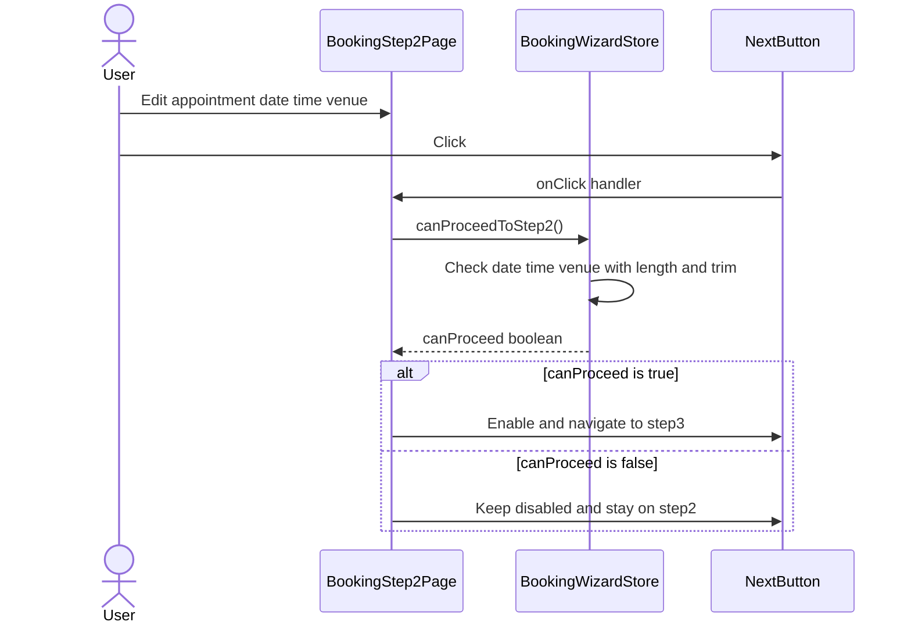
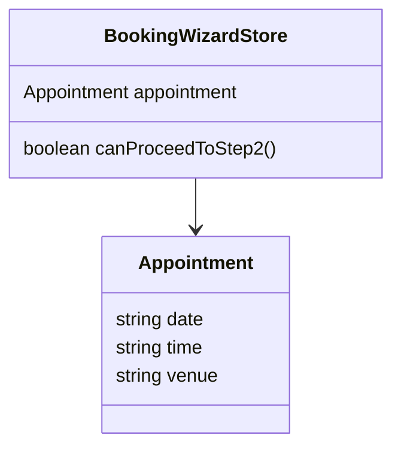

# PR #74 Review Analysis

**Generated**: 2026-01-14T08:36:03.591Z  
**Total Issues**: 8  
**Breakdown**: 1 CRITICAL, 3 HIGH, 2 MEDIUM, 2 LOW

---

## Summary

| Severity | Count | Action Required |
|----------|-------|-----------------|
| CRITICAL | 1 | Fix immediately before merge |
| HIGH | 3 | Fix if <5 min each |
| MEDIUM | 2 | Document for later |
| LOW | 2 | Optional (style/formatting) |

---

## CRITICAL Issues (1)


### 1. CodeRabbit - next.config.mjs:21

```
_⚠️ Potential issue_ | _🟠 Major_

<details>
<summary>🧩 Analysis chain</summary>

🏁 Script executed:

```shell
#!/bin/bash
# Check git diff to see what was removed from next.config.mjs
git log --oneline -n 5 -- next.config.mjs
echo "---"
git diff HEAD~1 -- next.config.mjs 2>/dev/null || echo "Checking full file history..."
echo "---"
git show HEAD:next.config.mjs 2>/dev/null || git log -p --follow -n 1 -- next.config.mjs | head -150
```

Repository: Hex-Tech-Lab/hex-test-drive-man

Length of output: 160

---

🏁 Script executed:

```shell
#!/bin/bash
# Check commit structure and file status
git log --oneline -n 10
echo "---"
git status
echo "---"
# Check if file exists in HEAD
git ls-tree -r HEAD | grep next.config
echo "---"
# Check git show for the actual file content at HEAD
git show HEAD:next.config.mjs 2>&1 | head -50
echo "---"
# Check if there's a parent and what changed
git rev-parse HEAD
git rev-parse HEAD~1 2>/dev/null || echo "No parent commit"
```

Repository: Hex-Tech-Lab/hex-test-drive-man

Length of output: 864

---

🏁 Script executed:

```shell
#!/bin/bash
# Search for PR-related information and config documentation
echo "=== Searching for GEMINI.md (mentioned in learnings) ==="
cat GEMINI.md 2>/dev/null | head -100
echo ""
echo "=== Searching for PR or documentation about config ==="
find . -name "*.md" -type f | head -20
echo ""
echo "=== Check for any config-related documentation ==="
grep -r "next.config" . --include="*.md" 2>/dev/null | head -10
echo ""
echo "=== Check if there's an expected config structure ==="
grep -r "reactStrictMode\|remotePatterns" . --include="*.mjs" --include="*.js" 2>/dev/null
```

Repository: Hex-Tech-Lab/hex-test-drive-man

Length of output: 6371

---

🏁 Script executed:

```shell
#!/bin/bash
# Search for previous versions or references to the full config
echo "=== Check PRODUCTION_PERFORMANCE_REGRESSION for config reference ==="
grep -A 30 "next.config.mjs" ./docs/analysis/PRODUCTION_PERFORMANCE_REGRESSION.md 2>/dev/null
echo ""
echo "=== Check BB_SESSION for what should be in config ==="
grep -B 5 -A 10 "cache TTL\|bundle analyzer" ./docs/BB_SESSION_2026-01-06_PHASE2_COMPLETE.md 2>/dev/null
echo ""
echo "=== Search for ANALYZE flag usage ==="
grep -r "ANALYZE" . --include="*.mjs" --include="*.js" --include="*.md" 2>/dev/null | head -15
echo ""
echo "=== Check for any config backups or templates ==="
find . -name "*.config.*" -o -name "*next*.template*" 2>/dev/null | head -20
```

Repository: Hex-Tech-Lab/hex-test-drive-man

Length of output: 161

---

🏁 Script executed:

```shell
#!/bin/bash
# Check specific docs that mention next.config
echo "=== BB_SESSION config references ==="
head -200 ./docs/BB_SESSION_2026-01-06_PHASE2_COMPLETE.md 2>/dev/null | grep -A 5 -B 5 "next.config"
echo ""
echo "=== Check BOOKING_LINKS_AUDIT ==="
grep -A 3 "redirects" ./docs/BOOKING_LINKS_AUDIT.md 2>/dev/null | head -15
echo ""
echo "=== Search package.json for build scripts ==="
cat package.json | grep -A 5 '"scripts"'
```

Repository: Hex-Tech-Lab/hex-test-drive-man

Length of output: 1200

---


</details>

**Restore missing Next.js configuration features that were unintentionally removed.**

The current configuration is missing multiple features documented in the prior work:

- `reactStrictMode: true` (required for React 19.x development per project standards)
- Bundle analyzer infrastructure (`@next/bundle-analyzer` setup)
- Performance optimizations (`compress`, `swcMinify`)
- X-Powered-By header removal (security hardening)
- Server-side redirects for `/bookings` wizard routes

Reference: `docs/BB_SESSION_2026-01-06_PHASE2_COMPLETE.md` and `docs/BOOKING_LINKS_AUDIT.md` document these features as intentional additions. This PR's scope (wizard validation) does not justify removing them.

<details>
<summary>🤖 Prompt for AI Agents</summary>

```
In @next.config.mjs around lines 1 - 21, Restore the removed Next.js config
flags and bundle-analyzer wrapper: add reactStrictMode: true, compress: true,
swcMinify: true, and set poweredByHeader: false inside the nextConfig object;
reintroduce the @next/bundle-analyzer setup (wrap/export nextConfig with the
bundle analyzer function, e.g., using withBundleAnalyzer or similar) so bundle
analysis env vars still work; and add a redirects() async function on nextConfig
returning the server-side redirects for the /bookings wizard routes (define the
exact routes listed in BOOKING_LINKS_AUDIT and return them as redirect objects).
Ensure you reference and update the nextConfig constant and the export (wrap
export default nextConfig with the bundle-analyzer enhancer) and include the
redirects() implementation and the documented flags.
```

</details>

<!-- fingerprinting:phantom:poseidon:ocelot -->

<!-- This is an auto-generated comment by CodeRabbit -->
```


---

## HIGH Issues (3)


### 1. Sourcery

```
<!-- Generated by sourcery-ai[bot]: start review_guide -->

<details>
<summary>Reviewer's guide (collapsed on small PRs)</summary>

## Reviewer's Guide

Adjusts booking wizard step-2 validation to reject empty/whitespace-only appointment fields, simplifies Next.js config to a single .mjs file with narrowed image domains, and adds a placeholder logo asset.

#### Sequence diagram for booking wizard step 2 validation on Next click



#### Updated class diagram for booking wizard appointment validation



### File-Level Changes

| Change | Details | Files |
| ------ | ------- | ----- |
| Tightened wizard step-2 validation to require non-empty, non-whitespace date/time/venue values and added temporary logging for debugging. | <ul><li>Replaced boolean coercion of appointment fields with explicit length and trim-based checks to ensure fields are not empty or whitespace-only.</li><li>Added console logging of the appointment object and computed field lengths inside canProceedToStep2 for manual verification during testing.</li></ul> | `src/stores/useBookingWizardStore.ts` |
| Simplified Next.js configuration to a minimal next.config.mjs and removed legacy JS config. | <ul><li>Removed Sentry and bundle analyzer wrapping along with various performance, ESLint, webpack, and redirect settings from the Next.js config, leaving a minimal images configuration with GitHub-related remotePatterns.</li><li>Exported the bare nextConfig object directly from next.config.mjs instead of wrapping it with external plugins.</li><li>Deleted next.config.js to standardize on the .mjs config file.</li></ul> | `next.config.mjs`<br/>`next.config.js` |
| Added a placeholder logo asset to the public images directory. | <ul><li>Introduced public/images/logo.png as a zero-byte placeholder that will need a real image replacement later.</li></ul> | `public/images/logo.png` |

</details>

---

<details>
<summary>Tips and commands</summary>

#### Interacting with Sourcery

- **Trigger a new review:** Comment `@sourcery-ai review` on the pull request.
- **Continue discussions:** Reply directly to Sourcery's review comments.
- **Generate a GitHub issue from a review comment:** Ask Sourcery to create an
  issue from a review comment by replying to it. You can also reply to a
  review comment with `@sourcery-ai issue` to create an issue from it.
- **Generate a pull request title:** Write `@sourcery-ai` anywhere in the pull
  request title to generate a title at any time. You can also comment
  `@sourcery-ai title` on the pull request to (re-)generate the title at any time.
- **Generate a pull request summary:** Write `@sourcery-ai summary` anywhere in
  the pull request body to generate a PR summary at any time exactly where you
  want it. You can also comment `@sourcery-ai summary` on the pull request to
  (re-)generate the summary at any time.
- **Generate reviewer's guide:** Comment `@sourcery-ai guide` on the pull
  request to (re-)generate the reviewer's guide at any time.
- **Resolve all Sourcery comments:** Comment `@sourcery-ai resolve` on the
  pull request to resolve all Sourcery comments. Useful if you've already
  addressed all the comments and don't want to see them anymore.
- **Dismiss all Sourcery reviews:** Comment `@sourcery-ai dismiss` on the pull
  request to dismiss all existing Sourcery reviews. Especially useful if you
  want to start fresh with a new review - don't forget to comment
  `@sourcery-ai review` to trigger a new review!

#### Customizing Your Experience

Access your [dashboard](https://app.sourcery.ai) to:
- Enable or disable review features such as the Sourcery-generated pull request
  summary, the reviewer's guide, and others.
- Change the review language.
- Add, remove or edit custom review instructions.
- Adjust other review settings.

#### Getting Help

- [Contact our support team](mailto:support@sourcery.ai) for questions or feedback.
- Visit our [documentation](https://docs.sourcery.ai) for detailed guides and information.
- Keep in touch with the Sourcery team by following us on [X/Twitter](https://x.com/SourceryAI), [LinkedIn](https://www.linkedin.com/company/sourcery-ai/) or [GitHub](https://github.com/sourcery-ai).

</details>

<!-- Generated by sourcery-ai[bot]: end review_guide -->
```


### 2. CodeRabbit

```
<!-- This is an auto-generated comment: summarize by coderabbit.ai -->
<!-- walkthrough_start -->

## Walkthrough

This PR simplifies the Next.js configuration by removing Sentry integration, bundle analyzer wrapping, ESLint build-time linting, webpack optimizations, and booking route redirects. Additionally, it modifies image optimization rules and updates validation logic in the booking wizard store.

## Changes

| Cohort / File(s) | Summary |
|---|---|
| **Configuration simplification** <br> `next.config.js`, `next.config.mjs` | Removed Sentry and bundle analyzer wrappers; default export reverted to plain nextConfig. Deleted ESLint ignoreDuringBuilds, performance optimizations (compress, poweredByHeader, reactStrictMode), webpack customization, and booking route redirects. Updated remotePatterns to include raw.githubusercontent.com and github.com instead of Supabase domain. |
| **Booking store validation** <br> `src/stores/useBookingWizardStore.ts` | Enhanced canProceedToStep2 to validate appointment.date, appointment.time, and appointment.venue using trim().length checks instead of truthiness evaluation. Added console.log statements for debugging individual field validations. |

## Estimated code review effort

🎯 3 (Moderate) | ⏱️ ~20 minutes

## Possibly related PRs

- **Hex-Tech-Lab/hex-test-drive-man#70**: Modifies booking route redirects in next.config.mjs (complements the redirect removal in this PR)
- **Hex-Tech-Lab/hex-test-drive-man#68**: Introduces canProceedToStep2 logic in useBookingWizardStore.ts (this PR enhances the validation in that function)

<!-- walkthrough_end -->


<!-- pre_merge_checks_walkthrough_start -->

<details>
<summary>🚥 Pre-merge checks | ✅ 3</summary>

<details>
<summary>✅ Passed checks (3 passed)</summary>

|     Check name     | Status   | Explanation                                                                                                                                                              |
| :----------------: | :------- | :----------------------------------------------------------------------------------------------------------------------------------------------------------------------- |
|  Description Check | ✅ Passed | Check skipped - CodeRabbit’s high-level summary is enabled.                                                                                                              |
|     Title check    | ✅ Passed | The title accurately describes the primary change to the validation logic in useBookingWizardStore.ts, replacing truthiness checks with explicit length and trim checks. |
| Docstring Coverage | ✅ Passed | No functions found in the changed files to evaluate docstring coverage. Skipping docstring coverage check.                                                               |

</details>

<sub>✏️ Tip: You can configure your own custom pre-merge checks in the settings.</sub>

</details>

<!-- pre_merge_checks_walkthrough_end -->

<!-- finishing_touch_checkbox_start -->

<details>
<summary>✨ Finishing touches</summary>

- [ ] <!-- {"checkboxId": "7962f53c-55bc-4827-bfbf-6a18da830691"} --> 📝 Generate docstrings
<details>
<summary>🧪 Generate unit tests (beta)</summary>

- [ ] <!-- {"checkboxId": "f47ac10b-58cc-4372-a567-0e02b2c3d479", "radioGroupId": "utg-output-choice-group-unknown_comment_id"} -->   Create PR with unit tests
- [ ] <!-- {"checkboxId": "07f1e7d6-8a8e-4e23-9900-8731c2c87f58", "radioGroupId": "utg-output-choice-group-unknown_comment_id"} -->   Post copyable unit tests in a comment
- [ ] <!-- {"checkboxId": "6ba7b810-9dad-11d1-80b4-00c04fd430c8", "radioGroupId": "utg-output-choice-group-unknown_comment_id"} -->   Commit unit tests in branch `cc/wizard-validation-fix`

</details>

</details>

<!-- finishing_touch_checkbox_end -->

<!-- tips_start -->

---

Thanks for using [CodeRabbit](https://coderabbit.ai?utm_source=oss&utm_medium=github&utm_campaign=Hex-Tech-Lab/hex-test-drive-man&utm_content=74)! It's free for OSS, and your support helps us grow. If you like it, consider giving us a shout-out.

<details>
<summary>❤️ Share</summary>

- [X](https://twitter.com/intent/tweet?text=I%20just%20used%20%40coderabbitai%20for%20my%20code%20review%2C%20and%20it%27s%20fantastic%21%20It%27s%20free%20for%20OSS%20and%20offers%20a%20free%20trial%20for%20the%20proprietary%20code.%20Check%20it%20out%3A&url=https%3A//coderabbit.ai)
- [Mastodon](https://mastodon.social/share?text=I%20just%20used%20%40coderabbitai%20for%20my%20code%20review%2C%20and%20it%27s%20fantastic%21%20It%27s%20free%20for%20OSS%20and%20offers%20a%20free%20trial%20for%20the%20proprietary%20code.%20Check%20it%20out%3A%20https%3A%2F%2Fcoderabbit.ai)
- [Reddit](https://www.reddit.com/submit?title=Great%20tool%20for%20code%20review%20-%20CodeRabbit&text=I%20just%20used%20CodeRabbit%20for%20my%20code%20review%2C%20and%20it%27s%20fantastic%21%20It%27s%20free%20for%20OSS%20and%20offers%20a%20free%20trial%20for%20proprietary%20code.%20Check%20it%20out%3A%20https%3A//coderabbit.ai)
- [LinkedIn](https://www.linkedin.com/sharing/share-offsite/?url=https%3A%2F%2Fcoderabbit.ai&mini=true&title=Great%20tool%20for%20code%20review%20-%20CodeRabbit&summary=I%20just%20used%20CodeRabbit%20for%20my%20code%20review%2C%20and%20it%27s%20fantastic%21%20It%27s%20free%20for%20OSS%20and%20offers%20a%20free%20trial%20for%20proprietary%20code)

</details>

<sub>Comment `@coderabbitai help` to get the list of available commands and usage tips.</sub>

<!-- tips_end -->

<!-- internal state start -->


<!-- DwQgtGAEAqAWCWBnSTIEMB26CuAXA9mAOYCmGJATmriQCaQDG+Ats2bgFyQAOFk+AIwBWJBrngA3EsgEBPRvlqU0AgfFwA6NPEgQAfACgjoCEYDEZyAAUASpETZWaCrKPR1AGxJcAZvAAeABQA7vAAXs60AJRcEmge8LTU8PhY2IjSkF4YRLiwegAMkADUkLgU8MyBUSgYiDRo9Pg+kCAgRgByjgKUXADsACyQkAYAqjYAMlywuLjciBwA9ItE6rDYAhpMzIsAEiT+YNCisGATKouwB2A09WC0FVJgzJiL3NgeHouDw2MZFFxjgxYLtZNwSAANKy/ADK+GwFAYJEgAioGGBXAYDEWoQiFFoYDiCSS4lSYD8/kggCTCGDOUi4FFojGQF7wLAjGG4ajpLj4cHsgwAYQoJGodHQnEgACYClKAGxgAoARjASoAzNAZRw1QAObVSgBaRgAItIGBVuKSMBwDFArBRBF5mFwAOrhSKQABEHQOuE9KLwBCwwTQyDIKi89GCVywaG43HwbNwbAwDJJJEW4jYiykGGwyOClGRJGYlvk+D40fU0m4aCRYFSHnk9QqOUQGkgNnw+AZDDQ6W8jEw9vwSLo0HwnJI3Cl1UgA/oeWRAAM2sv+OCqARKwhgTwHbRsEj6GymBQRWIyhQ8AhyIhkD4K7V1PB4uFxSWy/ZymyiO3bZAcIeHgKTWp204eHWK5rowVwMAA1sgoR5JABzcAkDDqFkZC5LA6AYIuFTMLBoiITawxQHGCZJimmjpgA/Bo2S4ZAeiQEUABkHHoPGiaprRGjphoP5VFETE4ShbFFIEmD0IgaBsJAj58FmyKyZAub5lEAGCrAmCkAsBgUfOGQAELdvBv5unitCchWJDCQsSkBOKRKJMkqRZPgqwMJAgQJHekBKgMfSAMgEwUAJzacZ5D+JoTAYH4RAaEITlKF4ND0IE8EkNO/AYE2kCxfFqRJRozCpdFuhFb6WylfAyUVU52DonpOR0EZ1XvAIGGLJUaAGYsHjefgGjcDkXCNEo9DoVBsD4B4Sh8IERRyLcADcNV0MgIqzUitHaVAxz1L+JEIQk9TkdVABqlDwD48g+nFAazJ5tBIBG4rIXhn64PIfgkItiCdVAt0VA9kBPQyAiBm9H09V9ayQFWty1vWjbyES+bA8ZYP3Y9vovUGqEYJ9UZI259DppmlQZppJAg5AumkQodQLciw1/vY83BAo56iAyzF5MggQYD284ESQfjkNEAEAJKlnWkoALLODl9CCjYcvQHLgoAIITJAgAoBPuJC5rgyC8KOuXvTkyNI2ylMohZv7IJBCGnVRfHJuwkBKFy8AeMDUDGgiHlgTKLJsng0gAXjfh9laChOAR+74BIiTispXl9h4ZTSOIdsZ2gjAInn6movgwT/JApoSBOC3AwYMKOC8LgovIcIIkiLhcJyIo5EuMvO/gll27iHqU+H+FyZU6H3fA4pQylyAJUlYdJ4EIrMOnH5xVQrNJcjVDxpQm3YNw6Yni8pCQNvPbIrWsyUHURUPyeWC2H7ZoWlaYlGPoYw4AoBkCaC0fsBBiBkGUJlZOtEuC8H4MIAWkhMhyAUEtFQahNDaF0GAQwJgjoIGQKgTAOBIGkHIFucU2x4F3zQLzBwTh27oKYJg1Q6gtA6EAUA0wBhip1USg1FeNpPRiIMBYSAes5ZQKoWKOSrdnDlhaMCfSscDA2BLLvRcVwUA32kBoe+NArDUBoBQV+a8Gob1AkpB0xEBGWOSqlAANKhBIzA2TJDtrgYI+A75aJoDwUxL9kB5GoOgT4Vcl61VSpABWA1kQAHlLSVHdEnAgSkSC4D3EY5E/UDK2JYPQ4IGhVh5A2AOREqQaCpjqsRdSZT1ibG2B2OAqB2DaCDt/DKp0lx6IScgQQIhLzfRQBbfxO9jHBPMcgZwVBZCuNPMBW2RAyi6J8X4p+ZisDsAqJkQIMw5iWwdAQJgHhXHzXqKTNgO0GGlLWBU/4CUaklXqanRpGw6muPUkueAfBFgACoAVBOFmJSGfj4jbOSFIEF2zBl8EoA6PgbVaABVWUmA8R46AaCMBMNkmRVHtVoFwYoBRFiqjlEYAAoidF4sC2HIhFBnEgvMpbKUlBMKuBgxGegAXwhx9VGqpVEeIyR0jZEwPFEwtuyjYJqKblATRO8pAfxoEQLcNjRkwl2fICuLVUVqVJk2MIlBj5UUoIgTaSgfD9g8AyNCFYGSoDFrzPps02Q1TioKQVtR6iijAegZOCYMj0EcTiqAVKYR4tTCgIgYsRSh1bEQUy2BA60FmanEUkFYEwzTTcWmWQkye1oEIdIPtUxISLBM7R4a4n6MgJcwuqzrxeFXm1UgxLfUNADfEYaoQ7Yl0QOCTCCc/YsG0BgVxfTckmOfjMt+vMlnYCUMU+55SYZPOqewOpM9IAfOaSwVxu13a9N0bwM2KR0j2AvioUMJAwBZvkWO1kGBa3aqkFQPOm5lIvHRIaqMJABBo3ghuLMaSbEZFmK7Py2xz33lcQmQsIpaCmVkPsRolAj2ijEP3eAYhlaKBIK4hgZaimFiA3WEDjiahIcZVolVtbNHvQvOMxx1jPLZwWvQAQLs7YOhjhm+gj7YHIb+QLLyPlkZVvvgxgCiSP29qnbotjGrPJMsoOMnwdjA0+FFLgBE96KjAgQ8BVYGAwDBBPuCOSWSL5lAhVHDA/U87L1iSp6eQyBY4qMBIywes7UwNAqEvxfSlAMEgqp1+zRUL+ATBQWBT5uoYRJuIcQ6iI2xcdR+VM6h5CEo7Vwa1tr7WZfi7UZyXhPUlSEUKnG1VTJS3slwB1ZWisfAZN9FNBEvB6yNbIE1FAQhrG1amFw3qaui19ONpKriADe/AKBEC4J6K4hwKxEE9Ahh0wzJQreuLcXA9xHj3t/Zt+wgd2BcBAFbJE94NBkAkBoQUctXGhCUBgQUCR2AADELujHQvgRoXByj5lce9eSCNOVEFIACK8oPyHjvEAwMGSIPAEac9uJyIPkQAF8ohVSgHrHwZjmulbTFLYrVXpsNVxfittajO3FCVGSsAABWSlBgaVZifQy/xzLWU+HZVwZWdB4COG5eI20fDECIkWPUeyiBFgDnMqPKy7p8R2RFI5EVvKxUyMoZKhRzDZX5fS0ODAI4xy0AnFOGcC6NJvnTKEvSDIvY0W3emb5vF3e1NUt81Obv+LbvpugEUb9zO/V1cT01IkPE5EWXUbt/AWgYzOmPVZvyVLXjyHT9sMBiHoFoOmmL89MKCwknhH5RE0//kJ0XmhqREDsyYt5b8YpaIkLqJnc3lubY25oHbjJnM1nIhI/zGNgfy0Mk85eH5Z7KDkkXotbCg9YCZmr8CUiefxvlAWkpPt/AlwUFCBkCZE7nfInkmwbz5g/MBci8Fkf39wvOHDoMloLWEt8CS3hlLL4zcdCpAMwGDRoErtp0AkoRTkoDDUq0o86EZ86LwC5C6QAi7vTi48p8qGAGCEIkw9p4CEAG7UKhosB0JUCMKKIsJ5aEZUAcI4LcL4I4HAJwLqAAD6iQiArBTKSBdArB9QzgDIPCuBOoUoEUEUAgrOPgcoSoumfQrOaASoaAgGYhaAPgUoChAgUoOoPgtAfQDArOuU4hWhaoeC2BuBtCbBHBXBF6LKvBoCphTBEApsrBbAi2JArBm+CEnB/BZWPCs2nUnoSAtgpkw0CEdA3qrA7AVg+AfqtAnovg8QGQziARiA80HwKGoR8Etg8RSkiRRGARSA8miKiQ72ORNqQc+Rwwno70tANgLUxoo4uGbYzMCEOR2OyRVRNRdRGA7guAXgLR8EbR14lRXoXR9RP88AKSqQAxZReRHRXoAU6scs942M/cORYi8xnokE9QAxmiDgdqiAORAA2p1MMP4cMBcV6J4fBB0ApCQOsaaIgOaJMUnDMfMZcZ6PwfpoccDsMe8RcZ6GhJBKTFaOsQMfYJZKfPQFAN6koDYFguoIAJgEyACARApwXgUgec0qSiKAYYpMCMtAGgm2pxAJO8Sg6xIY5iv4xJlxVRFYDUniHgAxtxbA6xSgTxv8oEvKlxOO/x5xtJno1xLJ9xy2vRlW1xNJApXx6QQxoOJJVRQJmA4c6xcAyIqWlWdYY+YohU7JzxPQF++4/U7cpu9mT+U8ScnMv+HqyuvGRA1kkQmuDkFsWGe0vS2et40gbaW+9sKEQJeGWEQsleqcIkNeRJ/xVRZJIpXolJTmOQkpHxF4gqBmsxFR4ZXo9JZm8QzJdx6x6p9xJJvJJJ/JHxQpOZy2DRDALYp03qCmpA8ZAJ0pPxcOIxHxipIJXJy2gBSkLUYgQWSk8IqcHqfSpu9AfgrappZs8Q2AYoY6lZP4dsTAtZDkgEkJ3Ap0tAo4VZC5u8VAt81xYZ8pXoIoTewEoJy2LoFQgSG5c5SaD4T4fSPgPZVoyAHi94p6JYpp8k4giAEMw5O5CSayx580i0B5tJXokZFJzgsZG2aZnoGZjJ2ZrJy215W5f43JFxOOnUAAupsdsbgLYI8c8VMRgOsQIAMEoezgMOzroT4GqAwDqBFGqCQBFDqFiMxSITan0OIbQAwLQFoRFH0AIH0HKAwGqD0KJVKAMDxTqKoaoGqHKPJWgFKD4DqJKVsaGPhTYGKVGZ6MFCQGJVKCQAULQGqKZXRUZT4EqMJWgCoAUPoYJT4AwAMKZT0JIX0KxWqGgDqCJbpgUAIGoVJSQHKIZSFPoWIVKGpShfOUQDWcoKQHLKmC/PEJyGKDkbNphZhY4VAOei4ZQKQB4XBIhKwfYfoEAA= -->

<!-- internal state end -->
```


### 3. CodeRabbit - src/stores/useBookingWizardStore.ts:145

```
_⚠️ Potential issue_ | _🟠 Major_

**Remove debug console.log statements before merging.**

These debug statements log internal state to the browser console in production, which is inappropriate for a production build. Remove them or replace with a proper logging utility that respects environment.


<details>
<summary>🔧 Proposed fix</summary>

```diff
      canProceedToStep2: () => {
        const { appointment } = get();
-        console.log("Store appointment:", appointment);
-        console.log("canProceedToStep2 checks:", {
-          dateLen: appointment.date?.length || 0,
-          timeLen: appointment.time?.length || 0,
-          venueLen: appointment.venue?.length || 0
-        });
        return (
          appointment.date?.length > 0 && appointment.date.trim().length > 0 &&
          appointment.time?.length > 0 && appointment.time.trim().length > 0 &&
          appointment.venue?.length > 0 && appointment.venue.trim().length > 0
        );
      },
```

</details>

<details>
<summary>🤖 Prompt for AI Agents</summary>

```
In @src/stores/useBookingWizardStore.ts around lines 140 - 145, Remove the debug
console.log statements in useBookingWizardStore.ts (the console.log lines that
print "Store appointment:" and "canProceedToStep2 checks:") before merging;
either delete them entirely or replace them with a proper logging utility that
respects environment (e.g., use a logger wrapper or process.env.NODE_ENV check)
so internal state is not emitted to the browser console in production. Ensure
the change targets the logging inside the canProceedToStep2/key validation flow
where appointment, appointment.date, appointment.time, and appointment.venue are
being inspected.
```

</details>

<!-- fingerprinting:phantom:poseidon:ocelot -->

<!-- This is an auto-generated comment by CodeRabbit -->
```


---

## MEDIUM Issues (2)


### 1. SonarCloud

```
## [](https://sonarcloud.io/dashboard?id=Hex-Tech-Lab_hex-test-drive-man&pullRequest=74) **Quality Gate passed**  
Issues  
 [0 New issues](https://sonarcloud.io/project/issues?id=Hex-Tech-Lab_hex-test-drive-man&pullRequest=74&issueStatuses=OPEN,CONFIRMED&sinceLeakPeriod=true)  
 [0 Accepted issues](https://sonarcloud.io/project/issues?id=Hex-Tech-Lab_hex-test-drive-man&pullRequest=74&issueStatuses=ACCEPTED)

Measures  
 [0 Security Hotspots](https://sonarcloud.io/project/security_hotspots?id=Hex-Tech-Lab_hex-test-drive-man&pullRequest=74&issueStatuses=OPEN,CONFIRMED&sinceLeakPeriod=true)  
 [0.0% Coverage on New Code](https://sonarcloud.io/component_measures?id=Hex-Tech-Lab_hex-test-drive-man&pullRequest=74&metric=new_coverage&view=list)  
 [0.0% Duplication on New Code](https://sonarcloud.io/component_measures?id=Hex-Tech-Lab_hex-test-drive-man&pullRequest=74&metric=new_duplicated_lines_density&view=list)  
  
[See analysis details on SonarQube Cloud](https://sonarcloud.io/dashboard?id=Hex-Tech-Lab_hex-test-drive-man&pullRequest=74)


```


### 2. Sourcery - src/stores/useBookingWizardStore.ts:149

```
**suggestion:** Simplify the non-empty string checks to avoid redundant length conditions.

Since `trim().length > 0` already guarantees a non-empty string, the preceding `?.length > 0` checks are redundant. You can simplify to `appointment.date?.trim().length > 0`, `appointment.time?.trim().length > 0`, and `appointment.venue?.trim().length > 0` to keep the whitespace-only protection with less duplication.
```


---

## LOW Issues (2)


### 1. CodeRabbit - next.config.mjs:16

```
_🧹 Nitpick_ | _🔵 Trivial_

**Overly permissive pathname patterns for image domains.**

Using `pathname: '/**'` allows loading images from any path on `github.com` and `raw.githubusercontent.com`. Consider restricting to specific repository paths if possible to reduce attack surface.


<details>
<summary>♻️ Example: Restrict to specific org/repo</summary>

```diff
      {
        protocol: 'https',
        hostname: 'raw.githubusercontent.com',
        port: '',
-        pathname: '/**',
+        pathname: '/Hex-Tech-Lab/**',
      },
      {
        protocol: 'https',
        hostname: 'github.com',
        port: '',
-        pathname: '/**',
+        pathname: '/Hex-Tech-Lab/**',
      },
```

</details>

<!-- suggestion_start -->

<details>
<summary>📝 Committable suggestion</summary>

> ‼️ **IMPORTANT**
> Carefully review the code before committing. Ensure that it accurately replaces the highlighted code, contains no missing lines, and has no issues with indentation. Thoroughly test & benchmark the code to ensure it meets the requirements.

```suggestion
        hostname: 'raw.githubusercontent.com',
        port: '',
        pathname: '/Hex-Tech-Lab/**',
      },
      {
        protocol: 'https',
        hostname: 'github.com',
        port: '',
        pathname: '/Hex-Tech-Lab/**',
      },
```

</details>

<!-- suggestion_end -->

<details>
<summary>🤖 Prompt for AI Agents</summary>

```
In @next.config.mjs around lines 7 - 16, The image domain entries using
pathname: '/**' (the objects with hostname 'raw.githubusercontent.com' and
'github.com' in next.config.mjs) are overly permissive; update those entries to
restrict pathname globs to only the specific org(s)/repo(s) and directory
patterns your app needs (e.g., limit to /<org>/<repo>/... or a specific
branch/raw path) or enumerate exact repository paths instead of '/**', and if
you truly need broad access add a clear justification comment; modify the
hostname entries for 'raw.githubusercontent.com' and 'github.com' accordingly to
tighten the allowed path patterns.
```

</details>

<!-- fingerprinting:phantom:poseidon:ocelot -->

<!-- This is an auto-generated comment by CodeRabbit -->
```


### 2. CodeRabbit - src/stores/useBookingWizardStore.ts:149

```
_🧹 Nitpick_ | _🔵 Trivial_

**Simplify redundant validation checks.**

The fix correctly addresses whitespace-only validation, but the pattern is redundant. If `field.trim().length > 0` is true, then `field.length > 0` is necessarily true (a non-empty trimmed result requires a non-empty original). The `?.length > 0` guard is also unnecessary since the interface defines these as `string` (not nullable).


<details>
<summary>♻️ Simplified validation</summary>

```diff
        return (
-          appointment.date?.length > 0 && appointment.date.trim().length > 0 &&
-          appointment.time?.length > 0 && appointment.time.trim().length > 0 &&
-          appointment.venue?.length > 0 && appointment.venue.trim().length > 0
+          appointment.date.trim().length > 0 &&
+          appointment.time.trim().length > 0 &&
+          appointment.venue.trim().length > 0
        );
```

</details>

<!-- suggestion_start -->

<details>
<summary>📝 Committable suggestion</summary>

> ‼️ **IMPORTANT**
> Carefully review the code before committing. Ensure that it accurately replaces the highlighted code, contains no missing lines, and has no issues with indentation. Thoroughly test & benchmark the code to ensure it meets the requirements.

```suggestion
        return (
          appointment.date.trim().length > 0 &&
          appointment.time.trim().length > 0 &&
          appointment.venue.trim().length > 0
        );
```

</details>

<!-- suggestion_end -->

<details>
<summary>🤖 Prompt for AI Agents</summary>

```
In @src/stores/useBookingWizardStore.ts around lines 147 - 149, The validation
is redundant: remove the unnecessary length and optional chaining checks and
rely only on trimmed-length checks because the fields are typed as string;
replace the three-line condition using "appointment.date?.length > 0 &&
appointment.date.trim().length > 0" (and similar for appointment.time and
appointment.venue) with a single trimmed check per field like
"appointment.date.trim().length > 0" (or use a small helper isNonEmpty(str) =>
str.trim().length > 0) and update the boolean expression to use only
appointment.date.trim().length > 0 && appointment.time.trim().length > 0 &&
appointment.venue.trim().length > 0.
```

</details>

<!-- fingerprinting:phantom:poseidon:ocelot -->

<!-- This is an auto-generated comment by CodeRabbit -->
```


---

## Next Steps

1. **Fix CRITICAL issues** (1 found) - Block merge until resolved
2. **Fix HIGH issues** (3 found) - Fix if <5 min each, otherwise document
3. **Document MEDIUM/LOW** (4 found) - Create follow-up issues

**Generated by**: `pnpm run pr:scrape 74`
