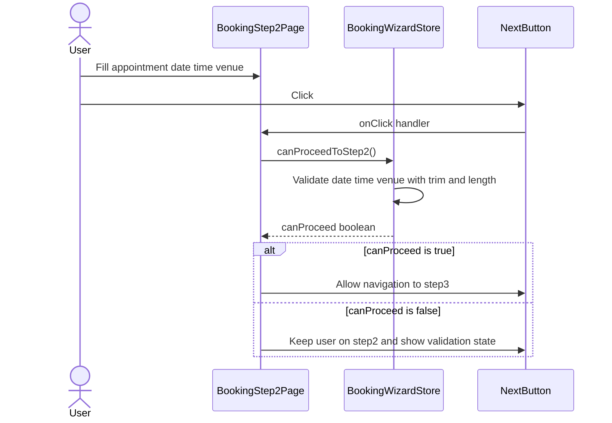
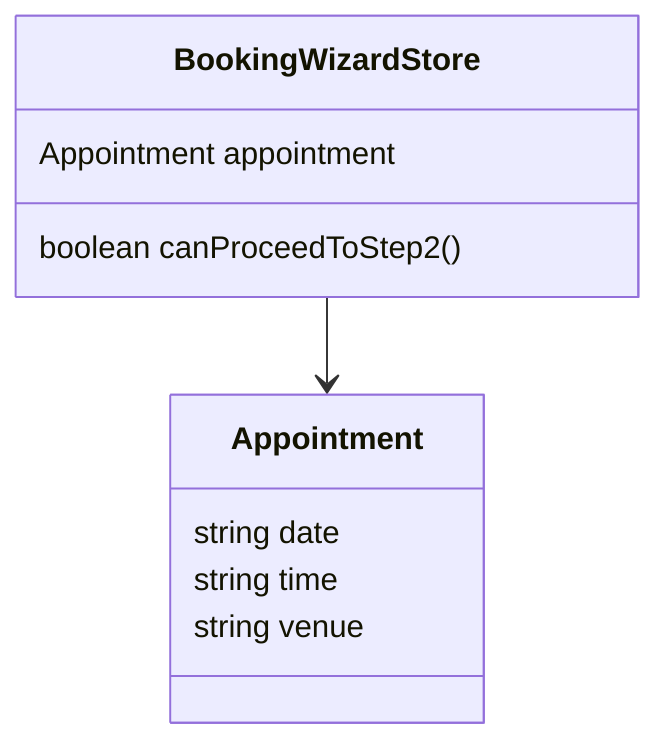

# PR #75 Review Analysis

**Generated**: 2026-01-14T07:54:13.652Z  
**Total Issues**: 3  
**Breakdown**: 2 CRITICAL, 0 HIGH, 0 MEDIUM, 1 LOW

---

## Summary

| Severity | Count | Action Required |
|----------|-------|-----------------|
| CRITICAL | 2 | Fix immediately before merge |
| HIGH | 0 | Fix if <5 min each |
| MEDIUM | 0 | Document for later |
| LOW | 1 | Optional (style/formatting) |

---

## CRITICAL Issues (2)


### 1. CodeRabbit

```
<!-- Generated by sourcery-ai[bot]: start review_guide -->

## Reviewer's Guide

Tightens booking wizard step-2 validation (with temporary debug logging) and introduces an internal security review document, in a PR that was originally paired with broader Next.js config and image-domain hardening changes now documented but not present in this diff snapshot.

#### Sequence diagram for booking wizard step 2 validation



#### Updated class diagram for booking wizard appointment validation



### File-Level Changes

| Change | Details | Files |
| ------ | ------- | ----- |
| Adjust booking wizard step-2 progression logic to use stricter, content-based validation for appointment fields. | <ul><li>Replaced the previous truthiness check on appointment.date, appointment.time, and appointment.venue with more explicit validations (e.g., length/trim-based checks) so empty or whitespace-only values are rejected.</li><li>Temporarily added debug-oriented inspection of appointment state and field values within canProceedToStep2 to aid verification of the new validation behavior during testing.</li><li>Removed the old concise boolean-coercion return expression that treated any non-empty string as valid, even if it was only whitespace.</li></ul> | `src/stores/useBookingWizardStore.ts` |
| Add a detailed, auto-generated security and tooling review analysis document for PR #74. | <ul><li>Introduced PR_74_REVIEW_ANALYSIS.md to capture automated review outputs from CodeRabbit, Sourcery, and SonarCloud, including identified issues, suggested fixes, and prompts.</li><li>Documented missing or reverted Next.js configuration features (e.g., strict mode, bundle-analyzer, redirects, security headers) and image-domain/pathname recommendations as context for future corrective work.</li><li>Recorded guidance about removing temporary console logging and simplifying validation checks in the booking wizard store for follow-up refinement.</li></ul> | `docs/PR_74_REVIEW_ANALYSIS.md` |

---

<details>
<summary>Tips and commands</summary>

#### Interacting with Sourcery

- **Trigger a new review:** Comment `@sourcery-ai review` on the pull request.
- **Continue discussions:** Reply directly to Sourcery's review comments.
- **Generate a GitHub issue from a review comment:** Ask Sourcery to create an
  issue from a review comment by replying to it. You can also reply to a
  review comment with `@sourcery-ai issue` to create an issue from it.
- **Generate a pull request title:** Write `@sourcery-ai` anywhere in the pull
  request title to generate a title at any time. You can also comment
  `@sourcery-ai title` on the pull request to (re-)generate the title at any time.
- **Generate a pull request summary:** Write `@sourcery-ai summary` anywhere in
  the pull request body to generate a PR summary at any time exactly where you
  want it. You can also comment `@sourcery-ai summary` on the pull request to
  (re-)generate the summary at any time.
- **Generate reviewer's guide:** Comment `@sourcery-ai guide` on the pull
  request to (re-)generate the reviewer's guide at any time.
- **Resolve all Sourcery comments:** Comment `@sourcery-ai resolve` on the
  pull request to resolve all Sourcery comments. Useful if you've already
  addressed all the comments and don't want to see them anymore.
- **Dismiss all Sourcery reviews:** Comment `@sourcery-ai dismiss` on the pull
  request to dismiss all existing Sourcery reviews. Especially useful if you
  want to start fresh with a new review - don't forget to comment
  `@sourcery-ai review` to trigger a new review!

#### Customizing Your Experience

Access your [dashboard](https://app.sourcery.ai) to:
- Enable or disable review features such as the Sourcery-generated pull request
  summary, the reviewer's guide, and others.
- Change the review language.
- Add, remove or edit custom review instructions.
- Adjust other review settings.

#### Getting Help

- [Contact our support team](mailto:support@sourcery.ai) for questions or feedback.
- Visit our [documentation](https://docs.sourcery.ai) for detailed guides and information.
- Keep in touch with the Sourcery team by following us on [X/Twitter](https://x.com/SourceryAI), [LinkedIn](https://www.linkedin.com/company/sourcery-ai/) or [GitHub](https://github.com/sourcery-ai).

</details>

<!-- Generated by sourcery-ai[bot]: end review_guide -->
```


### 2. CodeRabbit

```
<!-- This is an auto-generated comment: summarize by coderabbit.ai -->
<!-- walkthrough_start -->

## Walkthrough

A validation function `canProceedToStep2` in the booking wizard store had its validation body removed. The function previously enforced checks for appointment date, time, and venue but now returns nothing, effectively removing the progression gate.

## Changes

| Cohort / File(s) | Summary |
|---|---|
| **Validation removal** <br> `src/stores/useBookingWizardStore.ts` | Removed validation checks from `canProceedToStep2` that required `appointment.date`, `appointment.time`, and `appointment.venue` to be truthy. Function body is now empty. |

## Estimated code review effort

🎯 1 (Trivial) | ⏱️ ~3 minutes

<!-- walkthrough_end -->


<!-- pre_merge_checks_walkthrough_start -->

<details>
<summary>🚥 Pre-merge checks | ✅ 2 | ❌ 1</summary>

<details>
<summary>❌ Failed checks (1 inconclusive)</summary>

|  Check name | Status         | Explanation                                                                                                                                                                                                                                                                                                          | Resolution                                                                                                                                                                                                                                                    |
| :---------: | :------------- | :------------------------------------------------------------------------------------------------------------------------------------------------------------------------------------------------------------------------------------------------------------------------------------------------------------------- | :------------------------------------------------------------------------------------------------------------------------------------------------------------------------------------------------------------------------------------------------------------ |
| Title check | ❓ Inconclusive | The PR title 'Security: PR#74 CodeRabbit fixes' is vague and does not clearly describe the actual changes. The changeset removes validation logic from canProceedToStep2, but the title provides no meaningful information about what was changed or why, instead referencing an external PR number without context. | Revise the title to be more specific and descriptive of the actual changes, such as 'Remove validation check from canProceedToStep2 function' or 'Clean up booking wizard validation logic', which would clearly communicate the primary change to reviewers. |

</details>
<details>
<summary>✅ Passed checks (2 passed)</summary>

|     Check name     | Status   | Explanation                                                                                                |
| :----------------: | :------- | :--------------------------------------------------------------------------------------------------------- |
|  Description Check | ✅ Passed | Check skipped - CodeRabbit’s high-level summary is enabled.                                                |
| Docstring Coverage | ✅ Passed | No functions found in the changed files to evaluate docstring coverage. Skipping docstring coverage check. |

</details>

<sub>✏️ Tip: You can configure your own custom pre-merge checks in the settings.</sub>

</details>

<!-- pre_merge_checks_walkthrough_end -->

<!-- finishing_touch_checkbox_start -->

<details>
<summary>✨ Finishing touches</summary>

- [ ] <!-- {"checkboxId": "7962f53c-55bc-4827-bfbf-6a18da830691"} --> 📝 Generate docstrings
<details>
<summary>🧪 Generate unit tests (beta)</summary>

- [ ] <!-- {"checkboxId": "f47ac10b-58cc-4372-a567-0e02b2c3d479", "radioGroupId": "utg-output-choice-group-unknown_comment_id"} -->   Create PR with unit tests
- [ ] <!-- {"checkboxId": "07f1e7d6-8a8e-4e23-9900-8731c2c87f58", "radioGroupId": "utg-output-choice-group-unknown_comment_id"} -->   Post copyable unit tests in a comment
- [ ] <!-- {"checkboxId": "6ba7b810-9dad-11d1-80b4-00c04fd430c8", "radioGroupId": "utg-output-choice-group-unknown_comment_id"} -->   Commit unit tests in branch `security/pr74-fixes`

</details>

</details>

<!-- finishing_touch_checkbox_end -->


---


---

<details>
<summary>📜 Recent review details</summary>

**Configuration used**: Path: .coderabbit.yaml

**Review profile**: ASSERTIVE

**Plan**: Pro

<details>
<summary>📥 Commits</summary>

Reviewing files that changed from the base of the PR and between d256f74af492d83eda2308e39409dab11c1be3af and 7a98c8a76245458e442526aafd66c0b4935750dd.

</details>

<details>
<summary>⛔ Files ignored due to path filters (1)</summary>

* `docs/PR_74_REVIEW_ANALYSIS.md` is excluded by `!**/*.md`

</details>

<details>
<summary>📒 Files selected for processing (1)</summary>

* `src/stores/useBookingWizardStore.ts`

</details>

<details>
<summary>💤 Files with no reviewable changes (1)</summary>

* src/stores/useBookingWizardStore.ts

</details>

<details>
<summary>⏰ Context from checks skipped due to timeout of 90000ms. You can increase the timeout in your CodeRabbit configuration to a maximum of 15 minutes (900000ms). (1)</summary>

* GitHub Check: Sourcery review

</details>

<sub>✏️ Tip: You can disable this entire section by setting `review_details` to `false` in your review settings.</sub>

</details>

<!-- tips_start -->

---

Thanks for using [CodeRabbit](https://coderabbit.ai?utm_source=oss&utm_medium=github&utm_campaign=Hex-Tech-Lab/hex-test-drive-man&utm_content=75)! It's free for OSS, and your support helps us grow. If you like it, consider giving us a shout-out.

<details>
<summary>❤️ Share</summary>

- [X](https://twitter.com/intent/tweet?text=I%20just%20used%20%40coderabbitai%20for%20my%20code%20review%2C%20and%20it%27s%20fantastic%21%20It%27s%20free%20for%20OSS%20and%20offers%20a%20free%20trial%20for%20the%20proprietary%20code.%20Check%20it%20out%3A&url=https%3A//coderabbit.ai)
- [Mastodon](https://mastodon.social/share?text=I%20just%20used%20%40coderabbitai%20for%20my%20code%20review%2C%20and%20it%27s%20fantastic%21%20It%27s%20free%20for%20OSS%20and%20offers%20a%20free%20trial%20for%20the%20proprietary%20code.%20Check%20it%20out%3A%20https%3A%2F%2Fcoderabbit.ai)
- [Reddit](https://www.reddit.com/submit?title=Great%20tool%20for%20code%20review%20-%20CodeRabbit&text=I%20just%20used%20CodeRabbit%20for%20my%20code%20review%2C%20and%20it%27s%20fantastic%21%20It%27s%20free%20for%20OSS%20and%20offers%20a%20free%20trial%20for%20proprietary%20code.%20Check%20it%20out%3A%20https%3A//coderabbit.ai)
- [LinkedIn](https://www.linkedin.com/sharing/share-offsite/?url=https%3A%2F%2Fcoderabbit.ai&mini=true&title=Great%20tool%20for%20code%20review%20-%20CodeRabbit&summary=I%20just%20used%20CodeRabbit%20for%20my%20code%20review%2C%20and%20it%27s%20fantastic%21%20It%27s%20free%20for%20OSS%20and%20offers%20a%20free%20trial%20for%20proprietary%20code)

</details>

<sub>Comment `@coderabbitai help` to get the list of available commands and usage tips.</sub>

<!-- tips_end -->

<!-- internal state start -->


<!-- DwQgtGAEAqAWCWBnSTIEMB26CuAXA9mAOYCmGJATmriQCaQDG+Ats2bgFyQAOFk+AIwBWJBrngA3EsgEBPRvlqU0AgfFwA6NPEgQAfACgjoCEYDEZyAAUASpETZWaCrKPR1AGxJcAyqOwU6rJctmYA7AAskADCiiQ2Kmq4kABm8AAe0pCQBgByjgKUXGEArNkGAKo2ADJcsLi43IgcAPQtROqw2AIaTMwtABIk6WDQorBg1SotsMNgNIi4YLSBUmDMmC3c2B4eLaXlFYhFMOMDstwkABpW5T74AQwkkAJUGAywXMcMAUFbFJEwGlMshAEmEMGcpGSr0wHy4G3gWByPlw1GwzX4lyRBmiFBI1Do6E4kAATAAGEkANjAZIAjGBaRFoGSwhwSmSOCSIgAtIwAEWkDEC3HE+AwXAARD4fDYAGIAagkaA88Fo1HgYvlHnwREQErcCGQ212kDxAEdsNJkqhxLgvPQ0Mhvr9cPJgVk8R4CfQCNY7OEIhoYLMeBR8BJVYSlIghfARRqsCrFshcLA8c8UvgfshnPiMdK5ZAABTHChSChgRCR00kC1W1L4CikFwASgANJAlSq1aKMB3MPRtbqg7l8OhaLR1AnlZAlKj4B5EB20l5kB9MKRaB3GzWIyQAO6UFpewoeFAYTMUDa9yCHvGh8OR+iIyCp562WeC4W9jTmSyxVh1EgNhEEQNBSCdRwNhcA1KGeVAxWePpmCAkCwNISVgRLfxAldFsuDxZhw2eAtZU7UQCD4eVGC8TBsG4TtlVVdUxX1Aw4CQlgUOtDBJwYAlkEI8MZ3wFJ0CwUjyLEHcBxo/EMHo/gxK7ZibyYJQRzHFIAjfPgiDeHZnAUQDkkNSj5BkicpzFGc0PArI72eXhHyUWhfwMfRjHAKAyHoUScAIYgyGUGh6GQ9guF4fhhAoyQsjkBQlCoVR1C0HRPJMKA4FQVBMACwhSHIKhQuMtgMGJKh93sKDnHkBL1OUFLNG0XQwEMLzTAMRAKAYFpFkbaQWnREgACF8HwABrREiAAdXgAAvZxaBRAaNFwZoDAlLaDAsSAAEEAEkgqK71qqcFwlMYWAN2kIwoBsEgiKkH0QxUnsExeRQ3TDZhGEwKwwyeOhoHwFESG4EkOxIFUUIwdUMCIV8Qw+UQJqR6gawteA8RzbhuHwRFcDKzQexIfs8YJ8ribW+A2H7Xj0ApwnqakBTnl9QpXwoPBYFkIMONSbB3hvAQvsgDB8Cq67kAlmtcACPtIBIFIUliqQPHkISIwRpGnLxCMHiNMN9OkKsxUgIgCVfMcwYYklNP4XTICHeAGH4PhFit9cEayXNrewFHnywVNUEnFX3L/faPBoYqExTMc30/BgvVjsVkH84Z8YoEqd22AQVTd9gp1ujzIFHK6bvj+x4CIOH5Zxy7M8bUKtm6AulfK4vECDfiMABrMSGB0GaAhwBMAidGu64CZ5CO0DBkCLFtIAAXj0T78FojAAG5dZQZhuC8YmWKwUXaHkfdHRrJ66Hc6pESyb3Ny4eUyRaMBKSMABRRZadOhrd3gAeJWKtm5cAALJ0HgI4Ta20PJtQ6j5Bm/k0B4AKsFYqhJwrlQImgKqDhzp1XkA1ZKSQ0qtUMJlUq6gAD6qpEDUP1oAw8tBqGe2zuQhBkAwhoAAJwAA4GB8LQGESkXISgRBKHwkgEQIgkhKFSNAaAUi0EpJSBgZIBARB4QAZhKKUMkE4OEGEochGhdCGEkD3Mw6hvkOGUN4CQahbAmyOJRgwCa9C2HJE8gYAA3gYbIEokC2BGtqdxdAALEysPgRYdAJRcBSMqY4bYAmQAlIgWADwPC0FCVmCath4mpCSWTVJQTEAAHlyyBAnGQQpiTFwlMCZOWgNghZ8izCiQICNEDRFmO4wpuBuaNLSc01pGB3B2hIL01GAyhkpKaaqMZAoYzfgTNM/pCTinzLSSqDAE06AHVApaRAnTClbW2RKL0ix1kTQeg4aOeouAAG1UnZH8dkD5aS3ETVyGgNgZzlmxnjObG5EptmfPSaieWjyuaWnBR8iUmcvR1wTGcm59gpp40JFAWISgEhNXHpABARAJheHVmdaC8hUBkBUPaDQYLXkIqIkoM5F8KAYGmgyz5gTGw10RMqG5vz/mSmjEC3s+pPkAF94XvO5RKb5QqSBnImV4K6Mz4WBM9tCupWzGWBKRZgY+yqQwfltKqgA5H4H4uFgh+gDDEOI+KkipAyNIc1KBkBKiIJacS9BaD4CyBLZIyd8QUA1p+FZ8BOaJzQGIbAM5H7SH5sja6PtjjJC1lkN6x9nY6ldqkH6f0+6A0HrQEGttIYvDwLvM1esXKBrHGwTA01tJnkRJea8H0VAPGSPua6vbL6Jr8nwPtsgOyIliWgegeJVZ4neNNcSSt0gxzhmeD8ClmCFBHZ0HtChyrDE0FyuVOMN54FRZKB6EZjg1s8OzMcnMiL3kQJcBg8A0hu1kqK1ZUhLoxrjQm1NEEOwOA+OgZA5qHrX0Yt2HN3yC0sCLf3IGZbh7gxJILYWCZ3U7nNdETekBFKi0mgu/cC0lrQdUh9F2DBzUdj7a7WAt4slhVomGohXEhauytonXgv8LqJutgAg8lBu5HohcypVko2UcoRmJhFeImAXhrtPWZcK9VpN5R0Vdgq/mSbSbWiVHzpWMtlRChVumAVZkWF0xGsRyz2Tk5qqF6JVPDIhQalFrFJTl20phtODYhZB13kOl1q5BOWOVPGmgs4rODIXUwezpAgw+ExdwBd/qGDWfi8RKgpA1XuPpRqtJJ6PBnq82kmauFngZay90hsfBE6+bEHHYCSAqw6zfL9X0YFxCIBSPIROCXlB5dTDjTJ2TCvqYlBJ1lzgZNEEcxpwIWmBV9J+RZkVsWbN6kZZK1JABdC5VzcC2EBas8riK+HaL4XwkoPCIjXbJGgAxJQVCvYECkSkMiSiUh4SI17lJ2RhBETd2g2jaTaLJAwRk8iKQMEkXwqkv3KSiBkUey5joTs2BVXpiUsahEiLQNoiItIyQ8NpCSEgtJaA8JKNogQfDChhDJLo5REREmUgEETunlI0ARFEE9hgPCJwM7QLSIRDBtHw54ZSMI2j0c1biwjOzw2SAHX3ey5UKICSFN8XtvbxjvKhkcc40g1Dvn0NsfoIAA= -->

<!-- internal state end -->
```


---

## HIGH Issues (0)

_No high-priority issues found._

---

## MEDIUM Issues (0)

_No medium-priority issues found._

---

## LOW Issues (1)


### 1. Sourcery - docs/PR_74_REVIEW_ANALYSIS.md:475

```
**suggestion (typo):** Consider correcting the product name from "SonarQube Cloud" to "SonarCloud" in the link text.

Since the URL already points to sonarcloud.io, aligning the link text to "SonarCloud" will ensure consistent and accurate branding.

```suggestion
[See analysis details on SonarCloud](https://sonarcloud.io/dashboard?id=Hex-Tech-Lab_hex-test-drive-man&pullRequest=74)
```
```


---

## Next Steps

1. **Fix CRITICAL issues** (2 found) - Block merge until resolved
2. **Fix HIGH issues** (0 found) - Fix if <5 min each, otherwise document
3. **Document MEDIUM/LOW** (1 found) - Create follow-up issues

**Generated by**: `pnpm run pr:scrape 75`
