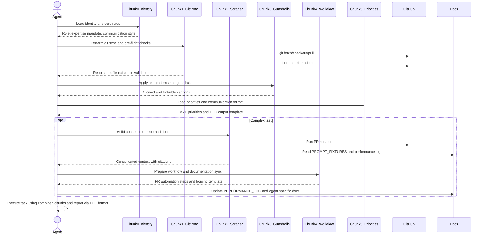
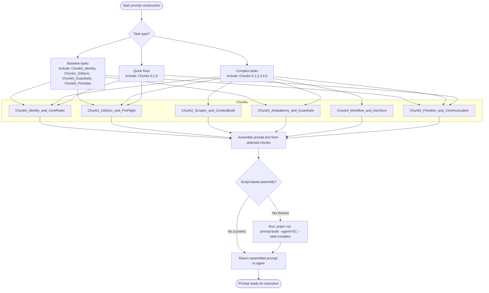

# PR #79 Review Analysis

**Generated**: 2026-01-15T11:58:26.680Z  
**Total Issues**: 3  
**Breakdown**: 0 CRITICAL, 1 HIGH, 0 MEDIUM, 2 LOW

---

## Summary

| Severity | Count | Action Required |
|----------|-------|-----------------|
| CRITICAL | 0 | Fix immediately before merge |
| HIGH | 1 | Fix if <5 min each |
| MEDIUM | 0 | Document for later |
| LOW | 2 | Optional (style/formatting) |

---

## CRITICAL Issues (0)

_No critical issues found._

---

## HIGH Issues (1)


### 1. Sourcery

```
<!-- Generated by sourcery-ai[bot]: start review_guide -->

## Reviewer's Guide

Adds a new "6-CHUNK PROMPT ARCHITECTURE" section to PROMPT_FIXTURES.md, defining a modular, chunked structure for agent prompts (identity, git sync, context scraping, guardrails, workflow, and communication) without modifying existing documentation.

#### Sequence diagram for agent workflow using the 6-chunk prompt architecture



#### Flow diagram for 6-chunk prompt selection and assembly



### File-Level Changes

| Change | Details | Files |
| ------ | ------- | ----- |
| Document a modular 6-chunk prompt architecture for constructing agent prompts. | <ul><li>Introduce a new top-level section titled "6-CHUNK PROMPT ARCHITECTURE" separated by a visual delimiter</li><li>Define chunks 0–5 with clear purposes and approximate size budgets (identity/rules, git sync, scraper/context build, anti-patterns/guardrails, workflow/doc sync, priorities/communication format)</li><li>Detail standard git and filesystem pre-flight commands, PR scraping and context-building commands, and doc/log update templates</li><li>Enumerate strict "NEVER DO" and "ALWAYS DO" operational guardrails for agents, including tooling and workflow constraints</li><li>Specify standardized TOC-style communication format and bullet length guidance for agent responses</li><li>Describe recommended chunk combinations for different task types and outline a future script-based prompt assembly command</li></ul> | `docs/PROMPT_FIXTURES.md` |

---

<details>
<summary>Tips and commands</summary>

#### Interacting with Sourcery

- **Trigger a new review:** Comment `@sourcery-ai review` on the pull request.
- **Continue discussions:** Reply directly to Sourcery's review comments.
- **Generate a GitHub issue from a review comment:** Ask Sourcery to create an
  issue from a review comment by replying to it. You can also reply to a
  review comment with `@sourcery-ai issue` to create an issue from it.
- **Generate a pull request title:** Write `@sourcery-ai` anywhere in the pull
  request title to generate a title at any time. You can also comment
  `@sourcery-ai title` on the pull request to (re-)generate the title at any time.
- **Generate a pull request summary:** Write `@sourcery-ai summary` anywhere in
  the pull request body to generate a PR summary at any time exactly where you
  want it. You can also comment `@sourcery-ai summary` on the pull request to
  (re-)generate the summary at any time.
- **Generate reviewer's guide:** Comment `@sourcery-ai guide` on the pull
  request to (re-)generate the reviewer's guide at any time.
- **Resolve all Sourcery comments:** Comment `@sourcery-ai resolve` on the
  pull request to resolve all Sourcery comments. Useful if you've already
  addressed all the comments and don't want to see them anymore.
- **Dismiss all Sourcery reviews:** Comment `@sourcery-ai dismiss` on the pull
  request to dismiss all existing Sourcery reviews. Especially useful if you
  want to start fresh with a new review - don't forget to comment
  `@sourcery-ai review` to trigger a new review!

#### Customizing Your Experience

Access your [dashboard](https://app.sourcery.ai) to:
- Enable or disable review features such as the Sourcery-generated pull request
  summary, the reviewer's guide, and others.
- Change the review language.
- Add, remove or edit custom review instructions.
- Adjust other review settings.

#### Getting Help

- [Contact our support team](mailto:support@sourcery.ai) for questions or feedback.
- Visit our [documentation](https://docs.sourcery.ai) for detailed guides and information.
- Keep in touch with the Sourcery team by following us on [X/Twitter](https://x.com/SourceryAI), [LinkedIn](https://www.linkedin.com/company/sourcery-ai/) or [GitHub](https://github.com/sourcery-ai).

</details>

<!-- Generated by sourcery-ai[bot]: end review_guide -->
```


---

## MEDIUM Issues (0)

_No medium-priority issues found._

---

## LOW Issues (2)


### 1. CodeRabbit

```
<!-- This is an auto-generated comment: summarize by coderabbit.ai -->
<!-- This is an auto-generated comment: skip review by coderabbit.ai -->

> [!IMPORTANT]
> ## Review skipped
> 
> Review was skipped due to path filters
> 
> <details>
> <summary>:no_entry: Files ignored due to path filters (1)</summary>
> 
> * `docs/PROMPT_FIXTURES.md` is excluded by `!**/*.md`
> 
> </details>
> 
> CodeRabbit blocks several paths by default. You can override this behavior by explicitly including those paths in the path filters. For example, including `**/dist/**` will override the default block on the `dist` directory, by removing the pattern from both the lists.
> 
> You can disable this status message by setting the `reviews.review_status` to `false` in the CodeRabbit configuration file.

<!-- end of auto-generated comment: skip review by coderabbit.ai -->


<!-- finishing_touch_checkbox_start -->

<details>
<summary>✨ Finishing touches</summary>

<details>
<summary>🧪 Generate unit tests (beta)</summary>

- [ ] <!-- {"checkboxId": "f47ac10b-58cc-4372-a567-0e02b2c3d479", "radioGroupId": "utg-output-choice-group-unknown_comment_id"} -->   Create PR with unit tests
- [ ] <!-- {"checkboxId": "07f1e7d6-8a8e-4e23-9900-8731c2c87f58", "radioGroupId": "utg-output-choice-group-unknown_comment_id"} -->   Post copyable unit tests in a comment
- [ ] <!-- {"checkboxId": "6ba7b810-9dad-11d1-80b4-00c04fd430c8", "radioGroupId": "utg-output-choice-group-unknown_comment_id"} -->   Commit unit tests in branch `gc/add-6-chunk-architecture`

</details>

</details>

<!-- finishing_touch_checkbox_end -->

<!-- tips_start -->

---

Thanks for using [CodeRabbit](https://coderabbit.ai?utm_source=oss&utm_medium=github&utm_campaign=Hex-Tech-Lab/hex-test-drive-man&utm_content=79)! It's free for OSS, and your support helps us grow. If you like it, consider giving us a shout-out.

<details>
<summary>❤️ Share</summary>

- [X](https://twitter.com/intent/tweet?text=I%20just%20used%20%40coderabbitai%20for%20my%20code%20review%2C%20and%20it%27s%20fantastic%21%20It%27s%20free%20for%20OSS%20and%20offers%20a%20free%20trial%20for%20the%20proprietary%20code.%20Check%20it%20out%3A&url=https%3A//coderabbit.ai)
- [Mastodon](https://mastodon.social/share?text=I%20just%20used%20%40coderabbitai%20for%20my%20code%20review%2C%20and%20it%27s%20fantastic%21%20It%27s%20free%20for%20OSS%20and%20offers%20a%20free%20trial%20for%20the%20proprietary%20code.%20Check%20it%20out%3A%20https%3A%2F%2Fcoderabbit.ai)
- [Reddit](https://www.reddit.com/submit?title=Great%20tool%20for%20code%20review%20-%20CodeRabbit&text=I%20just%20used%20CodeRabbit%20for%20my%20code%20review%2C%20and%20it%27s%20fantastic%21%20It%27s%20free%20for%20OSS%20and%20offers%20a%20free%20trial%20for%20proprietary%20code.%20Check%20it%20out%3A%20https%3A//coderabbit.ai)
- [LinkedIn](https://www.linkedin.com/sharing/share-offsite/?url=https%3A%2F%2Fcoderabbit.ai&mini=true&title=Great%20tool%20for%20code%20review%20-%20CodeRabbit&summary=I%20just%20used%20CodeRabbit%20for%20my%20code%20review%2C%20and%20it%27s%20fantastic%21%20It%27s%20free%20for%20OSS%20and%20offers%20a%20free%20trial%20for%20proprietary%20code)

</details>

<sub>Comment `@coderabbitai help` to get the list of available commands and usage tips.</sub>

<!-- tips_end -->
```


### 2. Sourcery - docs/PROMPT_FIXTURES.md:315

```
**issue (typo):** Add the missing verb "is" for correct grammar.

Consider rephrasing this bullet to `FAIL fast if repo state is unexpected` for clearer grammar.

```suggestion
- File existence checks (VehicleCard.tsx, FilterPanel.tsx)
- FAIL fast if repo state is unexpected
```
```


---

## Next Steps

1. **Fix CRITICAL issues** (0 found) - Block merge until resolved
2. **Fix HIGH issues** (1 found) - Fix if <5 min each, otherwise document
3. **Document MEDIUM/LOW** (2 found) - Create follow-up issues

**Generated by**: `pnpm run pr:scrape 79`
