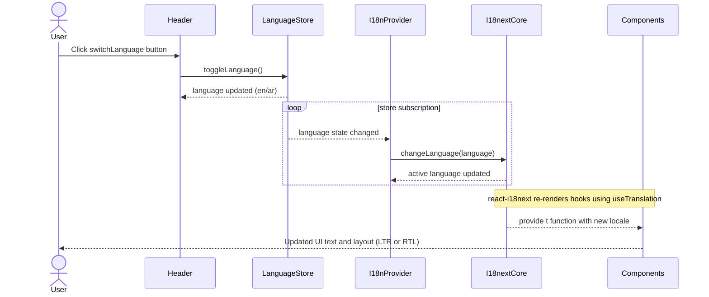
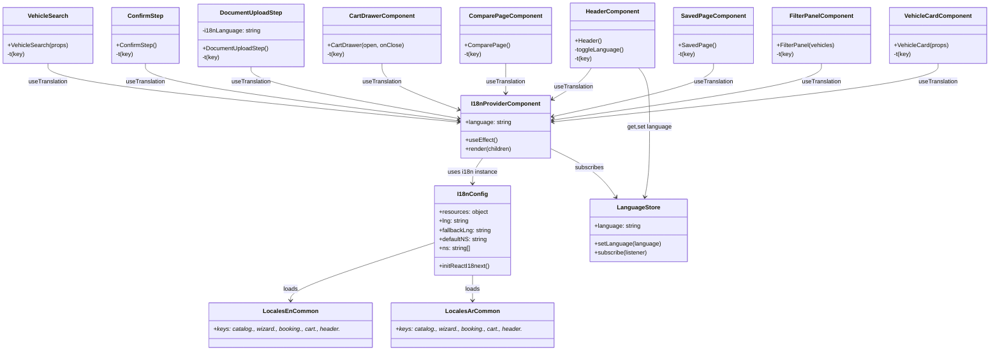

# PR #82 Review Analysis

**Generated**: 2026-01-16T10:37:52.105Z  
**Total Issues**: 29  
**Breakdown**: 1 CRITICAL, 1 HIGH, 2 MEDIUM, 25 LOW

---

## Summary

| Severity | Count | Action Required |
|----------|-------|-----------------|
| CRITICAL | 1 | Fix immediately before merge |
| HIGH | 1 | Fix if <5 min each |
| MEDIUM | 2 | Document for later |
| LOW | 25 | Optional (style/formatting) |

---

## CRITICAL Issues (1)


### 1. CodeRabbit - src/services/ocr/ocrService.ts:29

```
_⚠️ Potential issue_ | _🔴 Critical_

**Missing error handling for failed HTTP responses.**

The code calls `response.json()` without checking `response.ok`. If the API returns a 4xx/5xx error, this will attempt to parse an error response (or HTML) as JSON, causing a runtime exception or silent data corruption.


<details>
<summary>🛡️ Proposed fix with error handling</summary>

```diff
     const response = await fetch('/api/ocr/scan', { method: 'POST', body: formData });
+    if (!response.ok) {
+      throw new Error(`OCR scan failed: ${response.status} ${response.statusText}`);
+    }
     const result = await response.json();
```
</details>

<!-- suggestion_start -->

<details>
<summary>📝 Committable suggestion</summary>

> ‼️ **IMPORTANT**
> Carefully review the code before committing. Ensure that it accurately replaces the highlighted code, contains no missing lines, and has no issues with indentation. Thoroughly test & benchmark the code to ensure it meets the requirements.

```suggestion
    const response = await fetch('/api/ocr/scan', { method: 'POST', body: formData });
    if (!response.ok) {
      throw new Error(`OCR scan failed: ${response.status} ${response.statusText}`);
    }
    const result = await response.json();
    
    // Inject local preview URL for immediate feedback
    return {
      ...result,
      imageUrl: URL.createObjectURL(imageBlob)
    };
```

</details>

<!-- suggestion_end -->

<details>
<summary>🤖 Prompt for AI Agents</summary>

```
In `@src/services/ocr/ocrService.ts` around lines 22 - 29, The fetch/response
handling in ocrService.ts currently calls response.json() unconditionally
(variables: response, result) which breaks on 4xx/5xx; update the flow to check
response.ok after awaiting fetch('/api/ocr/scan', { method: 'POST', body:
formData }), and if not ok read the response body (e.g., await response.text())
and throw a descriptive Error including response.status and the body before
attempting to parse JSON; only call response.json() when response.ok and
preserve the existing injection of imageUrl via URL.createObjectURL(imageBlob).
```

</details>

<!-- fingerprinting:phantom:poseidon:ocelot -->

<!-- This is an auto-generated comment by CodeRabbit -->
```


---

## HIGH Issues (1)


### 1. CodeRabbit

```
<!-- This is an auto-generated comment: summarize by coderabbit.ai -->
<!-- This is an auto-generated comment: review in progress by coderabbit.ai -->

> [!NOTE]
> Currently processing new changes in this PR. This may take a few minutes, please wait...
> 
> <details>
> <summary>📥 Commits</summary>
> 
> Reviewing files that changed from the base of the PR and between 5a916da3fcdde7d7f4c91813dec405d31e4da590 and 0b9eac1a02af8900f49193cadb1d33fe174d627a.
> 
> </details>
> 
> <details>
> <summary>⛔ Files ignored due to path filters (1)</summary>
> 
> * `pnpm-lock.yaml` is excluded by `!**/pnpm-lock.yaml`, `!pnpm-lock.yaml`
> 
> </details>
> 
> <details>
> <summary>📒 Files selected for processing (1)</summary>
> 
> * `pnpm-workspace.yaml`
> 
> </details>
> 
> ```ascii
>  ____________________________________________________________
> < In God we trust. All others must go through a code review. >
>  ------------------------------------------------------------
>   \
>    \   \
>         \ /\
>         ( )
>       .( o ).
> ```
> 
> <sub>✏️ Tip: You can disable in-progress messages by setting `review_status` to `false` in your review settings. Additionally, you can disable the fortune message by setting `in_progress_fortune` to `false` in your review settings.</sub>

<!-- end of auto-generated comment: review in progress by coderabbit.ai -->
<!-- usage_tips_start -->

> [!TIP]
> <details>
> <summary>You can validate your CodeRabbit configuration file in your editor.</summary>
> 
> If your editor has YAML language server, you can enable auto-completion and validation by adding `# yaml-language-server: $schema=https://coderabbit.ai/integrations/schema.v2.json` at the top of your CodeRabbit configuration file.
> 
> </details>

<!-- usage_tips_end -->
<!-- walkthrough_start -->

## Walkthrough

Adds application i18n (i18next/react-i18next) with English/Arabic resource bundles and wiring, migrates many UI strings to translations, removes legacy public locale files, and introduces a client-side OCR flow (ScanModal, ScanSlotButton, ocrService, API route) integrated into the booking wizard store and UI.

## Changes

| Cohort / File(s) | Summary |
|---|---|
| **Dependencies** <br> `package.json` | Added runtime deps `i18next`, `react-i18next`. |
| **Removed legacy public locales** <br> `public/locales/ar/common.json`, `public/locales/en/common.json` | Deleted legacy public locale JSON files. |
| **i18n infrastructure** <br> `src/i18n/config.ts`, `src/i18n/I18nProvider.tsx`, `src/i18n/index.ts` | New i18n init, provider that syncs language store, and centralized exports. |
| **Locale resources (new)** <br> `src/i18n/locales/en/common.json`, `src/i18n/locales/ar/common.json` | Added comprehensive English and Arabic translation bundles. |
| **App provider wiring** <br> `src/components/AppProviders.tsx` | Wrapped app children with `I18nProvider`. |
| **Header / Cart / Catalog / Search** <br> `src/components/Header.tsx`, `src/components/CartDrawer.tsx`, `src/components/catalog/CatalogToolbar.tsx`, `src/components/catalog/VehicleSearch.tsx` | Replaced language-store branching with `useTranslation` and migrated displayed strings to `t(...)` keys. |
| **Vehicle, Filters & Search UI** <br> `src/components/VehicleCard.tsx`, `src/components/FilterPanel.tsx` | Replaced hard-coded language conditionals and strings with i18n keys; updated aria/validation messages. |
| **Compare & Saved pages** <br> `src/app/[locale]/compare/page.tsx`, `src/app/[locale]/saved/page.tsx` | Switched UI text to `useTranslation`; compare page layout adjusted to grid and translation-driven labels. |
| **Booking wizard pages & steps** <br> `src/app/[locale]/bookings/new/page.tsx`, `src/components/booking/wizard/DateTimeStep.tsx`, `src/components/booking/wizard/ConfirmStep.tsx` | Added translation hooks; replaced displayed strings with `t(...)`; adjusted some effect deps and validation subscriptions. |
| **Document upload / OCR UI** <br> `src/components/booking/wizard/DocumentUploadStep.tsx`, `src/components/ScanModal.tsx`, `src/components/ScanSlotButton.tsx` | Rewrote DocumentUploadStep to slot-based scan flow; added `ScanModal` (camera capture) and `ScanSlotButton` components. |
| **OCR service & API** <br> `src/services/ocr/ocrService.ts`, `src/app/api/ocr/scan/route.ts` | New OCRService with `scanImage` and validation utilities; mock POST `/api/ocr/scan` route returning simulated OCR result. |
| **Booking wizard store changes** <br> `src/stores/useBookingWizardStore.ts` | Added OCR state fields (idFront/idBack/licenseFront/licenseBack), `scanDocument`, `allDocumentsValid()`, and updated validation/reset logic. |
| **PWA & misc** <br> `public/manifest.json`, `public/sw.js` | Simplified manifest icons; service worker caching restricted to GET responses. |

## Sequence Diagram(s)

mermaid
sequenceDiagram
  participant User as User
  participant UI as ScanSlotButton / DocumentUploadStep
  participant Modal as ScanModal
  participant OCR_Svc as ocrService (client)
  participant API as /api/ocr/scan (server)
  participant Store as bookingWizardStore

  User->>UI: clicks scan slot
  UI->>Modal: open ScanModal (slot)
  Modal->>Modal: start camera (getUserMedia)
  User->>Modal: Capture photo
  Modal->>UI: onCapture(blob)
  UI->>OCR_Svc: ocrService.scanImage(blob, type, side)
  OCR_Svc->>API: POST /api/ocr/scan (FormData with image)
  API-->>OCR_Svc: mock OCR JSON result
  OCR_Svc-->>UI: enriched ScanResult (preview URL + fields)
  UI->>Store: call scanDocument(...) to save ScanResult
  Store-->>UI: updated document slot state
  UI->>User: display scan result (success/error)

## Estimated code review effort

🎯 4 (Complex) | ⏱️ ~45 minutes

## Possibly related PRs

- PR `#58`: Adds OCR/ID-scanning components and API endpoints — overlaps with `ocrService`, ScanModal, and scan API route.  
- PR `#68`: Modifies the booking wizard pages (same files localized and adjusted here).  
- PR `#77`: Adjusts booking validation/workflow (canProceedToStepX) which intersects store and validation changes in this PR.

<!-- walkthrough_end -->

<!-- pre_merge_checks_walkthrough_start -->

<details>
<summary>🚥 Pre-merge checks | ✅ 3</summary>

<details>
<summary>✅ Passed checks (3 passed)</summary>

|     Check name     | Status   | Explanation                                                                                                                                                                                                                           |
| :----------------: | :------- | :------------------------------------------------------------------------------------------------------------------------------------------------------------------------------------------------------------------------------------ |
|  Description Check | ✅ Passed | Check skipped - CodeRabbit’s high-level summary is enabled.                                                                                                                                                                           |
|     Title check    | ✅ Passed | The title 'feat(i18n): complete locale migration system' accurately summarizes the primary change—migrating the application to use a comprehensive i18n system with locale files—which is clearly reflected throughout the changeset. |
| Docstring Coverage | ✅ Passed | Docstring coverage is 85.71% which is sufficient. The required threshold is 80.00%.                                                                                                                                                   |

</details>

<sub>✏️ Tip: You can configure your own custom pre-merge checks in the settings.</sub>

</details>

<!-- pre_merge_checks_walkthrough_end -->

<!-- finishing_touch_checkbox_start -->

<details>
<summary>✨ Finishing touches</summary>

<details>
<summary>🧪 Generate unit tests (beta)</summary>

- [ ] <!-- {"checkboxId": "f47ac10b-58cc-4372-a567-0e02b2c3d479", "radioGroupId": "utg-output-choice-group-unknown_comment_id"} -->   Create PR with unit tests
- [ ] <!-- {"checkboxId": "07f1e7d6-8a8e-4e23-9900-8731c2c87f58", "radioGroupId": "utg-output-choice-group-unknown_comment_id"} -->   Post copyable unit tests in a comment
- [ ] <!-- {"checkboxId": "6ba7b810-9dad-11d1-80b4-00c04fd430c8", "radioGroupId": "utg-output-choice-group-unknown_comment_id"} -->   Commit unit tests in branch `cc/locale-system-migration`

</details>

</details>

<!-- finishing_touch_checkbox_end -->

<!-- tips_start -->

---

Thanks for using [CodeRabbit](https://coderabbit.ai?utm_source=oss&utm_medium=github&utm_campaign=Hex-Tech-Lab/hex-test-drive-man&utm_content=82)! It's free for OSS, and your support helps us grow. If you like it, consider giving us a shout-out.

<details>
<summary>❤️ Share</summary>

- [X](https://twitter.com/intent/tweet?text=I%20just%20used%20%40coderabbitai%20for%20my%20code%20review%2C%20and%20it%27s%20fantastic%21%20It%27s%20free%20for%20OSS%20and%20offers%20a%20free%20trial%20for%20the%20proprietary%20code.%20Check%20it%20out%3A&url=https%3A//coderabbit.ai)
- [Mastodon](https://mastodon.social/share?text=I%20just%20used%20%40coderabbitai%20for%20my%20code%20review%2C%20and%20it%27s%20fantastic%21%20It%27s%20free%20for%20OSS%20and%20offers%20a%20free%20trial%20for%20the%20proprietary%20code.%20Check%20it%20out%3A%20https%3A%2F%2Fcoderabbit.ai)
- [Reddit](https://www.reddit.com/submit?title=Great%20tool%20for%20code%20review%20-%20CodeRabbit&text=I%20just%20used%20CodeRabbit%20for%20my%20code%20review%2C%20and%20it%27s%20fantastic%21%20It%27s%20free%20for%20OSS%20and%20offers%20a%20free%20trial%20for%20proprietary%20code.%20Check%20it%20out%3A%20https%3A//coderabbit.ai)
- [LinkedIn](https://www.linkedin.com/sharing/share-offsite/?url=https%3A%2F%2Fcoderabbit.ai&mini=true&title=Great%20tool%20for%20code%20review%20-%20CodeRabbit&summary=I%20just%20used%20CodeRabbit%20for%20my%20code%20review%2C%20and%20it%27s%20fantastic%21%20It%27s%20free%20for%20OSS%20and%20offers%20a%20free%20trial%20for%20proprietary%20code)

</details>

<sub>Comment `@coderabbitai help` to get the list of available commands and usage tips.</sub>

<!-- tips_end -->

<!-- internal state start -->


<!-- DwQgtGAEAqAWCWBnSTIEMB26CuAXA9mAOYCmGJATmriQCaQDG+Ats2bgFyQAOFk+AIwBWJBrngA3EsgEBPRvlqU0AgfFwA6NPEgQAfACgjoCEYDEZyAAUASpETZWaCrKPR1AGxJcAZiWoAFPAAjAAcGACUXEzM3F40kB74DGhekMzwRFTi+FgBtpBmoQBMEZCQBgByjgKUXCXlBgCqNgAyXLC4uNyIHAD0fUTqsNgCGjF9ABIkAB5g0KKwYK0qfbCzYDSIuGC0FJIkYMyYfdzYHh59DRVNiHUwi5Oy3CQAGlaQgCgE9vjYFAzeRgMPpJFJeMCIWTbEjMI6ZbLwXKQQBJhJBcM5SJx0tosBUAMro3DYXr8F5Yb4MCj+Gj0YoABmKADYwHTgmBggBWaDFYIcADMvOKfIAWkY8Y5ji4OAYoABZeHUaQKKnobhxeApHJYGLcXLsZAESDEkiQKloMRgELhWa4SAAd2GjHYVA88AAXnRIAApPEAeUqiWSqRNPngXmQmHoVOY+CkyFgzloTCU9G2+wwRAjGHoxww2FSiUwRHzpEY6wYAGtEBoZZAAMIsXXkDC4ZAZLKK2hcABC+HwFfgGcgAHV3YnIAEACKK9xsAA0kEnyUc7CacXwaFoC4bGFDFGYEW31FS+CIE7x/n+sEgADIYH2PAJnIf643nCbI5A8WgpPRuGhSEQABufhcHWPgqR8c0CAoZBBwYDxsCUSApAQBCTRSChaEQBd1k3SgF0w209jQO0CPQbNIFDDwaD4f9yA8NF8CNO40SoDBEA8ahESwCsSChGsoFaINwy4TcUwov98DOLiaXsf4+itDAQRE6Q+gAbzIOdnAAXz6GIYwwDQhEQJFPx9f1IAEbBs3DBQpHTM8DKRJoAElCOPJIiAXAQ+wHIcHTdRMPIoXBcP8JQKAXT9EBeBhkDTQdMwnYI6TpABqSA+KhCIQIAQSoNQGDYzBOO43JkF4WN4Aknx8D4cg7Sy/jq1rHdQyILhB1wChFGwAFUwTKl6CUm0+jNC1RpmW0mF3TI/nKrBP0wVV1U1HiwC8KRGNcsIMCsXqJBqyh7XgYaUBbZi8rVA7qsi4CUD2hQ5rPbBuFoTsmJYk1QQLCyA2o6RBMgbtsDDeg7wc+BQ3W3IuG4DBuGYKywY8P80EQO56DQHxaPQNFnhDeAZhAmxoFaew3t1ULTRIdFB09I60DRdY2GBycSDJJQMAYeBpDE2gJKmsLaegy09ptaLKLAkgzoJl5ICUUMMHUHjWqgSobXsGgejEpD1Fp45ByS9JB3qhRYj1FtkACAA1Eg0K8aZeoXFZsxNqwAOkXLaYAR2waRbUNNgKFLAoimKdnlzYFtFq6ltKAwAsCipI6SCazBUihVBaGj9gLoQpC6BrGUwEMAwTCgMh6HwHwcAIYgyGUOSDPYeG+EEEQxAOGR5GTZRVHULQdH0CvwCgOBUFQFa0DwQhSHIbJPVblsuCoJqHCcFwrL7xQB7UTRtF0MujDH0wDH/SsveM0yMGlAAiR+DAsSA8tcxvF8+zfJXkWuyyLaQRgoB5UFp6RqpobLiDYIrTm1cyC835o9a000JzFA5BoAA7BoAALGUT8E0djCxSoyDQ6C+RlBspFSA98lBc3gXzRA99gaVGYgwBMGYlSGnwDLPgtC4E8wYQuRAlJ4DcFbAuc2SgJAczoQI6QIFcgeHkOJVWFV+B1xlugXyUgeCjFdAwXYoguLnT4dmehSpBw8HNBWa+Jlcgl3MJYPKNFm5qy+popQCFnCLWQH/WY1M5LmzOAIfRkB2Cq0AbWGR/CGDKNAV2JB5AUGWMvjY0gN8kSmO5ggxAUTYFmJ5nElMa9/CTQlskrAqTbG3xgbInJRhWgM2QGwgBCT0rFD6CyIwABRbY8Bjgtz3rTNOTUSA+DqqFLgso6DwEcAYR+98gHn2CfolSYI1LOH0iwQyGS77zKfi/N+H9m6em/s4X+dcWkcNybWGwMJYyek0eElUBUVAakDGCMcWpno0BbFRXqyMVkajWcGRAfRNnOSMnYjAC54KIVoCbNAapKhoHnIWDMJYSA+T8gsbYk59hSCltjC4VE+Zo2QJQk6mjfL9hNp3UQtoAjiFwF4BcSc0XcFgHqBcvAxmUGGtOGgbLuHSCEaMDIIsUg8xIB4MVDAASYwXPy+qbLUUkDuf7M6dAeVcvIBqsGw0FwfRoPqrVtAIgaBgAgZASh4icPWGElsWr0AUC2awex0LtYUH6kSFUn51AGnYmVLUrVT6HJcQiNRhoPFGO8SG9RYSZgBM9EEvR7zwniEiRrPUDSmn/w4W0uknTggAE4el9IGcvIZqc+ajPGfVLEwk7T7MWaXMARggXAl+uGPoZA3U7OhQ/A5Tj34LxOamCU5yE1XMAkYO5MZfwsxNN0jMrpEDXm7SabKyAqSyUecxTRSLuAoG5sy5RlEaX+TPBM5GPgAW6JCcCzdYK+2Qt2ZavEcVoYalSEohcmiCDcE2iQbazUoSrRRWiriGKvZEqsjiwO+KDj2koCaW1dNtXoCSAFR0TynUqkvXS4QDKC7wpNgG0lMrsJcGZayyA7KsU8F1Yx3lfgKACsVMKrYYqBASo8tK2VlN5XSBwmE9jKr6NqtNYapjeppOYc/Ma9VJBNXDUtSw+j6cwPIDIn6+JDjn5OIjT49xDrPHGJM34pNDaU10TTcVDNDCgGQHnQ8v89nvR+gDNlLgAADI9kGSC+YupAXznaQU9tfdsj1t9fO3PuYuztnnLI+dC9B4sXtguWLC/ZiLakovuqhbF+LC7PRJf+mBvzl7cW4CQ1ILLWAcuPq7apF9yk33Qri1AVziWPMVdS75wjGYNC0aCyFprqzn29va9ForuQusuYS2VvrXnKuhaG0QDQDGGuhfC1NgrA7ivdaW+55ryXvP8Sq35JKGhOV6h2xNp9rXpv9pi/NkrbmH2hP65d9b13husf5XQQVY3st7eewdt7GAFs9eW2dn7sgru0uGxgEViAHvg/WW117c3ocfd6/D1bA2NsaAcLx9QGPcv7Zm4V3ZMOTtffeQjpHV7xiYABB4SnzW8vY460dxbpXTvfaJ79wb/3NsOGE5jLnk2Ic08O+947gvGfFWZ395Hm3lUUBl09rHL2+eK4F598rIvEfq9Zwx+TtAdctb15D3H9Plcm5S6Lknd29UqYNXQG3PP9ezbp/juHwuXdm7FxrjQSmrc++pzjgPBhGnkGaew0ghbi1loML0qBn1+7DNrWE+tkzIDTIRXMhZSz20GEQApI9fQADam6AC6br/xUlONfVsMwh2LMOaOpuS8J1bwufm2d8W4jmk9ENWgYB+70FeUVPoK6iBruvDQFBAh2JsKVA6MCiSSocVkm44kJtjTQCDQfuG6B4koEtjTP+J+z+LSNZQA49B0uYv+SwRJGg3+wckrTMfA06Q5w4gcQJobkXqSUOmuGAQAA5BoPATAWUNusDLDlGDKvAOziaGZPYJzHGj9EWO/tsPVCGObOAavrgCBD/qWKjhvPgF4EoorASmQDvLvlQSQMDK5C2L1LQP1I8g/t8lyv2DbCLEpHgpRMaPQDLMjOaL1JjJAHhAihmKJlxLUB4KJp+NZF0EiOQerItnaPVHxK/mgLIL8LaHep/szNsNxMVHcP7PAiaIaMzFkDVGAE+FjEaCrKGJ6FxCYXgFRObKhBqGkJhNhH/rFKIN+rDBxLCjzGRkOCtP4vogbIBsBrjGErELgH3DKoxMtJAM4ZITCGPgkGCAwOcJ9OYcjJonmMwLUB3HXIEehLoQANKcy2izBIDiBDg+A2Tdy5CpDqDyATKSZHRECP6GyxgFhTgyoYauSzQvifjoTOBYaCaaFohawqEyoUrvSfSGjGh77Bo8TabAzdJJqRiej9JezyGRiuhDjRg4gyB+Hb4r78EbR7AHBYAbFqEgRkAODnQAEOx0FUJQQXBPiViBhDDFR3GDhwSxxiDAzyio58D9IBKMBeCYBvQlLK42QSFF6Kj7CpBgDgE6hWytgTgADi+wW4MAKgXgAAVAuJOJIMdHwMSJcWmP4MwDcXQGIdjFfj1KVOflgMiQ2gZuGrRCZtGmZrGpGhxAmv4jZjXHZmdo5lmkXnTFyrycUpACwuQLWNMmBIoPYJkEnL6iaG9EpgkjqSQLWLbM4BgSEiaFSAxpaTmoZriZ4YHJAAAGJhgmh5RJxKIegUC5qJ7D50BcDtLYKdLFDFDlpZ6DLIQ1paZjITJYiTCZCwAtrl5GBV7Ag1716qRN6IA/h0Bt7pId5d5ulHJjr96UyD7TrJ6qkgIST8n76LTyF+TX4okBD34CmLQ8nfQjRBzMSCD0xYC2j+p7QoGcxcSAG5j5iMRsFliiBVgThLkAC8m5kAMBzgiBp0O+uAAQ8BGgZQYIah/hfAv6isSAY+sgpyPUkBNGngjGSgwi+wYiPEcGmhBA45NoHBXBfUgBS5VID5IGBYTMX+S5Qxuovy4gBY3Rpp4JGoPkfhvAFx28TpkUJsNBtMroSo2hF5yxax00zCrCjZBorCuQPUdBVESQTU5sWuVxtkJstQJh0s6xIkXyPEIEMYH0jEtQCYR05sSIMYkCf+CE+ArEUJspmixZbMp8VZxm8akpaG0plmdc8poUtmKujqzKTmtYVpIZSoM64ZkA6UGCnSGCcZFxCZjpIGeeKZDaUyMypeT8baOZCkxJzYrYfQ103At0R090I2iAneWZPexytZZy28f8JlNywCV+wpt+dcu04QAVzJf+doVAaojyDqflaV90MBZY4MTp+514wAKV+0h0zJegX0VUgVJo3Uici0/RQU3ys05B6mzESWeUVgrkfQiAxp1AfwGE5FX0eVVV90IEmFVKVIJoOFcKRcBoDqFV+VJ0zgvwlEbCxVZAopRm4pylB6UpXiMpviGl1mWlipOlKpcV2pZFACFFiayatApwHmGa8gA1RAJpw1oawAuY0MgcAA+oDIYFUuktChXH0H9X4NsEDb6UZUnq0hGR0uyNZZWvQDnkmXWqmc5SXswFme5ZXp5Y2CSWCnWM4LVuvJQMFaFWXuFTWV/JOtFZcuRc5ncv8fGImNPnvPQGTBTJ+IvsvhAUoaVfsYKdpihBgaLGUsgpoK/ILBSncKfn2d8p+MaAaLAURMeXuUMVeWQVrEys+f+ioIWKoaJoUZkRCISCaGwJjF7OoRengD+SbZsRapAC0ZzMgO0X0kOEgLza4RjN4cYaYTArzANWogEOzlyrwlqr0ZECjMRNMaMVsBLQNQ6cRcOaLT4pagiebHaAgFsJfA4b8GwmAG9L4gIHcBQIuqsajkhcVLFVZNIMdMgN2lxUiA6I5J1WGQ9d1b1fwHwF5fnB9V9VSKGs5hpg3YaJpTSC9cqU6pkUaZ9UNaPSXAnsZY2W0sEMjWEKjdntWvZcmQXliMXrMnjWXgTbmc3iTX0D6RGp7AxNTZWXTX3gzfWTFSzbWM2ecQnBQCaTxC1e2Q4GqA2iwd1Nwf1MforS8UiBUVLYQuUhOZRMbHBa6G6CbLaBBbNNsJAOpGiJADpJAOud9ErW2VqAEGUJYrfbRPfTKtOf8fQJPjPuihlqQFze7FqKkAregw6kuUQSqE8Znd8kkP2GXdKOUBPM+enROPfF6a5K0NAN0jYHiPfH0K2cGtyYRZogoVTQYOI/WGiXwN+UiJ8TWHoxeLHWiM+cgEMd2OxNhEeDQEQPVIItYPsACC5gAguL2LQPINAITKJl6QHIxH4y8HBiQ4gBkJjIcVSPQyLYeTAdRLRNWLSXucIxWGXfCWbHwDetQJ0WeJuEIMSLgDHKSetZQkuppk1Go2LayaWAEFgx0fnD6K8BeQMnk2ESwCaHneoNIIXd3RagZSORXZQBIDSSNQArVR5oPX8sPcvfhXwNPZ6D1a5CBAJT+IiAPaNe+IkP0j05IcxHrSgq3a1TxLta/EpW4ipSHRZvGlZk9f3VdfPfpdmrqfHnmiZZvVGeyLGRnhWnvYmQfVjU5WqbjfjRABXpfdMz5dMPhBQI/WFSOhFa/T/A2fdc5pwdRTwQqhdLRH/X0ag+2UEHtGUEAyid1IdSaDC1QlC6Azfu06rQNUOL2aQ4cbAwQuLDLXQ7OUqJPlzSmAuGwRCF+jDELclAI9U1/A+cLRBYeceUgS1GI7oDAJIzhWrWiLAdo3C6NogaY0q27CwyaIgNvmwvHU7Wq/E5q6Tsa7APq5ijq7o0q2TTTE+LQKWPgjKp9J8cgKq6xPE5rRtogA2JAjAQuLg0wGJTpAOX6+TeMG+PsLfIGxtbgCGzgwoBGwM/FaEWYT0d8rUyQQPeTX/pq+nQuNGNVEOLykJcSNeVSGIMw5iv7e4bNAihw+eUMeQT8uwMDO7T0D8r1IxD4HRTi9BGuQQZcQQEQEvoxknCMWMURIwaRJQGUKsZPQ6u1fnNNY5F9Lur/OOdAxxGc84vtZcxS9c3Gm4ncwqQ80ltdePV1blos/QOZue2orptbYoN+p6AEN0TzN8rM6aaJo1RQFBAqhIgs+dXJNdYbDiDlYa2qgM26bKJgP9dg7fX6QGbIEGfDWGW0hyJ0oyLvbZbnofdjSC6fWC+fJC8Td5WCvbI7CQE67QPC7TYi/TXJFFUPrFeiwBVixYj/XiwGW3VgKSyA3IJfooa9FA8rYce6wASbLy0w4lMLeK7AVrfK+BjIZJcgOAV69FPiZtCoJsShVob+dNHBqM66MaocTbcWYBFy+Pi3WO6w24Z6OvpHSbAEBuVuTuRQIVQAPyQDHmQBcBytxP7uBgiO9s60krGgUBgAgfoOSykb6xDgbatOUZozO1qFKriZ8A2d23GdO26dhGEjVv5d2e1hrhKbIAWc1TtmfiMXsK0A3FniGg7v8B7vK2ejldKgBDsGbbYrh6W6e5mqDes7u7KaqaYYk6R4jcyYk5a4DkFNFNLWqV1LKLsbGFfRZIdcVMSvfI/sWO2jQk0CbgJpsHAwgKFPbARhS6p1hgDFZcPV7H7duIR36deuEVQQSDOMJALFxsfix2IAZuLbs3azWGivWPmwPnMCiY9GKhOP7AehUl3DUBm24AMAaALjivhfboTgNFeAjb7Cw8LgE/sEw+k8OxBHsHw+OPOPI+U/0ek7UjA8hbMDAGiJpDgHvgYz2fYsKfc2QCAA4BL2P2A8Ng3ViQIALgEf+u6n0vFqQfQCKJ4rXVjPGo29t9ARjHxhn55OP0nSIzoDCE4JOo2Y3NWkvY3N2UqHOVvw2ZOfG8G4eDv6geTdvm2MPiAeUozYYYzSqGPJ58JOIY5ntMwHRJs7V/btF+AGclEjF/4YEDxtovUeASoV5sX8X5oiXKCYEKfRA14SkMRhcEnQmCqL6uX9gSclYT4eXImdtJv4uGgi3f+CvjE67fysV3bJAHtVEOb/9/FDs6z5s3UI7379UyMtXVnuQ7vlM5OUTMDdFsKxwpYwJj41ipbvTFUyGazQlFAZQ3TaQZbR0Q4gr4RvMIrAvLZf5d73dkzZ2yz/Vg1AHcpEHnoUHdsVP6EjHFsTYQ9T/w10HaEhUzkokAEOL8MNHtVcRRpT2z7E6i/3uapo56elVUoZTeahkPmSNL5sUCsq/N4yVaAFiMnzykcT6rlVtOCw8rAgoWYKDbH0ECiJg+g7UM6MwAJCcxmOw6V+L3k/jsdGanHD+lAAxbgNsWr3JEBBWZYHEzI0sI8vATKDRdGIGfBLkOCU7JRK2iIYkAwUv4KZxkDKE2IxR67KFdeomf4lyjRiUBRM2vEtpYxZSio/8r5ERB+R0Q6E+eSoKwuIAcwV8lBWYIwqbRFrHNPQePPrhoAG5O9xuzGK3NjzHBYQNA3CbgBeGzDdJcu4QoKJEMlxl93AVgwiP7lpLaYQeVXRUMgF9DQArAYAOXnJG55x8K+TXFrl9Be78FuudfQCBdGhBnc/4GgnMPUOsELUS+BQooSULf65d9BptODOsA8AvA+Ajg2sMJE+QegZA4uUviJglpaZ2+jKDXk/jfKiIQ0cGJQPTDUIDlR6IzdslsO0CLkDBwMXIcnTS6zQ9wAyazu0M8Hg8iQBoG0Ld1kKrdIAZBZiDUIN68QWoQfEfkAMO6ttG6glDZhOG6E4F3YGYSnvsBhhjELhZoLUKqlnZah9+CAQ/jOSz5DgO2+vFlhVBAi11e6rkW/ubBpb/tvqh7C5tAIqawD1Kj1K9ogNCS3tBmt/Q0NSNuZnUEBSpBkU8yBiOJ3SKHW0Gh1fgYcsOaA9eojTMp8g8OYAPkHyEI74C7KhAxyoXnTL58KOELImpbBo59AaBdArCH0BByzgSALA7gGwO7yscX63At+szTRaf0Eq/HZqgSy1BdQ6WCaMQWLX9QqwUGQnBNGYXvRuj2yliTRAaP6RGidYP/Ekk4IYac0mG8gjEWeA8Fhcvh4tGVlIJPKKsoA8Q3qB3CwCRNGWZ4Mnr4HvQuD3kPXdxLAV1FMdBwk/OjtT1ci0B7WejL0nTBNa6D2hhYz/MWOKjRpYCC3XLg2KVZkk+86aCvgilig+EQsbkdscjBgI1j0I9GbhP4UoSFVuxMBN9Frn7ESMrB6dKcduTxCb4eCaQAAJq/A+ANWRcEwWXEHpyxEQpjtCB6AR4ZwIYjcYuEVBZcdxMBC8F4DrYg5Lx6rGAhWOZ5fjasioZ8YaLfEf5pxn4kjIaN/HxMAJdwICTBIGZ6N7YeYfAqoXfFQS62qEgOLBOvFJDbx0xMQDhJIDPjOCdULDJQBmhUU24EE+4e8g7YriAJg4OqM4ion2t+BPHXgpIXC55tnoA1aEC2AYKWJwCg7GPoRSSCbgkovaXLkrxvLjiE+sAdQq6E+omw9BItJSLTFMh/AFUJcCwNhwwFmVUonSdPJnhsryjiOQLQvCQLPpuVyBhNSgdR31DajxctAm8fqLzgtg1wkk2gMaNNFVlOB46Osii3fo2jjsIHGCJ6CXClESm3kjcL5LDG7FWImk4QUtEoiWEkgOwFzqmClQqwuidFS1KgQuhclGAiYOHuuDO7a9NeX4SULgD3GYBF4LEL2FNXRGAEBG9UjAHiEymgwTOeRSkn/mZgdTZQigVIJagEGAVHkdE/0VqBAhgMJp2MbuFIC6ncI6x9wkgCBCVgMxUwmUiMJt3kACNPusDTSTFFK53BrGRYyKSBHEgT5riDHJFIhUNBnl7AUqaKSuD+Tus7gE5RaYa0ykgQcSv6V6SU0QC2lLO5Dbbhhn3AMx+ADkK8maEUIiZLUZwz0Ju3QbMR104k0bEr2kB2DvkMrfduoT6k1QE0HU5abgB6lO0qBGQ9hv3y/BSphpfFQitBGQycRuE1U5mMrALBsSaYYEagLTEHYMod0EUJpDIADo1wloFwQGfqBBk1RCpDOLwKMViSKxjwLQVoAQEFGzQHIYdNKX+EoC7BPJtoYRCtEqGmDLUVgV6hB0AHRF46OLJqgP2BHmxPwokodts2MSkAGCVITKq7x2oKUxSUAmSjALUpsjaRF1a9q9W5E3UrSlqOAKhhdRzU7q1yUzIa3/6j14BdIzkemnDkTggx+suKZuGNHhjvKMBUPiiWkqvCQBCiDAMJPtGMQExGhQfrv1jlGhtickCCqIRLhIcPS2DQGAZI3oRkOQoQaMnSGwRyj0a+9RUUfS4AqjMy59eyVR01HOTNQKvBgZ5FPDQAHwNffyc/S4GnIeBqLa5KzVamehjQtrL2ASGIIi1pphxIluEFdrOJGIHbV0OKXPKBiHU3PFUDhRAr7AQMjMSWrK2kHi0TuEUadLkBbY0ylym+SsLoSRnEpjhqhcSjRJmZStkoSUhwrjwValT0QXkDQCMkCGUkPImC08NgtrTf4Oi+ClXkQvTixs1CfIPoFGQ5BkKsFpkUKLdjcYkA8owifUdjL6B3lnA7C4EBzA4UMY+FnC4RHBkXlYLR6wBRNmJQEbhs/kLeNVLRGnLK5BW2UqyBvgQBDgAhQQufO8gkDVhIAAtJALAAobizGI4BDwSBEj40UxJTUUucALVThCDyqY08r+gShUwlE3DDCAgs0C1ho5Bc9gIAEwCSqB5mWaWyKUPMDehXKrm4sCwHbFGfEWli8TbOXTGObxU/ZMcmRk9ZiN/L+TGzYI17XqMekyIvAZA/EEBVI20n/B1p0M5QCSgBH99HuvKSuougEbXSRo9o1tt6JE7MKfZkAuAVc1ZEXt2Racx5sgIjk5LX+z1JLKSJVAN0thDKb+vWBXlEA15dBDeR3ijlrsnJMzZOR+EohVRil/jS2Q4rYDRL5AQHAMlIwSVng7QGMD5C1R/nMwlIpFGgFwAxa2z+J6Ia2CV1fF8TzSOxZiO120LhcGluQPEfeyQGPdZlafCNMXB7nij0onIYtByBHkKACBDlCeWR1IHZkHJV9LUeItPB9BZxXgC8M4DYSbzzR28gfCFOtH7zR83LRzjBlLB8MzSKSkWuyyISpSOyYvHsncBPmkAz5KoVEJfIkGSEmppAEHnfO+hxcFBrXfWkYMBKmCBWBgwrtoSS53ALGChSAnBkkU0Q021sMoO2FrKwNWh9bS4hAtXLRo0F4GbRVjwwXkLUeV4KwNy2MGRQGFhC39LY0jCiZCVm2TcKM2lS+TLwbCD1Ztj1Wtgg2LYf3pjxB5FTm2qiK5UuTc6RLeu/Xe1c4CFYRERWHg0xVRB/DCU64NkDJYI0OLIE9Swfe4omnD5DgaWXkd5EMQGqxA0g+iy1AGswKpgQ1sABcIkxOguDramcUgCUzgxOqTWD5Sds/gzDnK9uWsJYX/m5VsArkSAaQn6jhWZKoA0CngK6qVWwQFwnBM4LgBWBwLiu0yPMK5BoDMBe0sQBMAJIsGKZZA7Kd5HIuIjyStuLI5/Dolgbcq8e2QcCCzBWjgLywVYckce0pExpjqNIx9qHKhWZoJlzI09jCtOrByZ6N7TOR/3o5kqrwAS3ZUvUQr2KeiG9V2v4obrbNLlcSg9LOp8V/5EqtoPNnpMsAdz+R3pX0kKKzgii16CNAtBGWwTI0eNaKjGoCyIHAsbJaoigYpD2h9AVqE1KmhWQRYcCkWlo2ld3WczNkIwlTVEnzBbAQhjokAKTXdBOh3IR2NLHmQbIfXxRIKTnLpo6CcJJAnwxw5lYa0iljTaNZ076N0i0F1s2upSDOoBvup/4AVydTSa3KnImUBVXTdYFgHIBl9zk2PLKtwAj6oi9gzBARhVRtCrU4Wum2IotXxjdpdNe0dLbdF7ZAcQO+beWF4qKpowSqhykDX7Iergabmwy5DdpVQ3jLx6yZKZX5j031Vtc2G3AA6ygBoc/Ml9JSJJvy3SatWIVOLGYz2V+Zp6MCKCMAV76/tDiXW5kgEDDaJaSqOkd5WNv00UBCtwPOLAYACAfLf6cS45a6D4ihZVtkUA7cFm2ao42iUylXEohPIIquNZlbAZ0jpD8ax5mK4gS5VslkDKOCkEbZcMyDBUn6VKoKRxz3kj5VN+McBJpPB3FgZS6QPqGkHbZrs8KWmgakoHCFbsiEAjTlQg2o2VzjYJ/VSOdi0knjdJmW1WI8rghPQBGRi9dH/l0XFQggWWkvrzVFjwzMYL4T6TajGSzx9VS5Q0BzpFqs7rw9y1fqCQrBUyOo31ebaLttAMZYo4+P/OrsLqiZRxYzZAIZrrYOBwiHEUrbAFkAkQERf+aeq8JR3DURoT0E7pgXQCvClYqu5DVstQBkB9d5qlldaxNgQVmYvDSKTYJjptEaidAEvn/E3Q06dJfHK5tZFsjsEFKGYi2e0q4Bu7Ftc2v+L5iUjBZYGgMULMNok0o7gqR2l+IxuhoCiWN/pNjZQHe0p4IyfIL5j9twHmTR5GKkjsJsB2ia8VI2wcEoBmCQ65N1ZC0TvKtHKaDA40rFug30Lqab2EHGEvJGBD96zEQ+1sNKFT0olM9+q2BhoC2QvQsMGBdwvcpeW1gTi2+kXYtr32jbUq42o/aLJd15a79e2kuJPAjDy18YAILgo8voDOh5AuobqIRSwaOBytyO3IErrR2fg6q6VKgTVoGUByINQcqDfSIzmtbz9ae+JH5jz0Tgd9T2lErA18z76UdvmPNb5mL3hBFIa+svRgZRLp7rtu27rcFgCB4HkNdEog7fsqp7bSD42Cg8pAH2zAaDiHZDlXuY1pBa9gZevaKM42N7Pt3237Z3qsnH0e9M8kHSvok1TYIU/uQdCPsCmRVd5oU+lQjuZjgJJdMe0erTo/AGzQdGh57Fodpyep2qOICPo2CpARaBqOiMgvjK2VEw0gm00MqlOeFacgCNETnoa20FqJOhLhwrOgCB7hRYWM/WxT2rDBJNGe1PGBNsN9Xk0MhsQd8EIhLJDkYQomM/pER8SJDxwAQdnqEctqcxghSUF8H6onCjrYAfQXtVFC0lSKhEDaJKEMMoD4B5ilEXofQHAJVQMiNsRVSYN3VPcMhkCaqZP3bJ6DXaGmMFVcpzwN1kgpRCgCBE0QmUUAam41GgHGjSBLD4nRNY6hpImwzDnFE5jA2h6vzXIJcDWO1qeqz1QkgMIbTYcoOaHXUBuaHBOEl2BHY91SiIEYF8xgmqg/obpAYDBPl7+lEpRAw1rUSXsQ5qBhzOHLa2jIplrxhtb6Q+PqGvjdhn49oeKzSGcOSNOkBZS6SqH1R+J5SDHl+NQ75NbHcfUpq462jQiJhrTNLoeWOjomxxuPegGsO0nfc9uXZD8mcO1rXDDsH4shi8NfCDFHMZWJwmkjAZQM/ggLI4t92MZqsiGJggOUTzscIjHEaILNniPuq6jkI0lBGlExk8QokqAHvkd/BCI4oomCsWGstTdJzQ14TVd8hgOvkeT7oe8o5Ch58BiuEx+6AuD0Gk9+iU/GFPcLVoLgiSVFfttVLiALReT6q5tXkInDpr3eYKZ9b6rjZIAKoUa3AK7U4LF8lQPjR9cVHDOmCczgQ+1epHUjPqdIOkUNupAm5tmBySmVRiGNwo7EnhcqMvjJKzHpBbhcGE7t6ljoFhRjYiAxReCrpp9Xh3J4CvyeqUowk9mjB1Een0SLR4D8JqkYHMa0oH05aJ9AwNpY30HyDnxuk3LljydYG9plJFXOHpCUnW9ZktGuioVH/bgWTaJ820jfPyG29X5gTePNI5Tze9l9fMo3hcka4wUjUMsuTxCqMnR91K4KVOkMMj5OJmLbiTbLO1dKbjQpBOB2G+TE7vNHLJJLaDE40bIGJAcJu6MoijkJTrXELJolF5XpRwBEz2OkgZXj4oxWEPlveVqOfdsR6jVMEgq4aYj8JiYUnDrGSba1zYd4xALXjpDwFigDeeEh+y8ISXaj8xv9qMDWEflKRZONYbUETkuZukeIJoPIwTT6XWWffNRGJzPJeLmA0QTALdABB0A15xo4oGDIWIeXeoXl2gD5Z1h8gwZhoKqLxyd5okrZgC5oXXFMsiI1AmI09isb5moZpUUC5uYzBjMLH2hu3KsTGZQif80grkScNUN9a1CCiKCFMf+JvEaAirlnElSQDrEcS5aLZCy1kngQbcqAFy8cg6mNDua/AnmhMMd09EYFUGSoMnqtNgYqylUHEP4CbCpDFCbI9oCLTydQVJj0rnfPi4AU7GBgpJmIrWGJbFpwSGrPkpKO1bZrcsJLEPbsNYi+hk0CFZ4cwViOgKrj/c8utec9ZV7tXN1M7TIO2TetawVxb6Ki3uU/B+t/cNvGVIgTgwPWwS5gz4mWM+u055d7Vq7kU09Caw18jtTJEgDGav5TwDEoFTKl3aCNXOD4fwFgAs4BwSQUqTy93xCv4BfL4lQK8kGZuhXOYfIGIk0Jrh1wqxGuUqVweCvc3uAflsoH0BFtM3vLrNsK+Q1OE5X6AZNATH/kRsVhTWxjAwZVa2s4i4zqtZWyDGsR9BcbtoetcVE+7mgmAWEJKK9r1JZNWmuTBLQAnbjSARmb/bMGAFrjxcWNjULkgeYOpHmkDJ557aid0oRI4N2SprdMrDlnpF6I9KsxhjEDwrSThk9pNvVRUgX/mP5rvcqIzK97wsUNQOLslQt6HkWmFuldhdB6MqKmzjIYFcqPQno3q459EAcZFqWFkSroHS9iE7lYgAtSoBjGESjq4AAaDGI1EUuF1GWVaTFr+bHCt3uteOrwjUGomcB9Wvond1dCaFLTFAZgO93Si4B8Pg9QoANP4IJlHG3kfI1iLIBtVoAA0mASQdo1DdZgkB77dBc2NJQ8IfMj7EatSSIc9I4UnDQAxRMolNgqxjgjEFe7KS8KZd4rAtkIyATSDHBEANiNOlA7uH4iG0VAA2M43YCANhWP6LUIHZPbB3ETspZE4EjPMR3YNzmAIKjnIAgnhDfdsQ+hzr3Bk07vcsyl81LQKHc7ShnGuR2pMdpcsRrG+GXYU0snK7k+ieA6j8AY9rw+SwigdYxhC75xTUFIJvkFmxQKo+FSuYMXNhkluk0AP2PTdbCmya0vwTiLIFhQzQvTnoTAO9X6hl9uijEOh3TH0IUAKwdybR6bqiEVgygo9JsHcAhVNQDYVIKbjMJ3zkBcAHjzWykPmHP27KdhbBmwANJa9ZYQ4Qx8Y7ccxODC3joJ+wTF43g7w4T0xxoFScalCG3nLJzqytSoAk44mO0Lbq9MsV65IIz8McHeoDhj0GjzRWeHodgAsnWkgpzbFzPWBfQeIaAH0CsBNBoAZQXJSgEStOORMLjn+56T/iaI5HJrWxeEq/ucPAnOj3aXZV9TkBsYiAS0K6cdC9OTYowm9FWmpn4sGCQxIZ6U8Dhj1FKoG/2aQ5fbkORlKJqh4yKgC8jK9npQURIcw5SGONZJuQ2AB+afmc7lkoTdZJUN2S1D4KNUOi/gB9BkgrqQ2cpBT40Bh9LHJk2PppVSO2Txh9TWbZvivw+6BLqw8vvRfcBMX2LykP1SlTjRTCyFrsl4BKaIpxnkzx1LQEAN/ITNRpKo9md9B1g7AVUMvixWUR3LVY8RSAGyE1UVLbUW3d1ic/5cxgwSUruwBGv4DEY62QDvKfmJjMDElU00KgCnfoAwPQidDzUzVGqAR72j+iH4iQBde1EBj1+L2E0AoCMQ6zT99Kc9FDDZJDWNt9glahNDVwRXyfTftmCgI74KsEFM2/k50e7JKjyQLx9IGAIIdeRR7WrV1ePNIm/nlDsZZHecyBNltZkLA6FisATPoAO2XiucBNA3m8yGLpFFi5xfsuTg9LsvSLRhWhY5tGMMzUtosYNvJnAQV59sC4D6pA4EQI7VC/Tv0hgL8LojpjSRfKHQWQjvFVQL6BDSRpHgSlSS/Quw6sLTZT/ZyfUc46dgeOk0Ibuonzy/kh7hmWK+kg/F8YLjjwBCEpDd8cxR7juzsx0RkAjovUDACU0z68xa1aqKgFRGZsLgj8Q4TELcEoAn00AlqCtUnAaGXXFBVtDwuIHvkOp6qaMnqByT2OCn0Q+4jexLSUA5LeX7AECEQV7YpAQ4zMfkpAt242RRKLYTD1AFWpqaUgYiAAbYq4BIgEIGoK9MsuE9UgPIMn+1BhD+BOkMGx0ZiHejVQ0epUozQsxgAciklHC3oKwN0jJIgxbNcGf8JjAsQZ1NEuQMmvJ9KkglrEfHzLZWe06EiHkAb4wiSHY9BoW8+cYsDpt8gzBooh1kvgPsIcSYNC3CAgNIQsZVSJwqtjnH/js+ml9+joTSV62c+ofkASHWiJNcJKEj6ZqQLxvgGC8gx8bcZusGdFKLGJboWQETCBBI9hIGPfyVANsFkBeB9mpKW0G0qwAefxxAXpQM57yjCZ5zPASe1wBZmMolBL4Wz/dIAEBBuwtm3QDVR+41RZvGAOsEkFYgBAwZZcFCPgHW/OetvNNrYuOeV4lROP4nnZbRog9Jt51xvVj8oGPvWeHUU38b9JFqQxJZAznyYLdOaSwfmYWuXuOCQbutdKKHEOglZoNJ+Fc+MfG7H0vOafO6tR1Mh0htPMVuaHBlZ41eyhZ+ZX3qQB7HPN/7WwD3dMo99TWCwCMYVDrXzHNqwa2gCfjEIhutvsCZSJEm3+b7J465bfJKJobba42kis91yNVZphoG6QtfcAC2M2WdkHAHr7ACYBWHNN470AIKvmO7RODI33zT2LbrwKeSoosX0xRezKZN6QVTalWvmOb/J64ABAQkggHsLZrKAi+DvNUc31AEt+bftvgIMGc77W/W5gX/91DjXuFGQv3mnD9KKEHfO8PEXSo7d4I9Rc0n8Vzkkmd1Iq8nu0LMOgw1XciTT7eCam8BFSFZJp1H3vW2mZgFJnkykQliYn9fRT/cJK/RkTZbpvjdmIClzMCT1fDTrf8xXm4e6QlEyJVC1F2hHc99I+/cAhEXKB0EOFlg8J8YeL313U2hjxnqwFxUgP68Yhe1WwZQB2csrY8oBZozm56KAsefyBN2am+J3IQYoV8oH615gpYVOkUe/TX7FwcSGwXFWFlkM0Mhf5q6e1cuAxp9q+oac1CNABIoX0B1L3wpUsZZYAedMwS10L/nBARgPvCoSE80bqX7W2rRJVATebPguIBAAjETKfgnxPMSj+tvtTaYAgug/4BAHUt46LaAAD70Y5wB4D/+HXCN7iAozAkD1Mv6PLrlmLmkqCygSZs+6lMSDFgy6q6BLo4VMVAbm76qJSg1R0snoLAw4ui5kdAAgR9tYoDsQ7G178kGZLgATIdylhBxMsALNRH+iagWCbs6ipHSIIq/iaD6KpUnv5QOQiA/7oOKEAD5QBYivoia2lQgHqS0uQCwGSAioF3Q2gnyve5ECAso3RsUkhA6jeBi0q+Jnk8usQ5gaqPj87o+YdgC7ombUDd7icplL5h1+ZMhV5E+GoiT4+U2QQ36U+g7nsrDuFsgz5l+nUqn69SLPrgxTe0UN9L2BQ1KJiRBrAa+IC+B2k76i+eIK8Di+kvkQYB+zDmC4h+7Dsu7h+2CMEBrufzBu6CasfgI44qF9ApAtKGoGpA9uCgSMyrBRLuwIZ++hhPpsmuftizMwKYIQ6eg+rjgRV0qwYO49QPqPbrywafCG6F+xZGg4cQ3ysoEdWvQM5gSBDgPqrFamukJ6+oAeha6ZEVrhx5yQ9roBzL8JAOv5iKEBsdDSowMNkH4WJWiLTmE70heiPW9yt8GLa5sHmAXAwMPq6KBVwV4hyEXdjCDhIGYEb54urkFCFBAUIUt6CA/6ITBCIx0FEA8AklKSSWBSsuiBfQLLj27z+9yl6Tj8gqGgA8ozgK5r/QcGLPBEAQMhUyGubSjybjegmirIS0zMCrLjA8IiQC+gxrrgAqydIV7AMhAgMhJKs+lmwoXApMogABAU3sDy+A5sL5A74MBDVCFUn4DATuupuimw/EyumiGIMWvI9bWhjcpPzHEi+nP522dMEiAbBlwe4xO60qLLyHANuuIFSo1AfqqfgSIdIGho7+ucYOkzSLe7aayEOcF4uZrhpKsAMyK+IqCWmAsQvCEIJlIoQeVkIwk2mPCnpqkaThkEJI5BlKg0hXsPqGkAhoUyGhMRpEoCLuIWCSHIAvmISGbBAIHkHAgKwQqisurqBGFKByFgtj6klTkO4D2CSPQ4mgbjk1AVOigDCS4WA0CCZQAW3io4thfmGOGRhoOI1iX004WsFsu84VsGtgC2BfpXsozPiRp015veEThmvq8GYEZBteHjht4XOGUgRIcoGPhtBlezSBp4aFjYhNEJOH9UAEWCjrBwEQBEDuAQBBRza0gYeGGKz2pBHXm2QXBE3hiEXeHIRF4ahHoRFsphGOIDGoH7V64hqMEAW3GsjQfmMwRZKbu8wZAD/mu7teGRSYKMaAcWSUFxaJgQqshbiOzJmS5M00jrpp0s3rOJKdCJoPmEARE4J+H7K9ADBFlmwMDL6hI/ERmCCRWEASCvifwe4yjEQAvq7FCHrOCFkoHJulJA8Rvl/QjQtAF6TgeIhLQAa2ArKsGm6jkVRRuR3+ncAa2E4FeQbOhMFUFJhtoHQF4hjAbqyZspyC9L6yXYYCA9h9wVwCOh9YjQGuh7kXcAps97klHehMBKlEY23QYL6RMJAMAB++egJFEdW9jhLL6ywMjGbkMXADSixWiIWGLFAisNVGxyzMPYqrEpkUManG8aL+jiSkoFJ7nBEar4iRaWmBCH+azcjoLWu0EMDjHgt/lgD5hyznQC6EmsE1DnBOzo1SkWPEFSExRMUvnBC2fEL4gkRC4aTjthUIZGZIoWjotpXMNtgc4QiZ4NlCa+DkU5GKQLkSbZuhdwJ5EtgIIOlEkAGtkwED2ofGCFzRPITAG027/vNFe6M0ba7lRAMtVHSyT7InTZmXCCdFbBpoXfIWhwBkp75w+YTtLAwiMfVyDG7ttRZtODsrQDXcNIEb6M2QVlzby2PNmo64UxvGZBVR+0dbCIxjQqdzwOZqrnBsxM0EBqtQejHsJq64ksLGvC4CN1HmRcgZZE2wNUN9HORrkTsw+RJAPLHeRHrgDEt8lasA6z+Ysf5HAM3UMOqtRfMb6pFMnTO0bRC7vCDxWApgo0wxhBGq0ghYaYLcEqgAQCA7awtRp+AzW2MCqCjCAkjSAvgXUdK5mRe6HdYJA9TuJIt4toBs4OoBIpNEWkgphAhOo8lB85FugyiW6/OMdtBpciF5tYBx2j3NeZyxTkVwBqRkAGFEMBBETxF9AfEeLi6RCUsQQ0G/HnnEL0Bce9GVgxcYmGSBoUfQEXAFccQS8RvkTXE3iwkQ3G5xMGkUiZBn0SrFFxwUZ3Glx3cZzi8GywZXHVxGuLXHDxYEY3FjxUEb5iTxGtu3GYAIUXPHhRvcaPRVxA8avFDxTmhvGjx2cfnF1ubYZgCSyLYHFEO+jIYlHbkToalGTxmUcdDZRTkblEwE+UYQw1Ut0EVElRh3rQB6AJ8WpArxnFpfH1x18ZpFoGd8VqT+YrMW9KtgiMTb4FRDUTTbQJ/cf9GDxBEuvHo4QwUxojBbDgxFmUjIAPLsgaUBRzlwlcEK4Jos8A3BiRFsCUxrwpEBhbbwzlnvCFQB8MPDHwhgEwkGQ6gADQ1QiAADSY0dAADRWENMKPBnwUAGgCMgJAIyBoAqUAwACAaCEPKMgPgPSAkAGCAwDFAoQAIAAgPgNgh8gZiQwDBAGCHyAMAJQLQCqAwiUokqu2CD4B6JViU+AYIkflBBoAoQDKJoA/cnSCCwfIHSAkAfILQAYIaAHyChAdIGEkYIwQDxouJTCYyAcgGCD4ABJHICQAcgAgGkk2JkfkmAcg4Sc3oAgJaJYmRJUECWihAjIACAxJjICknjwkAByBoAJaMECMgH0HyA+ADAKAgYIUSRYkMAbSaEDBAkSaIDYIdIByC0AAoCQDYIH0ByAlodIC4muJYiaPaSJ0iYCyyJ1cI0kQASoQDQhwpAPfYCxcieiAKJJ8AYDqQDrPfBIAtgAyGVgdAA2DFhLYFYAchdAPfC+AnDFiiXJ6MucAuRoIBWC2AbyfmpqEnyeUBXJiAL6AOQlJNzCApwJHcBzglyQii0ANgDZDRSBIMGZ1gQGoCk3BIKdQiIpyKRgBpCXgBikrkWKd6g4pNCDVD4pAijjI8QxKZWAwpHyfCmgpNxIYSuQmMPTZopgKY/BMp1CFxDbAdKTm4/BrYICm14DrOUAXJ5QJKnUIlqoFhcp1Ke+TfIAqffA8pUqffDwBpKQHAqpkqffCJEmcFqBcpAqfYDdOLwPQBHhe8DYAqAB8MEryEGZKqYyoPCRcqe0ScA6RMcyqWKnapvFCQBcpugWa5upUqaCn12g4KkACpsqVwA0I2Mgqk8QiyFKntm7qRKn+p98DKlqoXKYSkjUJKVqmgp6qTRhkpGadQi6pAnCmkOoo2NuR+AgQKIQmmzahhibWpsNtFIgkINCDMAzofKgLQNAAwRRUgZq8JoUKLCZSfAxqtxCYiO5mqB7m3yCgpf6Upu4bIYmkvWkXqPglTqAwiAJ8DdMJrKgCLEAbqf5jIQEjlR58XKLD5rs5FHTAaAfqQmmep3qc4C+puaffC1scIajpep7ycCkXpgaQGQhpyaWGmjY0aZKmxpUqfGmqpSaWwBypyQEoKvgMMqQBHpqqVmlsQmqe6mgp+aYtD/p8UEgr2QygKWCoAoQOgiJJAAKTrWGoAXzuK4yBqCaastP4qlOZqCzCj0bqhR5xJGgGlDoZh6ReknpYaT6lJQoGdqmPpwaUBqhpuKQBmSW76eUA6QDrA3g8p98Hym4AtgPKnrCUaWGkCAJaM3oYI2SWgAmJHiWokMAaUBYk+AwQLQChAJAKEAaZCyaEALJwQGgAYI0SfEk+AAgP3K1J6iQZkCAtAJ4kTJlieMhpQJaByBHpQmRjAiZZMM+RcpPgM3ojWWiYyDYIjICWh2JAWWkmsghiSWglotACWg+AHIAFmhAmST0npJ4yaWhBJDABgjd8dIJkkVJkfhgjhJSSbUCzJLmbzFKCDYMBmtW1cvpE0AgKd+nUI0Fhi4Fk6yE3g6g74EhbU01WVBnUIBAJgrVuQPICnBAF6SsaIAo4GBDRSHgn1nupn6dql1ZzLg1nBgRZAUatZHeO1n+pnWdwipAPWSGh9ZA2Y5YcQw2bACjZ3GVwDBAE2Vqlqp+QdfTjUe2tWBLZXADVmgpXWetk7ZjCEdnbZNbrtnDAB2cGbjZMaadk1+WolSwyaIVMtkJpD2R4AbZasFtkdZ98INl7Zn2ZATfZH6b9nnZWok6wU0i7BNozAwOaqmg54ORVCQ5K2dDlPZsOVxlfZR2SdnupZ2Y5ICBYKFQyUANDMe43ZODFDk45T2fjkJpMOR9kk58OWTk/ZFOX9nOSOou5LBibAH5KM5d2atndZrOS9lQ5HOSNlc5ShAjm8ZSOVTkFB1Aq5IViDAnCH7gouUDm3ZzOWtlg5UuSq6vZQPMTnwZpOSq7k5YGcjkC56uULk5yFUglKsCYufrmS5b2c9nG5MuUTmc55udzmQAP2rznW5KudfR+qy8i9ZrKa/BjlY52qSznu5bOaqmy5+2fLmZgiufgzK54mpQY3agOZjl65BObHm9Z0uQTmJ5cOQrk85iOXzk25pPqHktWmGhSou5eeQbm45HEPHnapxecnke5x2YHlTZ1ePVmwWAbH0CIW/4OWS65TOQ3lu5BeZ7lF53uXLm+5peZbld5maT3nMuXbrOG9u+Lly7BU0efdmN5Ruf1le57uWbljZXAAHkfpDrHxl8Zribyh7JlAAcmWqUiVsn6AQAA== -->

<!-- internal state end -->
```


---

## MEDIUM Issues (2)


### 1. SonarCloud

```
## [](https://sonarcloud.io/dashboard?id=Hex-Tech-Lab_hex-test-drive-man&pullRequest=82) **Quality Gate failed**  
Failed conditions  
 [3.1% Duplication on New Code](https://sonarcloud.io/component_measures?id=Hex-Tech-Lab_hex-test-drive-man&pullRequest=82&metric=new_duplicated_lines_density&view=list) (required ≤ 3%)  
  
[See analysis details on SonarQube Cloud](https://sonarcloud.io/dashboard?id=Hex-Tech-Lab_hex-test-drive-man&pullRequest=82)


```


### 2. CodeRabbit - public/locales/ar/common.json:undefined

```
_⚠️ Potential issue_ | _🟡 Minor_

<details>
<summary>🧩 Analysis chain</summary>

🏁 Script executed:

```shell
#!/bin/bash
# Search for locale path references in the codebase
echo "=== Searching for locale path references ==="
rg -n "public/locales|/locales/|locales/ar/common.json|locales/en/common.json" --max-count=20

echo ""
echo "=== Searching for i18next backend configuration ==="
rg -n "i18next-http-backend|loadPath|backend\s*:" --max-count=20
```

Repository: Hex-Tech-Lab/hex-test-drive-man

Length of output: 632

---

🏁 Script executed:

```shell
#!/bin/bash
# List all locale files to understand the structure
echo "=== Locale files in public/ ==="
find public -name "*.json" -type f 2>/dev/null | sort

echo ""
echo "=== Locale files in src/i18n/ ==="
find src -path "*/i18n/*" -name "*.json" -type f 2>/dev/null | sort

echo ""
echo "=== All JSON files matching locale patterns ==="
fd "common\.json$" --type f | sort
```

Repository: Hex-Tech-Lab/hex-test-drive-man

Length of output: 638

---

🏁 Script executed:

```shell
#!/bin/bash
# Read the active locale file (src/i18n/locales/ar/common.json)
echo "=== src/i18n/locales/ar/common.json ==="
cat src/i18n/locales/ar/common.json

echo ""
echo "=== public/locales/ar/common.json ==="
cat public/locales/ar/common.json
```

Repository: Hex-Tech-Lab/hex-test-drive-man

Length of output: 8316

---

🏁 Script executed:

```shell
#!/bin/bash
# Count keys in each file to quickly detect divergence
echo "=== Key count comparison ==="
echo "src/i18n/locales/ar/common.json keys:"
jq 'to_entries | length' src/i18n/locales/ar/common.json

echo "public/locales/ar/common.json keys:"
jq 'to_entries | length' public/locales/ar/common.json

echo ""
echo "=== Diff between the two files ==="
diff <(jq -S . src/i18n/locales/ar/common.json) <(jq -S . public/locales/ar/common.json) || true
```

Repository: Hex-Tech-Lab/hex-test-drive-man

Length of output: 324

---

🏁 Script executed:

```shell
#!/bin/bash
# Check src/i18n/config.ts to understand full i18n setup
echo "=== i18n configuration ==="
cat src/i18n/config.ts
```

Repository: Hex-Tech-Lab/hex-test-drive-man

Length of output: 966

---

🏁 Script executed:

```shell
#!/bin/bash
# Verify that public/locales is not referenced anywhere in code
echo "=== Verify public/locales is not used in imports or config ==="
rg "public/locales" --type ts --type tsx --type js --type jsx
echo "Exit code: $?"
```

Repository: Hex-Tech-Lab/hex-test-drive-man

Length of output: 195

---

🏁 Script executed:

```shell
#!/bin/bash
# Check if there's any documentation about public/locales usage
echo "=== Search for documentation about locale source ==="
rg "public/locales|src/i18n/locales" docs/ 2>/dev/null | head -20
```

Repository: Hex-Tech-Lab/hex-test-drive-man

Length of output: 253

---


</details>

**Remove the unused `public/locales` directory to eliminate duplication and maintenance risk.**

The codebase currently has two Arabic locale sources: `public/locales/ar/common.json` (under review) and `src/i18n/locales/ar/common.json` (active). Only `src/i18n/config.ts` imports locales from `src/i18n/locales/{en,ar}/common.json` at runtime; `public/locales/` is not referenced anywhere in the codebase. The two directories already diverge significantly:
- `src/i18n/locales/ar` has 14 top-level keys; `public/locales/ar` has 11
- Missing sections in `public/locales`: `common`, `specs`, `catalog`
- Translation differences: `booking.trimsAvailable` ("فئات متاحة" vs "إصدارات متاحة"), `filters.title`, `vehicle.trims`, `cart.noBookings`, `wizard` (51 keys vs 5 keys)

Delete the entire `public/locales/` directory. If a future migration to load locales from public assets is planned, implement it explicitly with updated configuration rather than maintaining parallel unused files.

<details>
<summary>🤖 Prompt for AI Agents</summary>

```
In `@public/locales/ar/common.json` around lines 6 - 85, Remove the unused
duplicate locale files by deleting the entire public/locales directory (e.g.,
public/locales/ar/common.json) and commit that removal; keep canonical locales
in src/i18n/locales and ensure src/i18n/config.ts continues to import from
src/i18n/locales/{en,ar}/common.json. Specifically, remove public/locales to
eliminate divergence for keys like booking.trimsAvailable, filters.title,
vehicle.trims, cart.noBookings and the wizard translations, and run a quick
repo-wide search to confirm no code references public/locales remain before
pushing the change.
```

</details>

<!-- fingerprinting:phantom:poseidon:eagle -->

<!-- This is an auto-generated comment by CodeRabbit -->

✅ Addressed in commits 356ceee to 14f6f3b
```


---

## LOW Issues (25)


### 1. CodeRabbit

```
<!-- Generated by sourcery-ai[bot]: start review_guide -->

## Reviewer's Guide

Migrates the app’s localization to react-i18next with centralized JSON locale files and wires it through a new I18nProvider, replacing manual language checks and hardcoded text in core booking, catalog, compare, saved, header, and cart components.

#### Sequence diagram for language change via Header and I18nProvider



#### Class diagram for I18nProvider and localized components



### File-Level Changes

| Change | Details | Files |
| ------ | ------- | ----- |
| Integrate react-i18next with a global I18nProvider wired to the existing language store and JSON locale resources. | <ul><li>Add i18next, react-i18next, and typings to dependencies.</li><li>Create i18n config that registers en/ar resources from local JSON files and configures namespaces, fallback, and React options.</li><li>Implement an I18nProvider that syncs i18next language with useLanguageStore and wraps the app in AppProviders.</li></ul> | `package.json`<br/>`src/components/AppProviders.tsx`<br/>`src/i18n/config.ts`<br/>`src/i18n/I18nProvider.tsx`<br/>`src/i18n/index.ts`<br/>`pnpm-lock.yaml` |
| Replace manual language branching and hardcoded strings with t() calls in catalog browsing and filtering UI. | <ul><li>Use useTranslation in VehicleSearch to localize placeholders, filter labels, and results count, including plural-aware resultsCount.</li><li>Update CatalogToolbar to localize view mode, column count, sort options, and total results chip.</li><li>Update FilterPanel section titles, clear button, and filter group headings to use t().</li></ul> | `src/components/catalog/VehicleSearch.tsx`<br/>`src/components/catalog/CatalogToolbar.tsx`<br/>`src/components/FilterPanel.tsx` |
| Localize booking wizard steps and booking flows, including validation, error handling, and summaries. | <ul><li>Wire ConfirmStep, DateTimeStep, and DocumentUploadStep to useTranslation and move all user-facing copy into translation keys.</li><li>Use t() for OTP, phone, and booking error messages, success screens, reservation details labels, and SMS confirmation text.</li><li>Localize document upload titles, scan actions, success alerts, and SmartScanner language based on i18n.language.</li></ul> | `src/components/booking/wizard/ConfirmStep.tsx`<br/>`src/components/booking/wizard/DateTimeStep.tsx`<br/>`src/components/booking/wizard/DocumentUploadStep.tsx` |
| Localize vehicle card display, quick booking dialog, and related UX copy. | <ul><li>Use t() in VehicleCard to replace language-based ternaries with booking and vehicle-related translation keys.</li><li>Localize validation error messages, dialog labels, buttons, and snackbar error copy.</li><li>Update labels for trims, seats, category fallback, and CTA buttons to use translation keys instead of inline strings.</li></ul> | `src/components/VehicleCard.tsx` |
| Localize compare, saved, header, and cart drawer pages to rely on react-i18next rather than manual language store checks. | <ul><li>Update ComparePage to use t() and i18n.language for titles, empty-state copy, buttons, and spec labels.</li><li>Update SavedPage to use t() for title, sign-in description, and sign-in button text via i18n.language.</li><li>Update Header and CartDrawer to use t() for titles, language switch label, cart badge description, tab labels, empty states, and primary actions.</li></ul> | `src/app/[locale]/compare/page.tsx`<br/>`src/app/[locale]/saved/page.tsx`<br/>`src/components/Header.tsx`<br/>`src/components/CartDrawer.tsx` |
| Introduce centralized locale JSON files for English and Arabic text keys used across the app. | <ul><li>Create common.json locale bundles for en and ar under src/i18n/locales, matching new t() keys for catalog, booking wizard, cart, header, compare, saved, specs, filters, etc.</li><li>Wire these resources into i18next config as the common namespace for both languages.</li></ul> | `src/i18n/locales/en/common.json`<br/>`src/i18n/locales/ar/common.json`<br/>`public/locales/en/common.json`<br/>`public/locales/ar/common.json` |
| Add an internal review analysis document for this PR. | <ul><li>Document PR #79 analysis including issue severities, external bot comments (Sourcery, CodeRabbit), and next steps for follow-ups.</li></ul> | `docs/PR_79_REVIEW_ANALYSIS.md` |

---

<details>
<summary>Tips and commands</summary>

#### Interacting with Sourcery

- **Trigger a new review:** Comment `@sourcery-ai review` on the pull request.
- **Continue discussions:** Reply directly to Sourcery's review comments.
- **Generate a GitHub issue from a review comment:** Ask Sourcery to create an
  issue from a review comment by replying to it. You can also reply to a
  review comment with `@sourcery-ai issue` to create an issue from it.
- **Generate a pull request title:** Write `@sourcery-ai` anywhere in the pull
  request title to generate a title at any time. You can also comment
  `@sourcery-ai title` on the pull request to (re-)generate the title at any time.
- **Generate a pull request summary:** Write `@sourcery-ai summary` anywhere in
  the pull request body to generate a PR summary at any time exactly where you
  want it. You can also comment `@sourcery-ai summary` on the pull request to
  (re-)generate the summary at any time.
- **Generate reviewer's guide:** Comment `@sourcery-ai guide` on the pull
  request to (re-)generate the reviewer's guide at any time.
- **Resolve all Sourcery comments:** Comment `@sourcery-ai resolve` on the
  pull request to resolve all Sourcery comments. Useful if you've already
  addressed all the comments and don't want to see them anymore.
- **Dismiss all Sourcery reviews:** Comment `@sourcery-ai dismiss` on the pull
  request to dismiss all existing Sourcery reviews. Especially useful if you
  want to start fresh with a new review - don't forget to comment
  `@sourcery-ai review` to trigger a new review!

#### Customizing Your Experience

Access your [dashboard](https://app.sourcery.ai) to:
- Enable or disable review features such as the Sourcery-generated pull request
  summary, the reviewer's guide, and others.
- Change the review language.
- Add, remove or edit custom review instructions.
- Adjust other review settings.

#### Getting Help

- [Contact our support team](mailto:support@sourcery.ai) for questions or feedback.
- Visit our [documentation](https://docs.sourcery.ai) for detailed guides and information.
- Keep in touch with the Sourcery team by following us on [X/Twitter](https://x.com/SourceryAI), [LinkedIn](https://www.linkedin.com/company/sourcery-ai/) or [GitHub](https://github.com/sourcery-ai).

</details>

<!-- Generated by sourcery-ai[bot]: end review_guide -->
```


### 2. CodeRabbit - package.json:undefined

```
_⚠️ Potential issue_ | _🟡 Minor_

<details>
<summary>🧩 Analysis chain</summary>

🏁 Script executed:

```shell
# Find and check the actual i18next version in package.json
fd package.json -x grep -A 2 '"i18next"' {} \;
```

Repository: Hex-Tech-Lab/hex-test-drive-man

Length of output: 148

---

🌐 Web query:

`i18next version 25 TypeScript types bundled support`

💡 Result:

Short answer: Yes — i18next v25 bundles TypeScript types (no `@types` package needed). The package includes .d.ts/.d.mts type files and its package.json points to them; v25 also requires TypeScript 5+. [1][2][3]

Sources:
- i18next package.json showing "types" and exported type entries (v25.x). [1]
- i18next TypeScript docs mentioning v25 behavior/examples. [2]
- Migration notes: i18next now requires TypeScript >5 and removed older v4 types. [3]

---

🌐 Web query:

`@types/i18next deprecated npm package status 2025`

💡 Result:

As of Jan 15, 2026: the npm package `@types/i18next` is marked deprecated — its npm page states "This is a stub types definition. i18next provides its own type definitions, so you do not need this installed." Use the types bundled with i18next instead. [1][2]

Sources:
- npm: `@types/i18next` (deprecated note). [1]
- i18next TypeScript docs (i18next provides embedded type definitions). [2]

---


</details>

**Remove deprecated `@types/i18next` — i18next ships its own types.**

Since i18next v20+, TypeScript definitions are bundled with the package. The `@types/i18next` package is officially deprecated and unnecessary with i18next v25.7.4, which includes built-in type definitions.

<details>
<summary>🧹 Remove deprecated types package</summary>

```diff
   "devDependencies": {
     "@next/bundle-analyzer": "^16.1.1",
     "@octokit/rest": "^22.0.1",
     "@playwright/test": "^1.57.0",
-    "@types/i18next": "13.0.0",
     "@types/node": "22.13.1",
```
</details>

<!-- suggestion_start -->

<details>
<summary>📝 Committable suggestion</summary>

> ‼️ **IMPORTANT**
> Carefully review the code before committing. Ensure that it accurately replaces the highlighted code, contains no missing lines, and has no issues with indentation. Thoroughly test & benchmark the code to ensure it meets the requirements.

```suggestion

```

</details>

<!-- suggestion_end -->

<details>
<summary>🤖 Prompt for AI Agents</summary>

```
In `@package.json` at line 55, Remove the deprecated dependency "@types/i18next"
from package.json (the dependency entry "@types/i18next": "13.0.0"), then run
your package manager to update the lockfile (npm install or yarn install) so the
bundled types from i18next v25.7.4 are used; also search for any direct imports
referencing "@types/i18next" and remove them if present.
```

</details>

<!-- fingerprinting:phantom:poseidon:ocelot -->

<!-- This is an auto-generated comment by CodeRabbit -->

✅ Addressed in commit 5a916da
```


### 3. CodeRabbit - src/app/[locale]/compare/page.tsx:43

```
_⚠️ Potential issue_ | _🟡 Minor_

<details>
<summary>🧩 Analysis chain</summary>

🏁 Script executed:

```shell
# Find the file and check its content at the specified lines
if [ -f "src/app/[locale]/compare/page.tsx" ]; then
  echo "=== File found. Content at lines 39-43 ==="
  sed -n '39,43p' "src/app/[locale]/compare/page.tsx"
  echo ""
  echo "=== Full context (lines 35-50) ==="
  sed -n '35,50p' "src/app/[locale]/compare/page.tsx"
else
  echo "File not found at expected path"
fi
```

Repository: Hex-Tech-Lab/hex-test-drive-man

Length of output: 979

---

🏁 Script executed:

```shell
# Find locale files in the repository
echo "=== Searching for locale files ==="
find . -type f -name "*.json" | grep -i "locale\|lang\|i18n\|translation" | head -20
```

Repository: Hex-Tech-Lab/hex-test-drive-man

Length of output: 241

---

🏁 Script executed:

```shell
# Search for the locale keys in the codebase
echo "=== Searching for compare.addLimit ==="
rg "compare\.addLimit" -t json -t ts

echo ""
echo "=== Searching for compare.addVehicles ==="
rg "compare\.addVehicles" -t json -t ts
```

Repository: Hex-Tech-Lab/hex-test-drive-man

Length of output: 228

---

🏁 Script executed:

```shell
# Check the locale files for the compare keys
echo "=== Checking ./src/i18n/locales/en/common.json ==="
cat ./src/i18n/locales/en/common.json | grep -A 5 -B 5 "compare" || echo "No 'compare' key found"

echo ""
echo "=== Checking ./src/i18n/locales/ar/common.json ==="
cat ./src/i18n/locales/ar/common.json | grep -A 5 -B 5 "compare" || echo "No 'compare' key found"

echo ""
echo "=== Checking ./public/locales/en/common.json ==="
cat ./public/locales/en/common.json | grep -A 5 -B 5 "compare" || echo "No 'compare' key found"

echo ""
echo "=== Checking ./public/locales/ar/common.json ==="
cat ./public/locales/ar/common.json | grep -A 5 -B 5 "compare" || echo "No 'compare' key found"
```

Repository: Hex-Tech-Lab/hex-test-drive-man

Length of output: 2157

---

🏁 Script executed:

```shell
# More specific search for the exact keys
echo "=== Searching for both keys across all JSON files ==="
rg "addLimit|addVehicles" -t json
```

Repository: Hex-Tech-Lab/hex-test-drive-man

Length of output: 472

---


</details>

**Locale files are inconsistent.** The code uses `compare.addLimit`, which is correctly defined in `src/i18n/locales` (both English and Arabic). However, `public/locales` defines `compare.addVehicles` instead. These locale sets need to be aligned; the mismatch could cause issues depending on which locale configuration is active.

<details>
<summary>🤖 Prompt for AI Agents</summary>

```
In `@src/app/`[locale]/compare/page.tsx around lines 39 - 43, The localization
keys are inconsistent: the UI calls t('compare.addLimit') while the public
locale JSON uses compare.addVehicles; pick one canonical key and update the
other sources to match: either rename the public/locales key compare.addVehicles
→ compare.addLimit, or change the component to use t('compare.addVehicles');
ensure both English and Arabic sets in src/i18n/locales and public/locales use
the exact same key so t('compare.addLimit') (or the chosen key) exists
everywhere.
```

</details>

<!-- fingerprinting:phantom:medusa:eagle -->

<!-- This is an auto-generated comment by CodeRabbit -->
```


### 4. CodeRabbit - src/app/[locale]/saved/page.tsx:8

```
_🧹 Nitpick_ | _🔵 Trivial_

**Unused import: `useLanguageStore` is no longer needed.**

After the i18n migration, `useLanguageStore` is imported but never used in this component. The language is now obtained from `i18n.language` instead.


<details>
<summary>🧹 Remove unused import</summary>

```diff
 import { useFavoriteStore } from '@/stores/favorite-store';
-import { useLanguageStore } from '@/stores/language-store';
 import FavoriteLoginModal from '@/components/FavoriteLoginModal';
```
</details>

<!-- suggestion_start -->

<details>
<summary>📝 Committable suggestion</summary>

> ‼️ **IMPORTANT**
> Carefully review the code before committing. Ensure that it accurately replaces the highlighted code, contains no missing lines, and has no issues with indentation. Thoroughly test & benchmark the code to ensure it meets the requirements.

```suggestion
import { useFavoriteStore } from '@/stores/favorite-store';
import FavoriteLoginModal from '@/components/FavoriteLoginModal';
```

</details>

<!-- suggestion_end -->

<details>
<summary>🤖 Prompt for AI Agents</summary>

```
In `@src/app/`[locale]/saved/page.tsx at line 8, Remove the unused import
useLanguageStore from the component; edit src/app/[locale]/saved/page.tsx to
delete the line importing useLanguageStore and ensure there are no remaining
references to the symbol in the file (verify i18n.language is used instead where
language is needed).
```

</details>

<!-- fingerprinting:phantom:poseidon:ocelot -->

<!-- This is an auto-generated comment by CodeRabbit -->
```


### 5. CodeRabbit - src/app/[locale]/saved/page.tsx:20

```
_🧹 Nitpick_ | _🔵 Trivial_

**Unused variable: `language` is declared but never used.**

The `language` variable extracted from `i18n.language` is not used anywhere in the component. If it's intended for future use, consider removing it for now to keep the code clean.


<details>
<summary>🧹 Simplify hook usage</summary>

```diff
-  const { t, i18n } = useTranslation();
-  const language = i18n.language;
+  const { t } = useTranslation();
```
</details>

<!-- suggestion_start -->

<details>
<summary>📝 Committable suggestion</summary>

> ‼️ **IMPORTANT**
> Carefully review the code before committing. Ensure that it accurately replaces the highlighted code, contains no missing lines, and has no issues with indentation. Thoroughly test & benchmark the code to ensure it meets the requirements.

```suggestion
  const { t } = useTranslation();
```

</details>

<!-- suggestion_end -->

<details>
<summary>🤖 Prompt for AI Agents</summary>

```
In `@src/app/`[locale]/saved/page.tsx around lines 19 - 20, The variable
"language" extracted from useTranslation() (const language = i18n.language) is
unused; remove that declaration to eliminate the unused-variable warning and
keep the component clean. Locate the useTranslation() call in the saved page
component (useTranslation, i18n) and simply delete the "const language =
i18n.language" line (or if you actually need the current locale later, replace
it with a used variable like "const locale = i18n.language" and reference it
where needed).
```

</details>

<!-- fingerprinting:phantom:poseidon:ocelot -->

<!-- This is an auto-generated comment by CodeRabbit -->
```


### 6. CodeRabbit - src/components/booking/wizard/ConfirmStep.tsx:162

```
_⚠️ Potential issue_ | _🟡 Minor_

**Avoid concatenating translation keys; use a dedicated key instead.**

Concatenating `t('wizard.otpLabel') + ' ' + t('common.error')` produces "OTP Code Error" which is unclear and won't work correctly for RTL languages with different word orders.


<details>
<summary>🌐 Suggested fix</summary>

Add a dedicated key to the locale file:
```json
"wizard": {
  "invalidOTPLength": "Please enter a valid 6-digit OTP code"
}
```

Then update the code:
```diff
     if (!otp.code || otp.code.length !== 6) {
-      setError(t('wizard.otpLabel') + ' ' + t('common.error'));
+      setError(t('wizard.invalidOTPLength'));
       return;
     }
```
</details>

<details>
<summary>🤖 Prompt for AI Agents</summary>

```
In `@src/components/booking/wizard/ConfirmStep.tsx` around lines 158 - 162, The
code in handleConfirmBooking builds the error message by concatenating
translation keys (t('wizard.otpLabel') + ' ' + t('common.error')), which breaks
i18n/RTL; add a dedicated translation key such as wizard.invalidOTPLength to
your locale files with the full message, then replace the concatenation in
handleConfirmBooking to call setError(t('wizard.invalidOTPLength')) (keep the
otp/code validation intact) so the translated sentence and word order are
correct.
```

</details>

<!-- fingerprinting:phantom:medusa:ocelot -->

<!-- This is an auto-generated comment by CodeRabbit -->
```


### 7. CodeRabbit - src/components/booking/wizard/DocumentUploadStep.tsx:undefined

```
_🧹 Nitpick_ | _🔵 Trivial_

**Type assertion is acceptable but consider a safer alternative.**

The assertion `i18n.language as 'en' | 'ar'` works given the project's bilingual scope, but could be more defensive.


<details>
<summary>🛡️ Optional: Defensive fallback</summary>

```diff
-                    language={i18n.language as 'en' | 'ar'}
+                    language={['en', 'ar'].includes(i18n.language) ? (i18n.language as 'en' | 'ar') : 'en'}
```
</details>

<!-- suggestion_start -->

<details>
<summary>📝 Committable suggestion</summary>

> ‼️ **IMPORTANT**
> Carefully review the code before committing. Ensure that it accurately replaces the highlighted code, contains no missing lines, and has no issues with indentation. Thoroughly test & benchmark the code to ensure it meets the requirements.

```suggestion
                    language={['en', 'ar'].includes(i18n.language) ? (i18n.language as 'en' | 'ar') : 'en'}
```

</details>

<!-- suggestion_end -->

<details>
<summary>🤖 Prompt for AI Agents</summary>

```
In `@src/components/booking/wizard/DocumentUploadStep.tsx` at line 115, The
current use of a type assertion in DocumentUploadStep.tsx
(language={i18n.language as 'en' | 'ar'}) should be made defensive: replace the
direct cast with a safe mapping or guard that returns 'ar' only if i18n.language
strictly equals 'ar' and otherwise returns 'en' (or use a small helper like a
getLanguage() type-guard that normalizes i18n.language to the union 'en'|'ar');
update the prop passed to the component from i18n.language to the result of that
guard so you never rely on an unchecked assertion.
```

</details>

<!-- fingerprinting:phantom:medusa:ocelot -->

<!-- This is an auto-generated comment by CodeRabbit -->

✅ Addressed in commit fcb61f9
```


### 8. CodeRabbit - src/i18n/config.ts:12

```
_⚠️ Potential issue_ | _🟡 Minor_

**Clarify the docstring’s responsibility.**  
This module doesn’t integrate with `useLanguageStore`; that happens in `I18nProvider`. Update the comment to avoid confusion.  


<details>
<summary>💡 Suggested edit</summary>

```diff
- * Integrates with useLanguageStore for language switching
+ * Language switching is handled by I18nProvider via useLanguageStore
```
</details>

<!-- suggestion_start -->

<details>
<summary>📝 Committable suggestion</summary>

> ‼️ **IMPORTANT**
> Carefully review the code before committing. Ensure that it accurately replaces the highlighted code, contains no missing lines, and has no issues with indentation. Thoroughly test & benchmark the code to ensure it meets the requirements.

```suggestion
/**
 * i18next configuration for the HEX Test Drive Platform
 * Language switching is handled by I18nProvider via useLanguageStore
 * Supports English and Arabic with RTL
 */
```

</details>

<!-- suggestion_end -->

<details>
<summary>🤖 Prompt for AI Agents</summary>

```
In `@src/i18n/config.ts` around lines 8 - 12, The top-of-file docstring in
src/i18n/config.ts incorrectly claims integration with useLanguageStore; update
the comment in the i18next configuration block to state its actual
responsibility: that it configures i18next (languages, RTL support, resources,
and options) and that runtime integration with language switching is handled by
I18nProvider (not in this module). Keep references to supported languages
(English, Arabic) and RTL behavior, and remove or reword any mention of
useLanguageStore.
```

</details>

<!-- fingerprinting:phantom:poseidon:eagle -->

<!-- This is an auto-generated comment by CodeRabbit -->
```


### 9. CodeRabbit - src/i18n/I18nProvider.tsx:6

```
_⚠️ Potential issue_ | _🟠 Major_

**Use a path alias for the i18n config import.**  
Relative imports are disallowed here; switch to `@/i18n/config`. As per coding guidelines, use path aliases only.  


<details>
<summary>🔧 Proposed fix</summary>

```diff
-import i18n from './config';
+import i18n from '@/i18n/config';
```
</details>

<!-- suggestion_start -->

<details>
<summary>📝 Committable suggestion</summary>

> ‼️ **IMPORTANT**
> Carefully review the code before committing. Ensure that it accurately replaces the highlighted code, contains no missing lines, and has no issues with indentation. Thoroughly test & benchmark the code to ensure it meets the requirements.

```suggestion
import { I18nextProvider } from 'react-i18next';
import i18n from '@/i18n/config';
import { useLanguageStore } from '@/stores/language-store';
```

</details>

<!-- suggestion_end -->

<details>
<summary>🤖 Prompt for AI Agents</summary>

```
In `@src/i18n/I18nProvider.tsx` around lines 4 - 6, The import in I18nProvider.tsx
uses a relative path for the i18n config ("import i18n from './config'"); change
it to the path-alias form ("@/i18n/config") to comply with project guidelines,
i.e., update the import statement that references i18n in this file
(I18nextProvider and useLanguageStore usages remain unchanged).
```

</details>

<!-- fingerprinting:phantom:poseidon:eagle -->

<!-- This is an auto-generated comment by CodeRabbit -->
```


### 10. CodeRabbit - src/app/[locale]/bookings/new/page.tsx:35

```
_⚠️ Potential issue_ | _🟡 Minor_

**Unused `vehicleId` variable.**

The `vehicleId` variable is assigned but never used in the component. If it's not needed, remove it to satisfy the linter. If you need it later (e.g., to display current vehicle info), retain it.


<details>
<summary>🧹 Proposed fix</summary>

```diff
  const setStep = useBookingWizardStore((s) => s.setStep);
-  const vehicleId = useBookingWizardStore((s) => s.vehicleId);
  const setVehicleId = useBookingWizardStore((s) => s.setVehicleId);
```

</details>

<!-- suggestion_start -->

<details>
<summary>📝 Committable suggestion</summary>

> ‼️ **IMPORTANT**
> Carefully review the code before committing. Ensure that it accurately replaces the highlighted code, contains no missing lines, and has no issues with indentation. Thoroughly test & benchmark the code to ensure it meets the requirements.

```suggestion
  const setVehicleId = useBookingWizardStore((s) => s.setVehicleId);
  // Subscribe to the RESULT of the validation functions to trigger re-renders
  const canProceedToStep2 = useBookingWizardStore((s) => s.canProceedToStep2());
  const canProceedToStep3 = useBookingWizardStore((s) => s.canProceedToStep3());
```

</details>

<!-- suggestion_end -->

<details>
<summary>🧰 Tools</summary>

<details>
<summary>🪛 GitHub Check: quality-gate</summary>

[warning] 31-31: 
'vehicleId' is assigned a value but never used

</details>

</details>

<details>
<summary>🤖 Prompt for AI Agents</summary>

```
In `@src/app/`[locale]/bookings/new/page.tsx around lines 31 - 35, The variable
vehicleId retrieved via useBookingWizardStore((s) => s.vehicleId) is unused;
either remove that selector line or use vehicleId where intended. Edit the
component to delete the unused const vehicleId = useBookingWizardStore((s) =>
s.vehicleId); if you don't display or read the current vehicle, otherwise keep
it and reference vehicleId where needed (e.g., to render current vehicle info or
pass into setVehicleId). Ensure you still subscribe to canProceedToStep2() and
canProceedToStep3() via useBookingWizardStore so validation-triggered re-renders
remain.
```

</details>

<!-- fingerprinting:phantom:medusa:ocelot -->

<!-- This is an auto-generated comment by CodeRabbit -->
```


### 11. CodeRabbit - src/app/[locale]/bookings/new/page.tsx:42

```
_⚠️ Potential issue_ | _🟡 Minor_

**Missing trailing comma.**

Per coding guidelines, use trailing commas in multi-line structures.


<details>
<summary>🧹 Proposed fix</summary>

```diff
  const steps = [
    t('wizard.steps.dateTime'),
    t('wizard.steps.idUpload'),
-    t('wizard.steps.confirm')
+    t('wizard.steps.confirm'),
  ];
```

</details>

<details>
<summary>🧰 Tools</summary>

<details>
<summary>🪛 GitHub Check: quality-gate</summary>

[warning] 41-41: 
Missing trailing comma                        

</details>

</details>

<details>
<summary>🤖 Prompt for AI Agents</summary>

```
In `@src/app/`[locale]/bookings/new/page.tsx around lines 38 - 42, The multi-line
array assigned to steps (const steps = [...]) is missing a trailing comma;
update the steps array declaration in page.tsx to add a trailing comma after
t('wizard.steps.confirm') so the multi-line structure follows the project's
trailing-comma style.
```

</details>

<!-- fingerprinting:phantom:medusa:ocelot -->

<!-- This is an auto-generated comment by CodeRabbit -->
```


### 12. CodeRabbit - public/manifest.json:9

```
_⚠️ Potential issue_ | _🟠 Major_

**Restore required PWA icon sizes (192 + 512) and maskable variants.**

A single 192×192 icon can break installability on some platforms and degrades launcher/app switcher visuals. Add at least 512×512 and maskable entries (confirm the assets exist in `public/`).  


<details>
<summary>🔧 Suggested manifest update</summary>

```diff
-  "icons": [{"src": "/icon-192.png", "sizes": "192x192", "type": "image/png"}]
+  "icons": [
+    {"src": "/icon-192.png", "sizes": "192x192", "type": "image/png"},
+    {"src": "/icon-512.png", "sizes": "512x512", "type": "image/png"},
+    {"src": "/icon-192-maskable.png", "sizes": "192x192", "type": "image/png", "purpose": "maskable"},
+    {"src": "/icon-512-maskable.png", "sizes": "512x512", "type": "image/png", "purpose": "maskable"}
+  ]
```
</details>

<details>
<summary>🤖 Prompt for AI Agents</summary>

```
In `@public/manifest.json` around lines 2 - 9, The manifest's icons array
currently contains only a single 192x192 icon which can break PWA
installability; update the "icons" entry in manifest.json to include at least a
512x512 icon object and maskable variants for both 192 and 512 sizes (e.g., add
entries with "sizes": "512x512" and "purpose": "maskable" alongside the existing
one), and ensure the corresponding asset files (icon-192.png, icon-512.png, and
maskable versions if used) exist in the public/ assets so the app can be
installed and display correctly.
```

</details>

<!-- fingerprinting:phantom:poseidon:eagle -->

<!-- This is an auto-generated comment by CodeRabbit -->
```


### 13. CodeRabbit - src/app/api/ocr/scan/route.ts:19

```
_🧹 Nitpick_ | _🔵 Trivial_

**Mock endpoint is acceptable for development, but consider adding input handling.**

The unused `request` parameter and hardcoded mock response are fine for development/testing purposes. However, consider:

1. The `request` parameter is unused - either consume it or prefix with underscore to indicate intentional disuse.
2. Add a comment or TODO indicating this needs real OCR integration before production.


<details>
<summary>♻️ Suggested improvements</summary>

```diff
-export async function POST(request: Request) {
+// TODO: Replace mock with actual OCR service integration before production
+export async function POST(_request: Request) {
   // Simulate processing delay
   await new Promise(resolve => setTimeout(resolve, 1000));
```
</details>

<details>
<summary>🤖 Prompt for AI Agents</summary>

```
In `@src/app/api/ocr/scan/route.ts` around lines 3 - 19, The POST handler
currently ignores its request parameter and returns a hardcoded mockResult;
either consume the request or rename the parameter to _request to indicate
intentional unused status, and add a TODO comment in the POST function noting
this is a development mock that must be replaced with real OCR integration and
proper request validation/response handling (refer to POST and
mockResult/NextResponse.json to locate where to update).
```

</details>

<!-- fingerprinting:phantom:medusa:ocelot -->

<!-- This is an auto-generated comment by CodeRabbit -->
```


### 14. CodeRabbit - src/components/booking/wizard/DocumentUploadStep.tsx:19

```
_⚠️ Potential issue_ | _🟠 Major_

**Function invocation inside selector violates Zustand best practices.**

Calling `s.allDocumentsValid()` inside the selector executes the function on every render and doesn't leverage Zustand's subscription mechanism properly. Per coding guidelines, use primitive selectors only to avoid infinite loops and unnecessary re-renders.


<details>
<summary>🐛 Proposed fix: Use computed value outside selector</summary>

```diff
-  const allValid = useBookingWizardStore((s) => s.allDocumentsValid());
+  const allDocumentsValid = useBookingWizardStore((s) => s.allDocumentsValid);
+  const allValid = allDocumentsValid();
```

Or better, derive the validity from the primitive selectors you already have:

```diff
+  import { ocrService } from '@/services/ocr/ocrService';
+
   const idFront = useBookingWizardStore((s) => s.idFront);
   const idBack = useBookingWizardStore((s) => s.idBack);
   const licenseFront = useBookingWizardStore((s) => s.licenseFront);
   const licenseBack = useBookingWizardStore((s) => s.licenseBack);
   
-  const scanDocument = useBookingWizardStore((s) => s.scanDocument);
-  const allValid = useBookingWizardStore((s) => s.allDocumentsValid());
+  const scanDocument = useBookingWizardStore((s) => s.scanDocument);
+  
+  const allValid = ocrService.validateAllSlots({
+    id: { front: idFront, back: idBack },
+    license: { front: licenseFront, back: licenseBack }
+  });
```
</details>

As per coding guidelines, use Zustand with primitive selectors only to prevent infinite loops.

<details>
<summary>🤖 Prompt for AI Agents</summary>

```
In `@src/components/booking/wizard/DocumentUploadStep.tsx` at line 19, The
selector currently calls s.allDocumentsValid() inside useBookingWizardStore
which executes logic during selection and breaks Zustand's primitive-selector
rule; instead, select the underlying primitive pieces of state that
allDocumentsValid() relies on (e.g., the document list and per-document status
flags) via useBookingWizardStore(s => ({ documents: s.documents, statuses:
s.documentStatuses })) and compute const allValid = /* inline check using the
selected primitives */ in the component (or expose a computed boolean from the
store as a primitive named e.g., allDocumentsAreValid and select that),
referencing the existing allDocumentsValid function only as guidance for the
computation.
```

</details>

<!-- fingerprinting:phantom:medusa:ocelot -->

<!-- This is an auto-generated comment by CodeRabbit -->
```


### 15. CodeRabbit - src/components/booking/wizard/DocumentUploadStep.tsx:39

```
_⚠️ Potential issue_ | _🟡 Minor_

**Async `scanDocument` is not awaited.**

The `scanDocument` function is async (per the store snippet), but it's called without `await`. If the user rapidly taps different slots, multiple scans could race and produce unexpected state.


<details>
<summary>🛡️ Suggested fix: Await the scan and add loading state</summary>

```diff
-  const handleCapture = (blob: Blob) => {
+  const [scanning, setScanning] = useState(false);
+
+  const handleCapture = async (blob: Blob) => {
     if (!activeSlotId) return;
     
     const slot = slots.find(s => s.id === activeSlotId);
     if (slot) {
-      scanDocument(blob, slot.type, slot.side);
+      setScanning(true);
+      await scanDocument(blob, slot.type, slot.side);
+      setScanning(false);
       setActiveSlotId(null);
     }
   };
```
</details>

<!-- suggestion_start -->

<details>
<summary>📝 Committable suggestion</summary>

> ‼️ **IMPORTANT**
> Carefully review the code before committing. Ensure that it accurately replaces the highlighted code, contains no missing lines, and has no issues with indentation. Thoroughly test & benchmark the code to ensure it meets the requirements.

```suggestion
  const [scanning, setScanning] = useState(false);

  const handleCapture = async (blob: Blob) => {
    if (!activeSlotId) return;
    
    const slot = slots.find(s => s.id === activeSlotId);
    if (slot) {
      setScanning(true);
      await scanDocument(blob, slot.type, slot.side);
      setScanning(false);
      setActiveSlotId(null);
    }
  };
```

</details>

<!-- suggestion_end -->

<details>
<summary>🤖 Prompt for AI Agents</summary>

```
In `@src/components/booking/wizard/DocumentUploadStep.tsx` around lines 31 - 39,
handleCapture calls the async scanDocument without awaiting, which can cause
race conditions when users tap rapidly; make handleCapture async, await
scanDocument(slot.type, slot.side), and introduce a loading guard (e.g.,
isScanning state or per-slot scanning flag) to early-return while a scan is in
progress; after awaiting, clear activeSlotId via setActiveSlotId(null) and
handle errors with try/catch to ensure loading state is reset on failure —
update references in the component to use the new isScanning guard and the
existing symbols handleCapture, scanDocument, setActiveSlotId, activeSlotId, and
slots.
```

</details>

<!-- fingerprinting:phantom:medusa:ocelot -->

<!-- This is an auto-generated comment by CodeRabbit -->
```


### 16. CodeRabbit - src/components/ScanModal.tsx:36

```
_⚠️ Potential issue_ | _🟠 Major_

**Camera errors leave user stuck on loading spinner.**

When camera access fails (denied permission, no camera, etc.), the error is only logged to console. The user sees an infinite loading spinner with no feedback or recovery path.


<details>
<summary>🐛 Proposed fix: Add error state and user feedback</summary>

```diff
 export const ScanModal = ({ slot, onCapture, onClose }: Props) => {
   const { t } = useTranslation();
   const videoRef = useRef<HTMLVideoElement>(null);
   const [loading, setLoading] = useState(true);
+  const [error, setError] = useState<string | null>(null);
   
   useEffect(() => {
     let stream: MediaStream | null = null;
     
     const startCamera = async () => {
       try {
         stream = await navigator.mediaDevices.getUserMedia({
           video: { 
             facingMode: 'environment',
             width: { ideal: 1920 },
             height: { ideal: 1080 }
           }
         });
         if (videoRef.current) {
           videoRef.current.srcObject = stream;
           setLoading(false);
         }
       } catch (err) {
         console.error("Camera error:", err);
+        setError(t('common.error'));
+        setLoading(false);
       }
     };
```

Then in the render, show error state:

```tsx
{error && (
  <Box sx={{ display: 'flex', height: '100%', flexDirection: 'column', justifyContent: 'center', alignItems: 'center', color: 'white' }}>
    <Typography>{error}</Typography>
    <Button onClick={onClose} variant="outlined" sx={{ mt: 2, color: 'white', borderColor: 'white' }}>
      {t('common.cancel')}
    </Button>
  </Box>
)}
```
</details>

<!-- suggestion_start -->

<details>
<summary>📝 Committable suggestion</summary>

> ‼️ **IMPORTANT**
> Carefully review the code before committing. Ensure that it accurately replaces the highlighted code, contains no missing lines, and has no issues with indentation. Thoroughly test & benchmark the code to ensure it meets the requirements.

```suggestion
        if (videoRef.current) {
          videoRef.current.srcObject = stream;
          setLoading(false);
        }
      } catch (err) {
        console.error("Camera error:", err);
        setError(t('common.error'));
        setLoading(false);
      }
```

</details>

<!-- suggestion_end -->

<details>
<summary>🤖 Prompt for AI Agents</summary>

```
In `@src/components/ScanModal.tsx` around lines 30 - 36, The catch block in
ScanModal (around videoRef.current assignment) only logs errors and leaves the
spinner running; update the error handling to call setLoading(false) and set a
new error state (e.g., add const [error, setError] = useState<string |
null>(null) and call setError with a user-friendly message inside the catch),
and update the component render to show the error UI when error is non-null
(render the provided Typography/Button using onClose to allow recovery). Ensure
references: videoRef, setLoading, setError, onClose, and the ScanModal render
branch are updated accordingly.
```

</details>

<!-- fingerprinting:phantom:medusa:ocelot -->

<!-- This is an auto-generated comment by CodeRabbit -->
```


### 17. CodeRabbit - src/components/ScanModal.tsx:42

```
_🧹 Nitpick_ | _🔵 Trivial_

**Variable `t` shadows the translation function.**

The cleanup callback parameter `t` shadows the `useTranslation` hook's `t` function from line 14. While this works due to closure scope, it reduces code clarity.


<details>
<summary>♻️ Rename parameter for clarity</summary>

```diff
-    return () => stream?.getTracks().forEach(t => t.stop());
+    return () => stream?.getTracks().forEach(track => track.stop());
```
</details>

<!-- suggestion_start -->

<details>
<summary>📝 Committable suggestion</summary>

> ‼️ **IMPORTANT**
> Carefully review the code before committing. Ensure that it accurately replaces the highlighted code, contains no missing lines, and has no issues with indentation. Thoroughly test & benchmark the code to ensure it meets the requirements.

```suggestion
    return () => stream?.getTracks().forEach(track => track.stop());
  }, [slot]);
```

</details>

<!-- suggestion_end -->

<details>
<summary>🤖 Prompt for AI Agents</summary>

```
In `@src/components/ScanModal.tsx` around lines 41 - 42, The cleanup arrow
currently uses a forEach parameter named "t" which shadows the translation
function t from useTranslation; rename the forEach parameter (e.g., to "track"
or "trk") in the cleanup returned by the useEffect to avoid shadowing and
improve clarity while keeping the same behavior in the ScanModal component.
```

</details>

<!-- fingerprinting:phantom:medusa:ocelot -->

<!-- This is an auto-generated comment by CodeRabbit -->
```


### 18. CodeRabbit - src/components/ScanModal.tsx:55

```
_⚠️ Potential issue_ | _🟡 Minor_

**Capture may fail silently if video dimensions are zero.**

If `capture()` is called before the video stream has fully initialized, `videoWidth` and `videoHeight` may be 0, resulting in an empty canvas. Consider adding a guard or waiting for the `loadedmetadata` event.


<details>
<summary>🛡️ Suggested defensive check</summary>

```diff
   const capture = () => {
-    if (!videoRef.current) return;
+    if (!videoRef.current || videoRef.current.videoWidth === 0) return;
     
     const canvas = document.createElement('canvas');
```
</details>

<details>
<summary>🤖 Prompt for AI Agents</summary>

```
In `@src/components/ScanModal.tsx` around lines 44 - 55, The capture() function
can create an empty canvas if videoRef.current.videoWidth or videoHeight are 0;
add a guard in capture() to check that videoRef.current exists and has non-zero
videoWidth and videoHeight, and if not either return an error/callback or wait
for the video to be ready (e.g., subscribe to the video's 'loadedmetadata' or
'playing' event before attempting capture). Update the logic around videoRef and
canvas creation in capture() to only create/draw to the canvas when dimensions
are > 0 and surface the failure (or queue retry) instead of failing silently.
```

</details>

<!-- fingerprinting:phantom:medusa:ocelot -->

<!-- This is an auto-generated comment by CodeRabbit -->
```


### 19. CodeRabbit - src/components/ScanSlotButton.tsx:41

```
_⚠️ Potential issue_ | _🟠 Major_

**Hardcoded strings need i18n translation keys.**

This PR is focused on i18n migration, but this component contains hardcoded English strings:
- Line 30: `alt="Scan"`
- Line 37: `"Tap to Scan"`

These should use translation keys via `useTranslation` hook to maintain consistency with the PR's i18n objectives.


<details>
<summary>🌐 Proposed i18n fix</summary>

```diff
 'use client';

+import { useTranslation } from 'react-i18next';
 import { Card, CardContent, Typography } from '@mui/material';
 import CheckCircleIcon from '@mui/icons-material/CheckCircle';
 import ErrorIcon from '@mui/icons-material/Error';
 import CameraAltIcon from '@mui/icons-material/CameraAlt';
 import { ScanResult } from '@/services/ocr/ocrService';

 // ... props interface ...

-export const ScanSlotButton = ({ slot, active, status, onActivate }: Props) => (
+export const ScanSlotButton = ({ slot, active, status, onActivate }: Props) => {
+  const { t } = useTranslation();
+  return (
   <Card 
     // ...
   >
     <CardContent sx={{ display: 'flex', flexDirection: 'column', alignItems: 'center', p: 2, '&:last-child': { pb: 2 } }}>
       <Typography variant="subtitle2" gutterBottom align="center" noWrap>{slot.label}</Typography>
       {status?.imageUrl ? (
-        
+        
       ) : (
         <CameraAltIcon sx={{ fontSize: 40, color: 'text.secondary', mb: 1 }} />
       )}
       {status ? (
         status.valid ? <CheckCircleIcon color="success" fontSize="small" /> : <ErrorIcon color="error" fontSize="small" />
       ) : (
-        <Typography variant="caption" color="text.secondary">Tap to Scan</Typography>
+        <Typography variant="caption" color="text.secondary">{t('booking.scan.tapToScan')}</Typography>
       )}
     </CardContent>
   </Card>
+  );
+};
```
</details>

Based on learnings, this project requires bilingual i18n (EN/AR) support with react-i18next throughout the application.

<details>
<summary>🤖 Prompt for AI Agents</summary>

```
In `@src/components/ScanSlotButton.tsx` around lines 16 - 41, ScanSlotButton
currently contains hardcoded UI strings (the img alt and the "Tap to Scan"
caption); import and call the react-i18next useTranslation hook inside the
ScanSlotButton component, replace alt="Scan" with t('scanSlot.alt') (or your
project's translation key convention) and replace the literal "Tap to Scan" with
t('scanSlot.tapToScan'); ensure you add corresponding keys to the translation
resource files for both languages and keep the t usage on the same JSX nodes
that render the strings.
```

</details>

<!-- fingerprinting:phantom:poseidon:ocelot -->

<!-- This is an auto-generated comment by CodeRabbit -->
```


### 20. CodeRabbit - src/components/ScanSlotButton.tsx:25

```
_⚠️ Potential issue_ | _🟠 Major_

**Card lacks keyboard accessibility and uses hardcoded colors.**

1. **Accessibility**: The clickable `Card` is not keyboard-navigable. Add `role="button"`, `tabIndex={0}`, and `onKeyDown` handler for Enter/Space.

2. **Theme consistency**: Hardcoded colors (`#1976d2`, `#eee`) should use MUI theme tokens for proper RTL/dark mode support.


<details>
<summary>♿ Proposed accessibility and theme fix</summary>

```diff
+export const ScanSlotButton = ({ slot, active, status, onActivate }: Props) => {
+  const handleKeyDown = (e: React.KeyboardEvent) => {
+    if (e.key === 'Enter' || e.key === ' ') {
+      e.preventDefault();
+      onActivate();
+    }
+  };
+
+  return (
   <Card 
     onClick={onActivate}
+    onKeyDown={handleKeyDown}
+    role="button"
+    tabIndex={0}
     sx={{ 
       opacity: active ? 1 : 0.9, 
       cursor: 'pointer', 
       height: '100%', 
-      border: active ? '2px solid `#1976d2`' : '1px solid `#eee`',
-      transition: 'all 0.2s'
+      border: (theme) => active 
+        ? `2px solid ${theme.palette.primary.main}` 
+        : `1px solid ${theme.palette.divider}`,
+      transition: 'all 0.2s',
     }}
   >
```
</details>

<!-- suggestion_start -->

<details>
<summary>📝 Committable suggestion</summary>

> ‼️ **IMPORTANT**
> Carefully review the code before committing. Ensure that it accurately replaces the highlighted code, contains no missing lines, and has no issues with indentation. Thoroughly test & benchmark the code to ensure it meets the requirements.

```suggestion
export const ScanSlotButton = ({ slot, active, status, onActivate }: Props) => {
  const handleKeyDown = (e: React.KeyboardEvent) => {
    if (e.key === 'Enter' || e.key === ' ') {
      e.preventDefault();
      onActivate();
    }
  };

  return (
    <Card 
      onClick={onActivate}
      onKeyDown={handleKeyDown}
      role="button"
      tabIndex={0}
      sx={{ 
        opacity: active ? 1 : 0.9, 
        cursor: 'pointer', 
        height: '100%', 
        border: (theme) => active 
          ? `2px solid ${theme.palette.primary.main}` 
          : `1px solid ${theme.palette.divider}`,
        transition: 'all 0.2s',
      }}
    >
```

</details>

<!-- suggestion_end -->

<details>
<summary>🤖 Prompt for AI Agents</summary>

```
In `@src/components/ScanSlotButton.tsx` around lines 17 - 25, Update the Card in
ScanSlotButton.tsx to be keyboard-accessible and use MUI theme tokens: add
role="button", tabIndex={0}, and an onKeyDown handler that calls onActivate when
Enter or Space is pressed (handle React.KeyboardEvent and preventDefault for
Space), and replace the hardcoded '#1976d2' and '#eee' in the sx prop with theme
tokens (e.g., theme.palette.primary.main for the active border and
theme.palette.divider or a neutral palette color for the default border) by
using the sx callback form (sx={(theme) => ({ ... })}) so styles respect
RTL/dark mode. Ensure onActivate remains the same function reference and that
accessibility attributes live on the Card that currently has onClick.
```

</details>

<!-- fingerprinting:phantom:poseidon:ocelot -->

<!-- This is an auto-generated comment by CodeRabbit -->
```


### 21. CodeRabbit - src/services/ocr/ocrService.ts:11

```
_🧹 Nitpick_ | _🔵 Trivial_

**Missing trailing commas per coding guidelines.**

As per coding guidelines, use trailing commas in multi-line structures.


<details>
<summary>✨ Proposed style fix</summary>

```diff
 interface ScanResult {
   valid: boolean;
-  extracted: { name?: string; idNumber?: string; licenseNumber?: string };
+  extracted: { name?: string; idNumber?: string; licenseNumber?: string; };
   imageUrl: string;
-  confidence: number
+  confidence: number;
 }

 interface ScanSlot {
-  front: ScanResult | null;
-  back: ScanResult | null
+  front: ScanResult | null;
+  back: ScanResult | null;
 }
```
</details>

<!-- suggestion_start -->

<details>
<summary>📝 Committable suggestion</summary>

> ‼️ **IMPORTANT**
> Carefully review the code before committing. Ensure that it accurately replaces the highlighted code, contains no missing lines, and has no issues with indentation. Thoroughly test & benchmark the code to ensure it meets the requirements.

```suggestion
interface ScanResult {
  valid: boolean;
  extracted: { name?: string; idNumber?: string; licenseNumber?: string; };
  imageUrl: string;
  confidence: number;
}

interface ScanSlot {
  front: ScanResult | null;
  back: ScanResult | null;
}
```

</details>

<!-- suggestion_end -->

<details>
<summary>🤖 Prompt for AI Agents</summary>

```
In `@src/services/ocr/ocrService.ts` around lines 1 - 11, Update the multi-line
interfaces ScanResult and ScanSlot to follow coding guidelines by adding
trailing commas to each property line in both interfaces (e.g., after valid,
extracted, imageUrl, confidence in ScanResult and after front, back in
ScanSlot); locate the ScanResult and ScanSlot interface declarations in
ocrService.ts and add the trailing commas so the multi-line object/field lists
all end with a comma.
```

</details>

<!-- fingerprinting:phantom:poseidon:ocelot -->

<!-- This is an auto-generated comment by CodeRabbit -->
```


### 22. CodeRabbit - src/services/ocr/ocrService.ts:29

```
_⚠️ Potential issue_ | _🟡 Minor_

<details>
<summary>❓ Verification inconclusive</summary>

Script executed:

```shell
# First, let's examine the ocrService.ts file
cat -n src/services/ocr/ocrService.ts
```

Repository: Hex-Tech-Lab/hex-test-drive-man

---

Repository: Hex-Tech-Lab/hex-test-drive-man
Exit code: 0


stdout:
```
     1	interface ScanResult {
     2	  valid: boolean;
     3	  extracted: { name?: string; idNumber?: string; licenseNumber?: string };
     4	  imageUrl: string;
     5	  confidence: number;
     6	}
     7	
     8	interface ScanSlot {
     9	  front: ScanResult | null;
    10	  back: ScanResult | null;
    11	}
    12	
    13	class OCRService {
    14	  async scanImage(imageBlob: Blob, type: 'id' | 'license', side: 'front' | 'back'): Promise<ScanResult> {
    15	    const formData = new FormData();
    16	    formData.append('image', imageBlob);
    17	    formData.append('type', type);
    18	    formData.append('side', side);
    19	    
    20	    // In a real app, this calls the API. For demo/mock:
    21	    // We can call the API, but we also want to ensure the preview works.
    22	    const response = await fetch('/api/ocr/scan', { method: 'POST', body: formData });
    23	    const result = await response.json();
    24	    
    25	    // Inject local preview URL for immediate feedback
    26	    return {
    27	      ...result,
    28	      imageUrl: URL.createObjectURL(imageBlob)
    29	    };
    30	  }
    31	  
    32	  validateAllSlots(slots: Record<'id'|'license', ScanSlot>): boolean {
    33	    return ['id', 'license'].every(typeKey => {
    34	      const type = typeKey as 'id' | 'license';
    35	      const slot = slots[type];
    36	      return slot.front?.valid && slot.back?.valid;
    37	    });
    38	  }
    39	}
    40	
    41	export const ocrService = new OCRService();
    42	export type { ScanResult, ScanSlot };
```

---

Script executed:

```shell
# Search for consumers of ocrService
rg "ocrService|scanImage" --type ts --type tsx -A 3
```

Repository: Hex-Tech-Lab/hex-test-drive-man

---

Repository: Hex-Tech-Lab/hex-test-drive-man
Exit code: 2


stderr:
```
unrecognized file type: tsx
```

---

Script executed:

```shell
# Search for consumers of ocrService - correct rg syntax
rg "ocrService|scanImage" --type ts -A 3
```

Repository: Hex-Tech-Lab/hex-test-drive-man

---

Repository: Hex-Tech-Lab/hex-test-drive-man
Exit code: 0


stdout:
```
src/stores/useBookingWizardStore.ts:import { ocrService, ScanResult } from '@/services/ocr/ocrService';
src/stores/useBookingWizardStore.ts-
src/stores/useBookingWizardStore.ts-/**
src/stores/useBookingWizardStore.ts- * Booking wizard state interface
--
src/stores/useBookingWizardStore.ts:          const result = await ocrService.scanImage(image, type, side);
src/stores/useBookingWizardStore.ts-          const key = `${type}${side.charAt(0).toUpperCase() + side.slice(1)}` as 'idFront' | 'idBack' | 'licenseFront' | 'licenseBack';
src/stores/useBookingWizardStore.ts-          
src/stores/useBookingWizardStore.ts-          set((state) => {
--
src/stores/useBookingWizardStore.ts:        return ocrService.validateAllSlots({
src/stores/useBookingWizardStore.ts-            id: { front: state.idFront, back: state.idBack },
src/stores/useBookingWizardStore.ts-            license: { front: state.licenseFront, back: state.licenseBack }
src/stores/useBookingWizardStore.ts-        });
--
src/services/ocr/ocrService.ts:  async scanImage(imageBlob: Blob, type: 'id' | 'license', side: 'front' | 'back'): Promise<ScanResult> {
src/services/ocr/ocrService.ts-    const formData = new FormData();
src/services/ocr/ocrService.ts-    formData.append('image', imageBlob);
src/services/ocr/ocrService.ts-    formData.append('type', type);
--
src/services/ocr/ocrService.ts:export const ocrService = new OCRService();
src/services/ocr/ocrService.ts-export type { ScanResult, ScanSlot };
--
src/components/ScanSlotButton.tsx:import { ScanResult } from '@/services/ocr/ocrService';
src/components/ScanSlotButton.tsx-
src/components/ScanSlotButton.tsx-interface Props {
src/components/ScanSlotButton.tsx-  slot: { id: string; label: string };
--
src/components/booking/BarcodeReader.tsx:      const symbols = await zbar.scanImageData(imgData);
src/components/booking/BarcodeReader.tsx-
src/components/booking/BarcodeReader.tsx-      if (symbols && symbols.length > 0) {
src/components/booking/BarcodeReader.tsx-        const rawData = symbols[0].decode();
```

---

Script executed:

```shell
# Examine the booking wizard store to see how imageUrl is handled
cat -n src/stores/useBookingWizardStore.ts
```

Repository: Hex-Tech-Lab/hex-test-drive-man

---

Repository: Hex-Tech-Lab/hex-test-drive-man
Exit code: 0


stdout:
```
     1	import { create } from 'zustand';
     2	import { persist } from 'zustand/middleware';
     3	import { ocrService, ScanResult } from '@/services/ocr/ocrService';
     4	
     5	/**
     6	 * Booking wizard state interface
     7	 * Manages 3-step booking flow:
     8	 * 1. Date/Time/Venue (vehicle inherited from URL)
     9	 * 2. ID + Driver's License upload
    10	 * 3. Confirm + OTP verification
    11	 */
    12	export interface BookingWizardState {
    13	  // Navigation
    14	  step: 1 | 2 | 3;
    15	  setStep: (step: 1 | 2 | 3) => void;
    16	
    17	  // Step 1: Vehicle + Appointment
    18	  vehicleId: string | null;
    19	  setVehicleId: (id: string) => void;
    20	
    21	  appointment: {
    22	    date: string;
    23	    time: string;
    24	    venue: string;
    25	  };
    26	  setAppointment: (appointment: Partial<BookingWizardState['appointment']>) => void;
    27	
    28	  // Step 2: Documents (Legacy & OCR)
    29	  documents: {
    30	    nationalId: File | null;
    31	    driversLicense: File | null;
    32	    extractedData: {
    33	      nationalIdNumber: string | null;
    34	      name: string | null;
    35	      dateOfBirth: string | null;
    36	    };
    37	  };
    38	  setDocuments: (documents: Partial<BookingWizardState['documents']>) => void;
    39	
    40	  // New OCR Slots
    41	  idFront: ScanResult | null;
    42	  idBack: ScanResult | null;
    43	  licenseFront: ScanResult | null;
    44	  licenseBack: ScanResult | null;
    45	  scanDocument: (image: Blob, type: 'id'|'license', side: 'front'|'back') => Promise<void>;
    46	  allDocumentsValid: () => boolean;
    47	
    48	  // Step 3: Customer + OTP
    49	  customer: {
    50	    phone: string;
    51	  };
    52	  setCustomer: (customer: Partial<BookingWizardState['customer']>) => void;
    53	
    54	  otp: {
    55	    sent: boolean;
    56	    code: string;
    57	    verified: boolean;
    58	    attempts: number;
    59	    expiresAt: string | null;
    60	  };
    61	  setOtp: (otp: Partial<BookingWizardState['otp']>) => void;
    62	
    63	  // Booking result
    64	  booking: {
    65	    id: string | null;
    66	    confirmed: boolean;
    67	  };
    68	  setBooking: (booking: Partial<BookingWizardState['booking']>) => void;
    69	
    70	  // Actions
    71	  reset: () => void;
    72	  canProceedToStep2: () => boolean;
    73	  canProceedToStep3: () => boolean;
    74	}
    75	
    76	export const useBookingWizardStore = create<BookingWizardState>()(
    77	  persist(
    78	    (set, get) => ({
    79	      // Initial state
    80	      step: 1,
    81	      vehicleId: null,
    82	      appointment: { date: '', time: '', venue: 'Cairo Showroom' },
    83	      documents: {
    84	        nationalId: null,
    85	        driversLicense: null,
    86	        extractedData: { nationalIdNumber: null, name: null, dateOfBirth: null },
    87	      },
    88	      idFront: null, idBack: null, licenseFront: null, licenseBack: null,
    89	      customer: { phone: '' },
    90	      otp: { sent: false, code: '', verified: false, attempts: 0, expiresAt: null },
    91	      booking: { id: null, confirmed: false },
    92	
    93	      // Setters
    94	      setStep: (step) => set({ step }),
    95	      setVehicleId: (id) => set({ vehicleId: id }),
    96	      setAppointment: (appointment) => set((state) => ({ appointment: { ...state.appointment, ...appointment } })),
    97	      setDocuments: (documents) => set((state) => ({ documents: { ...state.documents, ...documents } })),
    98	      setCustomer: (customer) => set((state) => ({ customer: { ...state.customer, ...customer } })),
    99	      setOtp: (otp) => set((state) => ({ otp: { ...state.otp, ...otp } })),
   100	      setBooking: (booking) => set((state) => ({ booking: { ...state.booking, ...booking } })),
   101	
   102	      // OCR Action
   103	      scanDocument: async (image, type, side) => {
   104	        try {
   105	          const result = await ocrService.scanImage(image, type, side);
   106	          const key = `${type}${side.charAt(0).toUpperCase() + side.slice(1)}` as 'idFront' | 'idBack' | 'licenseFront' | 'licenseBack';
   107	          
   108	          set((state) => {
   109	             const updates: Partial<BookingWizardState> = { [key]: result };
   110	             
   111	             if (result.valid && result.extracted) {
   112	               updates.documents = {
   113	                 ...state.documents,
   114	                 extractedData: {
   115	                   ...state.documents.extractedData,
   116	                   name: result.extracted.name || state.documents.extractedData.name,
   117	                   nationalIdNumber: result.extracted.idNumber || state.documents.extractedData.nationalIdNumber,
   118	                 }
   119	               };
   120	             }
   121	             return updates;
   122	          });
   123	        } catch (error) {
   124	          console.error('OCR failed:', error);
   125	        }
   126	      },
   127	
   128	      allDocumentsValid: () => {
   129	        const state = get();
   130	        return ocrService.validateAllSlots({
   131	            id: { front: state.idFront, back: state.idBack },
   132	            license: { front: state.licenseFront, back: state.licenseBack }
   133	        });
   134	      },
   135	
   136	      // Validation
   137	      canProceedToStep2: () => {
   138	        const { appointment } = get();
   139	        return (
   140	          appointment.date.trim().length > 0 &&
   141	          appointment.time.trim().length > 0 &&
   142	          appointment.venue.trim().length > 0
   143	        );
   144	      },
   145	
   146	      canProceedToStep3: () => {
   147	        return get().allDocumentsValid();
   148	      },
   149	
   150	      reset: () =>
   151	        set({
   152	          step: 1,
   153	          vehicleId: null,
   154	          appointment: { date: '', time: '', venue: 'Cairo Showroom' },
   155	          documents: {
   156	            nationalId: null,
   157	            driversLicense: null,
   158	            extractedData: { nationalIdNumber: null, name: null, dateOfBirth: null },
   159	          },
   160	          idFront: null, idBack: null, licenseFront: null, licenseBack: null,
   161	          customer: { phone: '' },
   162	          otp: { sent: false, code: '', verified: false, attempts: 0, expiresAt: null },
   163	          booking: { id: null, confirmed: false },
   164	        }),
   165	    }),
   166	    {
   167	      name: 'booking-wizard-storage',
   168	      partialize: (state) => ({
   169	        step: state.step,
   170	        vehicleId: state.vehicleId,
   171	      }),
   172	    },
   173	  ),
   174	);
```

---

Script executed:

```shell
# Examine ScanSlotButton to see how imageUrl is used
cat -n src/components/ScanSlotButton.tsx
```

Repository: Hex-Tech-Lab/hex-test-drive-man

---

Repository: Hex-Tech-Lab/hex-test-drive-man
Exit code: 0


stdout:
```
     1	'use client';
     2	
     3	import { Card, CardContent, Typography } from '@mui/material';
     4	import CheckCircleIcon from '@mui/icons-material/CheckCircle';
     5	import ErrorIcon from '@mui/icons-material/Error';
     6	import CameraAltIcon from '@mui/icons-material/CameraAlt';
     7	import { ScanResult } from '@/services/ocr/ocrService';
     8	
     9	interface Props {
    10	  slot: { id: string; label: string };
    11	  active: boolean;
    12	  status: ScanResult | null;
    13	  onActivate: () => void;
    14	}
    15	
    16	export const ScanSlotButton = ({ slot, active, status, onActivate }: Props) => (
    17	  <Card 
    18	    onClick={onActivate} 
    19	    sx={{ 
    20	      opacity: active ? 1 : 0.9, 
    21	      cursor: 'pointer', 
    22	      height: '100%', 
    23	      border: active ? '2px solid `#1976d2`' : '1px solid `#eee`',
    24	      transition: 'all 0.2s'
    25	    }}
    26	  >
    27	    <CardContent sx={{ display: 'flex', flexDirection: 'column', alignItems: 'center', p: 2, '&:last-child': { pb: 2 } }}>
    28	      <Typography variant="subtitle2" gutterBottom align="center" noWrap>{slot.label}</Typography>
    29	      {status?.imageUrl ? (
    30	        
    31	      ) : (
    32	        <CameraAltIcon sx={{ fontSize: 40, color: 'text.secondary', mb: 1 }} />
    33	      )}
    34	      {status ? (
    35	        status.valid ? <CheckCircleIcon color="success" fontSize="small" /> : <ErrorIcon color="error" fontSize="small" />
    36	      ) : (
    37	        <Typography variant="caption" color="text.secondary">Tap to Scan</Typography>
    38	      )}
    39	    </CardContent>
    40	  </Card>
    41	);
```

---

Script executed:

```shell
# Search for reset() calls to see where booking state is cleared
rg "reset\(\)|revokeObjectURL" --type ts -B 2 -A 2
```

Repository: Hex-Tech-Lab/hex-test-drive-man

---

Repository: Hex-Tech-Lab/hex-test-drive-man
Exit code: 0


stdout:
```
src/components/booking/wizard/ConfirmStep.tsx-   */
src/components/booking/wizard/ConfirmStep.tsx-  const handleDone = () => {
src/components/booking/wizard/ConfirmStep.tsx:    reset();
src/components/booking/wizard/ConfirmStep.tsx-    router.push(`/${locale}/catalog`);
src/components/booking/wizard/ConfirmStep.tsx-  };
--
src/app/[locale]/bookings/new/page.tsx-   */
src/app/[locale]/bookings/new/page.tsx-  const handleCancel = () => {
src/app/[locale]/bookings/new/page.tsx:    reset();
src/app/[locale]/bookings/new/page.tsx-    router.push(`/${locale}/`);
src/app/[locale]/bookings/new/page.tsx-  };
```

---


</details>

**Implement cleanup for object URLs to prevent memory accumulation.**

`URL.createObjectURL()` creates blob URLs that persist until explicitly revoked with `URL.revokeObjectURL()`. Currently, these URLs are never revoked—only the state references are cleared when the store resets. With multiple scans or retries, unreleased URLs can accumulate.

Add a cleanup mechanism: either revoke URLs when state is reset, or document that consumers must call `URL.revokeObjectURL(imageUrl)` when a scan result is no longer needed.

<details>
<summary>🤖 Prompt for AI Agents</summary>

```
In `@src/services/ocr/ocrService.ts` around lines 25 - 29, The returned scan
result currently creates a persistent blob URL via
URL.createObjectURL(imageBlob) (imageUrl in the returned object) but never
revokes it; update ocrService.ts to revoke these object URLs when the related
state is cleared or provide a documented helper to revoke them: either call
URL.revokeObjectURL(imageUrl) inside your store/state reset/cleanup routine that
clears result, or export a revokeImageUrl(imageUrl: string) utility and document
callers must invoke it when a scan result is discarded; ensure you reference the
created imageUrl field and use URL.revokeObjectURL for cleanup to prevent memory
accumulation.
```

</details>

<!-- fingerprinting:phantom:poseidon:ocelot -->

<!-- This is an auto-generated comment by CodeRabbit -->
```


### 23. CodeRabbit - src/services/ocr/ocrService.ts:38

```
_🧹 Nitpick_ | _🔵 Trivial_

**Simplify by iterating typed keys directly.**

The string array iteration with type assertion is unnecessary.


<details>
<summary>✨ Cleaner iteration</summary>

```diff
-  validateAllSlots(slots: Record<'id'|'license', ScanSlot>): boolean {
-    return ['id', 'license'].every(typeKey => {
-      const type = typeKey as 'id' | 'license';
-      const slot = slots[type];
-      return slot.front?.valid && slot.back?.valid;
-    });
+  validateAllSlots(slots: Record<'id' | 'license', ScanSlot>): boolean {
+    return (['id', 'license'] as const).every((type) => {
+      const slot = slots[type];
+      return slot.front?.valid && slot.back?.valid;
+    });
   }
```
</details>

<!-- suggestion_start -->

<details>
<summary>📝 Committable suggestion</summary>

> ‼️ **IMPORTANT**
> Carefully review the code before committing. Ensure that it accurately replaces the highlighted code, contains no missing lines, and has no issues with indentation. Thoroughly test & benchmark the code to ensure it meets the requirements.

```suggestion
  validateAllSlots(slots: Record<'id' | 'license', ScanSlot>): boolean {
    return (['id', 'license'] as const).every((type) => {
      const slot = slots[type];
      return slot.front?.valid && slot.back?.valid;
    });
  }
```

</details>

<!-- suggestion_end -->

<details>
<summary>🤖 Prompt for AI Agents</summary>

```
In `@src/services/ocr/ocrService.ts` around lines 32 - 38, In validateAllSlots,
remove the unnecessary string-to-type assertion and iterate the typed keys
directly; for example, use a const tuple of keys (['id','license'] as const) and
call .every(type => { const slot = slots[type]; return slot.front?.valid &&
slot.back?.valid; }) so the compiler infers type 'id'|'license' without casting
— update the validateAllSlots implementation to use that typed keys array
instead of asserting typeKey as 'id' | 'license'.
```

</details>

<!-- fingerprinting:phantom:poseidon:ocelot -->

<!-- This is an auto-generated comment by CodeRabbit -->
```


### 24. CodeRabbit - src/stores/useBookingWizardStore.ts:91

```
_🧹 Nitpick_ | _🔵 Trivial_

**Consider splitting multi-property lines for readability.**

Lines 88-91 pack multiple state initializations on single lines. While functional, splitting them improves readability and makes diffs cleaner.


<details>
<summary>✨ Improved formatting</summary>

```diff
-      idFront: null, idBack: null, licenseFront: null, licenseBack: null,
-      customer: { phone: '' },
-      otp: { sent: false, code: '', verified: false, attempts: 0, expiresAt: null },
-      booking: { id: null, confirmed: false },
+      idFront: null,
+      idBack: null,
+      licenseFront: null,
+      licenseBack: null,
+      customer: { phone: '' },
+      otp: { sent: false, code: '', verified: false, attempts: 0, expiresAt: null },
+      booking: { id: null, confirmed: false },
```
</details>

<!-- suggestion_start -->

<details>
<summary>📝 Committable suggestion</summary>

> ‼️ **IMPORTANT**
> Carefully review the code before committing. Ensure that it accurately replaces the highlighted code, contains no missing lines, and has no issues with indentation. Thoroughly test & benchmark the code to ensure it meets the requirements.

```suggestion
      idFront: null,
      idBack: null,
      licenseFront: null,
      licenseBack: null,
      customer: { phone: '' },
      otp: { sent: false, code: '', verified: false, attempts: 0, expiresAt: null },
      booking: { id: null, confirmed: false },
```

</details>

<!-- suggestion_end -->

<details>
<summary>🤖 Prompt for AI Agents</summary>

```
In `@src/stores/useBookingWizardStore.ts` around lines 88 - 91, Split the packed
initial state properties onto separate lines to improve readability and diff
clarity: in useBookingWizardStore, expand the single-line groupings for idFront,
idBack, licenseFront, licenseBack, customer, otp, and booking so each property
(and each nested property like customer.phone and otp.sent/otp.code/etc.)
appears on its own line; update the initializer object where
idFront/idBack/licenseFront/licenseBack, customer, otp, and booking are defined
so each key-value pair is one per line while preserving the exact values and
types.
```

</details>

<!-- fingerprinting:phantom:poseidon:ocelot -->

<!-- This is an auto-generated comment by CodeRabbit -->
```


### 25. CodeRabbit - src/stores/useBookingWizardStore.ts:126

```
_⚠️ Potential issue_ | _🟠 Major_

**Silent error swallowing prevents UI feedback on scan failures.**

The `scanDocument` action catches errors but only logs them. The calling component has no way to know the scan failed, leaving users with no feedback.

Consider:
1. Re-throwing the error so callers can handle it
2. Adding an error state field to the store
3. Returning a success/failure indicator


<details>
<summary>🛡️ Option 1: Re-throw for caller handling</summary>

```diff
       scanDocument: async (image, type, side) => {
-        try {
-          const result = await ocrService.scanImage(image, type, side);
-          const key = `${type}${side.charAt(0).toUpperCase() + side.slice(1)}` as 'idFront' | 'idBack' | 'licenseFront' | 'licenseBack';
-          
-          set((state) => {
-             // ...updates
-          });
-        } catch (error) {
-          console.error('OCR failed:', error);
-        }
+        const result = await ocrService.scanImage(image, type, side);
+        const key = `${type}${side.charAt(0).toUpperCase() + side.slice(1)}` as 'idFront' | 'idBack' | 'licenseFront' | 'licenseBack';
+        
+        set((state) => {
+          const updates: Partial<BookingWizardState> = { [key]: result };
+          
+          if (result.valid && result.extracted) {
+            updates.documents = {
+              ...state.documents,
+              extractedData: {
+                ...state.documents.extractedData,
+                name: result.extracted.name || state.documents.extractedData.name,
+                nationalIdNumber: result.extracted.idNumber || state.documents.extractedData.nationalIdNumber,
+              },
+            };
+          }
+          return updates;
+        });
       },
```
</details>

<!-- suggestion_start -->

<details>
<summary>📝 Committable suggestion</summary>

> ‼️ **IMPORTANT**
> Carefully review the code before committing. Ensure that it accurately replaces the highlighted code, contains no missing lines, and has no issues with indentation. Thoroughly test & benchmark the code to ensure it meets the requirements.

```suggestion
      scanDocument: async (image, type, side) => {
        const result = await ocrService.scanImage(image, type, side);
        const key = `${type}${side.charAt(0).toUpperCase() + side.slice(1)}` as 'idFront' | 'idBack' | 'licenseFront' | 'licenseBack';
        
        set((state) => {
          const updates: Partial<BookingWizardState> = { [key]: result };
          
          if (result.valid && result.extracted) {
            updates.documents = {
              ...state.documents,
              extractedData: {
                ...state.documents.extractedData,
                name: result.extracted.name || state.documents.extractedData.name,
                nationalIdNumber: result.extracted.idNumber || state.documents.extractedData.nationalIdNumber,
              },
            };
          }
          return updates;
        });
      },
```

</details>

<!-- suggestion_end -->

<details>
<summary>🤖 Prompt for AI Agents</summary>

```
In `@src/stores/useBookingWizardStore.ts` around lines 103 - 126, The scanDocument
action currently swallows errors (console.error) so callers can't react; update
scanDocument in useBookingWizardStore to surface failures by either re-throwing
the caught error after logging, or by updating BookingWizardState with an error
flag/message (e.g., add fields like documentScanError or lastScanSuccess) and
return a success boolean; reference the scanDocument function and
BookingWizardState (and the set(...) updater that constructs updates using key
like 'idFront'|'licenseBack') and ensure callers can await the promise and
receive the thrown error or inspect the new state/returned boolean.
```

</details>

<!-- fingerprinting:phantom:poseidon:ocelot -->

<!-- This is an auto-generated comment by CodeRabbit -->
```


---

## Next Steps

1. **Fix CRITICAL issues** (1 found) - Block merge until resolved
2. **Fix HIGH issues** (1 found) - Fix if <5 min each, otherwise document
3. **Document MEDIUM/LOW** (27 found) - Create follow-up issues

**Generated by**: `pnpm run pr:scrape 82`
