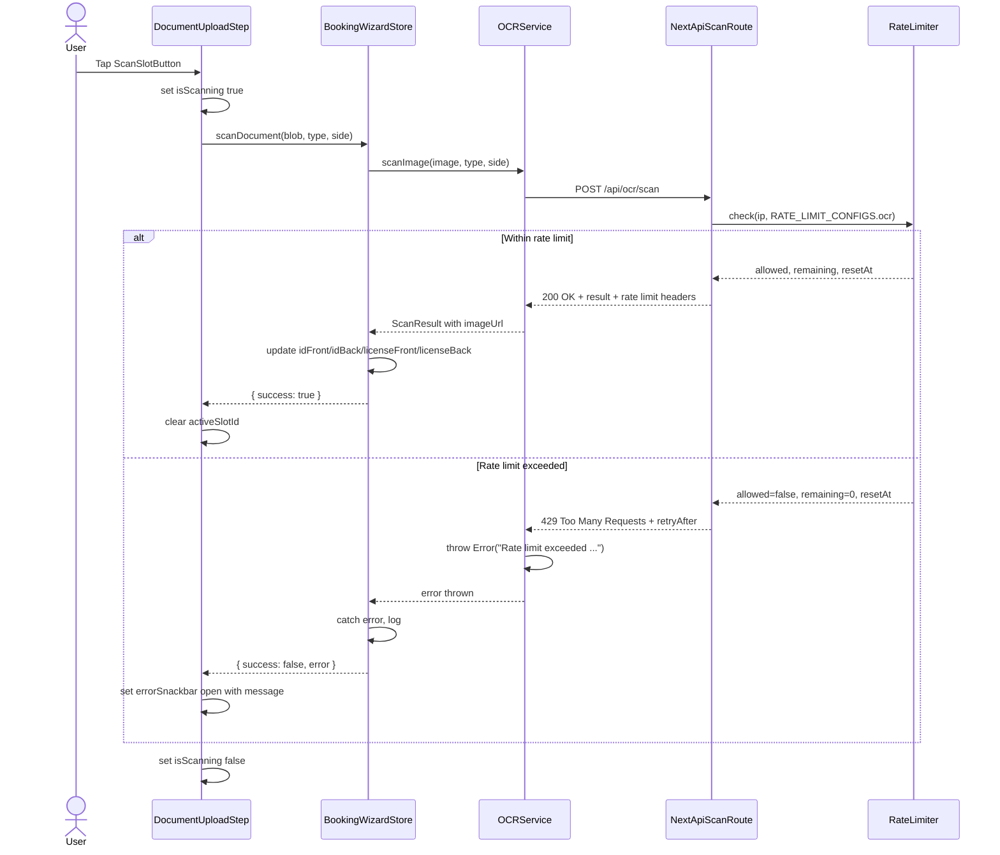
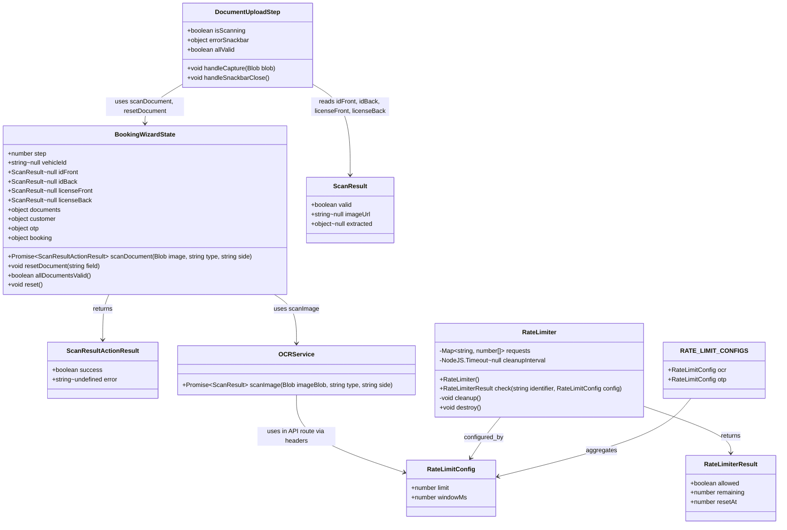

# PR #83 Review Analysis

**Generated**: 2026-01-16T15:40:43.670Z  
**Total Issues**: 6  
**Breakdown**: 2 CRITICAL, 2 HIGH, 1 MEDIUM, 1 LOW

---

## Summary

| Severity | Count | Action Required |
|----------|-------|-----------------|
| CRITICAL | 2 | Fix immediately before merge |
| HIGH | 2 | Fix if <5 min each |
| MEDIUM | 1 | Document for later |
| LOW | 1 | Optional (style/formatting) |

---

## CRITICAL Issues (2)


### 1. CodeRabbit

```
<!-- This is an auto-generated comment: summarize by coderabbit.ai -->
<!-- This is an auto-generated comment: review in progress by coderabbit.ai -->

> [!NOTE]
> Currently processing new changes in this PR. This may take a few minutes, please wait...
> 
> <details>
> <summary>📥 Commits</summary>
> 
> Reviewing files that changed from the base of the PR and between 99d56de06e6c3a3e43b29e639312f5ef9b0b49b8 and 9f1cebac26efa228f0f2ba077e36c4039248ef69.
> 
> </details>
> 
> <details>
> <summary>⛔ Files ignored due to path filters (1)</summary>
> 
> * `CLAUDE.md` is excluded by `!**/*.md`
> 
> </details>
> 
> <details>
> <summary>📒 Files selected for processing (7)</summary>
> 
> * `src/app/api/ocr/scan/route.ts`
> * `src/components/booking/wizard/DocumentUploadStep.tsx`
> * `src/i18n/locales/ar/common.json`
> * `src/i18n/locales/en/common.json`
> * `src/lib/rate-limit.ts`
> * `src/services/ocr/ocrService.ts`
> * `src/stores/useBookingWizardStore.ts`
> 
> </details>
> 
> ```ascii
>  _____________________________
> < I wish to make a complaint. >
>  -----------------------------
>   \
>    \   \
>         \ /\
>         ( )
>       .( o ).
> ```
> 
> <sub>✏️ Tip: You can disable in-progress messages by setting `review_status` to `false` in your review settings. Additionally, you can disable the fortune message by setting `in_progress_fortune` to `false` in your review settings.</sub>

<!-- end of auto-generated comment: review in progress by coderabbit.ai -->
<!-- usage_tips_start -->

> [!TIP]
> <details>
> <summary>CodeRabbit can suggest fixes for GitHub Check annotations.</summary>
> 
> Configure `reviews.tools.github-checks` in your project's settings in CodeRabbit to adjust the time to wait for GitHub Checks to complete.
> 
> </details>

<!-- usage_tips_end -->
<!-- other_code_reviewer_warning_start -->

> [!NOTE]
> ## Other AI code review bot(s) detected
> 
> CodeRabbit has detected other AI code review bot(s) in this pull request and will avoid duplicating their findings in the review comments. This may lead to a less comprehensive review.

<!-- other_code_reviewer_warning_end -->


<!-- finishing_touch_checkbox_start -->

<details>
<summary>✨ Finishing touches</summary>

- [ ] <!-- {"checkboxId": "7962f53c-55bc-4827-bfbf-6a18da830691"} --> 📝 Generate docstrings
<details>
<summary>🧪 Generate unit tests (beta)</summary>

- [ ] <!-- {"checkboxId": "f47ac10b-58cc-4372-a567-0e02b2c3d479", "radioGroupId": "utg-output-choice-group-unknown_comment_id"} -->   Create PR with unit tests
- [ ] <!-- {"checkboxId": "07f1e7d6-8a8e-4e23-9900-8731c2c87f58", "radioGroupId": "utg-output-choice-group-unknown_comment_id"} -->   Post copyable unit tests in a comment
- [ ] <!-- {"checkboxId": "6ba7b810-9dad-11d1-80b4-00c04fd430c8", "radioGroupId": "utg-output-choice-group-unknown_comment_id"} -->   Commit unit tests in branch `cc/pr82-critical-fixes`

</details>

</details>

<!-- finishing_touch_checkbox_end -->

<!-- tips_start -->

---

Thanks for using [CodeRabbit](https://coderabbit.ai?utm_source=oss&utm_medium=github&utm_campaign=Hex-Tech-Lab/hex-test-drive-man&utm_content=83)! It's free for OSS, and your support helps us grow. If you like it, consider giving us a shout-out.

<details>
<summary>❤️ Share</summary>

- [X](https://twitter.com/intent/tweet?text=I%20just%20used%20%40coderabbitai%20for%20my%20code%20review%2C%20and%20it%27s%20fantastic%21%20It%27s%20free%20for%20OSS%20and%20offers%20a%20free%20trial%20for%20the%20proprietary%20code.%20Check%20it%20out%3A&url=https%3A//coderabbit.ai)
- [Mastodon](https://mastodon.social/share?text=I%20just%20used%20%40coderabbitai%20for%20my%20code%20review%2C%20and%20it%27s%20fantastic%21%20It%27s%20free%20for%20OSS%20and%20offers%20a%20free%20trial%20for%20the%20proprietary%20code.%20Check%20it%20out%3A%20https%3A%2F%2Fcoderabbit.ai)
- [Reddit](https://www.reddit.com/submit?title=Great%20tool%20for%20code%20review%20-%20CodeRabbit&text=I%20just%20used%20CodeRabbit%20for%20my%20code%20review%2C%20and%20it%27s%20fantastic%21%20It%27s%20free%20for%20OSS%20and%20offers%20a%20free%20trial%20for%20proprietary%20code.%20Check%20it%20out%3A%20https%3A//coderabbit.ai)
- [LinkedIn](https://www.linkedin.com/sharing/share-offsite/?url=https%3A%2F%2Fcoderabbit.ai&mini=true&title=Great%20tool%20for%20code%20review%20-%20CodeRabbit&summary=I%20just%20used%20CodeRabbit%20for%20my%20code%20review%2C%20and%20it%27s%20fantastic%21%20It%27s%20free%20for%20OSS%20and%20offers%20a%20free%20trial%20for%20proprietary%20code)

</details>

<sub>Comment `@coderabbitai help` to get the list of available commands and usage tips.</sub>

<!-- tips_end -->
```


### 2. CodeRabbit

```
<!-- This is an auto-generated comment: summarize by coderabbit.ai -->
<!-- This is an auto-generated comment: failure by coderabbit.ai -->

> [!CAUTION]
> ## Review failed
> 
> The head commit changed during the review from d49ef636494a2e10ba83a728f3669580dd898e4e to 9f1cebac26efa228f0f2ba077e36c4039248ef69.

<!-- end of auto-generated comment: failure by coderabbit.ai -->

<!-- other_code_reviewer_warning_start -->

> [!NOTE]
> ## Other AI code review bot(s) detected
> 
> CodeRabbit has detected other AI code review bot(s) in this pull request and will avoid duplicating their findings in the review comments. This may lead to a less comprehensive review.

<!-- other_code_reviewer_warning_end -->


<!-- finishing_touch_checkbox_start -->

<details>
<summary>✨ Finishing touches</summary>

- [ ] <!-- {"checkboxId": "7962f53c-55bc-4827-bfbf-6a18da830691"} --> 📝 Generate docstrings
<details>
<summary>🧪 Generate unit tests (beta)</summary>

- [ ] <!-- {"checkboxId": "f47ac10b-58cc-4372-a567-0e02b2c3d479", "radioGroupId": "utg-output-choice-group-unknown_comment_id"} -->   Create PR with unit tests
- [ ] <!-- {"checkboxId": "07f1e7d6-8a8e-4e23-9900-8731c2c87f58", "radioGroupId": "utg-output-choice-group-unknown_comment_id"} -->   Post copyable unit tests in a comment
- [ ] <!-- {"checkboxId": "6ba7b810-9dad-11d1-80b4-00c04fd430c8", "radioGroupId": "utg-output-choice-group-unknown_comment_id"} -->   Commit unit tests in branch `cc/pr82-critical-fixes`

</details>

</details>

<!-- finishing_touch_checkbox_end -->

<!-- tips_start -->

---

Thanks for using [CodeRabbit](https://coderabbit.ai?utm_source=oss&utm_medium=github&utm_campaign=Hex-Tech-Lab/hex-test-drive-man&utm_content=83)! It's free for OSS, and your support helps us grow. If you like it, consider giving us a shout-out.

<details>
<summary>❤️ Share</summary>

- [X](https://twitter.com/intent/tweet?text=I%20just%20used%20%40coderabbitai%20for%20my%20code%20review%2C%20and%20it%27s%20fantastic%21%20It%27s%20free%20for%20OSS%20and%20offers%20a%20free%20trial%20for%20the%20proprietary%20code.%20Check%20it%20out%3A&url=https%3A//coderabbit.ai)
- [Mastodon](https://mastodon.social/share?text=I%20just%20used%20%40coderabbitai%20for%20my%20code%20review%2C%20and%20it%27s%20fantastic%21%20It%27s%20free%20for%20OSS%20and%20offers%20a%20free%20trial%20for%20the%20proprietary%20code.%20Check%20it%20out%3A%20https%3A%2F%2Fcoderabbit.ai)
- [Reddit](https://www.reddit.com/submit?title=Great%20tool%20for%20code%20review%20-%20CodeRabbit&text=I%20just%20used%20CodeRabbit%20for%20my%20code%20review%2C%20and%20it%27s%20fantastic%21%20It%27s%20free%20for%20OSS%20and%20offers%20a%20free%20trial%20for%20proprietary%20code.%20Check%20it%20out%3A%20https%3A//coderabbit.ai)
- [LinkedIn](https://www.linkedin.com/sharing/share-offsite/?url=https%3A%2F%2Fcoderabbit.ai&mini=true&title=Great%20tool%20for%20code%20review%20-%20CodeRabbit&summary=I%20just%20used%20CodeRabbit%20for%20my%20code%20review%2C%20and%20it%27s%20fantastic%21%20It%27s%20free%20for%20OSS%20and%20offers%20a%20free%20trial%20for%20proprietary%20code)

</details>

<sub>Comment `@coderabbitai help` to get the list of available commands and usage tips.</sub>

<!-- tips_end -->
```


---

## HIGH Issues (2)


### 1. Sourcery

```
<!-- Generated by sourcery-ai[bot]: start review_guide -->

## Reviewer's Guide

Implements a hotfix for the booking wizard OCR flow by adding an in-memory rate limiter to the OCR API, handling 429 errors in the OCR service, fixing Zustand selector and async race patterns in the document upload step, revoking blob URLs to prevent memory leaks, and surfacing scan errors to the user via a snackbar.

#### Sequence diagram for OCR scan flow with rate limiting and error surfacing



#### Updated class diagram for booking wizard store, OCR service, and rate limiter



### File-Level Changes

| Change | Details | Files |
| ------ | ------- | ----- |
| Harden OCR API endpoint with per-IP rate limiting and HTTP 429 responses plus rate-limit headers. | <ul><li>Add an in-memory RateLimiter with configurable limits and periodic cleanup to track requests per identifier.</li><li>Expose a singleton ocrRateLimiter and RATE_LIMIT_CONFIGS for OCR and OTP endpoints.</li><li>Update /api/ocr/scan POST handler to derive client IP, enforce the OCR rate limit, return 429 with Retry-After and X-RateLimit-* headers when exceeded, and attach rate-limit headers on successful responses.</li></ul> | `src/lib/rate-limit.ts`<br/>`src/app/api/ocr/scan/route.ts` |
| Improve OCR client error handling, especially for rate limiting, and return structured results from the store. | <ul><li>Update ocrService.scanImage to treat 429 responses specially by parsing retryAfter and throwing a descriptive rate-limit error.</li><li>Keep non-OK responses throwing explicit OCR failure errors for other HTTP statuses.</li><li>Change BookingWizardState.scanDocument to return a { success, error? } result and forward success or error state based on OCR service outcomes.</li></ul> | `src/services/ocr/ocrService.ts`<br/>`src/stores/useBookingWizardStore.ts` |
| Fix Zustand usage, async race conditions, and blob URL leaks in the booking wizard document upload step while surfacing scan errors via a snackbar. | <ul><li>Replace calling allDocumentsValid() inside a selector with a useMemo-computed allValid derived from primitive document states.</li><li>Introduce isScanning guard in DocumentUploadStep to prevent duplicate scans from rapid taps and wire it into handleCapture.</li><li>Add resetDocument usage and a docFieldKey helper to revoke existing image URLs before scanning a new document for the same slot.</li><li>Add MUI Snackbar-based error UI state that shows scan failures using returned { success, error } from scanDocument or a localized fallback string.</li></ul> | `src/components/booking/wizard/DocumentUploadStep.tsx`<br/>`src/stores/useBookingWizardStore.ts` |
| Add explicit blob URL cleanup utilities to prevent memory leaks when resetting or clearing the wizard state. | <ul><li>Introduce resetDocument(field) in the booking wizard store to revoke any existing imageUrl blob URL for a specific document field and null out the field.</li><li>Update reset() implementation to iterate over all document fields, revoke any existing blob URLs, and then reset the rest of the wizard state.</li></ul> | `src/stores/useBookingWizardStore.ts` |
| Add localized copy for scan failure messaging. | <ul><li>Add scanFailed i18n string to English and Arabic common locale files for use in the document upload error snackbar.</li></ul> | `src/i18n/locales/en/common.json`<br/>`src/i18n/locales/ar/common.json` |

---

<details>
<summary>Tips and commands</summary>

#### Interacting with Sourcery

- **Trigger a new review:** Comment `@sourcery-ai review` on the pull request.
- **Continue discussions:** Reply directly to Sourcery's review comments.
- **Generate a GitHub issue from a review comment:** Ask Sourcery to create an
  issue from a review comment by replying to it. You can also reply to a
  review comment with `@sourcery-ai issue` to create an issue from it.
- **Generate a pull request title:** Write `@sourcery-ai` anywhere in the pull
  request title to generate a title at any time. You can also comment
  `@sourcery-ai title` on the pull request to (re-)generate the title at any time.
- **Generate a pull request summary:** Write `@sourcery-ai summary` anywhere in
  the pull request body to generate a PR summary at any time exactly where you
  want it. You can also comment `@sourcery-ai summary` on the pull request to
  (re-)generate the summary at any time.
- **Generate reviewer's guide:** Comment `@sourcery-ai guide` on the pull
  request to (re-)generate the reviewer's guide at any time.
- **Resolve all Sourcery comments:** Comment `@sourcery-ai resolve` on the
  pull request to resolve all Sourcery comments. Useful if you've already
  addressed all the comments and don't want to see them anymore.
- **Dismiss all Sourcery reviews:** Comment `@sourcery-ai dismiss` on the pull
  request to dismiss all existing Sourcery reviews. Especially useful if you
  want to start fresh with a new review - don't forget to comment
  `@sourcery-ai review` to trigger a new review!

#### Customizing Your Experience

Access your [dashboard](https://app.sourcery.ai) to:
- Enable or disable review features such as the Sourcery-generated pull request
  summary, the reviewer's guide, and others.
- Change the review language.
- Add, remove or edit custom review instructions.
- Adjust other review settings.

#### Getting Help

- [Contact our support team](mailto:support@sourcery.ai) for questions or feedback.
- Visit our [documentation](https://docs.sourcery.ai) for detailed guides and information.
- Keep in touch with the Sourcery team by following us on [X/Twitter](https://x.com/SourceryAI), [LinkedIn](https://www.linkedin.com/company/sourcery-ai/) or [GitHub](https://github.com/sourcery-ai).

</details>

<!-- Generated by sourcery-ai[bot]: end review_guide -->
```


### 2. Sourcery - src/stores/useBookingWizardStore.ts:174

```
**issue (bug_risk):** Reset should also clear id/license document fields instead of only revoking URLs.

In `reset`, you revoke the `imageUrl`s for `idFront`, `idBack`, `licenseFront`, and `licenseBack`, but you don’t clear those fields in the subsequent `set` call. This leaves the corresponding ScanResult objects (including `valid` flags and extracted data) in state after a reset, which can cause stale validation and previews. Please also set `idFront`, `idBack`, `licenseFront`, and `licenseBack` to `null` in `set` so the document state is fully reset.
```


---

## MEDIUM Issues (1)


### 1. SonarCloud

```
## [](https://sonarcloud.io/dashboard?id=Hex-Tech-Lab_hex-test-drive-man&pullRequest=83) **Quality Gate passed**  
Issues  
 [2 New issues](https://sonarcloud.io/project/issues?id=Hex-Tech-Lab_hex-test-drive-man&pullRequest=83&issueStatuses=OPEN,CONFIRMED&sinceLeakPeriod=true)  
 [0 Accepted issues](https://sonarcloud.io/project/issues?id=Hex-Tech-Lab_hex-test-drive-man&pullRequest=83&issueStatuses=ACCEPTED)

Measures  
 [0 Security Hotspots](https://sonarcloud.io/project/security_hotspots?id=Hex-Tech-Lab_hex-test-drive-man&pullRequest=83&issueStatuses=OPEN,CONFIRMED&sinceLeakPeriod=true)  
 [0.0% Coverage on New Code](https://sonarcloud.io/component_measures?id=Hex-Tech-Lab_hex-test-drive-man&pullRequest=83&metric=new_coverage&view=list)  
 [0.0% Duplication on New Code](https://sonarcloud.io/component_measures?id=Hex-Tech-Lab_hex-test-drive-man&pullRequest=83&metric=new_duplicated_lines_density&view=list)  
  
[See analysis details on SonarQube Cloud](https://sonarcloud.io/dashboard?id=Hex-Tech-Lab_hex-test-drive-man&pullRequest=83)


```


---

## LOW Issues (1)


### 1. Sourcery - src/components/booking/wizard/DocumentUploadStep.tsx:47

```
**suggestion:** Tighten docFieldMap typing to use the DocField union instead of a generic string index.

Using `Record<string, ScanResult | null>` throws away the type safety provided by the `DocField` union and permits arbitrary string lookups. Since the keys are exactly `'idFront' | 'idBack' | 'licenseFront' | 'licenseBack'`, declare this as `Record<DocField, ScanResult | null>` (or a type alias) so it stays aligned with `getDocFieldKey`/`resetDocument` and fully type-checked.

Suggested implementation:

```typescript
  // Type-safe document field map
  const docFieldMap: Record<DocField, ScanResult | null> = {
    idFront,
    idBack,
    licenseFront,
    licenseBack
  };

```

If `DocField` is not yet in scope in this file, you will need to:

1. Either import it from where it is defined (e.g. `import type { DocField } from '…';`) or
2. Define it locally to match the existing usage in `getDocFieldKey`/`resetDocument`, something like:
   `type DocField = 'idFront' | 'idBack' | 'licenseFront' | 'licenseBack';`

Ensure this type is shared with other helpers (`getDocFieldKey`, `resetDocument`) so they all stay aligned.
```


---

## Next Steps

1. **Fix CRITICAL issues** (2 found) - Block merge until resolved
2. **Fix HIGH issues** (2 found) - Fix if <5 min each, otherwise document
3. **Document MEDIUM/LOW** (2 found) - Create follow-up issues

**Generated by**: `pnpm run pr:scrape 83`
